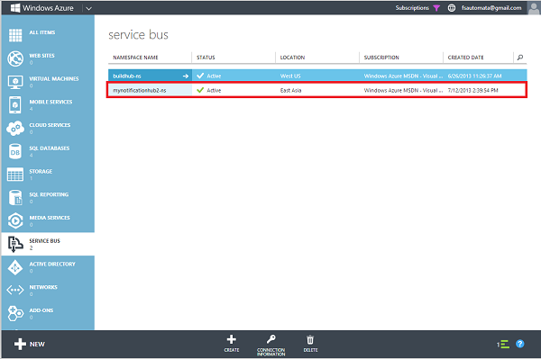

<properties linkid="develop-notificationhubs-tutorials-get-started-windowsphone" urlDisplayName="Get Started" pageTitle="Get Started with Azure Notification Hubs" metaKeywords="" description="Learn how to use Azure Notification Hubs to push notifications." metaCanonical="" services="notification-hubs" documentationCenter="Mobile" title="Get started with Notification Hubs" authors="elioda" solutions="" manager="" editor="" />

알림 허브 시작
==============

[Windows 스토어 C#](/en-us/manage/services/notification-hubs/getting-started-windows-dotnet "Windows 스토어 C#")[Windows Phone](/ko-kr/documentation/articles/notification-hubs-windows-phone-get-started/ "Windows Phone")[iOS](/ko-kr/documentation/articles/notification-hubs-ios-get-started/ "iOS")[Android](/ko-kr/documentation/articles/notification-hubs-android-get-started/ "Android")[Kindle](/ko-kr/documentation/articles/notification-hubs-kindle-get-started/ "Kindle")[Xamarin.iOS](/ko-kr/documentation/articles/partner-xamarin-notification-hubs-ios-get-started/ "Xamarin.iOS")[Xamarin.Android](/ko-kr/documentation/articles/partner-xamarin-notification-hubs-android-get-started/ "Xamarin.Android")

이 항목은 Azure 알림 허브를 사용하여 Windows Phone 8 응용 프로그램에 푸시 알림을 보내는 방법을 보여 줍니다. 이 자습서에서는 MPNS(Microsoft 푸시 알림 서비스)를 사용하여 푸시 알림을 받는 새 Windows Phone 8 앱을 만듭니다. 완료하면 알림 허브를 사용하여 앱을 실행하는 모든 장치로 푸시 알림을 브로드캐스트할 수 있습니다.

이 자습서에서는 푸시 알림을 사용하도록 설정하는 다음 단계를 단계별로 안내합니다.

1.  [알림 허브 만들기](#configure-hub)
2.  [알림 허브에 앱 연결](#connecting-app)
3.  [백 엔드에서 알림 보내기](#send)

이 자습서에서는 알림 허브를 사용하는 간단한 브로드캐스트 시나리오를 보여 줍니다. 알림 허브를 사용하여 장치의 특정 사용자 및 그룹을 처리하는 방법을 알아보려면 다음 자습서도 함께 완료해야 합니다. 이 자습서를 이용하려면 다음 사항이 필요합니다.

-   [Visual Studio 2012 Express for Windows Phone](https://go.microsoft.com/fwLink/p/?LinkID=268374) 이상 버전

이 자습서를 완료해야 다른 모든 Windows Phone 8 앱용 알림 허브 자습서를 진행할 수 있습니다.

**참고**

이 자습서를 완료하려면 활성 Azure 계정이 있어야 합니다. 계정이 없는 경우 몇 분 만에 무료 평가판 계정을 만들 수 있습니다. 자세한 내용은 [Azure 무료 평가판](http://www.windowsazure.com/ko-kr/pricing/free-trial/?WT.mc_id=A0E0E5C02&returnurl=http%3A%2F%2Fwww.windowsazure.com%2Fen-us%2Fdevelop%2Fmobile%2Ftutorials%2Fget-started%2F)을 참조하십시오.

알림 허브 만들기알림 허브 만들기
--------------------------------

1.  [Azure 관리 포털](https://manage.windowsazure.com/)에 로그온하고 화면 맨 아래에 있는 **+새로 만들기**를 클릭합니다.

2.  **앱 서비스**, **서비스 버스**, **알림 허브**, **빠른 생성**을 차례로 클릭합니다.

   	

3.  알림 허브의 이름을 입력하고 원하는 지역을 선택한 후 **Create a new Notification Hub**를 클릭합니다.

   	

4.  방금 만든 네임스페이스(일반적으로 ***알림 허브 이름*-ns**)를 클릭한 후 맨 위에 있는 **구성** 탭을 클릭합니다.

   	

5.  맨 위에 있는 **알림 허브** 탭을 클릭한 후 방금 만든 알림 허브를 클릭합니다.

   	

6.  맨 아래에 있는 **연결 정보**를 클릭합니다. 두 연결 문자열을 기록해 둡니다.

   	

7.  **구성** 탭을 클릭한 후 **Windows Phone 알림 설정** 섹션에서 **인증되지 않은 푸시 알림 사용** 확인란을 클릭합니다.

   	

이제 Windows Phone 8 앱을 등록하고 알림을 보내는 데 필요한 연결 문자열이 있습니다.

**참고**

이 자습서에서는 인증되지 않은 모드로 MPNS를 사용합니다. MPNS 인증되지 않은 모드에는 각 채널로 보낼 수 있는 알림에 대한 제한이 있습니다. 알림 허브는 [MPNS 인증된 모드](http://msdn.microsoft.com/ko-kr/library/windowsphone/develop/ff941099(v=vs.105).aspx)를 지원합니다.

앱 연결알림 허브에 앱 연결
--------------------------

1.  Visual Studio에서 새 Windows Phone 8 응용 프로그램을 만듭니다.

   	

2.  [WindowsAzure.Messaging.Managed NuGet 패키지](http://nuget.org/packages/WindowsAzure.Messaging.Managed/)를 사용하여 Windows 스토어용 Azure 메시징 라이브러리에 대한 참조를 추가합니다. Visual Studio 메뉴에서 **도구**를 클릭하고 **라이브러리 패키지 관리자**를 클린한 다음 **패키지 관리자 콘솔**을 클릭합니다. 그런 다음 콘솔 창에서 다음을 입력하고

		Install-Package WindowsAzure.Messaging.Managed

    Enter 키를 누릅니다.

3.  App.xaml.cs 파일을 열고 다음 `using` 문을 추가합니다.

		using Microsoft.Phone.Notification;
		using Microsoft.WindowsAzure.Messaging;

4.  App.xaml.cs의 **Application_Launching** 메서드 맨 위에 있는 다음 코드에서

		var channel = HttpNotificationChannel.Find("MyPushChannel");
		if (channel == null)
		{
			channel = new HttpNotificationChannel("MyPushChannel");
			channel.Open();
			channel.BindToShellToast();
		}

		channel.ChannelUriUpdated += new EventHandler<NotificationChannelUriEventArgs>(async (o, args) =>
		{
			var hub = new NotificationHub("<hub name>", "<connection string>");
			await hub.RegisterNativeAsync(args.ChannelUri.ToString());
		});

    허브 이름과 이전 섹션에서 얻은 **DefaultListenSharedAccessSignature**라는 연결 문자열을 삽입해야 합니다. 이 코드는 MPNS에서 앱의 ChannelURI를 검색한 후 해당 ChannelURI를 알림 허브에 등록합니다. 또한 이 코드는 응용 프로그램이 시작될 때마다 ChannelURI가 알림 허브에 등록되도록 보장합니다.

    **참고**

    이 자습서에서는 알림 메시지를 장치로 보냅니다. 타일 알림을 보내는 경우 채널에서 **BindToShellTile** 메서드를 대신 호출해야 합니다. 알림 메시지와 타일 알림을 둘 다 지원하려면 **BindToShellTile** 및 **BindToShellToast**를 둘 다 호출합니다.

5.  솔루션 탐색기에서 **속성**을 확장하고 WMAppManifest.xml 파일을 연 후 **기능** 탭을 클릭하고 **ID__CAP__PUSH_NOTIFICATION** 기능이 선택되었는지 확인합니다.

   	

   	이제 앱이 푸시 알림을 받을 수 있습니다.

6.  F5 키를 눌러 앱을 실행합니다.

알림 보내기백 엔드에서 알림 보내기
----------------------------------

[REST 인터페이스](http://msdn.microsoft.com/ko-kr/library/windowsazure/dn223264.aspx)를 사용하여 모든 백 엔드에서 알림 허브를 사용하여 알림을 보낼 수 있습니다. 이 자습서에서는 .NET 콘솔 앱 및 노드 스크립트를 사용하는 모바일 서비스를 통해 알림을 보냅니다.

.NET 앱을 사용하여 알림을 보내려면

1.  새 Visual C# 콘솔 응용 프로그램을 만듭니다.

   	

2.  [WindowsAzure.ServiceBus NuGet 패키지](http://nuget.org/packages/WindowsAzure.ServiceBus/)를 사용하여 Azure 서비스 버스 SDK에 대한 참조를 추가합니다. Visual Studio 주 메뉴에서 **도구**를 클릭하고 **라이브러리 패키지 관리자**를 클릭한 다음 **패키지 관리자 콘솔**을 클릭합니다. 그런 다음 콘솔 창에서 다음을 입력하고

		Install-Package WindowsAzure.ServiceBus

    Enter 키를 누릅니다.

3.  Program.cs 파일을 열고 다음 `using` 문을 추가합니다.

		using Microsoft.ServiceBus.Notifications;

4.  `Program` 클래스에 다음 메서드를 추가합니다.

		private static async void SendNotificationAsync()
		{
			NotificationHubClient hub = NotificationHubClient.CreateClientFromConnectionString("<connection string with full access>", "<hub name>");
			string toast = "<?xml version=\"1.0\" encoding=\"utf-8\"?>" +
				"<wp:Notification xmlns:wp=\"WPNotification\">" +
					"<wp:Toast>" +
						"<wp:Text1>Hello from a .NET App!</wp:Text1>" +
					"</wp:Toast> " +
				"</wp:Notification>";
			await hub.SendMpnsNativeNotificationAsync(toast);
		}

    허브 이름과 "알림 허브 구성" 섹션에서 얻은 DefaultFullSharedAccessSignature라는 연결 문자열을 삽입해야 합니다. 이는 수신 대기 권한이 아니라 모든 권한을 가진 연결 문자열입니다.

5.  그런 다음 Main 메서드에 다음 줄을 추가합니다.

		SendNotificationAsync();
		Console.ReadLine();

6.  F5 키를 눌러 앱을 실행합니다. 그러면 알림 메시지가 수신되어야 합니다. Windows Phone 에뮬레이터가 실행 중이고 앱이 닫혔는지 확인합니다.

MSDN의 [알림 카탈로그](http://msdn.microsoft.com/ko-kr/library/windowsphone/develop/jj662938(v=vs.105).aspx) 및 [타일 카탈로그](http://msdn.microsoft.com/ko-kr/library/windowsphone/develop/hh202948(v=vs.105).aspx)에서 가능한 모든 페이로드를 찾을 수 있습니다.

다음 단계
---------

이 간단한 예제에서는 모든 Windows Phone 8 장치로 알림을 브로드캐스트했습니다. 특정 사용자를 대상으로 하려면 [알림 허브를 사용하여 사용자에게 알림 푸시](/en-us/manage/services/notification-hubs/notify-users-aspnet)(영문) 자습서를 참조하십시오. 사용자를 관심 그룹별로 분할하려면 [알림 허브를 사용하여 뉴스 속보 보내기](/en-us/manage/services/notification-hubs/breaking-news-dotnet)(영문)를 참조하십시오. [알림 허브 지침](http://msdn.microsoft.com/ko-kr/library/jj927170.aspx)에서 알림 허브 사용 방법을 자세히 알아보십시오.

