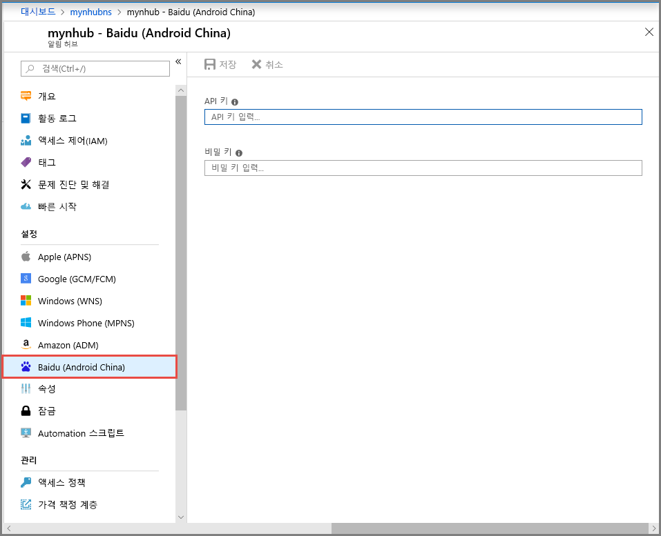

# Azure Portal에서 플랫폼 알림 시스템 설정을 사용하여 Azure 알림 허브 구성 
Azure Notification Hubs는 모든 백 엔드(클라우드 또는 온-프레미스)에서 모든 플랫폼(iOS, Android, Windows, Kindle, Baidu 등)에 알림을 보낼 수 있도록 하는 사용하기 쉬운 스케일 아웃 푸시 엔진을 제공합니다. 서비스에 대한 자세한 내용은 [Azure Notification Hubs란?](notification-hubs-push-notification-overview.md)을 참조하세요.

아직 수행하지 않은 경우 [Azure Portal을 사용하여 Azure 알림 허브를 만듭니다](create-notification-hub-portal.md). 이 빠른 시작에서는 PNS(플랫폼 알림 시스템) 설정을 사용하여 Azure Portal에서 알림 허브를 구성하는 방법을 알아봅니다.

## APNS(Apple 푸시 알림 서비스)
1. Azure Portal의 **알림 허브** 페이지에서 왼쪽 메뉴의 **설정**에 있는 **Apple(APNS)** 을 선택합니다.
2. **인증서**를 선택하는 경우 다음 작업을 수행합니다.
    1. **파일 아이콘**을 선택하고 업로드할 **.p12** 파일을 선택합니다. 
    2. **암호**를 지정합니다.
    3. **샌드박스** 모드를 선택합니다. 스토어에서 앱을 구매한 사용자에게 푸시 알림을 보내려는 경우에만 **프로덕션**을 사용합니다.

        
3. **토큰**을 선택하는 경우 다음 단계를 수행합니다. 
    1. **키 ID**, **번들 ID**, **팀 ID** 및 **토큰**에 사용할 값을 입력합니다.
    2. **샌드박스** 모드를 선택합니다. 스토어에서 앱을 구매한 사용자에게 푸시 알림을 보내려는 경우에만 **프로덕션**을 사용합니다.

        

Azure Notification Hubs 및 APNS(Apple Push Notification Service)를 사용하여 iOS 디바이스에 알림을 푸시하기 위한 전체 자습서는 [이 자습서](notification-hubs-ios-apple-push-notification-apns-get-started.md)를 참조하세요.

## Google FCM(Firebase Cloud Messaging)
1. Azure Portal의 **알림 허브** 페이지에서 왼쪽 메뉴의 **설정**에 있는 **Google(GCM/FCM)** 을 선택합니다. 
2. 앞에서 저장한 FCM 프로젝트의 **서버 키**를 붙여넣습니다. 
3. 도구 모음에서 **저장**을 선택합니다. 

    
4. Notification Hubs가 업데이트되었다는 경고 메시지가 표시됩니다. **Save** 단추가 비활성화됩니다. 

Azure Notification Hubs 및 Google Firebase Cloud Messaging을 사용하여 Android 디바이스에 알림을 푸시하기 위한 전체 자습서는 [이 자습서](notification-hubs-android-push-notification-google-fcm-get-started.md)를 참조하세요.

## WNS(Windows 푸시 알림 서비스)
1. Azure Portal의 **알림 허브** 페이지에서 왼쪽 메뉴의 **설정**에 있는 **Windows(WNS)** 를 선택합니다.
2. **패키지 SID** 및 **보안 키**에 사용할 값을 입력합니다.
3. 도구 모음에서 **저장**을 선택합니다.

    

Windows 디바이스에서 실행되는 UWP(유니버설 Windows 플랫폼) 앱에 알림을 푸시하기 위한 전체 자습서는 [이 자습서](notification-hubs-windows-store-dotnet-get-started-wns-push-notification.md)를 참조하세요.

## Windows Phone - Microsoft 푸시 알림 서비스
1. Azure Portal의 **알림 허브** 페이지에서 **설정**에 있는 **Windows Phone(MPNS)** 을 선택합니다.
2. 인증되지 않은 푸시를 사용하도록 설정하려는 경우 **인증되지 않은 푸시 사용**을 선택하고 도구 모음에서 **저장**을 선택합니다.

    
3. **인증된** 푸시를 사용하려는 경우 다음 단계를 수행합니다.
    1. 도구 모음에서 **인증서 업로드**를 선택합니다.
    2. **파일 아이콘**을 선택하고 인증서 파일을 선택합니다.
    3. 인증서에 사용할 **암호**를 입력합니다. 
    4. **확인**을 선택하여 **인증서 업로드** 페이지를 닫습니다. 
    5. **Windows Phone(MPNS)** 페이지에서 도구 모음에 있는 **저장**을 선택합니다.

MPNS(Microsoft 푸시 알림 서비스)를 사용하여 Windows Phone 8 앱에 알림을 푸시하기 위한 전체 자습서는 [이 자습서](notification-hubs-windows-mobile-push-notifications-mpns.md)를 참조하세요.
      
## ADM(Amazon Device Messaging)
1. Azure Portal의 **알림 허브** 페이지에서 왼쪽 메뉴의 **설정**에 있는 **Amazon(ADM)** 을 선택합니다.
2. **클라이언트 ID** 및 **클라이언트 비밀**에 사용할 값을 입력합니다.
3. 도구 모음에서 **저장**을 선택합니다.
    
    

Azure Notification Hubs를 사용하여 Kindle 애플리케이션에 알림을 푸시하기 위한 전체 자습서는 [이 자습서](notification-hubs-kindle-amazon-adm-push-notification.md)를 참조하세요.

## Baidu(Android China)
1. Azure Portal의 **알림 허브** 페이지에서 왼쪽 메뉴의 **설정**에 있는 **Baidu(Android China)** 를 선택합니다. 
2. Baidu 클라우드 푸시 프로젝트의 Baidu 콘솔에서 가져온 **API 키**를 입력합니다. 
3. Baidu 클라우드 푸시 프로젝트의 Baidu 콘솔에서 가져온 **비밀 키**를 입력합니다. 
4. 도구 모음에서 **저장**을 선택합니다. 

    
4. Notification Hubs가 업데이트되었다는 경고 메시지가 표시됩니다. **Save** 단추가 비활성화됩니다. 

Azure Notification Hubs 및 Baidu 클라우드 푸시를 사용하여 알림을 푸시하기 위한 전체 자습서는 [이 자습서](notification-hubs-baidu-china-android-notifications-get-started.md)를 참조하세요.

## 다음 단계
이 빠른 시작에서는 Azure Portal에서 알림 허브에 대해 여러 플랫폼 알림 시스템을 구성하는 방법을 알아봤습니다. 

이러한 다양한 플랫폼에 알림을 푸시하기 위한 단계별 전체 지침은 **자습서** 섹션의 자습서를 참조하세요.

- [Azure Notification Hubs 및 APNS(Apple Push Notification Service)를 사용하여 iOS 디바이스에 알림 푸시](notification-hubs-ios-apple-push-notification-apns-get-started.md)
- [Azure Notification Hubs 및 Google Firebase Cloud Messaging을 사용하여 Android 디바이스에 알림 푸시](notification-hubs-android-push-notification-google-fcm-get-started.md)
- [Windows 디바이스에서 실행되는 UWP(유니버설 Windows 플랫폼) 앱에 알림 푸시](notification-hubs-windows-store-dotnet-get-started-wns-push-notification.md)
- [MPNS(Microsoft 푸시 알림 서비스)를 사용하여 Windows Phone 8 앱에 알림 푸시](notification-hubs-windows-mobile-push-notifications-mpns.md)
- [Kindle 애플리케이션에 알림 푸시](notification-hubs-kindle-amazon-adm-push-notification.md)
- [Azure Notification Hubs 및 Baidu 클라우드 푸시를 사용하여 알림 푸시](notification-hubs-baidu-china-android-notifications-get-started.md)
