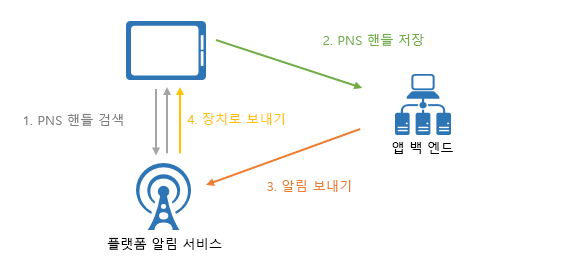
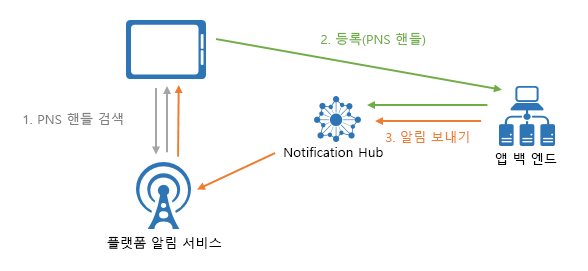

# Azure Notification Hubs란 무엇인가요?

Azure Notification Hubs는 모든 백 엔드(클라우드 또는 온-프레미스)에서 모든 플랫폼(iOS, Android, Windows, Kindle, Baidu 등)에 알림을 보낼 수 있도록 하는 사용하기 쉬운 스케일 아웃 푸시 엔진을 제공합니다. Notification Hubs는 엔터프라이즈 시나리오 및 소비자 시나리오 모두에 적합합니다. 다음은 몇 가지 샘플 시나리오입니다.

- 수백만 명의 사용자에게 대기 시간이 짧은 최신 뉴스 알림을 보냅니다.
- 관심 있는 사용자 세그먼트에 위치 기반 쿠폰을 보냅니다.
- 미디어/스포츠/금융/게임 애플리케이션을 위해 사용자 또는 그룹에 이벤트 관련 알림을 보냅니다.
- 프로모션 콘텐츠를 애플리케이션에 푸시하여 고객을 참여시키고 마케팅 활동을 전개합니다.
- 새 메시지 및 작업 항목과 같은 엔터프라이즈 이벤트를 사용자에게 알립니다.
- 다단계 인증을 위한 코드를 보냅니다.

## 푸시 알림이란 무엇인가요?

푸시 알림은 대개 팝업 또는 대화 상자에서 모바일 앱 사용자에게 원하는 특정 정보를 알리는 앱-사용자 통신의 한 형태입니다. 사용자는 일반적으로 메시지를 보거나 해제하도록 선택할 수 있습니다. 이전을 선택하면 알림을 전달한 모바일 애플리케이션이 열립니다.

푸시 알림은 앱 참여와 사용량이 증가하는 소비자 앱과 최신 비즈니스 정보를 전달하는 엔터프라이즈 앱에 매우 중요합니다. 모바일 장치에는 에너지 효율이 높고, 알림 보낸 사람에게는 유연하며, 해당 애플리케이션이 활성화되어 있지 않을 때 사용할 수 있으므로 최상의 앱-사용자 통신입니다.

인기 있는 몇 가지 플랫폼의 푸시 알림에 대한 자세한 내용은 다음 항목을 참조하세요.

- [Android](https://developer.android.com/guide/topics/ui/notifiers/notifications.html)
- [iOS](https://developer.apple.com/notifications/)
- [Windows](https://msdn.microsoft.com/library/windows/apps/hh779725.aspx)

## 푸시 알림은 어떻게 작동하나요?

푸시 알림은 *PNS(플랫폼 알림 시스템)* 라는 플랫폼별 인프라를 통해 전달됩니다. 메시지를 배달하는 베어본 푸시 기능을 제공되는 핸들이 있는 디바이스에 제공하며 공통 인터페이스가 없습니다. Android, iOS 및 Windows 버전의 앱에서 모든 고객에게 알림을 보내려면 개발자는 APNS(Apple Push Notification Service), FCM(Firebase Cloud Messaging) 및 WNS(Windows 알림 서비스)를 사용해야 합니다.

높은 수준의 푸시 작동 방식은 다음과 같습니다.

1. 클라이언트 앱은 알림을 받을지 결정합니다. 따라서 해당 PNS에 연결하여 고유한 임시 푸시 핸들을 검색합니다. 핸들 형식은 시스템에 따라 다릅니다(예: WNS에는 URI가 있지만 APNS에는 토큰이 있음).
2. 클라이언트 앱은 이 핸들을 백 엔드 또는 공급자에 저장합니다.
3. 푸시 알림을 보내기 위해 앱 백 엔드에서 핸들을 통해 PNS에 연결하여 특정 클라이언트 앱을 대상으로 합니다.
4. PNS가 핸들에 의해 지정된 디바이스로 알림을 전달합니다.

## 푸시 알림의 문제

PNS는 강력합니다. 그러나 분할된 사용자에게 푸시 알림을 브로드캐스트하는 것처럼 일반적인 푸시 알림 시나리오를 구현하기 위해 앱 개발자는 많은 작업을 수행해야 합니다.

알림을 푸시하려면 애플리케이션의 기본 비즈니스 논리와 관련 없는 복잡한 인프라가 필요합니다. 인프라 문제 중 일부는 다음과 같습니다.

- **플랫폼 종속성**
  - PNS가 통합되지 않기 때문에 다양한 플랫폼의 디바이스에 알림을 보내기 위해 복잡하고 유지하기가 힘든 플랫폼 종속 논리가 백 엔드에 필요합니다.
- **규모**
  - PNS 지침에 따라 앱이 시작될 때마다 디바이스 토큰을 새로 고쳐야 합니다. 백 엔드에서 토큰을 최신 상태로 유지하는 데에만 대량의 트래픽과 데이터베이스 액세스를 처리하고 있습니다. 디바이스의 수가 수억, 수십억 개에 이르면 이 인프라를 만들고 유지 관리하는 비용이 엄청납니다.
  - 대부분의 PNS는 여러 디바이스로의 브로드캐스트를 지원하지 않습니다. 단순히 백만 개의 디바이스로 브로드캐스트하면 PNS를 백만 번 호출하게 됩니다. 최소 대기 시간으로 트래픽 양을 조정하는 것이 중요합니다.
- **라우팅**
  - PNS에서 메시지를 디바이스로 보내는 방법을 제공하지만 대부분의 앱 알림은 사용자 또는 관심 그룹을 대상으로 합니다. 백 엔드에서 관심 그룹, 사용자, 속성 등과 디바이스를 연결하는 레지스트리를 유지해야 합니다. 이러한 오버헤드로 인해 앱의 출시 기간 및 유지 관리 비용이 늘어납니다.

## Azure Notification Hubs를 사용하는 이유는 무엇인가요?

Notification Hubs는 앱 백 엔드에서 직접 알림을 푸시하는 것과 관련된 모든 복잡성을 제거합니다. 다중 플랫폼의 확장된 푸시 알림 인프라는 푸시 관련 코딩을 줄이고 백 엔드를 간소화합니다. Notification Hubs를 사용하면 다음 그림과 같이 백 엔드에서 사용자 또는 관심 그룹에 메시지를 보내는 동안 디바이스는 PNS 핸들을 허브에 등록하는 역할만 수행합니다.

Notification Hubs는 다음과 같은 장점으로 즉시 사용할 수 있는 푸시 엔진입니다.

- **플랫폼 간**
  - 모든 주요 푸시 플랫폼(iOS, Android, Windows, Kindle 및 Baidu 포함) 지원
  - 플랫폼 특정 작업 없이 플랫폼별 또는 플랫폼 독립적 형식으로 모든 플랫폼에 푸시하는 공통 인터페이스
  - 한 곳에서 디바이스 핸들 관리
- **백 엔드 간**
  - 클라우드 또는 온-프레미스
  - .NET, Node.js, Java 등
- **다양한 배달 패턴**
  - 하나 이상의 플랫폼에 브로드캐스트: 단일 API 호출로 여러 플랫폼에서 수백만 개의 디바이스로 즉시 브로드캐스트할 수 있습니다.
  - 디바이스에 푸시: 개별 디바이스에 알림을 대상으로 지정할 수 있습니다.
  - 사용자에게 푸시: 태그 및 템플릿 기능을 사용하면 사용자의 모든 플랫폼 간 디바이스에 연결할 수 있습니다.
  - 동적 태그를 사용하여 세그먼트로 푸시: 태그 기능을 사용하면 하나의 세그먼트 또는 세그먼트의 식(예: 활성 AND 시애틀 거주 NOT 새 사용자)으로 보낼지 여부에 관계 없이 사용자의 요구에 따라 디바이스를 분류하고 푸시할 수 있습니다. 디바이스 태그를 pub-sub로 제한하는 대신 언제 어디서나 업데이트할 수 있습니다.
  - 지역화된 푸시: 템플릿 기능을 사용하면 백 엔드 코드에 영향을 미치지 않고도 지역화를 달성할 수 있습니다.
  - 자동 푸시: 디바이스에 자동 알림을 보내고 특정 끌어오기 또는 작업을 완료하도록 이 알림을 트리거하여 push-to-pull(밀어넣기-끌어오기) 패턴을 활성화할 수 있습니다.
  - 예약된 푸시: 언제든지 알림을 보내도록 예약할 수 있습니다.
  - 직접 푸시: Notification Hubs 서비스를 통해 디바이스 등록을 건너뛰고 직접 디바이스 핸들 목록에 일괄적으로 푸시할 수 있습니다.
  - 맞춤형 푸시: 디바이스 푸시 변수를 사용하면 사용자 지정 키-값 쌍이 있는 디바이스별 맞춤형 푸시 알림을 보낼 수 있습니다.
- **다양한 원격 분석**
  - 일반적인 푸시, 디바이스, 오류 및 작업 원격 분석은 Azure Portal에서 프로그래밍 방식으로 사용할 수 있습니다.
  - 메시지별 원격 분석은 초기 요청 호출에서 푸시 아웃 일괄 처리를 성공적으로 수행한 Notification Hubs 서비스에 대한 각 푸시를 추적합니다.
  - 플랫폼 알림 시스템 피드백은 디버깅을 지원하기 위해 플랫폼 알림 시스템의 모든 피드백을 통신합니다.
- **확장성**
  - 다시 설계하거나 디바이스를 분할하지 않고도 수백만 개의 디바이스로 빠른 메시지를 보냅니다.
- **보안**
  - SAS(Shared Access Secret) 또는 페더레이션 인증입니다.

## App Service Mobile Apps와 통합

Azure 서비스 전반에서 원활하고 일관적인 사용 환경을 조성하기 위하여 Notification Hubs를 사용한 푸시 알림이 [App Service Mobile Apps](../app-service-mobile/app-service-mobile-value-prop.md)에 기본적으로 지원됩니다. [App Service Mobile Apps](../app-service-mobile/app-service-mobile-value-prop.md)는 엔터프라이즈 개발자 및 시스템 통합자를 위해 확장성이 크고 전 세계에서 사용 가능한 모바일 애플리케이션 개발 플랫폼을 제공합니다. 이 플랫폼은 모바일 개발자에게 풍부한 기능 집합을 제공합니다.

Mobile Apps 개발자는 다음 워크플로에서 Notification Hubs를 활용할 수 있습니다.

1. 디바이스 PNS 핸들을 검색합니다.
2. 편리한 Mobile Apps 클라이언트 SDK 등록 API를 통해 디바이스를 Notification Hubs에 등록합니다.

    > [!NOTE]
    > Mobile Apps는 등록 시 보안을 목적으로 모든 태그를 제거합니다. 백 엔드에서 Notification Hubs와 직접 작업하여 디바이스와 태그를 연결합니다.
3. Notification Hubs를 통해 앱 백 엔드에서 알림을 보냅니다.

이 통합으로 인해 개발자에게 다음과 같은 편리한 기능이 제공됩니다.

- **Mobile Apps 클라이언트 SDK**:  이러한 다중 플랫폼 SDK는 등록을 위한 간단한 API를 제공하고 모바일 앱과 자동으로 연결되는 알림 허브와 통신합니다. 개발자는 Notification Hubs 자격 증명을 심도있게 분석하고 추가 서비스로 작업할 필요가 없습니다.
  - *사용자에게 푸시*: SDK는 Mobile Apps 인증된 사용자 ID로 지정된 디바이스를 자동으로 태그하여 사용자 시나리오를 푸시할 수 있습니다.
  - *디바이스에 푸시*: SDK는 자동으로 Mobile Apps 설치 ID를 GUID로 사용하여 Notification Hubs로 등록하며 이는 개발자가 여러 서비스 GUID를 유지 관리하는 문제를 해결합니다.
- **설치 모델**: Mobile Apps는 Notification Hubs의 최신 푸시 모델과 함께 사용되어 푸시 알림 서비스에 맞게 조정되어 사용이 편리한 JSON 설치의 디바이스와 연결된 모든 푸시 속성을 나타냅니다.
- **유연성**: 개발자는 통합이 되어 있더라도 Notification Hubs와 직접 작업하도록 언제든지 선택할 수 있습니다.
- **[Azure Portal](https://portal.azure.com)의 통합된 환경**: 푸시는 하나의 기능으로 Mobile Apps에 시각적으로 표현되며 개발자는 Mobile Apps를 통해 연결된 알림 허브와 쉽게 작업할 수 있습니다.

## 다음 단계

[자습서: 모바일 애플리케이션에 알림 푸시](notification-hubs-android-push-notification-google-fcm-get-started.md)를 따라 알림 허브 만들기 및 사용을 시작합니다.

[0]: ./media/notification-hubs-overview/registration-diagram.png
[1]: ./media/notification-hubs-overview/notification-hub-diagram.png

[How customers are using Notification Hubs]: http://azure.microsoft.com/services/notification-hubs
[Notification Hubs tutorials and guides]: http://azure.microsoft.com/documentation/services/notification-hubs
[iOS]: http://azure.microsoft.com/documentation/articles/notification-hubs-ios-get-started
[Android]: http://azure.microsoft.com/documentation/articles/notification-hubs-android-get-started
[Windows Universal]: http://azure.microsoft.com/documentation/articles/notification-hubs-windows-store-dotnet-get-started
[Windows Phone]: http://azure.microsoft.com/documentation/articles/notification-hubs-windows-phone-get-started
[Kindle]: http://azure.microsoft.com/documentation/articles/notification-hubs-kindle-get-started
[Xamarin.iOS]: http://azure.microsoft.com/documentation/articles/partner-xamarin-notification-hubs-ios-get-started
[Xamarin.Android]: http://azure.microsoft.com/documentation/articles/partner-xamarin-notification-hubs-android-get-started
[Microsoft.WindowsAzure.Messaging.NotificationHub]: http://msdn.microsoft.com/library/microsoft.windowsazure.messaging.notificationhub.aspx
[Microsoft.ServiceBus.Notifications]: http://msdn.microsoft.com/library/microsoft.servicebus.notifications.aspx
[App Service Mobile Apps]: https://azure.microsoft.com/documentation/articles/app-service-mobile-value-prop/
[templates]: notification-hubs-templates-cross-platform-push-messages.md
[Azure portal]: https://portal.azure.com
[tags]: (http://msdn.microsoft.com/library/azure/dn530749.aspx)
