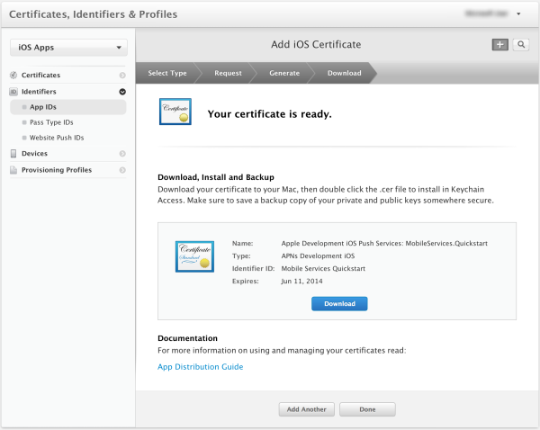
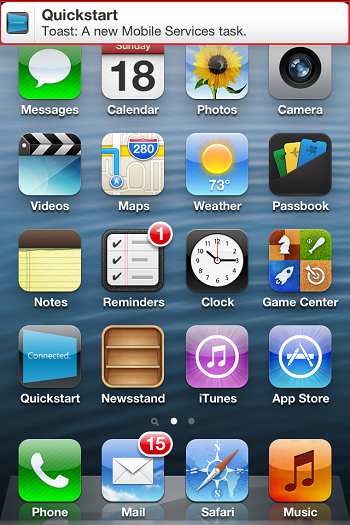

<properties linkid="develop-mobile-tutorials-get-started-with-push-xamarin-ios" urlDisplayName="Get Started with Push Notifications" pageTitle="Get started with push notifications (Xamarin.iOS) - Mobile Services" metaKeywords="" description="Learn how to use push notifications in Xamarin.iOS apps with Azure Mobile Services." metaCanonical="" disqusComments="0" umbracoNaviHide="1" editor="mollybos" documentationCenter="Mobile" title="Get started with push notifications in Mobile Services" authors="" />

모바일 서비스에서 푸시 알림 시작하기
====================================

[Windows Store C\#](/en-us/develop/mobile/tutorials/get-started-with-push-dotnet "Windows Store C#")[Windows Store JavaScript](/en-us/develop/mobile/tutorials/get-started-with-push-js "Windows Store JavaScript")[Windows Phone](/en-us/develop/mobile/tutorials/get-started-with-push-wp8 "Windows Phone")[iOS](/en-us/develop/mobile/tutorials/get-started-with-push-ios "iOS")[Android](/en-us/develop/mobile/tutorials/get-started-with-push-android "Android")[Xamarin.iOS](/en-us/develop/mobile/tutorials/get-started-with-push-xamarin-ios "Xamarin.iOS")[Xamarin.Android](/en-us/develop/mobile/tutorials/get-started-with-push-xamarin-android "Xamarin.Android")

이 항목에서는 Azure 모바일 서비스를 사용하여 Xamarin.iOS 앱에 푸시 알림을 보내는 방법을 보여 줍니다. 이 자습서에서는 APNS(Apple Push Notification Service)를 사용하여 quickstart 프로젝트에 푸시 알림을 추가합니다. 이 작업을 완료하면 레코드가 삽입될 때마다 모바일 서비스에서 푸시 알림을 전송합니다.

**참고**

이 자습서에서는 삽입된 레코드에 푸시 알림 장치 토큰을 추가하여 간단하게 푸시 알림을 보내는 방법을 보여 줍니다. 다음 자습서 내용을 따르면서 실제 앱에 푸시 알림을 통합하는 방법을 제대로 이해해야 합니다.

이 자습서에서는 푸시 알림을 사용하도록 설정하는 다음 기본 단계를 단계별로 안내합니다.

1.  [인증서 서명 요청 생성](#certificates)
2.  [앱을 등록하고 푸시 알림을 사용하도록 설정](#register)
3.  [앱용 프로비저닝 프로필 만들기](#profile)
4.  [모바일 서비스 구성](#configure)
5.  [앱에 푸시 알림 추가](#add-push)
6.  [푸시 알림을 전송하도록 스크립트 업데이트](#update-scripts)
7.  [알림을 받기 위한 데이터 삽입](#test)

이 자습서를 사용하려면 다음이 필요합니다.

-   [XCode 5.0](https://go.microsoft.com/fwLink/p/?LinkID=266532)
-   iOS 5.0(이상) 지원 장치
-   iOS 개발자 프로그램 멤버 자격
-   [Xamarin.iOS]
-   [Azure 모바일 서비스 구성 요소(영문)](http://components.xamarin.com/view/azure-mobile-services/)

    **참고**

    푸시 알림 구성 요구 사항 때문에 에뮬레이터 대신 iOS 지원 장치(iPhone 또는 iPad)에서 푸시 알림을 배포 및 테스트해야 합니다.

이 자습서는 모바일 서비스 quickstart를 기반으로 합니다. 이 자습서를 시작하기 전에 먼저 [모바일 서비스 시작하기](/en-us/develop/mobile/tutorials/get-started-xamarin-ios)를 완료해야 합니다.

APNS(Apple Push Notification Service)는 인증서를 사용하여 모바일 서비스를 인증합니다. 필요한 인증서를 만들어 모바일 서비스에 업로드하려면 해당 지침을 따르십시오. 공식 APNS 기능 설명서는 [Apple Push Notification Service](http://go.microsoft.com/fwlink/p/?LinkId=272584)(영문)를 참조하십시오.

CSR 파일 생성인증서 서명 요청 파일 생성
---------------------------------------

먼저, 서명된 인증서를 생성하기 위해 Apple에서 사용하는 CSR(인증서 서명 요청) 파일을 생성해야 합니다.

1.  Utilities 폴더에서 Keychain Access 도구를 실행합니다.

2.  **Keychain Access**를 클릭하고 **Certificate Assistant**를 확장한 다음 **Request a Certificate from a Certificate Authority...**를 클릭합니다.

	

3.  **User Email Address**을 선택하고 **Common Name** 및 **CA Email Address** 값을 입력한 후 **Saved to disk**가 선택되어 있는지 확인하고 **Continue**를 클릭합니다.

	

4.  **Save As**에 CSR(인증서 서명 요청) 파일의 이름을 입력하고, **Where**에서 위치를 선택한 후 **Save**를 클릭합니다.

	 CSR 파일이 선택한 위치에 저장됩니다. 기본 위치는 바탕 화면입니다. 이 파일을 저장한 위치를 기억해두십시오.

이제 Apple에 앱을 등록하고, 푸시 알림을 사용하도록 설정하고, 내보낸 CSR을 업로드하여 푸시 인증서를 만들 것입니다.

앱 등록푸시 알림을 위한 앱 등록
-------------------------------

모바일 서비스에서 iOS 앱으로 푸시 알림을 보내려면 Apple에 앱을 등록하고 푸시 알림도 등록해야 합니다.

1.  아직 앱을 등록하지 않은 경우 Apple Developer Center의 [iOS Provisioning Portal](http://go.microsoft.com/fwlink/p/?LinkId=272456)로 이동하여 Apple ID로 로그온하고 **Identifiers**와 **App IDs**를 클릭한 다음에 **+** 기호를 클릭합니다.

    ![][102] 

2.  **Description**에 앱의 이름을 입력하고, **Bundle Identifier**에 *MobileServices.Quickstart* 값을 입력하고, "App Services" 섹션에서 "Push Notifications" 옵션을 선택하고, **Continue**를 클릭합니다. 이 예제에서는 **MobileServices.Quickstart** ID를 사용하지만 실제로 이 ID를 사용해서는 안 됩니다. 모든 사용자는 고유한 앱 ID를 사용해야 하기 때문입니다. 사용자의 전체 이름 또는 이니셜을 앱 이름 뒤에 추가하는 것이 좋습니다.

	![][103]
           
    This generates your app ID and requests you to **Submit** the information. Click **Submit**
           
    ![][104] 
           
    Once you click **Submit**, you will see the **Registration complete** screen, as shown below. Click **Done**.
       
    ![][105]

    참고: *MobileServices.Quickstart* 외의 **Bundle Identifier** 값을 제공하려는 경우 Xcode 프로젝트에서도 Bundle Identifier(번들 식별자) 값을 업데이트해야 합니다.

3.  방금 만든 앱 ID를 찾아 해당 행을 클릭합니다.

    ![][106]
       
    Clicking on the app ID will display details on the app and app ID. Click the **Settings** button.
       
    ![][107] 

4.  화면 아래로 스크롤하여 **Development Push SSL Certificate** 섹션에서 **Create Certificate...** 단추를 클릭합니다.

    ![][108] 

    This displays the "Add iOS Certificate" assistant.
       
    ![][108] 

    참고: 이 자습서에서는 개발 인증서를 사용합니다. 프로덕션 인증서를 등록할 때에도 동일한 프로세스가 사용됩니다. 모바일 서비스로 인증서를 업로드할 때 동일한 인증서 유형을 설정해야 합니다.

5.  **Choose File**을 클릭하고, 첫 번째 작업에서 만든 CSR 파일이 저장된 위치로 이동하여 파일을 선택하고, **Generate**를 클릭합니다.

	

6.  포털에서 인증서가 생성되면 **Download** 단추를 클릭하고 **Done**을 클릭합니다.

	
 	
	서명 인증서가 다운로드되어 컴퓨터의 다운로드 폴더에 저장됩니다.

	

    참고: 기본적으로 다운로드된 개발 증명서 파일은 이름이 <strong>aps_development.cer</strong>로 지정됩니다.

7.  다운로드한 푸시 인증서 **aps\_development.cer**을 두 번 클릭합니다.

    This installs the new certificate in the Keychain, as shown below:

    ![][10]

    참고: 인증서의 이름은 다를 수 있지만 **Apple Development iOS Push Notification Services:**가 앞에 옵니다.

나중에 이 인증서를 사용하여 .p12 파일을 생성하고 모바일 서비스에 업로드하여 APNS에서의 인증에 사용하게 됩니다.

앱 프로비전앱용 프로비저닝 프로필 만들기
----------------------------------------

1.  [iOS Provisioning Portal](http://go.microsoft.com/fwlink/p/?LinkId=272456)로 돌아가, **Provisioning Profiles**와 **All**을 차례로 선택하고 **+** 단추를 클릭하여 새 프로필을 만듭니다. **Add iOS Provisioning Profile** 마법사가 실행됩니다.

	![][112]

2.  **Development**에서 프로비저닝 프로필 유형으로 **iOS App Development**를 선택하고 **Continue**를 클릭합니다.

    ![][113]

3.  **App ID** 드롭다운 목록에서 모바일 서비스 Quickstart 앱의 앱 ID를 선택하고 **Continue**를 클릭합니다.

	![][114]

4.  **Select certificates** 화면에서 앞서 만든 인증서를 선택하고 **Continue**를 클릭합니다.

    ![][115]

5.  테스트에 사용할 **Devices**를 선택하고 **Continue**를 클릭합니다.

    ![][116]

6.  마지막으로, **Profile Name**에서 프로필의 이름을 선택하고 **Generate**와 **Done**을 차례로 클릭합니다.

    ![][117]

	새 프로비저닝 프로필이 생성됩니다.

7.  Xcode에서 Organizer를 열고 Devices view를 선택하고, 왼쪽 창의 **Library** 섹션에서 **Provisioning Profiles**를 선택하고, 가운데 창의 아래쪽에서 **Refresh** 단추를 클릭합니다.

    ![][101]

8.  **Targets** 아래에서 **Quickstart**를 클릭하고 **Code Signing Identity**를 확장한 다음, **Debug** 아래에서 새 프로필을 선택합니다.

    ![][17]

이제 Xcode 프로젝트에서 코드 서명에 새 프로필을 사용하게 됩니다. 다음 단계에서는 인증서를 모바일 서비스에 업로드해야 합니다.

<h2>서비스 구성푸시 요청을 보내도록 모바일 서비스 구성</h2>

APNS에 앱을 등록하고 프로젝트를 구성했으면 APNS와 통합되도록 모바일 서비스를 구성해야 합니다.

1.  Keychain Access에서 새 인증서를 마우스 오른쪽 단추로 클릭하여 **Export**를 클릭하고, QuickstartPusher 파일의 이름을 지정하고, **.p12** 형식을 선택하고, **Save**를 클릭합니다.

    ![][28]

	내보낸 인증서의 파일 이름과 위치를 적어둡니다.

    
<b>참고</b>
    
이 자습서에서는 QuickstartPusher.p12 파일을 만듭니다. 파일 이름과 위치는 다를 수 있습니다.

    

1.  [Azure 관리 포털](https://manage.windowsazure.com/)에 로그온하여 **모바일 서비스**를 클릭한 후 앱을 클릭합니다.

    ![][18]

2.  **푸시** 탭을 클릭한 후 **업로드**를 클릭합니다.

    ![][19]

    인증서 업로드 대화 상자가 표시됩니다.

3.  **파일**을 클릭하고, 내보낸 인증서 QuickstartPusher.p12 파일을 선택하고, **암호**를 입력하고, 올바른 **모드**가 선택되었는지 확인하고, 확인 아이콘을 클릭한 후 **저장**을 클릭합니다.

    ![][20] 

    **참고**

    이 자습서에서는 개발 인증서를 사용합니다.

모바일 서비스가 이제 APNS와 작동하도록 구성됩니다.

<h2>푸시 알림 추가앱에 푸시 알림 추가</h2>

1.  Xamarin.Studio에서 AppDelegate.cs 파일을 열고 다음 속성을 추가합니다.

         public string DeviceToken { get; set; }

2.  **TodoItem** 클래스를 열고 다음 속성을 추가합니다.

         [DataMember(Name = "deviceToken")]
         public string DeviceToken { get; set; }

    **참고**

    모바일 서비스에서 동적 스키마를 사용하는 경우, 이 속성을 포함하는 새 항목이 삽입되면 **TodoItem** 테이블에 'deviceToken' 열이 자동으로 추가됩니다.

3.  **AppDelegate**에서 **FinishedLaunching** 이벤트를 재정의합니다.

         public override bool FinishedLaunching(UIApplication application, NSDictionary launchOptions)
         {
             UIRemoteNotificationType notificationTypes = UIRemoteNotificationType.Alert | 
                 UIRemoteNotificationType.Badge | UIRemoteNotificationType.Sound;
             UIApplication.SharedApplication.RegisterForRemoteNotificationTypes(notificationTypes); 

             return true;
         }

4.  **AppDelegate**에서 **RegisteredForRemoteNotifications** 이벤트를 재정의합니다.

         public override void RegisteredForRemoteNotifications(UIApplication application, NSData deviceToken)
         {
             string trimmedDeviceToken = deviceToken.Description;
             if (!string.IsNullOrWhiteSpace(trimmedDeviceToken))
             {
                 trimmedDeviceToken = trimmedDeviceToken.Trim('<');
                 trimmedDeviceToken = trimmedDeviceToken.Trim('>');
             }
             DeviceToken = trimmedDeviceToken;
         }

5.  **AppDelegate**에서 **ReceivedRemoteNotification** 이벤트를 재정의합니다.

         public override void ReceivedRemoteNotification(UIApplication application, NSDictionary userInfo)
         {
             Debug.WriteLine(userInfo.ToString());
             NSObject inAppMessage;

             bool success = userInfo.TryGetValue(new NSString("inAppMessage"), out inAppMessage);

             if (success)
             {
                 var alert = new UIAlertView("Got push notification", inAppMessage.ToString(), null, "OK", null);
                 alert.Show();
             }
         }

6.  **AppDelegeate**에 저장된 장치 토큰을 가져와서 추가될 **TodoItem**에 이 토큰을 저장하도록 **TodoListViewController**에서 **OnAdd** 동작을 수정합니다.

    string deviceToken = ((AppDelegate)UIApplication.SharedApplication.Delegate).DeviceToken;

             var newItem = new TodoItem() 
             {
                 Text = itemText.Text, 
                 Complete = false,
                 DeviceToken = deviceToken
             };

이제 푸시 알림을 지원하도록 앱이 업데이트됩니다.

삽입 스크립트 업데이트관리 포털에서 등록된 삽입 스크립트 업데이트
-----------------------------------------------------------------

1.  관리 포털에서 **데이터** 탭을 클릭한 후 **TodoItem** 테이블을 클릭합니다.

    ![][21]

2.  **TodoItem**에서 **스크립트** 탭을 클릭하고 **삽입**을 선택합니다.

	 

	**TodoItem** 테이블에 삽입 시 호출되는 함수가 표시됩니다.

1.  삽입 함수를 다음의 코드로 바꾼 후 **저장**을 클릭합니다.

         function insert(item, user, request) {
             request.execute();
             // Set timeout to delay the notification, to provide time for the 
             // app to be closed on the device to demonstrate toast notifications
             setTimeout(function() {
                 push.apns.send(item.deviceToken, {
                     alert: "Toast: " + item.text,
                     payload: {
                         inAppMessage: "Hey, a new item arrived: '" + item.text + "'"
                     }
                 });
             }, 2500);
         }

    This registers a new insert script, which uses the [apns object] to send a push notification (the inserted text) to the device provided in the insert request. 

    
<b>참고</b>
	
이 스크립트는 앱을 닫고 알림 메시지를 수신할 수 있는 시간을 주기 위해 알림 전송을 지연시킵니다.

    

앱 테스트앱에서 푸시 알림 테스트
--------------------------------

1.  **실행** 단추를 눌러 프로젝트를 빌드하고 iOS 지원 장치에서 앱을 시작한 다음, **확인**을 클릭하여 푸시 알림을 수락합니다.

	

    
<b>참고</b>
    
앱에서 명시적으로 푸시 알림을 허용해야 합니다. 이 요청은 앱이 처음 실행될 때만 발생합니다.

    

2.  앱에서 *새 모바일 서비스 작업*과 같은 의미 있는 텍스트를 입력하고 (**+**) 아이콘을 클릭합니다.

	

3.  알림이 수신되는지 확인하고, **확인**을 클릭하여 알림을 해제합니다.

	

4.  2단계를 반복하여 앱을 즉시 닫은 후 다음 알림이 표시되는지 확인합니다.

	

이 자습서를 성공적으로 완료했습니다.

완성된 예 가져오기
------------------

[완성된 예제 프로젝트](http://go.microsoft.com/fwlink/p/?LinkId=331303)를 다운로드합니다. 고유한 Azure 설정으로 **applicationURL** 및 **applicationKey** 변수를 업데이트해야 합니다.

다음 단계
---------

이 간단한 예제에서는 사용자가 방금 삽입한 데이터로 푸시 알림을 받습니다. APNS에서 사용되는 장치 토큰이 요청에서 클라이언트에 의해 모바일 서비스에 제공됩니다. 다음 자습서인 [앱 사용자에 대한 푸시 알림](/en-us/develop/mobile/tutorials/push-notifications-to-users-ios)에서는, 장치 토큰을 저장하고 삽입이 발생할 경우 저장된 모든 채널로 푸시 알림을 보내는 별도의 Devices 테이블을 만듭니다.

<!-- Anchors. -->
[Generate the certificate signing request]: #certificates
[Register your app and enable push notifications]: #register
[Create a provisioning profile for the app]: #profile
[Configure Mobile Services]: #configure
[Update scripts to send push notifications]: #update-scripts
[Add push notifications to the app]: #add-push
[Insert data to receive notifications]: #test
[Next Steps]:#next-steps

<!-- Images. -->

[5]: ./media/partner-xamarin-mobile-services-ios-get-started-push/mobile-services-ios-push-step5.png
[6]: ./media/partner-xamarin-mobile-services-ios-get-started-push/mobile-services-ios-push-step6.png
[7]: ./media/partner-xamarin-mobile-services-ios-get-started-push/mobile-services-ios-push-step7.png

[9]: ./media/partner-xamarin-mobile-services-ios-get-started-push/mobile-services-ios-push-step9.png
[10]: ./media/partner-xamarin-mobile-services-ios-get-started-push/mobile-services-ios-push-step10.png

[17]: ./media/partner-xamarin-mobile-services-ios-get-started-push/mobile-services-ios-push-step17.png
[18]: ./media/partner-xamarin-mobile-services-ios-get-started-push/mobile-services-selection.png
[19]: ./media/partner-xamarin-mobile-services-ios-get-started-push/mobile-push-tab-ios.png
[20]: ./media/partner-xamarin-mobile-services-ios-get-started-push/mobile-push-tab-ios-upload.png
[21]: ./media/partner-xamarin-mobile-services-ios-get-started-push/mobile-portal-data-tables.png
[22]: ./media/partner-xamarin-mobile-services-ios-get-started-push/mobile-insert-script-push2.png
[23]: ./media/partner-xamarin-mobile-services-ios-get-started-push/mobile-quickstart-push1-ios.png
[24]: ./media/partner-xamarin-mobile-services-ios-get-started-push/mobile-quickstart-push2-ios.png
[25]: ./media/partner-xamarin-mobile-services-ios-get-started-push/mobile-quickstart-push3-ios.png
[26]: ./media/partner-xamarin-mobile-services-ios-get-started-push/mobile-quickstart-push4-ios.png
[28]: ./media/partner-xamarin-mobile-services-ios-get-started-push/mobile-services-ios-push-step18.png

[101]: ./media/partner-xamarin-mobile-services-ios-get-started-push/mobile-services-ios-push-01.png
[102]: ./media/partner-xamarin-mobile-services-ios-get-started-push/mobile-services-ios-push-02.png
[103]: ./media/partner-xamarin-mobile-services-ios-get-started-push/mobile-services-ios-push-03.png
[104]: ./media/partner-xamarin-mobile-services-ios-get-started-push/mobile-services-ios-push-04.png
[105]: ./media/partner-xamarin-mobile-services-ios-get-started-push/mobile-services-ios-push-05.png
[106]: ./media/partner-xamarin-mobile-services-ios-get-started-push/mobile-services-ios-push-06.png
[107]: ./media/partner-xamarin-mobile-services-ios-get-started-push/mobile-services-ios-push-07.png
[108]: ./media/partner-xamarin-mobile-services-ios-get-started-push/mobile-services-ios-push-08.png

[110]: ./media/partner-xamarin-mobile-services-ios-get-started-push/mobile-services-ios-push-10.png
[111]: ./media/partner-xamarin-mobile-services-ios-get-started-push/mobile-services-ios-push-11.png
[112]: ./media/partner-xamarin-mobile-services-ios-get-started-push/mobile-services-ios-push-12.png
[113]: ./media/partner-xamarin-mobile-services-ios-get-started-push/mobile-services-ios-push-13.png
[114]: ./media/partner-xamarin-mobile-services-ios-get-started-push/mobile-services-ios-push-14.png
[115]: ./media/partner-xamarin-mobile-services-ios-get-started-push/mobile-services-ios-push-15.png
[116]: ./media/partner-xamarin-mobile-services-ios-get-started-push/mobile-services-ios-push-16.png
[117]: ./media/partner-xamarin-mobile-services-ios-get-started-push/mobile-services-ios-push-17.png

[Install Xcode]: https://go.microsoft.com/fwLink/p/?LinkID=266532
[iOS Provisioning Portal]: http://go.microsoft.com/fwlink/p/?LinkId=272456
[Mobile Services iOS SDK]: https://go.microsoft.com/fwLink/p/?LinkID=266533
[Apple Push Notification Service]: http://go.microsoft.com/fwlink/p/?LinkId=272584
[Get started with Mobile Services]: /en-us/develop/mobile/tutorials/get-started-xamarin-ios
[Get started with data]: /en-us/develop/mobile/tutorials/get-started-with-data-xamarin-ios
[Get started with authentication]: /en-us/develop/mobile/tutorials/get-started-with-users-xamarin-ios
[Get started with push notifications]: /en-us/develop/mobile/tutorials/get-started-with-push-xamarin-ios
[Push notifications to app users]: /en-us/develop/mobile/tutorials/push-notifications-to-users-ios
[Authorize users with scripts]: /en-us/develop/mobile/tutorials/authorize-users-in-scripts-xamarin-ios

[Azure Management Portal]: https://manage.windowsazure.com/
[apns object]: http://go.microsoft.com/fwlink/p/?LinkId=272333
[Azure Mobile Services Component]: http://components.xamarin.com/view/azure-mobile-services/
[completed example project]: http://go.microsoft.com/fwlink/p/?LinkId=331303
