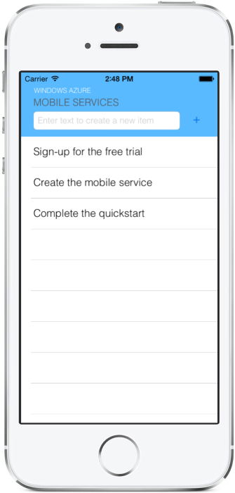
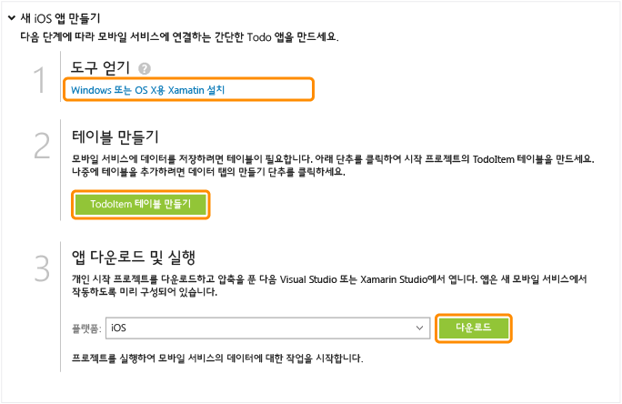
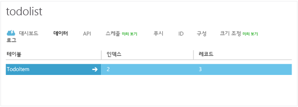

<properties pageTitle="Get Started with Mobile Services for Xamarin iOS apps" metaKeywords="" description="Follow this tutorial to get started using Azure Mobile Services for Xamarin iOS development." metaCanonical="" services="mobile" documentationCenter="Mobile" title="Get started with Mobile Services" authors="craigd" solutions="" manager="" editor="" />

모바일 서비스 시작
==================

[Windows 스토어](/en-us/documentation/articles/mobile-services-windows-store-get-started "Windows 스토어") [Windows Phone](/en-us/documentation/articles/mobile-services-windows-phone-get-started "Windows Phone") [iOS](/en-us/documentation/articles/mobile-services-ios-get-started "iOS") [Android](/en-us/documentation/articles/mobile-services-android-get-started "Android") [HTML](/en-us/documentation/articles/mobile-services-html-get-started "HTML") [Xamarin.iOS](/en-us/documentation/articles/partner-xamarin-mobile-services-ios-get-started "Xamarin.iOS") [Xamarin.Android](/en-us/documentation/articles/partner-xamarin-mobile-services-android-get-started "Xamarin.Android") [Sencha](/en-us/documentation/articles/partner-sencha-mobile-services-get-started/ "Sencha") [PhoneGap](/en-us/documentation/articles/mobile-services-javascript-backend-phonegap-get-started/ "PhoneGap")

이 자습서에서는 Azure 모바일 서비스를 사용하여 Xamarin.iOS 앱에 클라우드 기반 백 엔드 서비스를 추가하는 방법을 보여 줍니다. 이 자습서에서는 새 모바일 서비스와 새 모바일 서비스에 앱 데이터를 저장하는 간단한 *할 일 모음* 앱을 둘 다 만듭니다.

동영상을 시청하려는 경우 오른쪽에 있는 클립은 이 자습서와 동일한 단계를 따릅니다.

[자습서 보기](http://channel9.msdn.com/Series/Windows-Azure-Mobile-Services/Getting-Started-with-Xamarin-and-Windows-Azure-Mobile-Services) [동영상 재생](http://channel9.msdn.com/Series/Windows-Azure-Mobile-Services/Getting-Started-with-Xamarin-and-Windows-Azure-Mobile-Services) 10:05

완성된 앱의 스크린샷은 다음과 같습니다.

 

이 자습서를 완료하려면 XCode 4.5 및 iOS 5.0 이상 버전이 필요하며, OS X의 경우 [Xamarin Studio](http://xamarin.com/download)가 추가로 필요하고 Windows의 경우 Visual Studio용 Xamarin Visual Studio 플러그 인이 추가로 필요합니다.

**참고**

이 자습서를 완료하려면 Azure 계정이 필요합니다. 계정이 없는 경우 몇 분 만에 무료 평가판 계정을 만들 수 있습니다. 자세한 내용은 [Azure 무료 평가판](http://www.windowsazure.com/en-us/pricing/free-trial/?WT.mc_id=A643EE910&returnurl=http%3A%2F%2Fwww.windowsazure.com%2Fen-us%2Fdevelop%2Fmobile%2Ftutorials%2Fget-started-xamarin-ios%2F)을 참조하십시오.

새 모바일 서비스 만들기
-----------------------

[WACOM.INCLUDE [mobile-services-create-new-service](../includes/mobile-services-create-new-service.md)]

새 앱 만들기새 Xamarin.iOS 앱 만들기
------------------------------------

모바일 서비스를 만든 후 관리 포털에서 쉬운 빠른 시작을 따라 모바일 서비스에 연결할 새 앱을 만들거나 기존 앱을 수정할 수 있습니다.

이 섹션에서는 모바일 서비스에 연결된 새 Xamarin.iOS 앱을 만듭니다.

1.  관리 포털에서 **모바일 서비스**를 클릭한 후 방금 만든 모바일 서비스를 클릭합니다.

2.  빠른 시작 탭의 **플랫폼 선택** 아래에서 **Xamarin.iOS**를 클릭하고 **새 Xamarin.iOS 앱 만들기**를 확장합니다.

    

    그러면 모바일 서비스에 연결된 Xamarin.iOS 앱을 만들기 위한 쉬운 3단계가 표시됩니다.

    

1.  아직 수행하지 않은 경우 [Xcode] v4.4 이상 버전 및 [Xamarin Studio](http://xamarin.com/download)를 다운로드하여 설치합니다.

2.  **TodoItems 테이블 만들기**를 클릭하여 앱 데이터를 저장할 테이블을 만듭니다.

3.  **앱 다운로드 및 실행**에서 **다운로드**를 클릭합니다.

    그러면 모바일 서비스에 연결되고 Xamarin.iOS용 Azure 모바일 서비스 구성 요소를 참조하는 샘플 *할 일 모음* 응용 프로그램용 프로젝트가 다운로드됩니다. 압축된 프로젝트 파일을 로컬 컴퓨터에 저장하고 저장한 위치를 기록해 둡니다.

앱 실행새 Xamarin.iOS 앱 실행
-----------------------------

이 자습서의 최종 단계는 새 앱을 빌드하고 실행하는 것입니다.

1.  압축된 프로젝트 파일을 저장한 위치로 이동한 후 컴퓨터에서 파일 압축을 풀고 Xamarin Studio 또는 Visual Studio를 사용하여 **XamarinTodoQuickStart.iOS.sln** 솔루션 파일을 엽니다.

    

    

2.  **실행** 단추를 눌러 프로젝트를 빌드하고 이 프로젝트의 기본값인 iPhone 에뮬레이터에서 앱을 시작합니다.

3.  앱에서 *Complete the tutorial* 등의 의미 있는 텍스트를 입력한 후 더하기(**+**) 아이콘을 클릭합니다.

    

    이렇게 하면 POST 요청이 Azure에서 호스트되는 새 모바일 서비스로 전송되고, POST 요청의 데이터가 TodoItem 테이블에 삽입됩니다. TodoItem 테이블에 저장된 항목이 모바일 서비스에서 반환된 후 데이터가 목록에 표시됩니다.

    **참고**

    모바일 서비스에 액세스하여 데이터를 쿼리 및 삽입하는 코드를 검토할 수 있습니다. 이 코드는 TodoService.cs C\# 파일에 있습니다.

4.  관리 포털로 돌아가서 **데이터** 탭을 클릭한 후 **TodoItems** 테이블을 클릭합니다.

    

    이렇게 하면 앱에서 테이블로 삽입된 데이터를 찾을 수 있습니다.

    

다음 단계
---------

이제 빠른 시작을 완료했으며 모바일 서비스에서 중요한 추가 작업을 수행하는 방법을 알아보겠습니다.

-   [데이터 시작](/en-us/develop/mobile/tutorials/get-started-with-data-xamarin-ios)
    
    모바일 서비스를 사용하여 데이터를 저장 및 쿼리하는 방법을 자세히 알아봅니다.

-   [인증 시작](/en-us/develop/mobile/tutorials/get-started-with-users-xamarin-ios)
    
    ID 공급자를 사용하여 앱 사용자를 인증하는 방법을 알아봅니다.

-   [푸시 알림 시작](/en-us/develop/mobile/tutorials/get-started-with-push-xamarin-ios)
    
    기본적인 푸시 알림을 앱에 보내는 방법을 알아봅니다.

