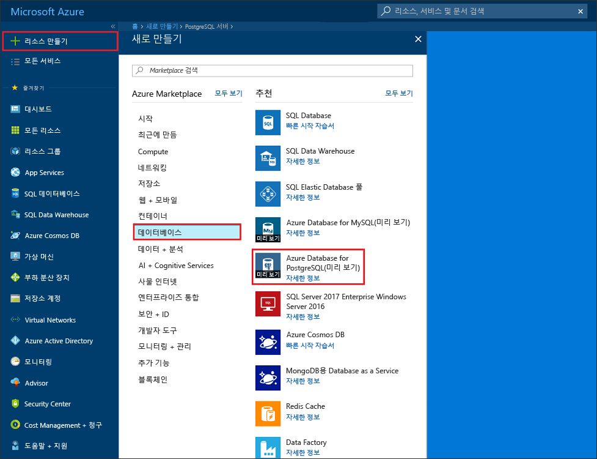
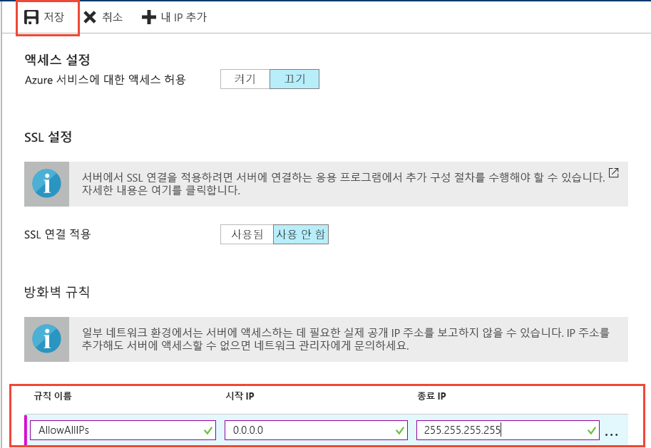

# <a name="tutorial-design-an-azure-database-for-postgresql---single-server-using-the-azure-portal"></a>자습서: Azure Portal을 사용하여 Azure Database for PostgreSQL - 단일 서버 디자인

PostgreSQL용 Azure Database는 클라우드에서 항상 사용 가능한 PostgreSQL 데이터베이스를 실행, 관리 및 크기 조정할 수 있게 하는 관리 서비스입니다. Azure Portal을 사용하면 쉽게 서버를 관리하고 데이터베이스를 디자인할 수 있습니다.

이 자습서에서는 Azure Portal을 사용하여 다음을 수행하는 방법에 대해 알아봅니다.
> [!div class="checklist"]
> * PostgreSQL용 Azure Database 서버 만들기
> * 서버 방화벽 구성
> * [**psql**](https://www.postgresql.org/docs/9.6/static/app-psql.html) 유틸리티를 사용하여 데이터베이스 만들기
> * 샘플 데이터 로드
> * 쿼리 데이터
> * 데이터 업데이트
> * 데이터 복원

## <a name="prerequisites"></a>사전 요구 사항
Azure 구독이 아직 없는 경우 시작하기 전에 [체험](https://azure.microsoft.com/free/) 계정을 만듭니다.

## <a name="create-an-azure-database-for-postgresql"></a>PostgreSQL용 Azure Database 만들기

Azure Database for PostgreSQL 서버는 정의된 [컴퓨팅 및 스토리지 리소스](./concepts-compute-unit-and-storage.md) 세트로 만들어집니다. 서버는 [Azure 리소스 그룹](../azure-resource-manager/management/overview.md) 내에 만들어집니다.

다음 단계에 따라 Azure Database for PostgreSQL 서버를 만듭니다.
1. Azure Portal의 왼쪽 위 모서리에서 **리소스 만들기**를 클릭합니다.
2. **새로 만들기** 페이지에서 **데이터베이스**를 선택하고, **데이터베이스** 페이지에서 **PostgreSQL용 Azure Database**를 선택합니다.
   

3. **단일 서버** 배포 옵션을 선택합니다.

   

4. 다음 정보로 **기본 사항** 양식을 입력합니다.

    

    설정|제안 값|Description
    ---|---|---
    Subscription|구독 이름|서버에 사용할 Azure 구독입니다. 구독이 여러 개인 경우 해당 리소스에 대해 요금이 청구되는 적절한 구독을 선택합니다.
    Resource group|*myresourcegroup*| 새 리소스 그룹 이름 또는 구독의 기존 이름입니다.
    서버 이름 |*mydemoserver*|PostgreSQL 서버용 Azure Database를 식별하는 고유한 이름입니다. 사용자가 제공한 서버 이름에 *postgres.database.azure.com* 도메인 이름이 추가됩니다. 서버는 소문자, 숫자 및 하이픈(-) 문자만 포함할 수 있으며, 3-63자 이상이어야 합니다.
    데이터 원본 | *없음* | 새 서버를 처음부터 만들려면 *없음*을 선택합니다. (기존 Azure Database for PostgreSQL 서버의 지역 백업에서 서버를 만든 경우 *백업*을 선택합니다).
    관리자 사용자 이름 |*myadmin*| 서버에 연결할 경우 사용할 사용자 고유의 로그인 계정입니다. 관리자 로그인 이름은 **azure_superuser**, **azure_pg_admin**, **admin**, **administrator**, **root**, **guest** 또는 **public**이 될 수 없습니다. **pg_** 로 시작할 수 없습니다.
    암호 |사용자 암호| 서버 관리자 계정의 새 암호입니다. 8-128자여야 합니다. 사용자 암호는 다음 범주 중 세 개의 문자를 포함해야 합니다. 영문 대문자, 영문 소문자, 숫자(0-9) 및 영숫자가 아닌 문자(!, $, #, % 등).
    위치|사용자와 가장 가까운 지역| 사용자에게 가장 가까운 위치입니다.
    버전|최신 주 버전| 다른 특정 요구 사항이 없는 한 최신 PostgreSQL 주 버전입니다.
    컴퓨팅 + 스토리지 | **범용**, **5세대**, **vCore 2개**, **5GB**, **7일**, **지역 중복** | 새 서버에 대한 컴퓨팅, 스토리지 및 백업 구성입니다. **서버 구성**을 선택합니다. 그런 다음, **범용** 탭을 선택합니다. *5세대*, *vCore 4개*, *100GB* 및 *7일*은 **세대 컴퓨팅**, **vCore**, **스토리지** 및 **백업 보존 기간**에 대한 기본 값입니다. 해당 슬라이더를 그대로 두거나 조정할 수 있습니다. 지역 중복 스토리지에서 서버 백업을 사용하도록 설정하려면 **백업 중복 옵션**에서 **지역 중복**을 선택합니다. 이 가격 책정 계층 선택을 저장하려면 **확인**을 선택합니다. 다음 스크린샷은 이러한 선택을 캡처한 것입니다.

   > [!NOTE]
   > 워크로드에 가벼운 컴퓨팅 및 I/O가 적합한 경우 기본 가격 책정 계층을 고려합니다. 기본 가격 책정 계층에서 만든 서버는 나중에 범용으로 또는 메모리 최적화되도록 확장할 수 없습니다. 자세한 내용은 [가격 책정 페이지](https://azure.microsoft.com/pricing/details/postgresql/)를 참조하세요.
   > 

    ![[가격 책정 계층] 창](./media/quickstart-create-database-portal/2-pricing-tier.png)

    > [!TIP]
    > **자동 증가**를 사용하면 워크로드에 영향을 주지 않고 할당된 제한에 도달할 때 서버가 스토리지를 늘립니다.

5. **검토 + 만들기**를 선택하여 선택 사항을 검토합니다. **만들기**를 선택하여 서버를 프로비전합니다. 이 작업은 몇 분 정도 걸릴 수 있습니다.

6. 배포 프로세스를 모니터링하려면 도구 모음에서 **알림** 아이콘(벨)을 선택합니다. 배포가 완료되면 Azure Portal 대시보드에서 이 서버에 대한 타일을 서버의 **개요** 페이지에 대한 바로 가기로 만드는 **대시보드에 고정**을 선택할 수 있습니다. **리소스로 이동** 옵션을 선택하면 서버의 **개요** 페이지가 열립니다.

    ![[알림] 창](./media/quickstart-create-database-portal/3-notifications.png)
   
   기본적으로 **postgres** 데이터베이스가 서버 아래에 만들어집니다. [postgres](https://www.postgresql.org/docs/9.6/static/app-initdb.html) 데이터베이스는 사용자, 유틸리티 및 타사 애플리케이션에서 사용하는 기본 데이터베이스입니다. (다른 기본 데이터베이스는 **azure_maintenance**입니다. 해당 기능은 사용자 작업으로부터 관리되는 서비스 프로세스를 구분하는 것입니다. 이 데이터베이스에 액세스할 수 없습니다.)


## <a name="configure-a-server-level-firewall-rule"></a>서버 수준 방화벽 규칙 구성

Azure Database for PostgreSQL 서비스는 서버 수준 방화벽을 사용합니다. 기본적으로 방화벽 규칙을 만들어 특정 IP 주소 범위에 대해 방화벽을 열지 않는 한 이 방화벽은 모든 외부 애플리케이션과 도구가 서버 및 서버의 모든 데이터베이스에 연결되는 것을 방지합니다. 

1. 배포가 완료되면 왼쪽 메뉴에서 **모든 리소스**를 클릭하고, **mydemoserver** 이름을 입력하여 새로 만든 서버를 검색합니다. 검색 결과에 나열된 서버 이름을 클릭합니다. 서버에 대한 **개요** 페이지가 열리고 추가 구성을 위한 옵션이 제공됩니다.

   

2. 서버 페이지에서 **연결 보안**을 선택합니다. 

3. **규칙 이름** 아래의 텍스트 상자를 클릭하고 연결을 위한 IP 범위를 지정하는 새 방화벽 규칙을 추가합니다. IP 범위를 입력합니다. **저장**을 클릭합니다.

   

4. **저장**을 클릭한 다음 **X**를 클릭하여 **연결 보안** 페이지를 닫습니다.

   > [!NOTE]
   > Azure PostgreSQL 서버는 5432 포트를 통해 통신합니다. 회사 네트워크 내에서 연결하려는 경우 5432 포트를 통한 아웃바운드 트래픽이 네트워크 방화벽에서 허용되지 않을 수 있습니다. 이 경우 IT 부서에서 포트 5432를 열지 않으면 Azure SQL Database 서버에 연결할 수 없습니다.
   >

## <a name="get-the-connection-information"></a>연결 정보 가져오기

Azure Database for PostgreSQL 서버를 만들 때 또한 기본 **postgres** 데이터베이스도 만들어집니다. 데이터베이스 서버에 연결하려면 호스트 정보와 액세스 자격 증명을 제공해야 합니다.

1. Azure Portal의 왼쪽 메뉴에서 **모든 리소스**를 클릭하고 방금 만든 서버를 검색합니다.

   

2. **mydemoserver**서버 이름을 클릭합니다.

3. 서버의 **개요** 페이지를 선택합니다. **서버 이름** 및 **서버 관리자 로그인 이름**을 기록해 둡니다.

   


## <a name="connect-to-postgresql-database-using-psql"></a>psql을 사용하여 PostgreSQL 데이터베이스에 연결
클라이언트 컴퓨터에 PostgreSQL이 설치되어 있는 경우 [psql](https://www.postgresql.org/docs/9.6/static/app-psql.html) 로컬 인스턴스 또는 Azure 클라우드 콘솔을 사용하여 Azure PostgreSQL 서버에 연결할 수 있습니다. 이제 psql 명령줄 유틸리티를 사용하여 PostgreSQL용 Azure Database 서버에 연결해 보겠습니다.

1. 다음 psql 명령을 실행하여 Azure Database for PostgreSQL 데이터베이스에 연결합니다.
   ```
   psql --host=<servername> --port=<port> --username=<user@servername> --dbname=<dbname>
   ```

   예를 들어, 다음 명령은 액세스 자격 증명을 사용하여 **mydemoserver.postgres.database.azure.com** PostgreSQL 서버의 **postgres**라는 기본 데이터베이스에 연결합니다. 암호를 묻는 메시지가 표시되면 선택한 `<server_admin_password>`를 입력합니다.
  
   ```
   psql --host=mydemoserver.postgres.database.azure.com --port=5432 --username=myadmin@mydemoserver --dbname=postgres
   ```

   > [!TIP]
   > URL 경로를 사용하여 Postgres에 연결하려는 경우 URL의 사용자 이름에서 @ 기호가 `%40`으로 인코딩됩니다. 예를 들어 psql에 대한 연결 문자열은 다음과 같습니다.
   > ```
   > psql postgresql://myadmin%40mydemoserver@mydemoserver.postgres.database.azure.com:5432/postgres
   > ```

2. 서버에 연결되면 프롬프트에서 빈 데이터베이스를 만듭니다.
   ```sql
   CREATE DATABASE mypgsqldb;
   ```

3. 프롬프트에서 다음 명령을 실행하여 새로 만든 **mypgsqldb** 데이터베이스에 대한 연결로 전환합니다.
   ```sql
   \c mypgsqldb
   ```

## <a name="create-tables-in-the-database"></a>데이터베이스에서 테이블 만들기
이제 Azure Database for PostgreSQL에 연결하는 방법을 알았으므로 몇 가지 기본 작업을 완료할 수 있습니다.

먼저 테이블을 만들고 일부 데이터와 함께 로드합니다. 이 SQL 코드를 사용하여 인벤토리 정보를 추적하는 테이블을 만들어 보겠습니다.
```sql
CREATE TABLE inventory (
    id serial PRIMARY KEY, 
    name VARCHAR(50), 
    quantity INTEGER
);
```

다음과 같이 입력하면 테이블 목록에서 새로 만든 테이블을 볼 수 있습니다.
```sql
\dt
```

## <a name="load-data-into-the-tables"></a>테이블에 데이터 로드
이제 테이블을 만들었으므로 이 테이블에 일부 데이터를 삽입합니다. 열린 명령 프롬프트 창에서 다음 쿼리를 실행하여 데이터 행을 일부 삽입합니다.
```sql
INSERT INTO inventory (id, name, quantity) VALUES (1, 'banana', 150); 
INSERT INTO inventory (id, name, quantity) VALUES (2, 'orange', 154);
```

이제 앞에서 만든 인벤토리 테이블에 두 개의 샘플 데이터 행이 있습니다.

## <a name="query-and-update-the-data-in-the-tables"></a>테이블의 데이터 쿼리 및 업데이트
다음 쿼리를 실행하여 인벤토리 데이터베이스 테이블에서 정보를 검색합니다. 
```sql
SELECT * FROM inventory;
```

또한 테이블의 데이터를 업데이트할 수도 있습니다.
```sql
UPDATE inventory SET quantity = 200 WHERE name = 'banana';
```

데이터를 검색할 때 업데이트된 값을 볼 수 있습니다.
```sql
SELECT * FROM inventory;
```

## <a name="restore-data-to-a-previous-point-in-time"></a>이전 시점으로 데이터 복원
실수로 이 테이블을 삭제했다고 가정해 보겠습니다. 이 상황은 쉽게 복구할 수 있는 것이 아닙니다. Azure Database for PostgreSQL을 사용하면, 서버에 백업이 있는 특정 시점(구성한 백업 보존 기간에 따라 결정됨)으로 돌아가서 새 서버를 이 시점으로 복원할 수 있습니다. 이 새 서버를 사용하여 삭제된 데이터를 복구할 수 있습니다. 다음 단계는 inventory 테이블을 추가하기 전의 시점으로 **mydemoserver** 서버를 복원합니다.

1. 서버에 대한 Azure Database for PostgreSQL **개요** 페이지의 도구 모음에서 **복원**을 클릭합니다. **복원** 페이지가 열립니다.

   

2. 필요한 정보로 **복원** 양식을 채웁니다.

   

   - **복원 지점**: 서버를 변경하기 전 발생한 특정 시점을 선택합니다.
   - **대상 서버**: 복원해 두려는 새 서버의 이름을 제공합니다.
   - **위치**: 지역은 선택할 수 없으며, 기본적으로 원본 서버와 동일합니다.
   - **가격 책정 계층**: 이 값은 서버를 복원할 때 변경할 수 없습니다. 원본 서버와 동일합니다. 
3. **확인**을 클릭하여 테이블이 삭제되기 전의 [특정 시점으로 서버를 복원](./howto-restore-server-portal.md)합니다. 서버를 다른 특정 시점으로 복원할 때 [가격 책정 계층](./concepts-pricing-tiers.md)에 대한 보존 기간 내에 있으면, 중복된 새 서버가 지정한 특정 시점의 원본 서버로 만들어집니다.

## <a name="next-steps"></a>다음 단계
이 자습서에서는 Azure Portal 및 기타 유틸리티를 사용하여 다음을 수행하는 방법에 대해 알아보았습니다.
> [!div class="checklist"]
> * PostgreSQL용 Azure Database 서버 만들기
> * 서버 방화벽 구성
> * [**psql**](https://www.postgresql.org/docs/9.6/static/app-psql.html) 유틸리티를 사용하여 데이터베이스 만들기
> * 샘플 데이터 로드
> * 쿼리 데이터
> * 데이터 업데이트
> * 데이터 복원

다음으로, Azure CLI를 사용하여 유사한 작업을 수행하는 방법을 알아보려면 이 자습서를 검토합니다. [Azure CLI를 사용하여 첫 번째 Azure Database for PostgreSQL 디자인](tutorial-design-database-using-azure-cli.md)
