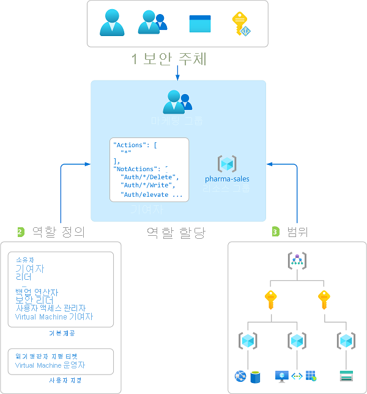
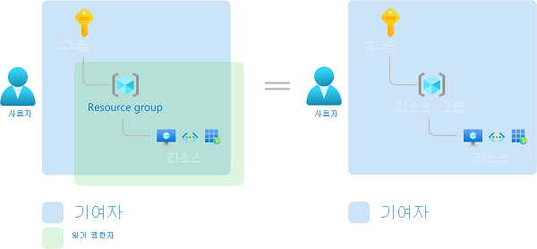

# Azure 리소스에 대한 RBAC(역할 기반 액세스 제어)란?

클라우드 리소스에 대한 액세스 관리는 클라우드를 사용하는 모든 조직에서 중요한 기능입니다. RBAC(역할 기반 액세스 제어)는 Azure 리소스에 액세스할 수 있는 사용자, 해당 리소스로 수행할 수 있는 작업 및 액세스 권한이 있는 영역을 관리하는 데 도움을 줍니다.

RBAC는 Azure 리소스에 대한 액세스를 세밀하게 관리할 수 있는 [Azure Resource Manager](../azure-resource-manager/resource-group-overview.md) 기반의 권한 부여 시스템입니다.

## RBAC로 무엇을 할 수 있나요?

RBAC로 다음과 같은 일을 할 수 있습니다.

- 한 사용자는 구독의 가상 머신을 관리하고 다른 사용자는 가상 네트워크를 관리하도록 허용
- DBA 그룹이 구독의 SQL 데이터베이스를 관리하도록 허용
- 사용자가 가상 머신, 웹 사이트, 서브넷 등 리소스 그룹의 모든 리소스를 관리하도록 허용
- 응용 프로그램이 리소스 그룹의 모든 리소스에 액세스하도록 허용

## RBAC 사용 모범 사례

RBAC를 사용하면 팀 내에서 업무를 분리하고 사용자에게 해당 작업을 수행하는 데 필요한 만큼의 권한만 부여할 수 있습니다. Azure 구독 또는 리소스에서 모든 사람에게 무제한 권한을 제공하는 대신, 특정 범위에서 특정 작업만 허용할 수 있습니다.

액세스 제어 전략을 계획할 때 작업을 완료하는 데 필요한 최소한의 권한만 사용자에게 부여하는 것이 가장 좋습니다. 다음 다이어그램은 RBAC에 대한 권장 패턴을 보여줍니다.

## RBAC의 작동 원리

RBAC를 사용하여 리소스에 대한 액세스를 제어하는 방법은 역할 할당을 만드는 것입니다. 이 개념을 반드시 이해해야 하며, 이 원리에 따라 권한이 적용됩니다. 역할 할당은 보안 주체, 역할 정의, 범위의 세 가지 요소로 구성됩니다.

### 보안 주체

*보안 주체*는 사용자, 그룹, 서비스 주체 또는 Azure 리소스에 대한 액세스를 요청하는 관리 ID를 나타내는 개체입니다.

- 사용자 - Azure Active Directory에 프로필이 있는 개인. 다른 테넌트의 사용자에게 역할을 할당할 수도 있습니다. 다른 조직의 사용자에 대한 내용은 [Azure Active Directory B2B](../active-directory/b2b/what-is-b2b.md)를 참조하세요.
- 그룹 - Azure Active Directory에서 만든 사용자 집합. 그룹에 역할을 할당하면 해당 그룹의 모든 사용자가 같은 역할을 갖습니다. 
- 서비스 주체 - 애플리케이션 또는 서비스에서 특정 Azure 리소스에 액세스하기 위해 사용하는 보안 ID. 응용 프로그램의 *사용자 ID*(사용자 이름과 암호 또는 인증서)로 생각하시면 됩니다.
- 관리 ID - Azure에서 자동으로 관리되는 Azure Active Directory의 ID입니다. 일반적으로 Azure 서비스에 인증하기 위한 자격 증명을 관리하는 클라우드 애플리케이션을 개발하는 경우 [ID 관리](../active-directory/managed-identities-azure-resources/overview.md)를 사용합니다.

### 역할 정의

*역할 정의*는 권한 컬렉션입니다. 때로는 *역할*이라고 합니다. 역할 정의에는 읽기, 쓰기 및 삭제와 같이 수행할 수 있는 작업이 나열됩니다. 역할은 소유자처럼 대략적일 수도 있고 가상 머신 판독기처럼 구체적일 수도 있습니다.

Azure에는 사용 가능한 [기본 제공 역할](built-in-roles.md)이 여러 개 있습니다. 다음은 네 가지 기본 제공 역할입니다. 처음 세 개는 모든 리소스 종류에 적용됩니다.

- [소유자](built-in-roles.md#owner) - 액세스 권한을 다른 사용자에게 위임할 수 있는 권한을 포함하여 모든 리소스에 대한 전체 액세스 권한을 보유합니다.
- [기여자](built-in-roles.md#contributor) - 모든 유형의 Azure 리소스를 만들고 관리할 수 있지만 다른 사용자에게 액세스 권한을 부여할 수 없습니다.
- [읽기 권한자](built-in-roles.md#reader) - 기존 Azure 리소스를 볼 수 있습니다.
- [사용자 액세스 관리자](built-in-roles.md#user-access-administrator) - Azure 리소스에 대한 사용자 액세스를 관리할 수 있습니다.

나머지 기본 제공 역할은 특정 Azure 리소스의 관리를 허용합니다. 예를 들어 [Virtual Machine 기여자](built-in-roles.md#virtual-machine-contributor) 역할을 사용하면 사용자가 가상 머신을 만들고 관리할 수 있습니다. 기본 제공 역할이 조직의 특정 요구 사항을 충족하지 않는 경우 [Azure 리소스에 대한 사용자 지정 역할](custom-roles.md)을 만들면 됩니다.

Azure에는 개체 내 데이터에 대한 액세스 권한을 부여할 수 있는 데이터 작업이 있습니다. 예를 들어 사용자가 저장소 계정에 대한 데이터 읽기 액세스 권한을 갖고 있는 경우 해당 저장소 계정 내의 BLOB 또는 메시지를 읽을 수 있습니다. 자세한 내용은 [Azure 리소스에 대한 역할 정의 이해](role-definitions.md)를 참조하세요.

### 범위

*범위*는 액세스가 적용되는 리소스의 세트입니다. 역할에 할당할 때 범위를 정의하여 허용되는 작업을 추가로 제한할 수 있습니다. 이러한 기능은 누군가를 단일 리소스 그룹에 대해서만 [웹 사이트 기여자](built-in-roles.md#website-contributor)로 지정하려는 경우에 유용합니다.

Azure는 여러 수준([관리 그룹](../governance/management-groups/index.md), 구독, 리소스 그룹 또는 리소스)에서 구독을 지정할 수 있습니다. 범위는 부모-자식 관계로 구조화되어 있습니다.

부모 범위에서 액세스 권한을 부여하는 경우 해당 권한은 자식 범위에 상속됩니다. 예:

- 관리 그룹 범위에서 [소유자](built-in-roles.md#owner) 역할을 사용자에게 할당하는 경우 해당 사용자는 모든 관리 그룹의 모든 구독에서 모든 항목을 관리할 수 있습니다.
- 구독 범위에서 그룹에 [읽기 권한자](built-in-roles.md#reader) 역할을 할당하면 해당 그룹의 멤버가 구독의 모든 리소스 그룹 및 리소스를 볼 수 있습니다.
- 리소스 그룹 범위에서 응용 프로그램에 [기여자](built-in-roles.md#contributor) 역할을 할당하면 해당 응용 프로그램은 해당 리소스 그룹의 모든 리소스 종류를 관리할 수 있지만, 구독의 다른 리소스 그룹을 관리할 수 없습니다.

### 역할 할당

*역할 할당*은 액세스 권한을 부여하기 위해 특정 범위에서 역할 정의를 사용자, 그룹, 서비스 주체 또는 관리 ID에 연결하는 프로세스입니다. 역할 할당을 만들어서 액세스 권한을 부여하고, 역할 할당을 제거하여 액세스 권한을 취소합니다.

다음 다이어그램은 역할 할당의 예를 보여줍니다. 이 예제에서 마케팅 그룹에는 pharma-sales 리소스 그룹에 대한 [기여자](built-in-roles.md#contributor) 역할이 할당되었습니다. 즉, 마케팅 그룹의 해당 사용자가 pharma-sales 리소스 그룹에 Azure 리소스를 만들거나 관리할 수 있습니다. 마케팅 사용자는 다른 역할 할당에 포함되지 않는 한, pharma-sales 리소스 그룹 외부에 있는 리소스에 액세스할 수 없습니다.

Azure Portal, Azure CLI, Azure PowerShell, Azure SDK 또는 REST API를 사용하여 역할 할당을 만들 수 있습니다. 각 구독에서 최대 2000개의 역할 할당을 유지할 수 있습니다. 역할 할당을 만들거나 제거하려면 `Microsoft.Authorization/roleAssignments/*` 권한이 필요합니다. 이 권한은 [소유자](built-in-roles.md#owner) 또는 [사용자 액세스 관리자](built-in-roles.md#user-access-administrator) 역할을 통해 부여됩니다.

## 여러 역할 할당

따라서 여러 겹치는 역할 할당이 있는 경우 어떻게 되나요? RBAC는 가법 모델이므로 유효 권한은 역할 할당의 추가입니다. 사용자가 구독 범위에서 기여자 역할에 부여되고 리소스 그룹에서 읽기 권한자 역할에 부여되는 다음 예제를 고려해 봅니다. 기여자 권한 및 읽기 권한자 권한의 추가는 사실상 리소스 그룹에 대한 기여자 역할입니다. 따라서 이 경우 판독기 역할 할당은 영향을 주지 않습니다.

## 거부 할당

이전에는 RBAC가 거부가 없는 허용 전용 모델이었지만 이제 RBAC는 제한된 방식으로 거부 할당을 지원합니다. *거부 할당*은 역할 할당과 마찬가지로 액세스를 거부하기 위해 특정 범위에서 사용자, 그룹, 서비스 주체 또는 관리 ID에게 거부 작업 세트를 연결합니다. 역할 할당은 *허용된* 일련의 작업을 정의하고 거부 할당은 *허용되지 않는* 일련의 작업을 정의합니다. 즉, 거부 할당은 역할 할당이 사용자에게 액세스 권한을 부여하더라도 지정된 작업을 사용자가 수행할 수 없도록 차단합니다. 거부 할당은 역할 할당보다 우선합니다. 자세한 내용은 [Azure 리소스에 대한 거부 할당 이해](deny-assignments.md)를 참조하세요.

## RBAC에서 사용자가 리소스에 액세스 권한이 있는지 확인하는 방법

다음은 관리 평면에서 리소스에 액세스할 수 있는지 확인하기 위해 RBAC가 사용하는 고급 단계입니다. 이 단계는 액세스 문제를 해결하려는 경우 이해하는 데 도움이 됩니다.

1. 사용자(또는 서비스 주체)가 Azure Resource Manager에 대한 토큰을 획득합니다.

    토큰에는 사용자의 그룹 멤버 자격(전이적 그룹 멤버 자격)이 포함됩니다.

1. 사용자는 연결된 토큰을 사용하여 Azure Resource Manager에 REST API를 호출합니다.

1. Azure Resource Manager는 모든 역할 할당을 검색하고 작업이 수행될 때 리소스에 적용되는 할당을 거부합니다.

1. Azure Resource Manager는 이 사용자 또는 그룹에 적용되는 역할 할당을 범위를 좁히고 사용자가 이 리소스에 대해 갖는 역할을 결정합니다.

1. Azure Resource Manager는 사용자가 이 리소스에 대해 갖는 역할에 API 호출의 동작이 포함되는지 여부를 결정합니다.

1. 사용자에게 요청한 범위의 작업이 있는 역할이 없으면 액세스가 허용되지 않습니다. 그렇지 않으면, Azure Resource Manager는 거부 할당이 적용되는지 확인합니다.

1. 거부 할당이 적용되면 액세스가 차단됩니다. 그렇지 않으면 액세스 권한이 부여됩니다.

## 라이선스 요구 사항

[!INCLUDE [Azure AD free license](../../includes/active-directory-free-license.md)]

## 다음 단계

- [빠른 시작: Azure Portal을 사용하여 사용자가 Azure 리소스에 대해 갖는 액세스 권한 보기](check-access.md)
- [RBAC 및 Azure Portal을 사용하여 Azure 리소스에 대한 액세스 관리](role-assignments-portal.md)
- [Azure의 다양한 역할 이해](rbac-and-directory-admin-roles.md)
- [엔터프라이즈 클라우드 채택: Azure에서 리소스 액세스 관리](/azure/architecture/cloud-adoption/governance/resource-consistency/azure-resource-access)
