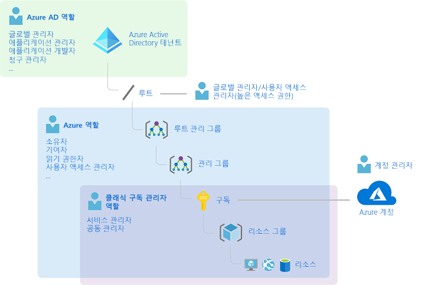
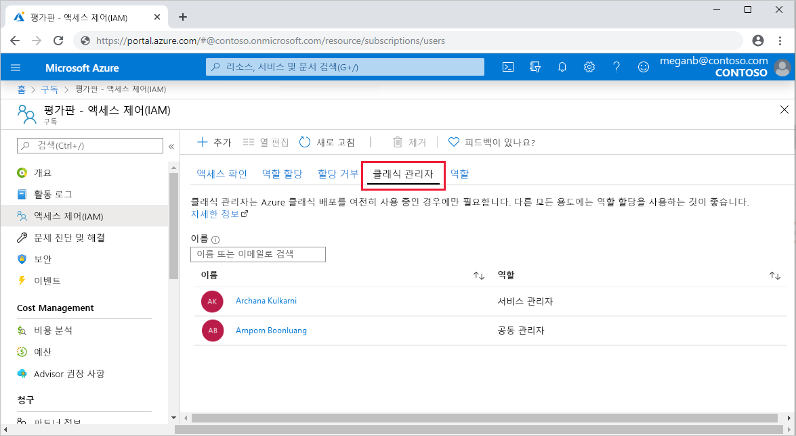
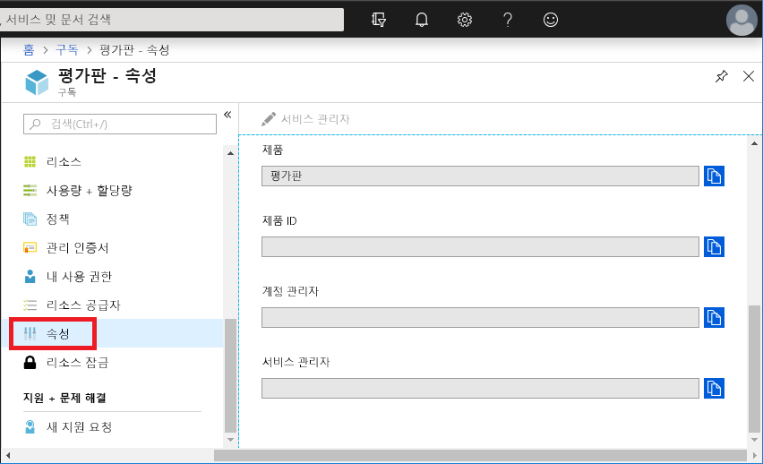
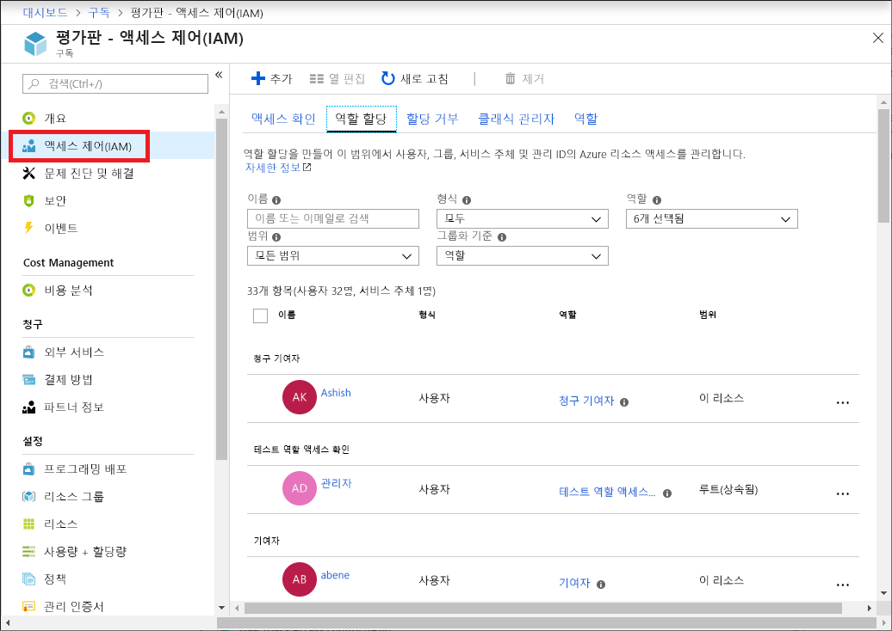
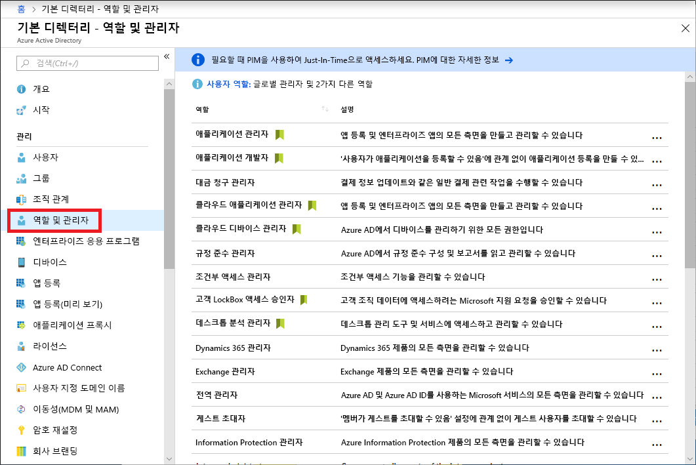
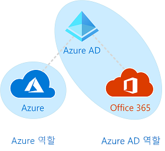

# 클래식 구독 관리자 역할, Azure 역할 및 Azure AD 역할

Azure를 처음 접하는 경우 Azure의 다양한 역할을 모두 이해하기가 약간 힘들 수 있습니다. 이 문서에서는 다음 역할에 대해 설명하고 각 역할의 사용 시기에 대해 설명합니다.
- 클래식 구독 관리자 역할
- Azure 역할
- Azure AD(Azure Active Directory) 역할

## 역할이 관련되는 원리

Azure의 역할을 보다 정확하게 이해하려면 역사를 살펴보는 것이 좋습니다. Azure가 처음 릴리스되었을 때 계정 관리자, 서비스 관리자 및 공동 관리자만이 리소스 액세스 권한을 관리할 수 있었습니다. 나중에 Azure RBAC(Azure역할 기반 액세스 제어)가 추가되었습니다. Azure RBAC는 Azure 리소스에 대한 액세스를 세밀하게 관리할 수 있는 새로운 권한 부여 시스템입니다. Azure RBAC는 여러 범위에서 할당할 수 있는 기본 제공 역할을 많이 포함하고 있으며, 고유의 사용자 지정 역할을 만들 수 있습니다. Azure AD에서 사용자, 그룹, 도메인 등의 리소스를 관리할 수 있도록 여러 Azure AD 역할이 있습니다.

다음 다이어그램은 클래식 구독 관리자 역할, Azure 역할 및 Azure AD 역할의 관계를 개략적으로 보여 줍니다.

## 클래식 구독 관리자 역할

계정 관리자, 서비스 관리자 및 공동 관리자는 Azure에 있는 세 가지 클래식 구독 관리자 역할입니다. 클래식 구독 관리자는 Azure 구독에 대한 모든 권한을 보유합니다. 이들은 Azure Portal, Azure Resource Manager API 및 클래식 배포 모델 API를 사용하여 리소스를 관리할 수 있습니다. Azure에 등록하는 데 사용된 계정은 자동으로 계정 관리자와 서비스 관리자로 설정됩니다. 그런 다음 공동 관리자를 추가할 수 있습니다. 서비스 관리자 및 공동 관리자는 구독 범위에서 소유자 역할(Azure 역할)이 할당된 사용자와 동일한 액세스 권한을 갖습니다. 다음 표에서는 이러한 세 가지 클래식 구독 관리 역할의 차이점을 설명합니다.

| 클래식 구독 관리자 | 제한 | 사용 권한 | 메모 |
| --- | --- | --- | --- |
| 계정 관리자 | Azure 계정당 1개 | <ul><li>[Azure Portal](https://portal.azure.com/#blade/Microsoft_Azure_Billing/SubscriptionsBlade)에서 청구 관리</li><li>계정의 모든 구독 관리</li><li>새 구독 만들기</li><li>구독 취소</li><li>구독 요금 청구 변경</li><li>서비스 관리자 변경</li></ul> | 개념적으로 구독의 청구 소유자입니다. |
| 서비스 관리자 | Azure 구독당 1개 | <ul><li>[Azure Portal](https://portal.azure.com)에서 서비스 관리</li><li>구독 취소</li><li>사용자를 공동 관리자 역할에 할당</li></ul> | 기본적으로 새 구독의 경우 계정 관리자가 서비스 관리자이기도 합니다. 서비스 관리자는 구독 범위에서 소유자 역할이 할당된 사용자와 동일한 액세스 권한을 갖습니다. 서비스 관리자는 Azure Portal에 대해 모든 권한을 갖습니다. |
| 공동 관리자 | 구독당 200 | <ul><li>서비스 관리자와 동일한 액세스 권한을 갖지만, Azure 디렉터리에 대한 구독의 연결을 변경할 수 없습니다.</li><li>사용자를 공동 관리자 역할에 할당할 수 있지만, 서비스 관리자를 변경할 수 없습니다.</li></ul> | 공동 관리자는 구독 범위에서 소유자 역할이 할당된 사용자와 동일한 액세스 권한을 갖습니다. |

Azure Portal에서 **클래식 관리자** 탭을 사용하여 공동 관리자를 관리하거나 서비스 관리자를 볼 수 있습니다.

Azure Portal에서 구독의 속성 블레이드에서 서비스 관리자를 보거나 변경하거나 계정 관리자를 볼 수 있습니다.

자세한 내용은 [Azure 클래식 구독 관리자](classic-administrators.md)를 참조하세요.

### Azure 계정 및 Azure 구독

Azure 계정은 청구 관계를 나타냅니다. Azure 계정은 사용자 ID이자, 하나 이상의 Azure 구독이자, 연결된 Azure 리소스 집합입니다. 계정을 만드는 사람은 해당 계정에서 만든 모든 구독의 계정 관리자입니다. 이 사람은 구독의 기본 서비스 관리자이기도 합니다.

Azure 구독을 사용하여 Azure 리소스에 대한 액세스를 구성할 수 있습니다. 리소스 사용을 보고하고, 요금을 청구하고, 지불하는 방식을 제어할 수도 있습니다. 각 구독은 청구 및 지불 설정이 다를 수 있으므로 사무실, 부서, 프로젝트 등에 따라 구독 및 계획이 다를 수 있습니다. 모든 서비스는 구독에 소속되며, 구독 ID는 프로그래밍 방식 작업에 필요할 수 있습니다.

각 구독은 Azure AD 디렉터리와 연결됩니다. 구독이 연결된 디렉터리를 찾으려면 Azure Portal에서 **구독** 을 열고 구독을 선택하여 해당 디렉터리를 확인합니다.

계정 및 구독은 [Azure Portal](https://portal.azure.com/#blade/Microsoft_Azure_Billing/SubscriptionsBlade)에서 관리합니다.

## Azure 역할

Azure RBAC는 [Azure Resource Manager](../azure-resource-manager/management/overview.md) 기반의 권한 부여 시스템으로, 컴퓨팅 및 스토리지 같은 Azure 리소스에 대한 액세스를 세밀하게 관리할 수 있습니다. Azure RBAC에는 70개가 넘는 기본 제공 역할이 포함되어 있습니다. 네 가지 기본 Azure 역할이 있습니다. 처음 세 개는 모든 리소스 종류에 적용됩니다.

| Azure 역할 | 사용 권한 | 메모 |
| --- | --- | --- |
| [소유자](built-in-roles.md#owner) | <ul><li>모든 리소스에 대한 전체 액세스 권한</li><li>다른 사람에게 액세스 권한을 위임 가능</li></ul> | 서비스 관리자 및 공동 관리자에게 구독 범위에서 소유자 역할이 할당됨 모든 리소스 종류에 적용됩니다. |
| [기여자](built-in-roles.md#contributor) | <ul><li>모든 종류의 Azure 리소스를 만들고 관리</li><li>Azure Active Directory에서 새 테넌트 만들기</li><li>다른 사람에게 액세스 권한을 부여할 수 없음</li></ul> | 모든 리소스 종류에 적용됩니다. |
| [판독기](built-in-roles.md#reader) | <ul><li>Azure 리소스 보기</li></ul> | 모든 리소스 종류에 적용됩니다. |
| [사용자 액세스 관리자](built-in-roles.md#user-access-administrator) | <ul><li>Azure 리소스에 대한 사용자 액세스 관리</li></ul> |  |

나머지 기본 제공 역할은 특정 Azure 리소스의 관리를 허용합니다. 예를 들어 [Virtual Machine 기여자](built-in-roles.md#virtual-machine-contributor) 역할을 사용하면 사용자가 가상 머신을 만들고 관리할 수 있습니다. 기본 제공 역할 전체 목록은 [Azure 기본 제공 역할](built-in-roles.md)을 참조하세요.

Azure Portal 및 Azure Resource Manager API만이 Azure RBAC를 지원합니다. Azure 역할이 할당된 사용자, 그룹 및 애플리케이션은 [Azure 클래식 배포 모델 API](../azure-resource-manager/management/deployment-models.md)를 사용할 수 없습니다.

Azure Portal에서 Azure RBAC를 사용하는 역할 할당은 **액세스 제어(IAM)** 블레이드에 나타납니다. 이 블레이드는 관리 그룹, 구독, 리소스 그룹 및 다양한 리소스와 같은 포털 전체에서 찾을 수 있습니다.

**역할** 탭을 클릭하면 기본 제공 역할 및 사용자 지정 역할 목록이 표시됩니다.

자세한 내용은 [Azure Portal을 사용하여 Azure 역할 할당](role-assignments-portal.md)을 참조하세요.

## Azure AD 역할

Azure AD 역할은 사용자 생성 또는 편집, 다른 사용자에게 관리 역할 할당, 사용자 암호 다시 설정, 사용자 라이선스 관리, 도메인 관리 등 디렉터리의 Azure AD 리소스를 관리하는 데 사용됩니다. 다음 표에서는 보다 중요한 몇 가지 Azure AD 역할에 대해 설명합니다.

| Azure AD 역할 | 사용 권한 | 메모 |
| --- | --- | --- |
| [전역 관리자](../active-directory/roles/permissions-reference.md#global-administrator) | <ul><li>Azure Active Directory에 페더레이션하는 서비스를 비롯하여 Azure Active Directory의 모든 관리 기능에 대한 액세스 관리</li><li>다른 사람에게 관리자 역할 할당</li><li>모든 사용자 및 다른 관리자의 암호 다시 설정</li></ul> | Azure Active Directory 테넌트에 등록하는 사람이 전역 관리자가 됩니다. |
| [사용자 관리자](../active-directory/roles/permissions-reference.md#user-administrator) | <ul><li>사용자 및 그룹과 관련된 모든 것을 만들고 관리</li><li>지원 티켓 관리</li><li>서비스 상태 모니터링</li><li>사용자, 기술 지원팀 관리자 및 다른 사용자 관리자의 암호 변경</li></ul> |  |
| [대금 청구 관리자](../active-directory/roles/permissions-reference.md#billing-administrator) | <ul><li>구매</li><li>구독 관리</li><li>지원 티켓 관리</li><li>서비스 상태 모니터링</li></ul> |  |

Azure Portal의 **역할 및 관리자** 블레이드에서 Azure AD 역할 목록을 볼 수 있습니다. Azure AD 역할의 전체 목록은 [Azure Active Directory에서 관리자 역할 사용 권한](../active-directory/roles/permissions-reference.md)을 참조하세요.

## Azure 역할과 Azure AD 역할의 차이점

간단하게 보자면, Azure 역할은 Azure 리소스를 관리하는 권한을 제어하고, Azure AD 역할은 Azure Active Directory 리소스를 관리하는 권한을 제어합니다. 다음 표에서는 몇 가지 차이점을 비교합니다.

| Azure 역할 | Azure AD 역할 |
| --- | --- |
| Azure 리소스에 대한 액세스 관리 | Azure Active Directory 리소스에 대한 액세스 관리 |
| 사용자 지정 역할 지원 | 사용자 지정 역할 지원 |
| 여러 수준(관리 그룹, 구독, 리소스 그룹, 리소스)에서 범위를 지정할 수 있음 | [범위](../active-directory/roles/custom-overview.md#scope)는 테넌트 수준(조직 전체), 관리 단위 또는 개별 개체(예: 특정 애플리케이션)에서 지정할 수 있습니다. |
| Azure Portal, Azure CLI, Azure PowerShell, Azure Resource Manager 템플릿, REST API에서 역할 정보에 액세스 가능 | 역할 정보는 Azure 관리 포털, Microsoft 365 관리 센터, Microsoft Graph, Azure AD PowerShell에서 액세스할 수 있음 |

### Azure 역할과 Azure AD 역할이 겹치나요?

기본적으로 Azure 역할과 Azure AD 역할은 Azure 및 Azure AD를 다루지 않습니다. 그러나 전역 관리자가 Azure Portal에서 **Azure 리소스에 대한 액세스 관리** 스위치를 선택하여 액세스 권한을 높이면 전역 관리자에게 특정 테넌트의 모든 구독에 대한 [사용자 액세스 관리자](built-in-roles.md#user-access-administrator) 역할(Azure 역할)이 부여됩니다. 사용자 액세스 관리자 역할은 사용자가 다른 사용자에게 Azure 리소스에 대한 액세스 권한을 부여할 수 있게 해줍니다. 이 스위치는 구독에 대한 액세스 권한을 다시 얻고자 할 때 유용하게 사용할 수 있습니다. 자세한 내용은 [모든 Azure 구독 및 관리 그룹을 관리할 수 있도록 액세스 권한 상승](elevate-access-global-admin.md)을 참조하세요.

여러 Azure AD 역할은 전역 관리자 및 사용자 관리자 역할 같은 Azure AD 및 Microsoft 365를 포괄합니다. 예를 들어 전역 관리자 역할의 구성원은 Azure AD 및 Microsoft 365에서 Microsoft Exchange와 Microsoft SharePoint를 변경하는 등의 전역 관리자 기능을 사용할 수 있습니다. 그러나 기본적으로 전역 관리자는 Azure 리소스에 액세스할 수 없습니다.

## 다음 단계

- [Azure RBAC(Azure 역할 기반 액세스 제어)란?](overview.md)
- [Azure Active Directory의 관리자 역할 사용 권한](../active-directory/roles/permissions-reference.md)
- [Azure 클래식 구독 관리자](classic-administrators.md)
