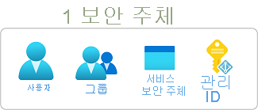
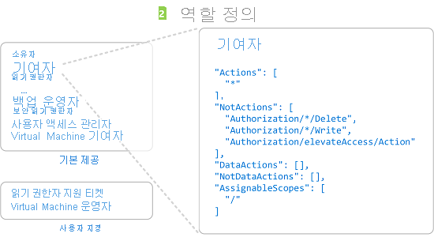
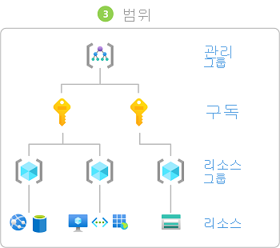

# Azure 역할을 할당 하는 단계

[!INCLUDE [Azure RBAC definition grant access](../../includes/role-based-access-control/definition-grant.md)] 이 문서에서는 [Azure Portal](role-assignments-portal.md), [Azure PowerShell](role-assignments-powershell.md), [Azure CLI](role-assignments-cli.md)또는 [REST API](role-assignments-rest.md)를 사용 하 여 Azure 역할을 할당 하는 개략적인 단계를 설명 합니다.

## 1 단계: 액세스 해야 하는 사용자 확인

먼저 액세스 해야 하는 사용자를 결정 해야 합니다. 사용자, 그룹, 서비스 주체 또는 관리 id에 역할을 할당할 수 있습니다. 이를 *보안 주체* 라고도 합니다.

- 사용자 - Azure Active Directory에 프로필이 있는 개인. 다른 테넌트의 사용자에게 역할을 할당할 수도 있습니다. 다른 조직의 사용자에 대한 내용은 [Azure Active Directory B2B](../active-directory/external-identities/what-is-b2b.md)를 참조하세요.
- 그룹 - Azure Active Directory에서 만든 사용자 집합. 그룹에 역할을 할당하면 해당 그룹의 모든 사용자가 같은 역할을 갖습니다. 
- 서비스 주체 - 애플리케이션 또는 서비스에서 특정 Azure 리소스에 액세스하기 위해 사용하는 보안 ID. 애플리케이션의 *사용자 ID*(사용자 이름과 암호 또는 인증서)로 생각하시면 됩니다.
- 관리 ID - Azure에서 자동으로 관리되는 Azure Active Directory의 ID입니다. 일반적으로 Azure 서비스에 인증하기 위한 자격 증명을 관리하는 클라우드 애플리케이션을 개발하는 경우 [ID 관리](../active-directory/managed-identities-azure-resources/overview.md)를 사용합니다.

## 2 단계: 적절 한 역할 선택

사용 권한은 *역할 정의* 에 함께 그룹화 됩니다. 일반적으로 단지 *역할* 이라고 합니다. 여러 기본 제공 역할 목록에서 선택할 수 있습니다. 기본 제공 역할이 조직의 특정 요구 사항을 충족하지 않는 경우 사용자 지정 역할을 만들면 됩니다.

다음은 네 가지 기본 제공 역할입니다. 처음 세 개는 모든 리소스 종류에 적용됩니다.

- [소유자](built-in-roles.md#owner) - 액세스 권한을 다른 사용자에게 위임할 수 있는 권한을 포함하여 모든 리소스에 대한 전체 액세스 권한을 보유합니다.
- [기여자](built-in-roles.md#contributor) - 모든 유형의 Azure 리소스를 만들고 관리할 수 있지만 다른 사용자에게 액세스 권한을 부여할 수 없습니다.
- [읽기 권한자](built-in-roles.md#reader) - 기존 Azure 리소스를 볼 수 있습니다.
- [사용자 액세스 관리자](built-in-roles.md#user-access-administrator) - Azure 리소스에 대한 사용자 액세스를 관리할 수 있습니다.

나머지 기본 제공 역할은 특정 Azure 리소스의 관리를 허용합니다. 예를 들어 [Virtual Machine 기여자](built-in-roles.md#virtual-machine-contributor) 역할을 사용하면 사용자가 가상 머신을 만들고 관리할 수 있습니다.

1. 포괄적인 내용을 다루는 [Azure 기본 제공 역할](built-in-roles.md) 문서부터 시작합니다. 문서 맨 위에 있는 표는 이 문서의 뒷부분에 있는 세부 정보의 인덱스입니다.

1. 이 문서에서 사용 권한을 부여 하려는 리소스에 대 한 서비스 범주 (예: 계산, 저장소, 데이터베이스)로 이동 합니다. 원하는 항목을 찾는 가장 쉬운 방법은 일반적으로 페이지에서 "BLOB", "가상 머신" 등의 관련 키워드를 검색하는 것입니다.

1. 서비스 범주에 대해 나열된 역할을 검토하고 필요한 작업을 찾습니다. 다시 말씀드리지만, 항상 가장 제한된 역할로 시작합니다.

    예를 들어 보안 주체가 Azure storage 계정에서 blob을 읽어야 하지만 쓰기 권한이 필요 하지 않은 경우 [저장소 Blob 데이터 참가자](built-in-roles.md#storage-blob-data-contributor) 대신 [저장소 blob 데이터 판독기](built-in-roles.md#storage-blob-data-reader) 를 선택 합니다 (관리자 수준 [저장소 blob 데이터 소유자](built-in-roles.md#storage-blob-data-owner) 역할은 명확 하지 않음). 나중에 필요에 따라 언제든지 역할 할당을 업데이트할 수 있습니다.

1. 적절 한 역할을 찾을 수 없는 경우 [사용자 지정 역할](custom-roles.md)을 만들 수 있습니다.

## 3 단계: 필요한 범위 확인

*범위* 는 액세스가 적용되는 리소스의 세트입니다. Azure에서 [관리 그룹](../governance/management-groups/overview.md), 구독, [리소스 그룹](../azure-resource-manager/management/overview.md#resource-groups)및 리소스의 네 가지 수준으로 범위를 지정할 수 있습니다. 범위는 부모-자식 관계로 구조화되어 있습니다. 계층의 각 수준은 범위를 보다 구체적으로 만듭니다. 이러한 범위 수준에서 역할을 할당할 수 있습니다. 선택한 수준에 따라 역할이 적용 되는 방식이 결정 됩니다. 하위 수준은 상위 수준에서 역할 권한을 상속 합니다. 

부모 범위에서 역할을 할당 하는 경우 해당 사용 권한은 자식 범위로 상속 됩니다. 예를 들면 다음과 같습니다.

- 관리 그룹 범위에서 사용자에 게 읽기 [권한자](built-in-roles.md#reader) 역할을 할당 하는 경우 해당 사용자는 관리 그룹의 모든 구독에 있는 모든 항목을 읽을 수 있습니다.
- 구독 범위에서 그룹에 [청구 읽기 권한자](built-in-roles.md#billing-reader) 역할을 할당 하는 경우 해당 그룹의 구성원은 구독의 모든 리소스 그룹 및 리소스에 대 한 청구 데이터를 읽을 수 있습니다.
- 리소스 그룹 범위에서 애플리케이션에 [기여자](built-in-roles.md#contributor) 역할을 할당하면 해당 애플리케이션은 해당 리소스 그룹의 모든 리소스 종류를 관리할 수 있지만, 구독의 다른 리소스 그룹을 관리할 수 없습니다.

 자세한 내용은 [범위 이해](scope-overview.md)를 참조 하세요.

## 4단계. 필수 구성 요소 확인

역할을 할당 하려면 역할 할당을 수행 하는 역할에 할당 된 사용자 (예: [소유자](built-in-roles.md#owner) 또는 [사용자 액세스 관리자](built-in-roles.md#user-access-administrator) )가 역할을 할당 하려는 사용자로 로그인 해야 합니다. 마찬가지로 역할 할당을 제거 하려면 역할 할당 삭제 권한이 있어야 합니다.

- `Microsoft.Authorization/roleAssignments/write`
- `Microsoft.Authorization/roleAssignments/delete`

사용자 계정에 구독 내에서 역할을 할당할 수 있는 권한이 없으면 계정에 "'Microsoft.Authorization/roleAssignments/write' 작업을 수행할 수 있는 권한이 없습니다"라는 오류 메시지가 표시됩니다. 이 경우 개발자 대신 권한을 할당할 수 있는 구독 관리자에게 문의하세요.

## 5단계. 역할 할당

보안 주체, 역할 및 범위를 알고 있으면 역할을 할당할 수 있습니다. Azure Portal, Azure PowerShell, Azure CLI, Azure Sdk 또는 REST Api를 사용 하 여 역할을 할당할 수 있습니다. 각 구독에서 최대 **2000** 개의 역할 할당을 유지할 수 있습니다. 이 제한에는 구독, 리소스 그룹 및 리소스 범위의 역할 할당이 포함됩니다. 각 관리 그룹에서 최대 **500** 개의 역할 할당을 유지할 수 있습니다.

역할을 할당 하는 방법에 대 한 자세한 단계는 다음 문서를 확인 하세요.

- [Azure Portal을 사용하여 Azure 역할 할당](role-assignments-portal.md)
- [Azure PowerShell을 사용하여 Azure 역할 할당](role-assignments-powershell.md)
- [Azure CLI를 사용 하 여 Azure 역할 할당](role-assignments-cli.md)
- [REST API를 사용 하 여 Azure 역할 할당](role-assignments-rest.md)

## 다음 단계

- [자습서: Azure Portal을 사용하여 Azure 리소스에 대한 사용자 액세스 권한 부여](quickstart-assign-role-user-portal.md)