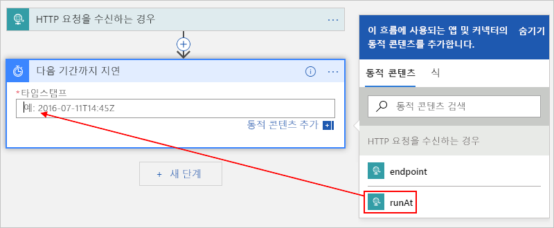
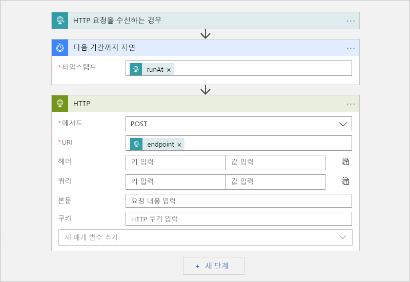

# Azure Scheduler 작업을 Azure Logic Apps로 마이그레이션

> [!IMPORTANT]
> Azure Scheduler는 조만간 사용 중지되고 Azure Logic Apps로 대체됩니다. 작업을 예약하려면 이 문서의 설명에 따라 Azure Logic Apps로 전환하세요.

이 문서에서는 Azure Scheduler 대신 Azure Logic Apps를 사용하여 자동화된 워크플로를 만들어서 일회성 및 되풀이 작업을 예약하는 방법을 보여줍니다. Logic Apps를 사용하여 예약된 작업을 만들면 다음과 같은 이점이 있습니다.

* 각 논리 앱이 별도의 Azure 리소스이므로 *작업 컬렉션* 개념에 대해 걱정할 필요가 없습니다.

* 단일 논리 앱을 사용하여 일회성 작업을 여러 개 실행할 수 있습니다.

* Azure Logic Apps 서비스는 표준 시간대 및 DST(일광 절약 시간)를 지원합니다.

자세한 내용을 알아보려면 [Azure Logic Apps란?](../logic-apps/logic-apps-overview.md)을 참조하거나 [첫 번째 논리 앱 만들기](../logic-apps/quickstart-create-first-logic-app-workflow.md) 빠른 시작에서 첫 번째 논리 앱을 만들어 보세요.

## 필수 조건

* Azure 구독. Azure 구독이 없는 경우 <a href="https://azure.microsoft.com/free/" target="_blank">체험 Azure 계정에 등록</a>합니다.

* HTTP 요청을 전송하여 논리 앱을 트리거하려면 [Postman 데스크톱 앱](https://www.getpostman.com/apps) 같은 도구를 사용합니다.

## 일회성 작업 예약

단일 논리 앱을 만들어서 일회성 작업을 여러 개 실행할 수 있습니다. 

### 논리 앱 만들기

1. [Azure Portal](https://portal.azure.com)의 논리 앱 디자이너에서 빈 논리 앱을 만듭니다. 

   기본 단계는 [빠른 시작: 첫 번째 논리 앱 만들기](../logic-apps/quickstart-create-first-logic-app-workflow.md)를 따릅니다.

1. 검색 상자에 “http 요청”을 필터로 입력합니다. 트리거 목록에서 **HTTP 요청을 수신하는 경우** 트리거를 선택합니다. 

   

1. 요청 트리거의 경우 필요에 따라 논리 앱 디자이너가 들어오는 요청의 입력 구조를 이해하도록 도와주고 워크플로 뒷부분에서 출력을 좀 더 쉽게 선택하도록 만들어주는 JSON 스키마를 제공할 수 있습니다.

   스키마를 지정하려면 다음과 같이 **요청 본문 JSON 스키마** 상자에 스키마를 입력합니다. 

   

   스키마는 없지만 JSON 형식의 샘플 페이로드가 있는 경우 해당 페이로드로 스키마를 생성할 수 있습니다.

   1. 요청 트리거에서 **샘플 페이로드를 사용하여 스키마 생성**을 선택합니다.

   1. 다음과 같이 **샘플 JSON 페이로드를 입력하거나 붙여넣기**에서 샘플 페이로드를 입력하고 **완료**를 선택합니다.

      

1. 트리거 아래에서 **다음 단계**를 선택합니다. 

1. 검색 상자에 필터로 "다음 기간까지 지연"을 입력합니다. 작업 목록에서 **다음 기간까지 지연** 작업을 선택합니다.

   이 작업은 지정된 날짜 및 시간까지 논리 앱 워크플로를 일시 중지합니다.

   

1. 논리 앱 워크플로를 시작할 타임스탬프를 입력합니다. 

   **타임스탬프** 상자 내부를 클릭하면 필요에 따라 트리거에서 출력을 선택할 수 있는 동적 콘텐츠 목록이 나타납니다.

   

1. [~200+ 커넥터](../connectors/apis-list.md)에서 실행하려는 다른 작업을 선택하여 추가합니다. 

   예를 들어 URL로 요청을 전송하는 HTTP 작업 또는 Storage 큐, Service Bus 큐, Service Bus 토픽을 사용하는 작업을 포함할 수 있습니다. 

   

1. 완료되면 논리 앱을 저장합니다.

   

   논리 앱을 처음으로 저장하면 논리 앱의 요청 트리거에 대한 엔드포인트 URL이 **HTTP POST URL** 상자에 나타납니다. 
   논리 앱을 호출하고 논리 앱으로 입력을 보내 처리하려면 이 URL을 호출 대상으로 사용합니다.

   

1. 나중에 논리 앱을 트리거하는 수동 요청을 보낼 수 있도록 이 엔드포인트 URL을 복사하여 저장합니다. 

## 일회성 작업 시작

일회성 작업을 수동으로 실행하거나 트리거하려면 논리 앱의 요청 트리거에 대한 엔드포인트 URL에 호출을 보냅니다. 이 호출에서 전송할 입력 또는 페이로드를 지정합니다. 앞에서 스키마를 지정하여 입력 또는 페이로드에 대해 설명했을 수도 있습니다. 

예를 들어 Postman 앱을 사용하는 경우 이 샘플과 비슷한 설정으로 POST 요청을 만든 후 **보내기**를 선택하여 요청을 만들 수 있습니다.

| 요청 메서드 | URL | 본문 | 헤더 |
|----------------|-----|------|---------| 
| **POST** | <*endpoint-URL*> | **원시** 
**JSON(응용 프로그램/json)** 
**원시** 상자에 요청에서 보낼 페이로드를 입력합니다. 
**참고**: 이 설정은 자동으로 **헤더** 값을 구성합니다. | **키**: Content-Type  **값**: 응용 프로그램/json
 |||| 

호출을 보낸 후 **본문** 탭의 **원시** 상자 아래에 논리 앱의 응답이 표시됩니다. 

> [!IMPORTANT]
>
> 나중에 작업을 취소하려면 **헤더** 탭을 선택합니다. 응답에서 **x-ms-workflow-run-id** 헤더 값을 찾아 복사합니다. 
>
> 

## 일회성 작업 취소

Logic Apps에서 각 일회성 작업은 단일 논리 앱 실행 인스턴스로 실행됩니다. 일회성 작업을 취소하려면 Logic Apps REST API에서 [Workflow Runs - Cancel](https://docs.microsoft.com/rest/api/logic/workflowruns/cancel)을 사용하면 됩니다. 트리거 호출을 보낼 때 [워크플로 실행 ID](#workflow-run-id)를 제공해야 합니다.

## 되풀이 작업 예약

### 논리 앱 만들기

1. [Azure Portal](https://portal.azure.com)의 논리 앱 디자이너에서 빈 논리 앱을 만듭니다. 

   기본 단계는 [빠른 시작: 첫 번째 논리 앱 만들기](../logic-apps/quickstart-create-first-logic-app-workflow.md)를 따릅니다.

1. 검색 상자에서 필터로 “되풀이”를 입력합니다. 트리거 목록에서 **되풀이** 트리거를 선택합니다. 

   

1. 원하는 경우 고급 일정을 설정합니다.

   

   고급 일정 옵션에 대한 자세한 내용은 [Azure Logic Apps를 사용하여 되풀이 작업 및 워크플로를 만들고 실행](../connectors/connectors-native-recurrence.md)을 참조하세요.

1. [~200+ 커넥터](../connectors/apis-list.md)에서 원하는 다른 작업을 선택하여 추가합니다. 트리거 아래에서 **다음 단계**를 선택합니다. 원하는 작업을 찾아 선택합니다.

   예를 들어 URL로 요청을 전송하는 HTTP 작업 또는 Storage 큐, Service Bus 큐, Service Bus 토픽을 사용하는 작업을 포함할 수 있습니다. 

   

1. 완료되면 논리 앱을 저장합니다.

   

## 고급 설정

작업을 사용자 지정하는 다른 방법이 있습니다.

### 다시 시도 정책

일시적인 오류가 발생할 때 논리 앱에서 작업 재실행을 시도하는 방법을 제어하려면 다음과 같이 각 작업의 설정에서 [재시도 정책](../logic-apps/logic-apps-exception-handling.md#retry-policies)을 설정하면 됩니다.

1. 작업의 (**...** ) 메뉴를 열고 **설정**을 선택합니다.

   

1. 원하는 재시도 정책을 선택합니다. 각 정책에 대한 자세한 내용은 [재시도 정책](../logic-apps/logic-apps-exception-handling.md#retry-policies)을 참조하세요.

   

## 예외 및 오류 처리

Azure Scheduler에서 기본 작업이 실행에 실패하는 경우 오류 조건을 해결하는 대체 작업을 실행할 수 있습니다. Azure Logic Apps에서도 동일한 작업을 수행할 수 있습니다.

1. 논리 앱 디자이너에서, 처리하려는 작업의 위쪽에서 포인터를 단계 사이의 화살표 위로 이동하고 **병렬 분기 추가**를 선택합니다. 

   

1. 대체 작업으로 실행할 작업을 찾아서 선택합니다.

   

1. 대체 작업에서 (**...** ) 메뉴를 열고 **실행 조건 구성**을 선택합니다.

   

1. **성공** 속성의 확인란을 선택 취소합니다. **실패함**, **건너뜀** 및 **시간이 초과됨** 속성을 선택합니다.

   

1. 모두 마쳤으면 **완료**를 선택합니다.

예외 처리에 대한 자세한 내용은 [오류 및 예외 처리 - RunAfter 속성](../logic-apps/logic-apps-exception-handling.md#catch-and-handle-failures-with-the-runafter-property)을 참조하세요.

## FAQ

 

**Q:**: Azure Scheduler는 언제 사용 중지되나요?  
**A**: Azure Scheduler는 2019년 9월 30일에 사용 중지될 예정입니다.

**Q:**: 서비스가 중지된 후 Scheduler 작업 컬렉션과 작업은 어떻게 되나요?  
**A**: 모든 Scheduler 작업 컬렉션과 작업은 시스템에서 삭제됩니다.

**Q:**: Scheduler 작업을 Logic Apps로 마이그레이션하기 전에 다른 작업을 백업하거나 수행해야 하나요?  
**A**: 작업을 백업하는 것은 언제나 가장 좋은 모범 사례입니다. 이전에 만든 논리 앱이 예상대로 실행되는지 확인한 후 Scheduler 작업을 삭제하거나 사용하지 않도록 설정하세요. 

**Q:**: 작업을 Scheduler에서 Logic Apps로 쉽게 마이그레이션할 수 있는 도구가 있나요?  
**A**: 각 Scheduler 작업은 고유하기 때문에 만능 도구는 존재하지 않습니다. 그러나 요구 사항에 맞게 수정할 수 있는 다양한 스크립트가 제공됩니다. 스크립트 가용성은 나중에 다시 확인하세요.

**Q:**: Scheduler 작업 마이그레이션에 대한 지원은 어디서 받을 수 있나요?  
**A**: 다음과 같은 방법으로 지원을 받을 수 있습니다. 

**Azure Portal**

Azure 구독에 유료 지원 플랜이 있는 경우 Azure Portal에서 기술 지원 요청을 만들 수 있습니다. 없는 경우 다른 지원 옵션을 선택할 수 있습니다.

1. [Azure Portal](https://portal.azure.com) 주 메뉴에서 **도움말 + 지원**을 선택합니다.

1. **지원** 아래에서 **새 지원 요청**을 선택합니다. 요청에 대한 다음 세부 정보를 제공합니다.

   | 설정 | 값 |
   |---------|-------|
   | **문제 유형** | **기술** | 
   | **구독** | <*your-Azure-subscription*> | 
   | **서비스** | **모니터링 및 관리** 아래에서 **Scheduler**를 선택합니다. | 
   ||| 

1. 원하는 지원 옵션을 선택합니다. 유료 지원 플랜이 있는 경우 **다음**을 선택합니다.

**커뮤니티**

* [Azure Logic Apps 포럼](https://social.msdn.microsoft.com/Forums/en-US/home?forum=azurelogicapps)
* [스택 오버플로](https://stackoverflow.com/questions/tagged/azure-scheduler)

## 다음 단계

* [Azure Logic Apps를 사용하여 정기적으로 실행되는 작업 및 워크플로 만들기](../connectors/connectors-native-recurrence.md)
* [자습서: 일정 기반 논리 앱으로 트래픽 확인](../logic-apps/tutorial-build-schedule-recurring-logic-app-workflow.md)