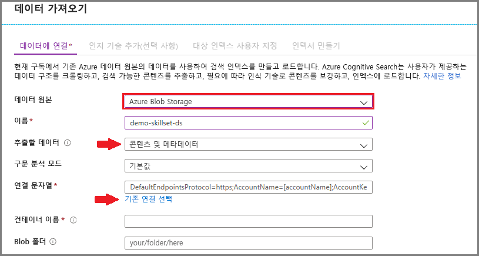
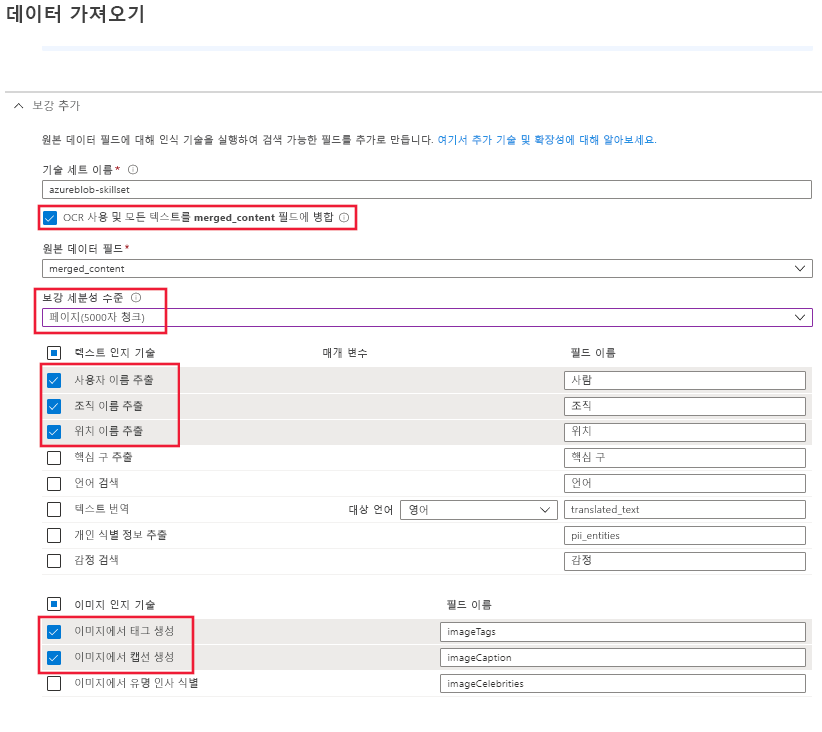
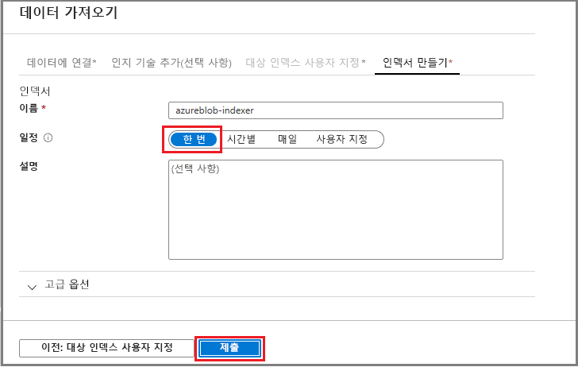

# 빠른 시작: 기술 및 샘플 데이터를 사용하여 인식 검색 파이프라인 만들기

인식 검색(미리 보기)은 Azure Search 인덱싱 파이프라인에 데이터 추출, NLP(자연어 처리) 및 이미지 처리 기술을 추가하여 검색할 수 없거나 구조화되지 않은 콘텐츠를 검색할 수 있게 만들어 줍니다. 엔터티 인식 또는 이미지 분석과 같은 기술로 만든 정보는 Azure Search의 인덱스에 추가됩니다.

이 빠른 시작은 [Azure Portal](https://portal.azure.com)에서 보강 파이프라인을 시도한 후 단일 코드 줄을 작성합니다.

* Azure Blob Storage에서 샘플 데이터로 시작
* 인덱싱 및 보강에 대해 [데이터 가져오기 마법사](search-import-data-portal.md) 구성 
* 마법사 실행(엔터티 기술이 사람, 위치 및 조직을 감지)
* [검색 탐색기](search-explorer.md)를 사용하여 보강된 데이터를 쿼리합니다.

##  지원되는 지역

다음 지역에 만든 Azure Search 서비스에서 인식 검색을 시도할 수 있습니다.

* 미국 중서부
* 미국 중남부
* 미국 동부
* 미국 동부 2
* 미국 서부 2
* 캐나다 중부
* 서유럽
* 영국 남부
* 북유럽
* 브라질 남부
* 동남아시아
* 인도 중부
* 오스트레일리아 동부

Azure 구독이 아직 없는 경우 시작하기 전에 [체험 계정](https://azure.microsoft.com/free/?WT.mc_id=A261C142F)을 만듭니다.

> [!NOTE]
> 인식 검색은 현재 공개 미리 보기로 제공됩니다. 기능 실행과 이미지 추출 및 정규화는 현재 무료로 제공됩니다. 이러한 기능의 가격은 추후에 발표될 예정입니다. 

## 필수 조건

["인식 검색이란?"](cognitive-search-concept-intro.md) 보강 아키텍처 및 구성 요소를 소개합니다. 

Azure 서비스는 이 시나리오에 단독으로 사용됩니다. 준비 과정에는 필요한 서비스 만들기가 포함되어 있습니다.

+ Azure Blob 저장소는 원본 데이터를 제공합니다.
+ Azure Search는 데이터 수집 및 인덱싱, 인식 검색 보강, 전체 텍스트 검색 쿼리를 처리합니다.

### Azure Search 설정

먼저 Azure Search 서비스에 등록합니다. 

1. [Azure Portal](https://portal.azure.com)로 이동한 후 Azure 계정을 사용하여 로그인합니다.

1. **리소스 만들기**를 클릭하고, Azure Search를 검색하고, **만들기**를 클릭합니다. 검색 서비스를 처음으로 설정하고 도움이 필요한 경우 [포털에서 Azure Search 서비스 만들기](search-create-service-portal.md)를 참조하세요.

  

1. 리소스 그룹으로는 이 빠른 시작에서 만드는 모든 리소스를 포함할 리소스 그룹을 만듭니다. 이렇게 하면 빠른 시작을 마친 후 보다 쉽게 리소스를 정리할 수 있습니다.

1. 위치에 대해 Cognitive Search에 [지원되는 지역](#supported-regions) 중 하나를 선택합니다.

1. 가격 책정 계층으로는 자습서와 빠른 시작을 완료할 수 있는 **무료** 서비스를 만듭니다. 사용자 고유의 데이터를 사용하여 자세히 조사하려면 **기본** 또는 **표준** 같은 [유료 서비스](https://azure.microsoft.com/pricing/details/search/)를 만듭니다. 

  무료 서비스는 인덱스 3개, blob 크기 최대 16MB, 인덱싱 2분으로 제한되며, 이는 인식 검색의 전체 기능을 실행하기에는 부족합니다. 다른 계층의 제한에 대한 내용은 [서비스 제한](search-limits-quotas-capacity.md)을 참조하세요.

  > [!NOTE]
  > 인식 검색은 현재 공개 미리 보기로 제공됩니다. 무료 계층을 포함한 모든 계층에서 기술 집합을 사용할 수 있습니다. 이 기능의 가격은 추후에 발표될 예정입니다.

1. 서비스를 대시보드에 고정하면 서비스 정보에 빠르게 액세스할 수 있습니다.

  

### Azure Blob service를 설정하고 샘플 데이터 로드

보강 파이프라인은 [Azure Search 인덱서](search-indexer-overview.md)가 지원하는 Azure 데이터 소스에서 데이터를 가져옵니다. 이 연습에서는 BLOB 저장소를 사용하여 여러 가지 콘텐츠 형식을 보여줍니다.

1. 여러 종류의 작은 파일 집합으로 구성된 [샘플 데이터를 다운로드](https://1drv.ms/f/s!As7Oy81M_gVPa-LCb5lC_3hbS-4)하세요. 

1. Azure Blob 저장소에 등록하고, 저장소 계정을 만들고, Storage 탐색기에 로그인하고, 컨테이너를 만드세요. 모든 단계에 대한 지침은 [Azure Storage 탐색기 빠른 시작](../storage/blobs/storage-quickstart-blobs-storage-explorer.md)을 참조하세요.

1. 앞에서 만든 컨테이너에서 Azure Storage 탐색기를 사용하여 **업로드**를 클릭하고 샘플 파일을 업로드합니다.

  

## 보강 파이프라인 만들기

Azure Search 서비스 대시보드 페이지로 돌아가서 명령 모음에서 **데이터 가져오기**를 클릭하여 다음 네 단계를 통해 보강을 설정합니다.

### 1단계: 데이터 소스 만들기

**데이터에 연결** > **Azure Blob 저장소**에서, 이전에 만든 계정 및 컨테이너를 선택합니다. 데이터 원본의 이름을 지정하고, 나머지는 기본값을 사용합니다. 

   

**확인**을 클릭하여 데이터 원본을 만듭니다.

**데이터 가져오기** 마법사를 사용할 때의 장점 중 하나는 인덱스를 만들 수 있다는 점입니다. 데이터 원본이 만들어지면 그와 동시에 마법사가 인덱스 스키마를 생성합니다. 인덱스를 만드는 데 몇 초 정도 걸릴 수 있습니다.

### 2단계: 인식 기술 추가

다음으로, 인덱싱 파이프라인에 보강 단계를 추가합니다. 포털은 이미지 분석 및 텍스트 분석을 위해 미리 정의된 인식 기술을 제공합니다. 포털에서 한 기술 집합은 한 원본 필드에 대해 작동합니다. 작은 대상처럼 보일 수 있지만, Azure BLOB의 경우 `content` 필드에 대부분의 BLOB 문서가 포함됩니다(예: Word 문서 또는 PowerPoint 데크). BLOB의 모든 콘텐츠가 이 필드에 있기 때문에 이 필드는 가장 이상적인 입력입니다.

경우에 따라 스캐너에서 생성되는 PDF와 같은 대부분 스캔된 이미지로 구성된 파일에서 텍스트 표현을 추출하려고 합니다. Azure Search는 문서의 포함된 이미지에서 자동으로 콘텐츠를 추출할 수 있습니다. 이렇게 하려면 **OCR을 활성화하고 모든 텍스트를 merged_content 필드로 병합** 옵션을 선택합니다. 이렇게 하면 문서에서 추출된 텍스트 및 문서에 포함된 이미지의 텍스트 표현을 포함하는 `merged_content` 필드를 자동으로 만듭니다. 이 옵션을 선택하는 경우 `Source data field`는 `merged_content`로 설정됩니다.

**인식 기술 추가**에서 자연어 처리를 수행하는 기술을 선택합니다. 이 빠른 시작에서는 사람, 조직 및 위치에 대한 엔터티 인식을 선택합니다.

**확인**을 클릭하여 정의를 수락합니다.
   
  

자연어 처리 기술은 샘플 데이터 집합의 텍스트 콘텐츠에 대해 작동합니다. 이미지 처리 옵션을 선택하지 않았으므로 이 빠른 시작의 샘플 데이터 집합에서 찾은 JPEG 파일이 처리되지 않습니다. 

### 3단계: 인덱스 구성

데이터 원본으로 만든 인덱스를 기억하세요? 이 단계에서는 스키마를 살펴보고 설정을 수정할 수 있습니다. 

이 빠른 시작에서 마법사는 기본값을 적절하게 설정합니다. 

+ 모든 인덱스에는 이름이 있어야 합니다. 이 데이터 원본 유형의 기본 이름은 *azureblob-index*입니다.

+ 모든 문서에는 키가 있어야 합니다. 마법사는 고유 값이 있는 필드를 선택합니다. 이 빠른 시작에서 키는 *metadata_storage_path*입니다.

+ 모든 필드 컬렉션에는 해당 값을 설명하는 데이터 형식이 포함된 필드가 있어야 하고, 각 필드에는 검색 시나리오에서 사용되는 방식을 설명하는 인덱스 특성이 있어야 합니다. 

앞에서 기술 집합을 정의했으니, 마법사는 사용자가 기술을 통해 원본 데이터 필드와 출력 필드를 만들려 한다고 간주합니다. 이러한 이유로 포털에서는 `content`, `people`, `organizations` 및 `locations`에 대한 인덱스 필드를 추가합니다. 마법사는 자동으로 이러한 필드에 대해 조회 가능 및 검색 가능을 사용합니다.

**인덱스 사용자 지정**에서 필드를 특성을 검토하여 인덱스에서 어떻게 사용되는지 살펴봅니다. 검색 가능은 필드를 검색할 수 있다는 뜻입니다. 조회 가능은 결과에 반환될 수 있다는 뜻입니다. 

`content` 필드에서 조회 가능을 제거하는 방안을 고려해 보세요. Blob에서는 이 필드가 수천 줄이 되어 **Search 탐색기** 같은 도구에서 읽기 어려울 수 있습니다.

인덱스를 수락하려면 **확인**을 클릭합니다.

  

> [!NOTE]
> 사용되지 않는 필드는 간결성을 위해 스크린샷에서 삭제됩니다. 포털을 사용 중인 경우 목록에 추가 필드가 표시됩니다.

### 4단계: 인덱서 구성

인덱서는 인덱싱 프로세스를 구동하는 상위 수준 리소스입니다. 인덱서는 데이터 원본 이름, 인덱스 및 실행 빈도를 지정합니다. **데이터 가져오기** 마법사의 최종 결과는 항상 반복적으로 실행할 수 있는 인덱서입니다.

**인덱서** 페이지에서 인덱서 이름을 지정하고 기본값인 "한 번 실행"을 사용하여 즉시 실행합니다. 

  

**확인**을 클릭하여 데이터를 가져오고, 보강하고, 인덱싱합니다.

  

인덱싱 및 보강에 시간이 걸릴 수 있으므로 탐색 속도를 높일 수 있도록 소량의 데이터 집합을 권장합니다. Azure Portal의 알림 페이지에서 인덱싱을 모니터링할 수 있습니다. 

## Search 탐색기에서 쿼리

인덱스를 만든 후에는 인덱스에서 문서를 반환하는 쿼리를 제출할 수 있습니다. 포털에서 **Search 탐색기**를 사용하여 쿼리를 실행하고 결과를 봅니다. 

1. 검색 서비스 대시보드 페이지의 명령 모음에서 **Search 탐색기**를 클릭합니다.

1. 맨 위에서 **인덱스 변경**을 선택하고 앞에서 만든 인덱스를 선택합니다.

1. "John F. Kennedy"처럼 인덱스를 쿼리하는 검색 문자열을 입력합니다.

결과는 자세한 정보 표시가 가능하고 읽기 어려울 수 있는 JSON으로 반환되며, Azure BLOB에서 오는 대용량 문서인 경우에 특히 그렇습니다. 

결과를 쉽게 검색할 수 없는 경우 문서 내에서 CTRL + F 키를 사용하여 검색합니다. 이 쿼리에 대해 JSON 내에서 "John F. Kennedy"를 검색하여 해당 검색어의 인스턴스를 볼 수 있습니다. 

CTRL + F 키는 특정 결과 집합에 문서가 몇 개나 있는지 확인하는 데 사용할 수도 있습니다. Azure BLOB의 경우 포털에서는 각 값이 문서에 고유한 "metadata_storage_path"를 키로 선택합니다. CTRL + F 키로 "metadata_storage_path"를 검색하여 문서 수를 가져옵니다. 이 쿼리의 경우 결과 집합의 두 문서에 "John F. Kennedy"라는 단어가 포함되어 있습니다.

  

## 핵심 내용

보강된 인덱싱 연습을 처음으로 완료했습니다. 이 빠른 시작의 목적은 사용자가 고유의 데이터를 사용하여 인식 검색 솔루션의 프로토타입을 신속하게 만들 수 있도록 중요한 개념을 소개하고 마법사를 연습하는 것이었습니다.

여러분이 꼭 기억했으면 하는 주요 개념 중 하나는 Azure 데이터 원본에 대한 종속성입니다. 인식 검색 보강은 인덱서에 바인딩되고, 인덱서는 Azure와 소스로 한정됩니다. 이 빠른 시작에서는 Azure Blob 저장소를 사용하지만 다른 Azure 데이터 원본도 가능합니다. 자세한 내용은 [Azure Search의 인덱서](search-indexer-overview.md)를 참조하세요.

또 다른 중요한 개념으로, 기술은 입력 필드에 대해 작동합니다. 포털에서 모든 기술에 대한 단일 원본 필드를 선택해야 합니다. 코드에서 입력은 다른 필드이거나 업스트림 기술의 출력일 수 있습니다.

 기술에 대한 입력은 인덱스의 출력 필드에 매핑됩니다. 내부적으로, 포털은 [주석](cognitive-search-concept-annotations-syntax.md)을 설정하고 [기술 집합](cognitive-search-defining-skillset.md)을 정의하여 작업 및 일반적인 흐름의 순서를 설정합니다. 이러한 단계는 포털에서 숨겨지지만, 코드 작성을 시할 때 이러한 개념이 중요합니다.

마지막으로, 인덱스를 쿼리하여 결과를 볼 수 있다는 것을 배웠습니다. 결국 Azure Search는 검색 가능한 인덱스를 제공하며, 이 인덱스는 [단순](https://docs.microsoft.com/rest/api/searchservice/simple-query-syntax-in-azure-search) 또는 [완전히 확장된 쿼리 구문](https://docs.microsoft.com/rest/api/searchservice/lucene-query-syntax-in-azure-search)을 사용하여 쿼리할 수 있습니다. 보강된 필드를 포함하는 인덱스는 다른 인덱스와 비슷합니다. 표준 또는 [사용자 지정 분석기](search-analyzers.md), [점수 매기기 프로필](https://docs.microsoft.com/rest/api/searchservice/add-scoring-profiles-to-a-search-index), [동의어](search-synonyms.md), [패싯 필터](search-filters-facets.md), 지역 검색, 기타 Azure Search 기능을 통합하고 싶은 경우 그렇게 하시면 됩니다.

## 리소스 정리

탐색을 마친 후 정리하는 가장 빠른 방법은 Azure Search 서비스 및 Azure Blob service를 포함하고 있는 리소스 그룹을 삭제하는 것입니다.  

두 서비스를 동일한 그룹에 배치한 경우 리소스 그룹을 삭제하면 서비스와 이 연습에서 만들고 저장한 콘텐츠를 포함하여 리소스 그룹에 들어 있는 모든 것이 영구적으로 삭제됩니다. 포털에서 리소스 그룹 이름은 각 서비스의 개요 페이지에 있습니다.

## 다음 단계

마법사를 다시 실행하고 다른 기술 및 원본 데이터 필드를 사용하여 인덱싱 및 보강을 실험할 수 있습니다. 단계를 반복하려면 인덱스 및 인덱서를 삭제한 다음, 새로운 선택 항목으로 인덱서를 다시 만듭니다.

+ **개요** > **인덱스**에서 이전에 만든 인덱스를 선택하고 **삭제**를 클릭합니다.

+ **개요**에서 **인덱서** 타일을 두 번 클릭합니다. 앞에서 만든 인덱서를 찾아 삭제합니다.

또는 앞에서 만든 샘플 데이터 및 서비스를 다시 사용하고, 그 다음 자습서에서 동일한 작업을 프로그래밍 방식으로 수행하는 방법을 알아보세요. 

> [!div class="nextstepaction"]
> [자습서: 인식 검색 REST API 알아보기](cognitive-search-tutorial-blob.md)
