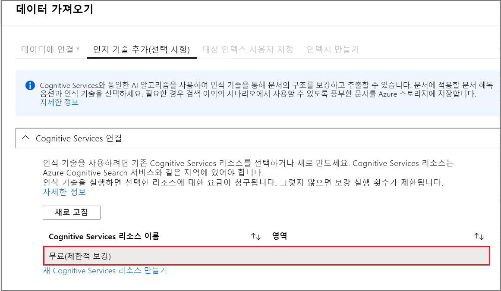
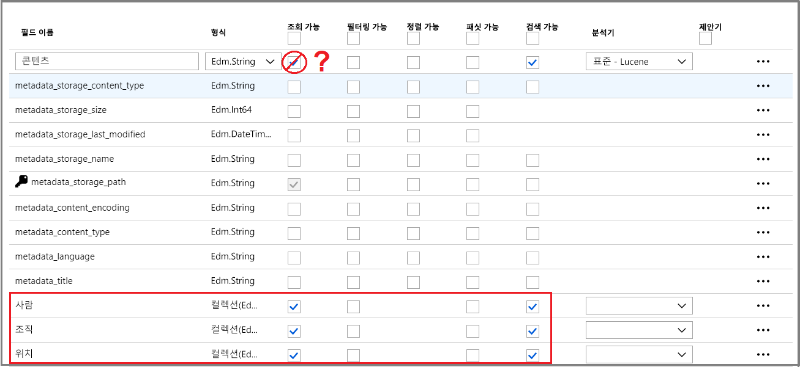

# 빠른 시작: 인식 기술 및 샘플 데이터를 사용하여 AI 인덱싱 파이프라인 만들기

Azure Search는 [Cognitive Services](https://azure.microsoft.com/services/cognitive-services/)와 통합되고, Azure Search 인덱싱 파이프라인에 콘텐츠 추출, NLP(자연어 처리) 및 이미지 처리 기술을 추가하여 검색할 수 없거나 구조화되지 않은 콘텐츠를 검색할 수 있게 만들어 줍니다. 

[OCR](cognitive-search-skill-ocr.md), [언어 감지](cognitive-search-skill-language-detection.md), [엔터티 인식](cognitive-search-skill-entity-recognition.md) 등의 여러 Cognitive Services 리소스를 인덱싱 프로세스에 연결할 수 있습니다. Cognitive Services의 AI 알고리즘은 Azure Search를 기반으로 한 전체 텍스트 검색 솔루션에서 사용할 수 있는 구조 및 텍스트 콘텐츠를 반환하면서 원본 데이터에서 패턴, 기능 및 특징을 찾는 데 사용됩니다.

이 빠른 시작에서는 [Azure Portal](https://portal.azure.com)에서 첫 번째 보강 파이프라인을 만든 후 단일 코드 줄을 작성합니다.

> [!div class="checklist"]
> * Azure Blob Storage에서 샘플 데이터로 시작
> * 인식 인덱싱 및 보강에 대해 [**데이터 가져오기**](search-import-data-portal.md) 마법사 구성 
> * 마법사 실행(엔터티 기술이 사람, 위치 및 조직을 감지)
> * [**검색 탐색기**](search-explorer.md)를 사용하여 보강된 데이터 쿼리

이 빠른 시작은 무료 서비스에서 실행되지만 무료 트랜잭션 수는 일일 20개 문서로 제한됩니다. 이 빠른 시작을 동일한 날에 두 번 이상 실행하려면 더 많은 실행에 적합하도록 더 작은 파일 세트를 사용하세요.

> [!NOTE]
> 처리 빈도를 늘리거나 문서를 추가하거나 AI 알고리즘을 추가하여 범위를 확장할 때는 청구 가능 Cognitive Services 리소스를 연결해야 합니다. Cognitive Services에서 API를 호출할 때와 Azure Search에서 문서 해독 단계의 일부로 이미지를 추출할 때는 요금이 누적됩니다. 문서에서 텍스트 추출할 때는 요금이 발생하지 않습니다.
>
> 기본 제공 기술을 실행하는 요금은 기존 [Cognitive Services 종량제 가격](https://azure.microsoft.com/pricing/details/cognitive-services/)으로 청구됩니다. 이미지 추출 가격은 미리 보기 가격으로 청구되며 [Azure Search 가격 책정 페이지](https://go.microsoft.com/fwlink/?linkid=2042400)에 설명되어 있습니다. [자세히](cognitive-search-attach-cognitive-services.md) 알아봅니다.

Azure 구독이 아직 없는 경우 시작하기 전에 [체험 계정](https://azure.microsoft.com/free/?WT.mc_id=A261C142F)을 만듭니다.

## 필수 조건

[Azure Search 서비스를 만들거나](search-create-service-portal.md) 현재 구독에서 [기존 서비스를 찾습니다](https://ms.portal.azure.com/#blade/HubsExtension/BrowseResourceBlade/resourceType/Microsoft.Search%2FsearchServices). 이 빠른 시작에서는 체험 서비스를 사용할 수 있습니다.

[Cognitive Services](https://azure.microsoft.com/services/cognitive-services/)는 AI를 제공합니다. 이 빠른 시작에는 파이프라인을 지정할 때 인라인으로 이러한 리소스를 추가하는 단계가 포함되어 있습니다. 계정을 미리 설정할 필요는 없습니다.

Azure 서비스는 인덱싱 파이프라인에 입력을 제공해야 합니다. AI 인덱싱에 지원되지 않는 Azure Table Storage를 제외하고, [Azure Search 인덱서](search-indexer-overview.md)에서 지원하는 모든 데이터 원본을 사용할 수 있습니다. 이 빠른 시작에서는 원본 데이터 파일의 컨테이너로 [Azure Blob Storage](https://azure.microsoft.com/services/storage/blobs/)를 사용합니다. 

### Azure Blob service를 설정하고 샘플 데이터 로드

1. 여러 종류의 작은 파일 집합으로 구성된 [샘플 데이터를 다운로드](https://1drv.ms/f/s!As7Oy81M_gVPa-LCb5lC_3hbS-4)하세요. 

1. [Azure Blob Storage에 가입](https://docs.microsoft.com/azure/storage/common/storage-quickstart-create-account?tabs=azure-portal)하고, 스토리지 계정을 만들고, Blob 서비스 페이지를 열고 컨테이너를 만드세요.  Azure Search와 동일한 지역에서 스토리지 계정을 만듭니다.

1. 만든 컨테이너에서 **업로드**를 클릭하여 이전 단계에서 다운로드한 샘플 파일을 업로드합니다.

   

## 보강 파이프라인 만들기

Azure Search 서비스 대시보드 페이지로 돌아가서 명령 모음에서 **데이터 가져오기**를 클릭하여 다음 네 단계를 통해 인식 보강을 설정합니다.

  

### 1단계: 데이터 소스 만들기

**데이터에 연결**에서 **Azure Blob 스토리지**를 선택하고 만든 계정 및 컨테이너를 선택합니다. 데이터 원본의 이름을 지정하고, 나머지는 기본값을 사용합니다. 

  

다음 페이지를 계속합니다.

  

### 2단계: 인식 기술 추가

다음으로, 인덱싱 파이프라인에 보강 단계를 추가합니다. Cognitive Services 리소스가 없으면 매일 20개의 트랜잭션을 제공하는 체험 버전에 가입할 수 있습니다. 샘플 데이터는 14개의 파일로 구성되므로 이 마법사를 실행하는 경우 매일 할당량을 대부분 사용할 수 있습니다.

1. **Cognitive Services 연결**을 확장하여 Cognitive Services API에 리소스를 제공하는 옵션을 확인합니다. 이 자습서의 용도로 **무료** 리소스를 사용할 수 있습니다.

   

2. **보강 추가**를 확장하고 자연어 처리를 수행하는 기술을 선택합니다. 이 빠른 시작에서는 사람, 조직 및 위치에 대한 엔터티 인식을 선택합니다.

   

   포털에서는 OCR 처리 및 텍스트 분석을 위해 기본 제공 기술을 제공합니다. 포털에서 한 기술 집합은 한 원본 필드에 대해 작동합니다. 작은 대상처럼 보일 수 있지만, Azure BLOB의 경우 `content` 필드에 대부분의 BLOB 문서가 포함됩니다(예: Word 문서 또는 PowerPoint 데크). BLOB의 모든 콘텐츠가 이 필드에 있기 때문에 이 필드는 가장 이상적인 입력입니다.

3. 다음 페이지를 계속합니다.

   

> [!NOTE]
> 자연어 처리 기술은 샘플 데이터 집합의 텍스트 콘텐츠에 대해 작동합니다. OCR 옵션을 선택하지 않았으므로 샘플 데이터 세트에서 발견된 JPEG 및 PNG 파일은 이 빠른 시작에서 처리되지 않습니다. 

### 3단계: 인덱스 구성

마법사는 일반적으로 기본 인덱스를 유추할 수 있습니다. 이 단계에서는 생성된 인덱스 스키마를 확인하고 설정을 수정할 수 있습니다. 데모 Blob 데이터 세트용으로 만든 기본 인덱스는 다음과 같습니다.

이 빠른 시작에서 마법사는 기본값을 적절하게 설정합니다. 

+ 기본 이름은 데이터 원본 유형을 기반으로 하는 *azureblob-index*입니다. 

+ 기본 필드는 원본 소스 데이터 필드(`content`) 및 인식 파이프라인에 의해 생성된 출력 필드(`people`, `organizations` 및 `locations`)를 기반으로 합니다. 기본 데이터 형식은 메타데이터 및 데이터 샘플링에서 유추됩니다.

+ 기본 키는 *metadata_storage_path*(이 필드는 고유 값 포함)입니다.

+ 기본 특성은 이러한 필드에 대해 **조회 가능**하고 **검색 가능**합니다. **검색 가능**은 필드를 검색할 수 있다는 뜻입니다. **조회 가능**은 결과에 반환될 수 있다는 뜻입니다. 마법사는 사용자가 기술 세트를 통해 필드를 생성했기 때문에 이 필드를 조회 및 검색 가능하도록 하려고 한다고 가정합니다.

  

`content` 필드의 **조회 가능** 특성에서 취소선과 물음표를 확인합니다. 텍스트가 많은 Blob 문서의 경우, `content` 필드에는 대량의 파일이 포함되어 있으며, 수천 줄이 포함될 수 있습니다. 파일 내용을 클라이언트 코드에 전달해야 하는 경우 **조회 가능**이 선택되어 있는지 확인합니다. 그렇지 않은 경우 추출된 요소(`people`, `organizations` 및 `locations`)가 사용자 목적에 충분하면 `content`에서 이 특성을 선택 취소하는 것이 좋습니다.

필드를 **조회 가능**으로 표시한다고 해서 필드가 검색 결과에 *나타나야* 하는 것은 아닙니다. **$select** 쿼리 매개 변수로 포함할 필드를 지정하여 검색 결과의 구성을 정확하게 제어할 수 있습니다. `content`와 같이 텍스트가 많은 필드의 경우 **$select** 매개 변수는 애플리케이션의 사용자에게 관리 가능한 검색 결과를 제공하는 솔루션으로, 클라이언트 코드에서 **조회 가능** 특성을 통해 필요한 모든 정보에 액세스할 수 있도록 해줍니다.
  
다음 페이지를 계속합니다.

  

### 4단계: 인덱서 구성

인덱서는 인덱싱 프로세스를 구동하는 상위 수준 리소스입니다. 인덱서는 데이터 원본 이름, 대상 인덱스 및 실행 빈도를 지정합니다. **데이터 가져오기** 마법사의 최종 결과는 항상 반복적으로 실행할 수 있는 인덱서입니다.

**인덱서** 페이지에서 기본 이름을 적용하고 **한 번 실행** 예약 옵션을 사용하여 즉시 실행할 수 있습니다. 

  

**제출**을 클릭하여 인덱서를 만드는 동시에 실행합니다.

## 인덱싱 모니터링

보강 단계는 일반적인 텍스트 기반 인덱싱보다 완료하는 데 오래 걸립니다. 마법사는 진행률을 추적할 수 있도록 개요 페이지에서 인덱서 목록을 열어야 합니다. 자체 탐색을 위해 개요 페이지로 이동하고 **인덱서**를 클릭합니다.

JPG 및 PNG 파일이 이미지 파일이므로 경고가 발생합니다. 따라서 이 파이프라인에서 OCR 기술을 생략했습니다. 또한 잘림 알림이 표시됩니다. Azure Search는 무료 계층에서 추출을 32,000자로 제한합니다.

  

인덱싱 및 보강에 시간이 걸릴 수 있으므로 탐색 속도를 높일 수 있도록 소량의 데이터 집합을 권장합니다. 

## Search 탐색기에서 쿼리

인덱스를 만든 후에는 인덱스에서 문서를 반환하는 쿼리를 제출할 수 있습니다. 포털에서 **Search 탐색기**를 사용하여 쿼리를 실행하고 결과를 봅니다. 

1. 검색 서비스 대시보드 페이지의 명령 모음에서 **Search 탐색기**를 클릭합니다.

1. 맨 위에서 **인덱스 변경**을 선택하고 앞에서 만든 인덱스를 선택합니다.

1. `search=Microsoft&searchFields=organizations`처럼 인덱스를 쿼리하는 검색 문자열을 입력합니다.

결과는 자세한 정보 표시가 가능하고 읽기 어려울 수 있는 JSON으로 반환되며, Azure BLOB에서 오는 대용량 문서인 경우에 특히 그렇습니다. 결과를 쉽게 검색할 수 없는 경우 문서 내에서 CTRL + F 키를 사용하여 검색합니다. 이 쿼리의 경우 JSON 내에서 특정 용어를 검색할 수 있습니다. 

CTRL + F 키는 특정 결과 집합에 문서가 몇 개나 있는지 확인하는 데 사용할 수도 있습니다. Azure BLOB의 경우 포털에서는 각 값이 문서에 고유한 "metadata_storage_path"를 키로 선택합니다. CTRL + F 키로 "metadata_storage_path"를 검색하여 문서 수를 가져옵니다. 

  

## 핵심 내용

이제 첫 번째 인식 보강 인덱싱 연습을 완료했습니다. 이 빠른 시작의 목적은 사용자가 고유의 데이터를 사용하여 인식 검색 솔루션의 프로토타입을 신속하게 만들 수 있도록 중요한 개념을 소개하고 마법사를 연습하는 것이었습니다.

여러분이 꼭 기억했으면 하는 주요 개념 중 하나는 Azure 데이터 원본에 대한 종속성입니다. 인식 검색 보강은 인덱서에 바인딩되고, 인덱서는 Azure와 소스로 한정됩니다. 이 빠른 시작에서는 Azure Blob Storage를 사용하지만 다른 Azure 데이터 원본도 가능합니다. 자세한 내용은 [Azure Search의 인덱서](search-indexer-overview.md)를 참조하세요.

또 다른 중요한 개념으로, 기술은 입력 필드에 대해 작동합니다. 포털에서 모든 기술에 대한 단일 원본 필드를 선택해야 합니다. 코드에서 입력은 다른 필드이거나 업스트림 기술의 출력일 수 있습니다.

 기술에 대한 입력은 인덱스의 출력 필드에 매핑됩니다. 내부적으로, 포털은 [주석](cognitive-search-concept-annotations-syntax.md)을 설정하고 [기술 집합](cognitive-search-defining-skillset.md)을 정의하여 작업 및 일반적인 흐름의 순서를 설정합니다. 이러한 단계는 포털에서 숨겨지지만, 코드 작성을 시할 때 이러한 개념이 중요합니다.

마지막으로, 인덱스를 쿼리하여 결과를 볼 수 있다는 것을 배웠습니다. 결국 Azure Search는 검색 가능한 인덱스를 제공하며, 이 인덱스는 [단순](https://docs.microsoft.com/rest/api/searchservice/simple-query-syntax-in-azure-search) 또는 [완전히 확장된 쿼리 구문](https://docs.microsoft.com/rest/api/searchservice/lucene-query-syntax-in-azure-search)을 사용하여 쿼리할 수 있습니다. 보강된 필드를 포함하는 인덱스는 다른 인덱스와 비슷합니다. 표준 또는 [사용자 지정 분석기](search-analyzers.md), [점수 매기기 프로필](https://docs.microsoft.com/rest/api/searchservice/add-scoring-profiles-to-a-search-index), [동의어](search-synonyms.md), [패싯 필터](search-filters-facets.md), 지역 검색, 기타 Azure Search 기능을 통합하고 싶은 경우 그렇게 하시면 됩니다.

## 리소스 정리

탐색을 마친 후 정리하는 가장 빠른 방법은 Azure Search 서비스 및 Azure Blob service를 포함하고 있는 리소스 그룹을 삭제하는 것입니다.  

두 서비스를 동일한 그룹에 배치한 경우 리소스 그룹을 삭제하면 서비스와 이 연습에서 만들고 저장한 콘텐츠를 포함하여 리소스 그룹에 들어 있는 모든 것이 영구적으로 삭제됩니다. 포털에서 리소스 그룹 이름은 각 서비스의 개요 페이지에 있습니다.

## 다음 단계

Cognitive Services 리소스를 프로비전하는 방법에 따라 다른 기술 및 원본 데이터 필드가 포함된 마법사를 다시 실행하여 인덱싱 및 보강을 실험할 수 있습니다. 단계를 반복하려면 인덱스 및 인덱서를 삭제한 다음, 새로운 선택 항목으로 인덱서를 다시 만듭니다.

+ **개요** > **인덱스**에서 이전에 만든 인덱스를 선택하고 **삭제**를 클릭합니다.

+ **개요**에서 **인덱서** 타일을 두 번 클릭합니다. 앞에서 만든 인덱서를 찾아 삭제합니다.

또는 앞에서 만든 샘플 데이터 및 서비스를 다시 사용하고, 그 다음 자습서에서 동일한 작업을 프로그래밍 방식으로 수행하는 방법을 알아보세요. 

> [!div class="nextstepaction"]
> [자습서: 인식 검색 REST API 알아보기](cognitive-search-tutorial-blob.md)
