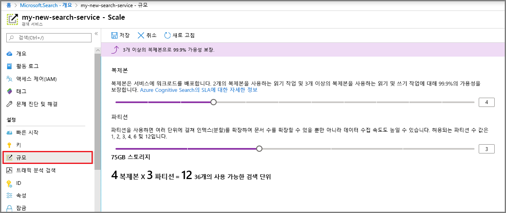

# 포털에서 Azure 검색서비스 만들기

이 문서에서는 포털에서 Azure Search 서비스를 만들거나 프로비전하는 방법을 설명합니다. PowerShell 지침에 대한 자세한 내용은 [PowerShell을 사용하여 Azure Search 관리](search-manage-powershell.md)를 참조하세요.

## 구독(무료 또는 유료)

[무료 Azure 계정을 열고](https://azure.microsoft.com/pricing/free-trial/?WT.mc_id=A261C142F) 무료 크레딧을 사용하여 유료 Azure 서비스를 사용해보세요. 크레딧이 소진되더라도 계정이 유지되므로 Websites와 같은 무료 Azure 서비스를 계속 사용하세요. 설정을 명시적으로 변경하여 결제를 요청하지 않는 한 신용 카드로 결제되지 않습니다.

아니면 [MSDN 구독자 혜택을 활성화합니다](https://azure.microsoft.com/pricing/member-offers/msdn-benefits-details/?WT.mc_id=A261C142F). MSDN 구독은 유료 Azure 서비스에 사용할 수 있는 크레딧을 매달 제공합니다. 

## Azure Search 찾기
1. [Azure 포털](https://portal.azure.com/)에 로그인합니다.
2. 왼쪽 위 모퉁이에서 더하기 기호("+")를 클릭합니다.
3. **웹 + 모바일** > **Azure Search**를 선택합니다.

## 서비스 및 URL 끝점의 이름

서비스 이름은 API 호출이 발급되는 URL 끝점의 일부입니다. **URL** 필드에 서비스 이름을 입력합니다. 

서비스 이름 요구 사항:
   * 2 ~ 60자 길이
   * 소문자, 숫자 또는 대시("-")
   * 첫 두 문자 또는 마지막 한 문자에는 대시("-")를 사용할 수 없음
   * 연속 대시("--")를 사용할 수 없음

## 구독 선택
둘 이상의 구독이 있는 경우 데이터 또는 파일 저장소 서비스도 있는 구독을 선택합니다. Azure Search는 *인덱서*를 통해 인덱싱하기 위해 Azure 테이블 및 Blob Storage, SQL Database 및 DocumentDB를 자동 검색할 수 있지만, 동일한 구독의 서비스에 대해서만 가능합니다.

## 리소스 그룹 선택
리소스 그룹은 함께 사용된 Azure 서비스 및 리소스의 컬렉션입니다. 예를 들어 Azure Search를 사용하여 SQL Database를 인덱싱하는 경우 이들 두 서비스는 동일한 리소스 그룹의 일부여야 합니다.

> [!TIP]
> 리소스 그룹을 삭제하면 그 안의 서비스도 삭제됩니다. 여러 서비스를 이용하는 프로토타입 프로젝트의 경우, 이들을 모두 동일한 리소스 그룹에 배치하면 프로젝트가 종료된 후 쉽게 정리할 수 있습니다. 

## 호스팅 위치 선택 
Azure 서비스인 Azure Search는 전 세계 데이터 센터에서 호스팅될 수 있습니다. 지역별로 [가격이 다를 수](https://azure.microsoft.com/pricing/details/search/) 있습니다.

## 가격 책정 계층(SKU) 선택
[Azure 검색은 무료, 기본 또는 표준 등 여러 가지 가격 책정 계층에서 현재 제공됩니다](https://azure.microsoft.com/pricing/details/search/). 각 계층에는 자체 [용량 및 제한](search-limits-quotas-capacity.md)이 있습니다. 지침은 [가격 책정 계층 또는 SKU 선택](search-sku-tier.md) 을 참조하세요.

이 연습에서는 서비스에 대한 표준 계층을 선택했습니다.

## 서비스 만들기

로그인할 때마다 손쉽게 액세스할 수 있도록 서비스를 대시보드에 고정합니다.

## 서비스 확장
서비스를 만드는 데 몇 분 정도 걸릴 수 있습니다(15분 이상 계층에 따라). 서비스가 프로비전되면 사용자의 요구에 맞게 확장할 수 있습니다. Azure Search 서비스에 대한 표준 계층을 선택했기 때문에 복제본과 파티션이라는 두 개의 차원에서 서비스를 확장할 수 있습니다. 기본 계층을 선택한 경우 복제본만 추가할 수 있습니다. 무료 서비스를 프로비전한 경우 확장이 불가능합니다.

***파티션***을 사용하면 서비스를 저장하고 더 많은 문서를 통해 검색할 수 있습니다.

***복제본***을 사용하면 서비스가 더 큰 부하의 검색 쿼리를 처리할 수 있습니다.

> [!Important]
> 서비스는 [SLA 읽기 전용으로 2개의 복제본과 SLA 읽기/쓰기용으로 3개의 복제본](https://azure.microsoft.com/support/legal/sla/search/v1_0/)이 있어야 합니다.

1. Azure Portal의 검색 서비스 블레이드로 이동합니다.
2. 왼쪽 탐색 창에서 **설정** > **규모**를 선택합니다.
3. 슬라이드 바를 사용하여 복제본 또는 파티션을 추가합니다.

> [!Note] 
> 각 계층에는 단일 서비스에서 허용하는 총 검색 단위 수(복제본 * 파티션 = 총 검색 단위)에 여러 [제한](search-limits-quotas-capacity.md)이 있습니다.

## 다음 단계
Azure Search 서비스를 프로비전한 후에 [인덱스를 정의](search-what-is-an-index.md)할 준비가 되었으므로 데이터를 업로드하고 검색할 수 있습니다.

코드 또는 스크립트에서 서비스에 액세스하려면 URL(*service-name*.search.windows.net)과 키를 제공합니다. 관리 키는 모든 액세스 권한을 부여하고, 쿼리 키는 읽기 전용 액세스 권한을 부여합니다. 시작하려면 [.NET에서 Azure Search를 사용하는 방법](search-howto-dotnet-sdk.md)을 참조하세요.

빠른 포털 기반 자습서는 [첫 번째 인덱스 빌드 및 쿼리](search-get-started-portal.md)를 참조하세요.

