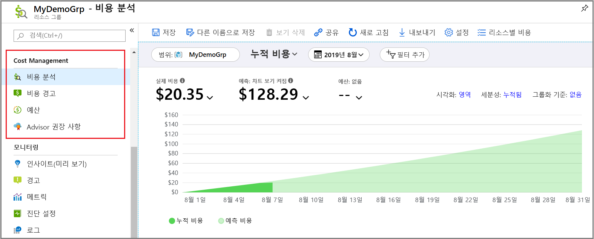
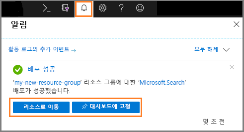
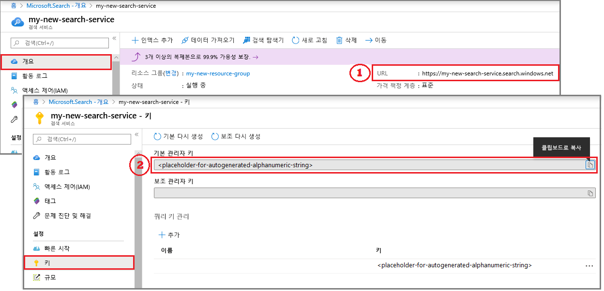

# 빠른 시작: 포털에서 Azure Cognitive Search서비스 만들기

Azure Cognitive Search는 검색 환경을 사용자 지정 앱에 연결하는 데 사용되는 독립 실행형 리소스입니다. Cognitive Search는 다른 Azure 서비스, 네트워크 서버의 앱 또는 다른 클라우드 플랫폼에서 실행되는 소프트웨어와 쉽게 통합됩니다.

이 문서에서는 [Azure Portal](https://portal.azure.com/)에서 리소스를 만드는 방법을 알아봅니다.

PowerShell을 선호합니까? Azure Resource Manager [서비스 템플릿](https://azure.microsoft.com/resources/templates/101-azure-search-create/)을 사용합니다. 시작하기 도움말은 [PowerShell로 Azure Cognitive Search 관리](search-manage-powershell.md)를 참조하세요.

## 시작하기 전에

다음 서비스 속성은 서비스의 수명 동안 고정되어 있습니다. 이 중 하나를 변경하려면 새로운 서비스가 필요합니다. 이러한 속성은 고정되어 있으므로 각 속성을 입력할 때 사용하는 영향을 고려합니다.

* 서비스 이름은 URL 엔드포인트의 일부가 됩니다(유용한 서비스 이름에 대한 [검토 팁](#name-the-service)).
* 서비스 계층은 [청구에 영향](search-sku-tier.md)을 주고 용량의 상향 제한을 설정합니다.
* 서비스 지역은 특정 시나리오의 가용성을 확인할 수 있습니다. 지식 마이닝 및 AI 보강에 관심이 있는 경우 Azure Cognitive Search와 동일한 지역에서 Cognitive Services 및 Azure Machine Learning이 필요합니다.

## 구독(무료 또는 유료)

[무료 Azure 계정을 열고](https://azure.microsoft.com/pricing/free-trial/?WT.mc_id=A261C142F) 무료 크레딧을 사용하여 유료 Azure 서비스를 사용해보세요. 크레딧이 소진되더라도 계정이 유지되므로 Websites와 같은 무료 Azure 서비스를 계속 사용하세요. 설정을 명시적으로 변경하여 결제를 요청하지 않는 한 신용 카드로 결제되지 않습니다.

아니면 [MSDN 구독자 혜택을 활성화합니다](https://azure.microsoft.com/pricing/member-offers/msdn-benefits-details/?WT.mc_id=A261C142F). MSDN 구독은 유료 Azure 서비스에 사용할 수 있는 크레딧을 매달 제공합니다. 

## Azure Cognitive Search 찾기

1. [Azure Portal](https://portal.azure.com/)에 로그인합니다.

1. 왼쪽 위 모퉁이에서 더하기 기호("+ 리소스 만들기")를 클릭합니다.

1. 검색 창을 사용하여 "Azure Cognitive Search"를 찾거나 **웹** > **Azure Cognitive Search**를 통해 리소스로 이동합니다.

## 구독을 선택합니다.

구독이 둘 이상 있는 경우 검색 서비스에 대해 하나의 구독을 선택합니다.

## 리소스 그룹 설정

리소스 그룹은 Azure 솔루션에 관련된 리소스를 보유하는 컨테이너입니다. 이는 검색 서비스에 필요합니다. 비용을 포함하여 리소스를 모두 관리하는 데에도 유용합니다. 리소스 그룹은 하나의 서비스 또는 함께 사용되는 여러 서비스로 구성될 수 있습니다. 예를 들어 Azure Cognitive Search를 사용하여 Azure Cosmos DB 데이터베이스를 인덱싱하는 경우 관리를 위해 두 서비스를 동일한 리소스 그룹의 일부로 만들 수 있습니다. 

단일 그룹에 리소스를 결합하지 않거나 기존 리소스 그룹을 관련이 없는 솔루션에서 사용되는 리소스로 채우는 경우 Azure Cognitive Search 리소스에 대해서만 새 리소스 그룹을 만듭니다. 

시간이 지남에 따라 현재 및 예상 비용을 모두 추적하거나 개별 리소스에 대한 요금을 확인할 수 있습니다. 다음 스크린샷에서는 여러 리소스를 하나의 그룹으로 결합할 때 제공될 수 있는 비용 정보를 보여줍니다.

> [!TIP]
> 리소스 그룹을 삭제하면 그룹 내의 모든 서비스가 삭제되므로 리소스 그룹의 정리가 간단해집니다. 여러 서비스를 이용하는 프로토타입 프로젝트의 경우, 이들을 모두 동일한 리소스 그룹에 배치하면 프로젝트가 종료된 후 쉽게 정리할 수 있습니다.

## 서비스 이름 지정

[인스턴스 세부 정보]의 **URL** 필드에서 서비스 이름을 제공합니다. 이름은 API 호출을 발급하는 URL 엔드포인트의 일부(`https://your-service-name.search.windows.net`)입니다. 예를 들어 엔드포인트가 `https://myservice.search.windows.net`이기를 원하는 경우 `myservice`을 입력합니다.

서비스 이름 요구 사항:

* search.windows.net 네임스페이스 내에서 고유해야 함
* 길이는 2~60자여야 합니다.
* 소문자, 숫자 또는 대시("-")를 사용해야 합니다.
* 처음 두 문자 또는 마지막 단일 문자로 대시("-")를 사용하지 마세요.
* 어디서든 연속 대시("--")를 사용할 수 없습니다.

> [!TIP]
> 여러 서비스를 사용하려는 경우 지역(또는 위치)을 명명 규칙으로 서비스 이름에 포함하는 것이 좋습니다. 동일한 지역 내의 서비스는 체험 서비스로 데이터를 교환할 수 있으므로, Azure Cognitive Search가 미국 서부에 있고 다른 서비스도 미국 서부에 있는 경우 `mysearchservice-westus`와 같은 이름은 리소스를 결합하거나 연결하는 방법을 결정할 때 속성 페이지로 이동하는 횟수를 줄일 수 있습니다.

## 위치 선택

Azure Cognitive Search는 대부분의 지역에서 사용할 수 있습니다. 지원되는 지역 목록은 [가격 책정 페이지](https://azure.microsoft.com/pricing/details/search/)를 참조하세요.

> [!Note]
> 인도 중부 및 아랍에미리트 북부는 현재 새 서비스에 사용할 수 없습니다. 해당 지역에 이미 있는 서비스의 경우 제한 없이 확장이 가능하며 해당 지역에서 서비스가 완전히 지원됩니다. 제한 사항은 일시적이며 새로운 서비스만 제한됩니다. 이 내용은 제한이 더 이상 적용되지 않을 때 삭제됩니다.

### 요구 사항

 AI 보강을 사용하는 경우 검색 서비스를 Cognitive Services와 동일한 지역에 만듭니다. *동일한 지역에 있는 Azure Cognitive Search와 Cognitive Services의 공동 위치는 AI 보강의 요건입니다*.

 BCDR(비즈니스 연속성 및 재해 복구) 요구 사항을 충족하는 고객은 [지역 쌍](https://docs.microsoft.com/azure/best-practices-availability-paired-regions#azure-regional-pairs)으로 서비스를 만들어야 합니다. 예를 들어 북아메리카에서 작업하는 경우 각 서비스에 대해 미국 동부 및 미국 서부, 미국 중북부 및 남부 중남부를 선택할 수 있습니다.

### 권장 사항

여러 Azure 서비스를 사용하는 경우 데이터 또는 애플리케이션 서비스를 호스트하는 영역을 선택합니다. 아웃바운드 데이터에 대한 대역폭 요금을 최소화 하거나 무효로 합니다(서비스가 동일한 지역에 있는 경우 아웃바운드 데이터에 대한 요금은 없음).

## 가격 책정 계층(SKU) 선택

[Azure Cognitive Search는 현재 여러 가지 가격 책정 계층에서 제공되며](https://azure.microsoft.com/pricing/details/search/) 무료, 기본 또는 표준 등이 있습니다. 각 계층에는 자체 [용량 및 제한](search-limits-quotas-capacity.md)이 있습니다. 지침은 [가격 책정 계층 또는 SKU 선택](search-sku-tier.md) 을 참조하세요.

기본 및 표준 계층은 프로덕션 워크로드에서 일반적으로 선택되지만, 대부분의 고객은 체험 서비스로 시작합니다. 계층 간의 주요 차이점은 파티션 크기와 속도 및 만들 수 있는 개체 수에 대한 제한에 있습니다.

서비스가 만들어지면 가격 책정 계층을 변경할 수 없습니다. 상위 계층 또는 하위 계층이 필요한 경우 서비스를 다시 만들어야 합니다.

## 서비스 만들기

필요한 입력이 제공되면 계속 진행하여 서비스를 만듭니다. 

서비스는 몇 분 안에 배포됩니다. Azure 알림을 통해 진행 상황을 모니터링할 수 있습니다. 향후 쉽게 액세스할 수 있도록 서비스를 대시보드에 고정하는 것을 고려하세요.

## 키 및 URL 엔드포인트 가져오기

포털을 사용하지 않는 경우 새 서비스에 프로그래밍 방식으로 액세스하려면 URL 엔드포인트와 인증 API 키를 제공해야 합니다.

1. **개요** 페이지의 오른쪽에서 URL 엔드포인트를 찾아 복사합니다.

2. **키** 페이지에서 관리 키(동급임) 중 하나를 복사합니다. 관리 api-key는 서비스에서 개체를 생성, 업데이트 및 삭제하는 데 필요합니다. 반대로 쿼리 키는 인덱스 콘텐츠에 대한 읽기 액세스를 제공합니다.

   

엔드포인트 및 키는 포털 기반 작업에 필요하지 않습니다. 포털은 관리자 권한으로 Azure Cognitive Search 리소스에 이미 연결되어 있습니다. 포털 연습의 경우 [빠른 시작: 포털에서 Azure Cognitive Search 인덱스 만들기](search-get-started-portal.md)

## 서비스 확장

서비스가 프로비전되면 사용자의 요구에 맞게 확장할 수 있습니다. Azure Cognitive Search 서비스에 대한 표준 계층을 선택한 경우 복제본과 파티션이라는 두 개의 차원에서 서비스를 확장할 수 있습니다. 기본 계층을 선택한 경우 복제본만 추가할 수 있습니다. 무료 서비스를 프로비전한 경우 확장이 불가능합니다.

***파티션***을 사용하면 서비스를 저장하고 더 많은 문서를 통해 검색할 수 있습니다.

***복제본***을 사용하면 서비스가 더 큰 부하의 검색 쿼리를 처리할 수 있습니다.

리소스를 추가하면 월별 청구서가 증가합니다. [가격 책정 계산기](https://azure.microsoft.com/pricing/calculator/)는 리소스 추가의 청구 영향을 이해하는 데 도움이 됩니다. 부하에 따라 리소스를 조정할 수 있도록 해야 합니다. 예를 들어 전체 초기 인덱스를 만들려면 리소스를 늘린 다음, 나중에 증분 인덱싱에 더 적합한 수준으로 리소스를 줄일 수 있습니다.

> [!Important]
> 서비스는 [SLA 읽기 전용으로 2개의 복제본과 SLA 읽기/쓰기용으로 3개의 복제본](https://azure.microsoft.com/support/legal/sla/search/v1_0/)이 있어야 합니다.

1. Azure Portal의 검색 서비스 페이지로 이동합니다.
2. 왼쪽 탐색 창에서 **설정** > **규모**를 선택합니다.
3. 슬라이드 바를 사용하여 두 형식의 리소스 중 하나를 추가합니다.

> [!Note]
> 파티션별 스토리지 및 속도는 더 높은 계층에서 증가합니다. 자세한 내용은 [할당량 및 제한 사항](search-limits-quotas-capacity.md)을 참조하세요.

## 두 번째 서비스를 추가하는 경우

대부분의 고객은 [적절히 균형 잡힌 리소스](search-sku-tier.md)를 제공하는 계층에 프로비전되는 하나의 서비스만 사용합니다. 하나의 서비스는 [선택한 계층의 최대 제한](search-capacity-planning.md)에 따라 서로 분리된 여러 인덱스를 호스트할 수 있습니다. Azure Cognitive Search에서 요청은 하나의 인덱스로만 리디렉션될 수 있으므로 같은 서비스의 다른 인덱스에서 실수로 또는 의도적으로 데이터가 검색될 가능성이 최소화됩니다.

대부분의 고객이 하나의 서비스만 사용하지만 운영과 관련해서 다음과 같은 사항이 요구될 경우 서비스 중복성이 필요할 수 있습니다.

+ [BCDR(비즈니스 연속성 및 재해 복구)](https://docs.microsoft.com/azure/best-practices-availability-paired-regions) Azure Cognitive Search는 가동 중단 시 즉각적인 장애 조치(failover)를 제공하지 않습니다.

+ [다중 테넌트 아키텍처](search-modeling-multitenant-saas-applications.md)는 때로 두 개 이상의 서비스를 호출하는 경우도 있습니다.

+ 전세계적으로 배포된 애플리케이션은 대기 시간을 최소화하기 위해 각 지리에서 검색 서비스를 필요로 할 수 있습니다.

> [!NOTE]
> Azure Cognitive Search에서는 인덱싱 및 쿼리 작업을 분리할 수 없습니다. 따라서 분리된 워크로드에 대해 여러 서비스를 만들지 않습니다. 인덱스는 항상 만들어진 서비스에서 쿼리됩니다(한 서비스에서 인덱스를 만든 후 다른 서비스로 복사할 수 없음).

고가용성을 위해 두 번째 서비스가 필요하지 않습니다. 동일한 서비스에 두 개 이상의 복제본을 사용하는 경우 쿼리에 대한 가용성을 높일 수 있습니다. 복제본 업데이트는 순차적입니다. 즉, 서비스 업데이트가 롤아웃될 때도 적어도 하나의 서비스는 작동됩니다. 가동 시간에 대한 자세한 내용은 [서비스 수준 계약](https://azure.microsoft.com/support/legal/sla/search/v1_0/)을 참조하세요.

## 다음 단계

서비스를 프로비저닝하면 포털에서 첫 번째 인덱스를 계속 만들 수 있습니다.

> [!div class="nextstepaction"]
> [빠른 시작: 포털에서 Azure Cognitive Search 인덱스 만들기](search-get-started-portal.md)
