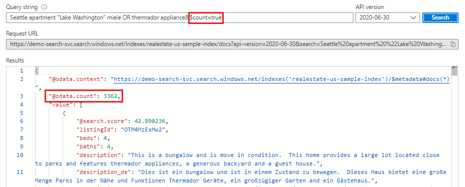
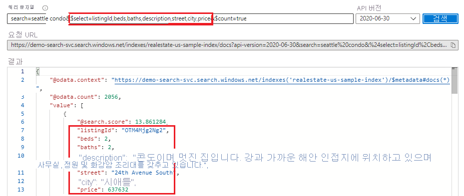
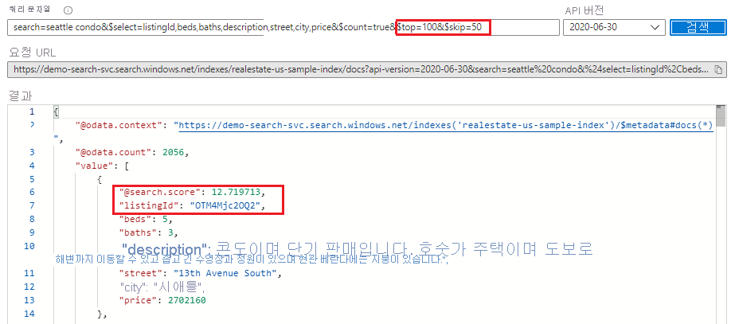

# <a name="use-search-explorer-in-the-azure-portal-for-querying-documents-in-azure-cognitive-search"></a>Azure Portal에서 검색 탐색기를 사용 하 여 Azure에서 문서를 쿼리 Cognitive Search 

이 문서에서는 Azure Portal에서 **검색 탐색기** 를 사용 하 여 기존 Azure Cognitive Search 인덱스를 쿼리 하는 방법을 보여 줍니다. 명령 모음에서 검색 탐색기를 시작 하 여 단순 또는 전체 Lucene 쿼리 식을 서비스의 기존 인덱스에 제출할 수 있습니다. 

   

## <a name="basic-search-strings"></a>기본 검색 문자열

다음 예에서는 기본 제공 부동산 샘플 인덱스를 가정 합니다. 데이터 원본으로 **샘플** 을 선택 하 여 포털에서 데이터 가져오기 마법사를 사용 하 여이 인덱스를 만들 수 있습니다.

### <a name="example-1---empty-search"></a>예제 1 - 빈 검색

콘텐츠를 대략적으로 살펴보려면 용어를 제공하지 않은 상태로 **검색**을 클릭하여 빈 검색을 실행합니다. 빈 검색은 전체 문서를 반환하여 문서 컴퍼지션을 검토할 수 있도록 하므로 첫 번째 쿼리로서 유용합니다. 빈 검색에서는 검색 순위가 없으며 문서가 임의 순서로 반환됩니다(모든 문서의 경우 `"@search.score": 1`). 기본적으로 하나의 검색 요청에서 50개의 문서가 반환됩니다.

빈 검색에 해당하는 구문은 `*` 또는 `search=*`입니다.

   ```Input
   search=*
   ```

   **결과**
   
   

### <a name="example-2---free-text-search"></a>예제 2 - 자유 텍스트 검색

연산자가 있거나 없는 자유 형식 쿼리는 사용자 지정 앱에서 Azure Cognitive Search로 전송 되는 사용자 정의 쿼리를 시뮬레이션 하는 데 유용 합니다. 쿼리 용어나 식을 제공하면 검색 순위가 매겨집니다. 다음 예제에서는 자유 텍스트 검색을 보여 줍니다.

   ```Input
   Seattle apartment "Lake Washington" miele OR thermador appliance
   ```

   **결과**

   특정 관심 용어의 경우 Ctrl+F를 사용하여 결과 내에서 검색을 수행할 수 있습니다.

   

### <a name="example-3---count-of-matching-documents"></a>예제 3 - 일치하는 문서 수 

인덱스의 일치 항목 수를 가져오려면 **$count**를 추가합니다. 빈 검색에서 count는 인덱스의 총 문서 수입니다. 정규화된 검색에서는 쿼리 입력과 일치하는 문서의 수입니다.

   ```Input1
   $count=true
   ```
   **결과**

   

### <a name="example-4---restrict-fields-in-search-results"></a>예제 4 - 검색 결과의 필드 제한

**검색 탐색기**에 보다 읽기 쉬운 출력을 표시하기 위해 명시적으로 명명된 필드로 결과를 제한하려면 **$select**를 추가합니다. 검색 문자열 및 **$count=true**를 유지하려면 인수에 **&** 접두사를 적용합니다. 

   ```Input
   search=seattle condo&$select=listingId,beds,baths,description,street,city,price&$count=true
   ```

   **결과**

   

### <a name="example-5---return-next-batch-of-results"></a>예제 5 - 결과의 다음 일괄 처리 반환

Azure Cognitive Search는 검색 순위를 기준으로 상위 50 개 일치 항목을 반환 합니다. 일치하는 문서의 다음 세트를 가져오려면 **$top=100,&$skip=50**을 추가하여 결과 세트를 100개 문서로 늘리고(기본값: 50개, 최대값: 1,000개) 처음 50개 문서를 건너뜁니다. 순위가 지정된 결과를 얻으려면 쿼리 용어 또는 식과 같은 검색 조건을 제공해야 합니다. 검색 결과에 더 깊게 도달할수록 검색 점수가 줄어듭니다.

   ```Input
   search=seattle condo&$select=listingId,beds,baths,description,street,city,price&$count=true&$top=100&$skip=50
   ```

   **결과**

   

## <a name="filter-expressions-greater-than-less-than-equal-to"></a>필터 식(보다 큼, 보다 작음, 같음)

자유 텍스트 검색이 아니라 정확한 조건을 지정하려는 경우 **$filter** 매개 변수를 사용합니다. 이 예에서는 3 보다 큰 침실를 검색 합니다.

   ```Input
   search=seattle condo&$filter=beds gt 3&$count=true
   ```
   
   **결과**

   

## <a name="order-by-expressions"></a>Order-by 식

검색 점수 이외의 필드를 기준으로 결과를 정렬하려면 **$orderby**를 추가합니다. 이를 테스트 하는 데 사용할 수 있는 식 예제는 다음과 같습니다.

   ```Input
   search=seattle condo&$select=listingId,beds,price&$filter=beds gt 3&$count=true&$orderby=price asc
   ```
   
   **결과**

   

**$filter** 및 **$orderby** 식 둘 다 OData 생성입니다. 자세한 내용은 [OData 필터 구문](https://docs.microsoft.com/rest/api/searchservice/odata-expression-syntax-for-azure-search)을 참조하세요.

<a name="start-search-explorer"></a>

## <a name="how-to-start-search-explorer"></a>검색 탐색기를 시작하는 방법

1. [Azure Portal](https://portal.azure.com)의 대시보드에서 검색 서비스 페이지를 열거나 서비스 목록에서 [서비스를 찾습니다](https://ms.portal.azure.com/#blade/HubsExtension/BrowseResourceBlade/resourceType/Microsoft.Search%2FsearchServices).

2. 서비스 개요 페이지에서 **검색 탐색기**를 클릭합니다.

   

3. 쿼리할 인덱스를 선택합니다.

   

4. 필요에 따라 API 버전을 설정합니다. 기본적으로 현재 일반 공급 API 버전이 선택되지만, 사용하려는 구문이 버전마다 다를 경우 미리 보기 또는 이전 API를 선택할 수 있습니다.

5. 인덱스 및 API 버전을 선택한 후에는 검색 표시줄에 검색 용어 또는 정규화된 쿼리 식을 입력하고 **검색**을 클릭하여 실행합니다.

   

**검색 탐색기**에서 검색을 수행하기 위한 팁:

+ 결과는 자세한 JSON 문서로 반환되므로 문서 생성 및 콘텐츠를 완전히 볼 수 있습니다. 예제에 표시된 쿼리 식을 사용하여 반환되는 필드를 제한할 수 있습니다.

+ 문서는 인덱스에서 **검색 가능**으로 표시되는 모든 필드로 구성됩니다. 포털에서 인덱스 특성을 보려면 검색 개요 페이지의 *인덱스* 목록에서 **realestate-us-sample**을 클릭합니다.

+ 상용 웹 브라우저에서 입력할 수 있는 것과 비슷한 자유 형식 쿼리는 최종 사용자 환경을 테스트하는 데 유용합니다. 예를 들어, 기본 제공 부동산 샘플 인덱스를 가정할 경우 "Seattle apartments lake washington"을 입력한 후 Ctrl+F를 사용하여 검색 결과 내에서 용어를 찾을 수 있습니다. 

+ 쿼리 및 필터 식은 Azure Cognitive Search에서 지 원하는 구문에서 반드시 필요 합니다. 기본 구문은 [간단한 구문](https://docs.microsoft.com/rest/api/searchservice/simple-query-syntax-in-azure-search)이지만 필요에 따라 보다 강력한 쿼리를 위해 [전체 Lucene](https://docs.microsoft.com/rest/api/searchservice/lucene-query-syntax-in-azure-search)을 사용할 수 있습니다. [필터 식](https://docs.microsoft.com/rest/api/searchservice/odata-expression-syntax-for-azure-search)은 OData 구문입니다.


## <a name="next-steps"></a>다음 단계

다음 리소스는 추가 쿼리 구문 정보 및 예제를 제공합니다.

 + [단순 쿼리 구문](https://docs.microsoft.com/rest/api/searchservice/simple-query-syntax-in-azure-search) 
 + [Lucene 쿼리 구문](https://docs.microsoft.com/rest/api/searchservice/lucene-query-syntax-in-azure-search) 
 + [Lucene 쿼리 예제](search-query-lucene-examples.md) 
 + [OData 필터 식 구문](https://docs.microsoft.com/rest/api/searchservice/odata-expression-syntax-for-azure-search) 
