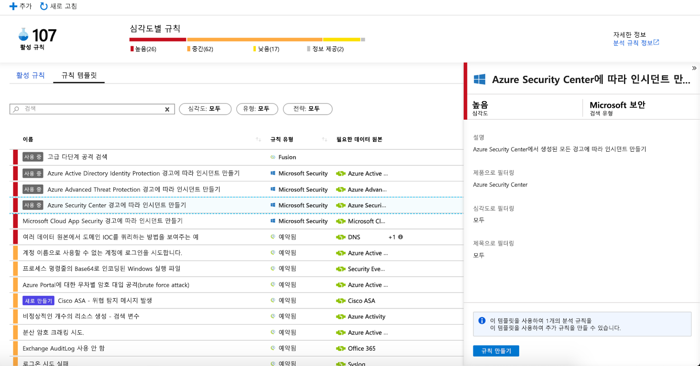
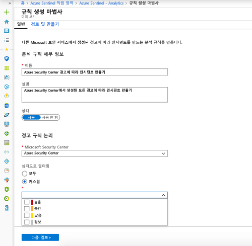
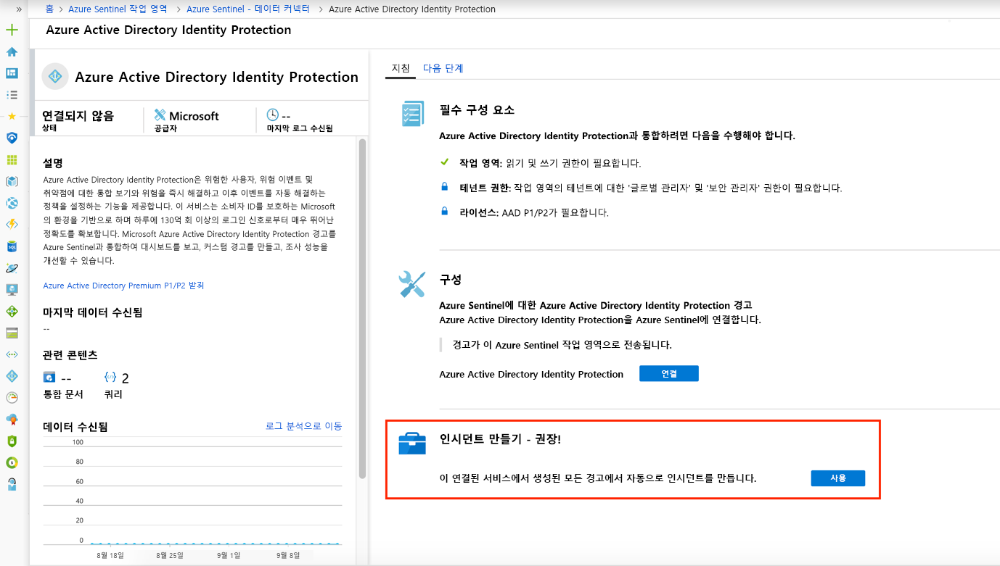

# Microsoft 보안 경고에서 인시던트 자동 생성

Microsoft Cloud App Security 및 Microsoft Defender for Identity (이전 Azure ATP)와 같이 Azure 센티널에 연결 된 Microsoft 보안 솔루션에서 트리거되는 경고는 Azure 센티널에서 인시던트를 자동으로 만들지 않습니다. 기본적으로 Microsoft 솔루션을 Azure Sentinel에 연결하면, 해당 서비스에서 생성된 경고는 Azure Sentinel의 원시 데이터로, Azure Sentinel 작업 영역의 보안 경고 테이블에 저장됩니다. 그러면 해당 데이터를 Sentinel에 연결하는 다른 모든 원시 데이터와 마찬가지로 사용할 수 있습니다.

이 문서의 지침에 따라, 연결된 Microsoft 보안 솔루션에서 경고가 트리거될 때마다 인시던트가 자동으로 생성되도록 Azure Sentinel을 쉽게 구성할 수 있습니다.

## 필수 구성 요소
보안 서비스 경고에서 인시던트가 생성되려면 [Microsoft 보안 솔루션을 연결](connect-data-sources.md#data-connection-methods)해야 합니다.

## Microsoft 보안 인시던트 생성 분석 규칙 사용

Azure Sentinel에 기본 제공되는 규칙을 사용하여 Azure Sentinel 인시던트를 실시간으로 자동 생성할 연결된 Microsoft 보안 솔루션을 선택합니다. Microsoft 보안 솔루션에 의해 생성된 경고 중 Azure Sentinel에서 인시던트를 생성할 경고를 필터링하는 옵션을 보다 구체적으로 정의하기 위해 규칙을 편집할 수도 있습니다. 예를 들어 심각도가 높은 Azure Defender (이전의 Azure Security Center) 경고 에서만 Azure 센티널 인시던트를 자동으로 만들도록 선택할 수 있습니다.

1. Azure Sentinel 아래의 Azure Portal에서 **Analytics**를 선택합니다.

1. **규칙 템플릿** 탭을 선택하면 기본 제공되는 분석 규칙을 모두 볼 수 있습니다.

    

1. 사용할 **Microsoft 보안** 분석 규칙 템플릿을 선택하고 **규칙 만들기**를 클릭합니다.

    

1. 규칙 세부 정보를 수정하고 경고 이름에 포함된 텍스트 또는 경고 심각도별로 인시던트를 생성하는 경고를 필터링하도록 선택할 수 있습니다.  
      
    예를 들어 **Microsoft Security service** 필드에서 **Azure defender** (계속 Azure Security Center 호출 될 수 있음)를 선택 하 고 **심각도 별 필터** 필드에서 **높음** 을 선택 하는 경우 심각도가 높은 azure defender 경고만 azure 센티널에서 인시던트를 자동으로 만듭니다.  

    

1. **+만들기**를 클릭하고 **Microsoft 인시던트 생성 규칙**을 선택하여 여러 **Microsoft 보안** 서비스의 경고를 필터링하는 새로운 Microsoft 보안 규칙을 만들 수도 있습니다.

    

  **Microsoft 보안 서비스** 유형별로 둘 이상의 **Microsoft Security** 분석 규칙을 만들 수 있습니다. 각 규칙이 필터로 사용되기 때문에 중복 인시던트는 생성되지 않습니다. 경고가 둘 이상의 **Microsoft Security** 분석 규칙과 일치하더라도 Azure Sentinel 인시던트는 하나만 생성됩니다.

## 연결 중에 인시던트 자동 생성이 가능하도록 설정
 Microsoft 보안 솔루션을 연결할 때 보안 솔루션의 경고가 Azure Sentinel에서 인시던트를 자동으로 생성할지 여부를 선택할 수 있습니다.

1. Microsoft 보안 솔루션 데이터 원본을 연결합니다. 

   

1. **인시던트 만들기**에서 **사용**을 선택하여 연결된 보안 서비스에서 생성된 경고에서 인시던트가 자동으로 생성되는 기본 분석 규칙을 사용하도록 설정합니다. 그런 다음, **Analytics** 및 **활성 규칙**에서 이 규칙을 편집할 수 있습니다.

## 다음 단계

- Azure Sentinel을 시작하려면 Microsoft Azure에 대한 구독이 필요합니다. 구독이 없는 경우 [무료 평가판](https://azure.microsoft.com/free/)을 등록할 수 있습니다.
- [Azure Sentinel에 데이터를 등록](quickstart-onboard.md)하고 [데이터 및 잠재적 위협을 표시](quickstart-get-visibility.md)하는 방법에 대해 알아봅니다.
