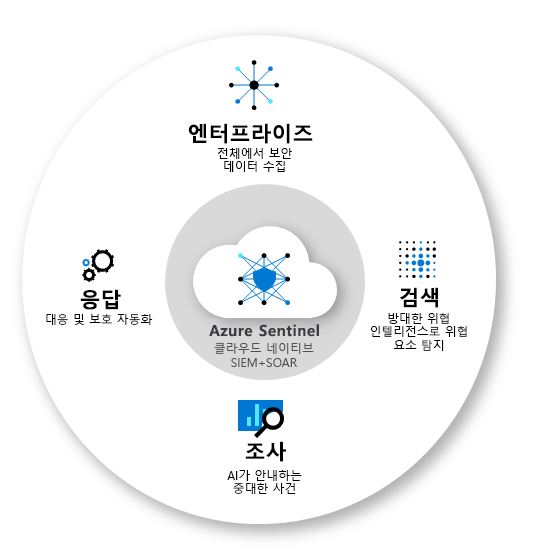
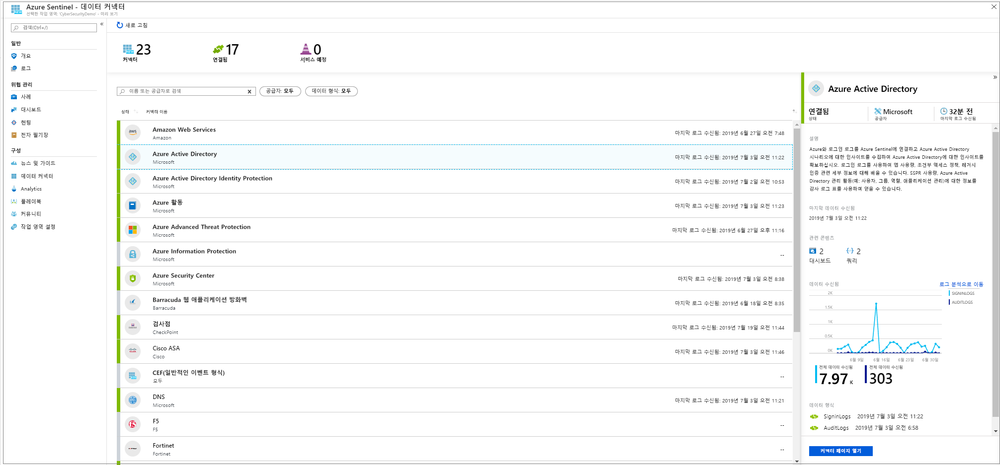
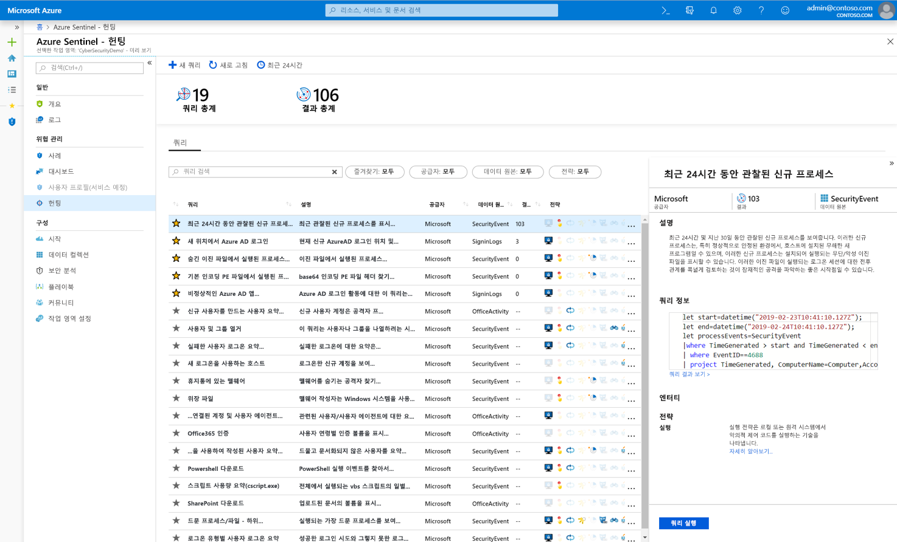

# Azure Sentinel이란?

Microsoft Azure Sentinel은 확장 가능한 클라우드 네이티브, **SIEM(보안 정보 이벤트 관리)** 및 **SOAR(보안 오케스트레이션 자동화 응답)** 솔루션입니다. Azure Sentinel은 엔터프라이즈 전반에 지능적인 보안 분석 및 위협 인텔리전스를 제공하며, 경고 검색, 위협 가시성, 주도적 헌팅 및 위협 대응을 위한 단일 솔루션을 제공합니다. 

Azure Sentinel은 점점 더 정교해지는 공격, 점점 늘어나는 경고의 양과 긴 해결 기간이라는 문제를 완화하기 위해 엔터프라이즈 전체를 폭넓은 시각으로 모니터링합니다.

- 온-프레미스와 여러 클라우드의 모든 사용자, 디바이스, 애플리케이션 및 인프라에서 **클라우드 규모로 데이터를 수집**합니다. 

- Microsoft의 분석 및 업계 최고의 위협 인텔리전스를 사용하여 **이전에 미검사된 위협을 탐지**하고 가양성을 최소화합니다. 

- Microsoft의 수년 간의 사이버 보안 성과물을 활용하여 **인공 지능을 통해 위협을 조사**하고 대규모로 의심스러운 활동을 헌팅합니다. 

- 일반 작업의 기본 제공 오케스트레이션 및 자동화로 **빠르게 인시던트에 대응**합니다.

기존 Azure 서비스의 전체 범위를 토대로 구축된 Azure Sentinel은 기본적으로 Log Analytics 및 Logic Apps와 같은 입증된 토대를 통합합니다. Azure Sentinel은 AI를 통해 조사 및 검색을 보강하고, Microsoft의 위협 인텔리전스 스트림을 제공하고, 사용자 고유의 위협 인텔리전스를 구현할 수 있도록 합니다. 

## 모든 데이터에 연결

Azure Sentinel을 온보딩하려면 먼저 [보안 원본](connect-data-sources.md)에 연결해야 합니다. Azure Sentinel에는 즉시 사용 가능하고 실시간 통합을 제공하는 Microsoft 솔루션(Microsoft Threat Protection 솔루션 포함) 및 Microsoft 365 원본(Office 365, Azure AD, Azure ATP 및 Microsoft Cloud App Security 등)에 대한 다양한 커넥터가 포함되어 있습니다. 또한 타사 솔루션에 대한 광범위한 보안 에코시스템에 기본 제공 커넥터도 제공됩니다. 일반적인 이벤트 형식, Syslog 또는 REST API를 사용하여 Azure Sentinel에 데이터 원본을 연결할 수도 있습니다.  

[!INCLUDE [azure-lighthouse-supported-service](../../includes/azure-lighthouse-supported-service.md)]

## 통합 문서

 [데이터 원본을](quickstart-onboard.md) Azure Sentinel에 연결한 후에는 사용자 지정 통합 문서를 만들 때 다양한 기능을 제공하는 Azure Monitor 통합 문서와 Azure Sentinel 통합을 사용하여 데이터를 모니터링할 수 있습니다. 통합 문서가 Azure Sentinel에 다르게 표시되는 반면, [Azure Monitor 통합 문서를 사용하여 대화형 보고서를 만드는](../azure-monitor/app/usage-workbooks.md) 방법을 확인하는 것이 유용할 수 있습니다. Azure Sentinel을 사용하면 데이터에 대한 사용자 지정 통합 문서를 만들 수 있으며 데이터 원본을 연결하는 즉시 데이터를 신속하게 파악할 수 있는 기본 제공 통합 문서 템플릿도 제공됩니다.

## 분석

노이즈를 줄이고 검토 및 조사해야 하는 경고의 수를 최소화하기 위해 Azure Sentinel은 [분석을 통해 경고와 인시던트 간 상관 관계를 파악합니다](tutorial-detect-threats-built-in.md). **인시던트**는 조사하고 해결할 수 있는 실행 가능한 위협을 만드는 데 사용되는 관련 경고 그룹입니다. 기본 제공 상관 관계 규칙을 있는 그대로 사용하거나, 이러한 규칙을 토대로 사용자 고유의 규칙을 구축할 수 있습니다. 또한 Azure Sentinel은 네트워크 동작을 매핑한 후 리소스의 오류를 찾아내는 Machine Learning 규칙을 제공합니다. 이러한 분석 과정에서 여러 다른 엔터티에 대한 충실도가 낮은 경고와 충실도가 높은 보안 인시던트를 결합합니다.

## 보안 자동화 및 오케스트레이션

일반적인 작업을 자동화하고, Azure 서비스 뿐만 아니라 기준 도구와 통합되는 [플레이 북을 사용하여 보안 오케스트레이션 간소화](tutorial-respond-threats-playbook.md)합니다. Azure Logic Apps 토대 위에 구축된 Azure Sentinel의 자동화 및 오케스트레이션 솔루션은 새로운 기술과 위협이 대두될 때 확장성이 뛰어난 자동화를 지원하는 고도로 확장 가능한 아키텍처를 제공합니다. Azure Logic Apps를 사용하여 플레이 북을 빌드하려는 경우 점점 더 커지는 기본 제공 플레이 북 갤러리 중에서 선택할 수 있습니다. 여기에는 Azure Functions와 같은 서비스를 위한 [200개 이상의 커넥터](https://docs.microsoft.com/azure/connectors/apis-list)가 포함됩니다. 이러한 커넥터를 사용하면 코드, ServiceNow, Jira, Zendesk, HTTP 요청, Microsoft Teams, Slack, Windows Defender ATP 및 Cloud App Security에서 사용자 지정 논리를 적용할 수 있습니다.

예를 들어, ServiceNow 티켓 시스템을 사용하는 경우 제공된 도구를 사용하여 Azure Logic Apps에서 워크플로를 자동화하고, 특정 이벤트가 검색될 때마다 ServiceNow에서 티켓을 열 수 있습니다.

## 조사

현재 미리 보기로 제공되는 Azure Sentinel [심층 조사](tutorial-investigate-cases.md) 도구는 잠재적 보안 위협의 범위를 이해하고 근본 원인을 찾는 데 도움이 됩니다. 대화형 그래프에서 엔터티를 선택하여 특정 엔터티에 대해 흥미로운 질문을 하고, 해당 엔터티 및 연결을 드릴다운하여 위협의 근본 원인을 파악할 수 있습니다. 

## 사냥

경고가 트리거되기 전에 조직의 데이터 원본에 대한 보안 위협을 미리 찾아낼 수 있도록 하는 MITRE 프레임워크를 기준으로 하는 Azure Sentinel의 [강력한 검색 및 쿼리 도구](hunting.md)를 사용하세요. 가능한 공격에 대한 수준 높은 인사이트를 제공하는 헌팅 쿼리를 검색한 후에는 쿼리를 기준으로 사용자 지정 검색 규칙을 만들고, 해당 인사이트를 보안 인시던트 응답자에게 경고로 제공할 수도 있습니다. 헌팅 동안 관심 있는 이벤트에 대해 책갈피를 만들어 나중에 해당 이벤트를 다른 사람들과 공유하고, 관련 있는 다른 이벤트와 그룹화하여 조사가 필요한 인시던트로 구현할 수 있습니다.

## 커뮤니티

Azure Sentinel 커뮤니티는 위협 검색 및 자동화를 위한 강력한 리소스입니다. Microsoft 보안 분석가들은 새로운 통합 문서, 플레이 북 및 헌팅 쿼리를 지속적으로 만들고 추가하며, 작업 환경에서 사용할 수 있게 커뮤니티에 게시하고 있습니다. 프라이빗 커뮤니티 GitHub [리포지토리](https://aka.ms/asicommunity)에서 샘플 콘텐츠를 다운로드하여 Azure Sentinel용 사용자 지정 통합 문서, 헌팅 쿼리, 노트 및 플레이 북을 만들 수 있습니다. 

## 다음 단계

- Azure Sentinel을 시작하려면 Microsoft Azure에 대한 구독이 필요합니다. 구독이 없는 경우 [무료 평가판](https://azure.microsoft.com/free/)을 등록할 수 있습니다.
- [Azure Sentinel에 데이터를 등록](quickstart-onboard.md)하고 [데이터 및 잠재적 위협을 표시](quickstart-get-visibility.md)하는 방법에 대해 알아봅니다.
