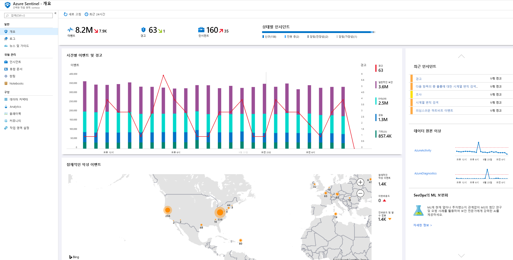
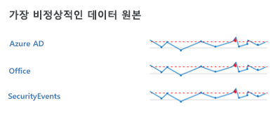

# <a name="quickstart-get-started-with-azure-sentinel"></a>빠른 시작: Azure Sentinel 시작


이 빠른 시작에서는 Azure Sentinel을 사용하여 작업 환경에서 발생하는 상황을 빠르게 보고 모니터링하는 방법을 알아봅니다. Azure Sentinel에 데이터 원본을 연결하면 데이터가 바로 시각화되고 분석되므로 연결된 모든 데이터 원본에서 발생하는 상황을 파악할 수 있습니다. Azure Sentinel은 로그 및 쿼리 분석을 제공하기 위해 기본적으로 제공되는 표와 차트뿐만 아니라 Azure에서 이미 사용할 수 있는 전체 도구 기능을 제공하는 통합 문서를 지원합니다. 기본 제공 통합 문서를 사용할 수도 있고, 기존 통합 문서를 토대로 또는 처음부터 완전히 새롭게 새 통합 문서를 만들 수도 있습니다. 

## <a name="get-visualization"></a>데이터 시각화

작업 환경에서 발생하는 상황을 시각화하고 분석하려면 먼저 개요 대시보드를 통해 조직의 보안 상황을 파악합니다. 이러한 타일의 각 요소를 클릭하여 생성 시 기반이 된 원시 데이터로 드릴다운할 수 있습니다. 노이즈를 줄이고 검토 및 조사해야 하는 경고의 수를 최소화하기 위해 Azure Sentinel은 Fusion 기법을 통해 경고와 인시던트 간 상관 관계를 파악합니다. **인시던트** 는 조사하고 해결할 수 있는 실행 가능한 인시던트를 만드는 데 사용되는 관련 경고 그룹입니다.

- Azure Portal에서 Azure Sentinel을 선택하고 모니터링하려는 작업 영역을 선택합니다.

  

- 위쪽 도구 모음에는 선택한 기간 동안 발생한 이벤트의 수와 이전 24시간과 비교한 결과가 표시됩니다. 이 도구 모음에는 이러한 이벤트에서 트리거된 경고(작은 크기 숫자는 지난 24시간 동안의 변화량을 나타냄)가 표시된 후, 열려 있는 이벤트, 진행 중인 이벤트 및 닫힌 이벤트 수가 표시됩니다. 이벤트 수가 급격히 증가하거나 감소하지 않았는지 확인합니다. 이벤트 수가 감소하면 Azure Sentinel에 연결 중지가 보고될 수 있습니다. 이벤트 수가 증가하면 의심스러운 문제가 발생한 것일 수 있습니다. 새 경고가 있는지 확인합니다.

   

개요 페이지의 주 본문에서 작업 영역의 보안 상태를 한눈에 파악할 수 있습니다.

- **시간에 따른 이벤트 및 경고**: 이벤트의 수와 해당 이벤트에서 생성된 경고 수를 표시합니다. 일반적이지 않은 스파이크가 나타나면 경고를 확인해야 합니다. 이벤트에 일반적이지 않은 스파이크가 나타나지만 경고가 발생하지 않으면 문제의 원인이 될 수 있습니다.

- **잠재적 악성 이벤트**: 트래픽이 악의적인 것으로 알려진 원본에서 검색되면 Azure Sentinel에서 맵에 경고를 표시합니다. 주황색 표시는 인바운드 트래픽을 나타냅니다. 누군가가 악의적인 것으로 알려진 IP 주소에서 조직에 액세스하려고 하는 것입니다. 아웃바운드(빨간색) 활동이 표시되면 네트워크의 데이터가 조직을 벗어나 악의적인 것으로 알려진 IP 주소로 스트리밍되고 있음을 나타냅니다.

   

- **최근 인시던트**: 최근 인시던트, 해당 심각도, 인시던트와 연결된 경고 수를 보려면 다음을 수행합니다. 특정 유형의 경고에서 갑작스러운 피크가 확인되면 현재 활성 공격이 진행되고 있는 것일 수 있습니다. 예를 들어 Microsoft Defender for Identity(이전에는 Azure ATP)에서 갑자기 20개의 Pass-the-hash 이벤트가 발생하면 누군가가 현재 공격 중인 것일 수 있습니다.

- **데이터 원본 오류**: Microsoft의 데이터 분석가는 데이터 원본 데이터에 오류가 있는지를 지속적으로 검색하는 모델을 만들었습니다. 오류가 있으면 아무것도 표시되지 않습니다. 오류가 감지되면 자세히 검토하여 원인을 파악해야 합니다. 예를 들어, Azure 활동에서 스파이크 부분을 클릭합니다. **차트** 를 클릭하여 스파이크가 발생한 시간을 확인한 후 해당 기간 동안 발생한 활동을 필터링하여 스파이크의 원인을 파악할 수 있습니다.

   

## <a name="use-built-in-workbooks"></a>기본 제공 통합 문서 사용<a name="dashboards"></a>

기본 제공 통합 문서는 연결된 데이터 원본의 통합 데이터를 제공하여 해당 서비스에서 생성된 이벤트를 자세히 분석할 수 있도록 합니다. 기본 제공 통합 문서에는 방화벽 트래픽 로그, Office 365 및 Windows 이벤트 기반 비보안 프로토콜을 포함하여 서버의 Windows 이벤트, 자사 경고, 타사의 데이터가 될 수 있는 Azure AD, Azure 활동 이벤트 및 온-프레미스가 포함됩니다. 통합 문서는 Azure Monitor 통합 문서에 기반하기 때문에, 자신의 통합 문서를 직접 디자인할 때 향상된 사용자 지정 기능으로 보다 유연하게 디자인할 수 있습니다. 자세한 내용은 [통합 문서](../azure-monitor/platform/workbooks-overview.md)를 참조하세요.

1. **설정** 에서 **통합 문서** 를 선택합니다. **설치됨** 아래에서 설치된 통합 문서를 모두 볼 수 있습니다. **모두** 아래에서 설치할 수 있는 기본 제공 통합 문서의 전체 갤러리를 볼 수 있습니다. 
2. 특정 통합 문서를 검색하여 각 통합 문서가 제공하는 항목의 전체 목록 및 설명을 볼 수 있습니다. 
3. Azure AD를 사용한다고 가정할 경우, Azure Sentinel을 가동하고 실행하기 위해 적어도 다음 통합 문서를 설치하는 것이 좋습니다.
   - **Azure AD**: 다음 중 하나 또는 둘 모두를 사용합니다.
       - **Azure AD 로그인** 은 시간에 따른 로그인을 분석하여 오류가 있는지 확인합니다. 이 통합 문서는 애플리케이션, 디바이스, 위치별로 실패한 로그인을 보여주기 때문에 비정상적인 상황이 발생하면 한눈에 알아볼 수 있습니다. 로그인이 여러 번 실패하면 주의하세요. 
       - **Azure AD 감사 로그** 는 사용자에 대한 변경(추가, 제거 등), 그룹 만들기 및 수정과 같은 관리 활동을 분석합니다.  

   - 방화벽에 대한 통합 문서를 추가합니다. 예를 들어, Palo Alto 통합 문서를 추가합니다. 이 통합 문서는 방화벽 트래픽을 분석하여 방화벽 데이터와 위협 이벤트 간 상관 관계를 제공하며, 엔터티 전체에서 의심스러운 이벤트를 강조 표시합니다. 통합 문서는 트래픽의 추세에 대한 정보를 제공하며, 결과를 드릴다운하고 필터링할 수 있습니다. 

      


주 쿼리를 편집하여() 통합 문서를 사용자 지정할 수 있습니다.  단추를 클릭하여 [쿼리 편집을 위한 Log Analytics](../azure-monitor/log-query/log-analytics-tutorial.md)로 이동한 다음, 줄임표(...)를 선택하고 **타일 데이터의 사용자 지정** 을 선택할 수 있습니다. 여기서 주 시간 필터를 편집하거나 통합 문서에서 특정 타일을 제거할 수 있습니다.

쿼리 작업에 대한 자세한 내용은 [자습서: Log Analytics의 시각적 데이터](../azure-monitor/learn/tutorial-logs-dashboards.md)를 참조하세요.

### <a name="add-a-new-tile"></a>새 타일 추가

새 타일을 추가하려는 경우 직접 만든 통합 문서 또는 Azure Sentinel 기본 제공 통합 문서에 추가할 수 있습니다. 
1. Log Analytics에서 [자습서: Log Analytics의 시각적 데이터](../azure-monitor/learn/tutorial-logs-dashboards.md)에 제공되는 지침에 따라 타일을 만듭니다. 
2. 타일이 생성되면 **고정** 아래에서 타일을 표시할 통합 문서를 선택합니다.

## <a name="create-new-workbooks"></a>새 통합 문서 만들기
처음부터 새로 통합 문서를 만들거나 기본 제공 통합 문서를 기초로 새 통합 문서를 만들 수 있습니다.

1. 새 통합 문서를 처음부터 만들려면 **통합 문서** 를 선택한 다음, **+새 통합 문서** 를 선택합니다.
2. 통합 문서가 생성된 구독을 선택하고 설명이 포함된 이름을 지정합니다. 각 통합 문서는 다른 통합 문서와 마찬가지로 Azure 리소스이며 액세스할 수 있는 사람을 정의하고 제한하기 위해 역할(Azure RBAC)을 할당할 수 있습니다. 
3. 통합 문서에 표시하여 시각화를 고정하려면 공유해야 합니다. **공유**, **사용자 관리** 를 차례로 클릭합니다. 
 
1. 다른 Azure 리소스와 마찬가지로 **액세스 권한 확인** 및 **역할 할당** 을 사용합니다. 자세한 내용은 [Azure RBAC를 사용하여 Azure 통합 문서 공유](../azure-portal/azure-portal-dashboard-share-access.md)를 참조하세요.


## <a name="new-workbook-examples"></a>새 통합 문서 예제

다음 샘플 쿼리를 사용하여 여러 주 동안의 트래픽 추세를 비교할 수 있습니다. 쿼리를 실행하는 디바이스 공급업체와 데이터 원본을 쉽게 전환할 수 있습니다. 이 예제에서는 Windows의 SecurityEvent를 사용하며, 다른 방화벽의 AzureActivity 또는 CommonSecurityLog에서 실행되도록 전환할 수 있습니다.

```console
 |where DeviceVendor == "Palo Alto Networks":
  // week over week query
  SecurityEvent
  | where TimeGenerated > ago(14d)
  | summarize count() by bin(TimeGenerated, 1d)
  | extend Week = iff(TimeGenerated>ago(7d), "This Week", "Last Week"), TimeGenerated = iff(TimeGenerated>ago(7d), TimeGenerated, TimeGenerated + 7d)
```

여러 원본의 데이터를 통합하는 하나의 쿼리를 만들 수 있습니다. 방금 만든 새 사용자의 Azure Active Directory 감사 로그를 살펴본 다음, Azure 로그를 확인하여 사용자가 생성되고 24시간 이내에 역할 할당 변경을 시작했는지 알아볼 수 있습니다. 이러한 의심스러운 활동이 다음과 같이 이 대시보드에 표시됩니다.

```console
AuditLogs
| where OperationName == "Add user"
| project AddedTime = TimeGenerated, user = tostring(TargetResources[0].userPrincipalName)
| join (AzureActivity
| where OperationName == "Create role assignment"
| project OperationName, RoleAssignmentTime = TimeGenerated, user = Caller) on user
| project-away user1
```

데이터를 보는 사용자의 역할과 이들이 원하는 정보에 따라 다른 통합 문서를 만들 수 있습니다. 예를 들어, 네트워크 관리자를 위해 방화벽 데이터를 포함하는 통합 문서를 만들 수 있습니다. 항목을 확인하려는 빈도, 매일 검토하려는 항목이 있는지 여부 및 1시간에 1번 확인하려는 기타 항목을 기준으로 통합 문서를 만들 수도 있습니다. 예를 들어, 1시간 간격으로 Azure AD 로그인을 확인하여 오류를 검색할 수 있습니다. 

## <a name="create-new-detections"></a>새 탐지 만들기

[Azure Sentinel에 연결한 데이터 원본](connect-data-sources.md)에 대한 탐지를 생성하여 조직내 위험 요소를 조사할 수 있습니다.

새 탐지를 만들 때 Microsoft 보안 연구원들이 만든 기본 제공 탐지를 활용하세요. 이 기본 제공 탐지는 사용자가 연결한 데이터 원본에 맞게 조정됩니다.

기본 제공되는 탐지를 모두 보려면 **Analytics** 로 이동한 다음, **규칙 템플릿** 으로 이동합니다. 이 탭에는 Azure Sentinel 기본 제공 규칙이 모두 포함됩니다.

   

기본 제공되는 탐지를 가져오는 방법에 대한 자세한 내용은 [자습서: 기본 제공 분석 가져오기](tutorial-detect-threats-built-in.md)를 참조하세요.
 
## <a name="next-steps"></a>다음 단계
이 빠른 시작에서는 Azure Sentinel 사용을 시작하는 방법을 알아보았습니다. [위협 감지 방법](tutorial-detect-threats-built-in.md)에 대한 자습서도 계속 진행하세요.
> [!div class="nextstepaction"]
> [사용자 지정 위협 탐지 규칙을 만들어서](tutorial-detect-threats-custom.md) 위협 요소에 대한 대응을 자동화합니다.