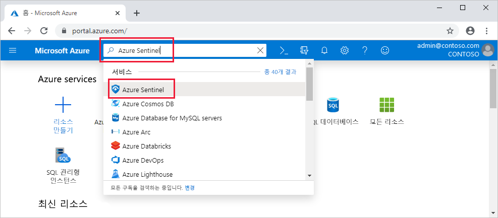

# 빠른 시작: Azure Sentinel 온보딩

이 빠른 시작에서는 Azure Sentinel을 온보딩하는 방법을 알아봅니다. 

Azure Sentinel을 온보딩하려면 먼저 Azure Sentinel을 사용하도록 설정한 후 데이터 원본을 연결해야 합니다. Azure Sentinel에는 즉시 사용 가능하고 실시간 통합을 제공하는 Microsoft 솔루션(Microsoft Threat Protection 솔루션 포함) 및 Microsoft 365 원본(Office 365, Azure AD, Azure ATP 및 Microsoft Cloud App Security 등)에 대한 다양한 커넥터가 포함되어 있습니다. 또한 타사 솔루션에 대한 광범위한 보안 에코시스템에 기본 제공 커넥터도 제공됩니다. 일반적인 이벤트 형식, Syslog 또는 REST API를 사용하여 Azure Sentinel에 데이터 원본을 연결할 수도 있습니다.  

데이터 원본을 연결한 후 데이터에 따른 인사이트를 제공하는 전문가가 만든 통합 문서 갤러리 중에서 선택합니다. 이러한 통합 문서는 사용자의 요구에 맞게 쉽게 사용자 지정할 수 있습니다.

>[!IMPORTANT] 
> Azure Sentinel 사용 시 발생하는 요금에 대한 자세한 내용은 [Azure Sentinel 가격 책정](https://azure.microsoft.com/pricing/details/azure-sentinel/)을 참조하세요.
  

## 전역 전제 조건

- 활성 Azure 구독이 아직 없는 경우 시작하기 전에 [체험 계정](https://azure.microsoft.com/free/?WT.mc_id=A261C142F)을 만드세요.

- Log Analytics 작업 영역. [Log Analytics 작업 영역을 만드는 방법](../log-analytics/log-analytics-quick-create-workspace.md)을 알아봅니다. Log Analytics 작업 영역에 대한 자세한 내용은 [Azure Monitor 로그 배포 디자인](../azure-monitor/platform/design-logs-deployment.md)을 참조하세요.

- Azure Sentinel을 사용하도록 설정하려면 Azure Sentinel 작업 영역이 있는 구독에 대한 참가자 권한이 필요합니다. 
- Azure Sentinel을 사용하려면 작업 영역이 속한 리소스 그룹에 대해 참가자 또는 읽기 권한자 권한이 있어야 합니다.
- 특정 데이터 원본을 연결하려면 추가 권한이 필요할 수 있습니다.
- Azure Sentinel은 유료 서비스입니다. 가격 책정 정보에 대해서는 [Azure Sentinel 정보](https://go.microsoft.com/fwlink/?linkid=2104058)를 참조하세요.
 
## Azure Sentinel 사용

1. Azure Portal에 로그인합니다. Azure Sentinel이 생성된 구독이 선택되었는지 확인합니다.

1. **Azure Sentinel**을 검색하여 선택합니다.

   

1. **추가**를 선택합니다.

1. 사용하려는 작업 영역을 선택하거나 새 작업 영역을 만듭니다. Azure Sentinel은 둘 이상의 작업 영역에서 실행할 수 있지만 데이터는 단일 작업 영역으로 격리됩니다.

   

   >[!NOTE] 
   > - Azure Security Center에서 만든 기본 작업 영역은 목록에 표시되지 않습니다. 기본 작업 영역에는 Azure Sentinel을 설치할 수 없습니다.
   > - Azure Sentinel은 중국과 독일(소버린) 지역을 제외한 모든 [Log Analytics의 GA 지역](https://azure.microsoft.com/global-infrastructure/services/?products=monitor)의 작업 영역에서 실행할 수 있습니다. Azure Sentinel에서 생성된 데이터(예: 이러한 작업 영역이 원본으로 사용되는 일부 고객 데이터를 포함할 수 있는 인시던트, 책갈피 및 경고 규칙)는 유럽(유럽에 있는 작업 영역용), 오스트레일리아(오스트레일리아에 있는 작업 영역용) 또는 미국 동부(다른 지역에 있는 작업 영역용)에 저장됩니다.

   >[!IMPORTANT]
   > - 작업 영역에서 Azure Sentinel을 사용하도록 설정한 후에는 해당 작업 영역을 다른 리소스 그룹 또는 구독으로 이동하는 것은 지원 되지 않습니다. 작업 영역을 이동해야 하는 경우 고객 지원팀에게 문의하세요.

1. **Azure Sentinel 추가**를 선택합니다.
  

## 데이터 원본 연결

Azure Sentinel은 서비스에 연결하고 이벤트 및 로그를 Azure Sentinel에 전달하여 서비스 및 앱에 대한 연결을 만듭니다. 컴퓨터 및 가상 머신의 경우 로그를 수집하고 Azure Sentinel에 전달하는 Azure Sentinel 에이전트를 설치할 수 있습니다. 방화벽과 프록시의 경우 Azure Sentinel은 Linux Syslog 서버를 활용합니다. 에이전트가 설치되고 에이전트가 로그 파일을 수집하여 Azure Sentinel에 전달합니다. 
 
1. **데이터 커넥터**를 클릭합니다.
1. 연결할 수 있는 각 데이터 원본에 대한 타일이 있습니다. 
예를 들어 **Azure Active Directory**를 클릭합니다. 이 데이터 원본을 연결하는 경우 Azure AD의 모든 로그를 Azure Sentinel로 스트리밍합니다. 가져오려는 로그 유형(로그인 로그 및/또는 감사 로그)을 선택할 수 있습니다.  
아래에서 Azure Sentinel은 각 커넥터에 대해 설치해야 하는 통합 문서에 대한 권장 사항을 제공하므로 데이터에 대해 흥미로운 인사이트를 즉시 얻을 수 있습니다.   자세한 내용은 설치 지침을 따르거나 [관련 연결 가이드](connect-data-sources.md)를 참조하세요. 데이터 커넥터에 대한 내용은 [Microsoft 서비스 연결](connect-data-sources.md)을 참조하세요.

데이터 원본이 연결된 후 데이터는 Azure Sentinel로 스트리밍되기 시작하고 작업을 시작할 준비가 됩니다. [기본 제공 대시보드](quickstart-get-visibility.md)에서 로그를 확인하고 Log Analytics에서 쿼리를 작성하여 [데이터를 조사](tutorial-investigate-cases.md)할 수 있습니다.

## 다음 단계
이 문서에서는 Azure Sentinel에 데이터 원본을 연결하는 방법을 알아보았습니다. Azure Sentinel에 대한 자세한 내용은 다음 문서를 참조하세요.
- [데이터에 대한 가시성을 얻고 재적 위협을 확인](quickstart-get-visibility.md)하는 방법을 알아봅니다.
- [Azure Sentinel을 사용하여 위협 검색](tutorial-detect-threats-built-in.md)을 시작합니다.
- [일반적인 이벤트 형식 어플라이언스](connect-common-event-format.md)의 데이터를 Azure Sentinel로 스트리밍합니다.
