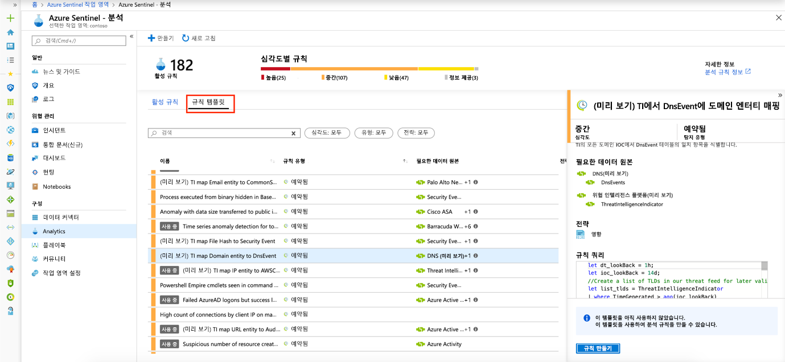

# 튜토리얼: 즉시 위협 탐지

> [!IMPORTANT]
> 즉시 사용 가능 위협 탐지는 현재 공개 미리 보기상태입니다.
> 이 기능은 서비스 수준 계약 없이 제공되며 프로덕션 워크로드에는 권장되지 않습니다.
> 자세한 내용은 [Microsoft Azure Preview에 대한 추가 사용 약관](https://azure.microsoft.com/support/legal/preview-supplemental-terms/)을 참조하세요.

데이터 [원본을](quickstart-onboard.md) Azure Sentinel에 연결한 후 의심스러운 문제가 발생하면 알림을 받게 됩니다. 이를 위해 Azure Sentinel은 기본 기본 기본 제공 템플릿을 제공합니다. 이러한 템플릿은 알려진 위협, 일반적인 공격 벡터 및 의심스러운 활동 에스컬레이션 체인을 기반으로 Microsoft의 보안 전문가 및 분석가 팀에 의해 설계되었습니다. 이러한 템플릿을 사용하도록 설정하면 사용자 환경 전체에서 의심스러운 모든 활동을 자동으로 검색합니다. 대부분의 템플릿은 필요에 따라 활동을 검색하거나 필터링하도록 사용자 지정할 수 있습니다. 이러한 템플릿에서 생성된 경고는 사용자 환경에서 할당하고 조사할 수 있는 인시던트를 만듭니다.

이 자습서에서는 Azure Sentinel을 사용하면 위협을 감지할 수 있습니다.

> [!div class="checklist"]
> * 즉시 사용 가능 감지
> * 위협 응답 자동화

## 기본 제공 검색 정보

기본 제공되는 탐지를 모두 보려면 **Analytics**로 이동한 다음, **규칙 템플릿**으로 이동합니다. 이 탭에는 Azure Sentinel 기본 제공 규칙이 모두 포함됩니다.

   

다음 템플릿 유형을 사용할 수 있습니다.

- **Microsoft 보안** - Microsoft 보안 템플릿은 다른 Microsoft 보안 솔루션에서 생성된 경고에서 Azure Sentinel 인시던트를 실시간으로 자동으로 만듭니다. Microsoft 보안 규칙을 템플릿으로 사용하여 유사한 논리를 사용하여 새 규칙을 만들 수 있습니다. 보안 규칙에 대한 자세한 내용은 [Microsoft 보안 경고에서 인시던트를 자동으로 생성합니다.](create-incidents-from-alerts.md)
- **Fusion** - Fusion 기술을 기반으로 Azure Sentinel의 고급 다단계 공격 탐지는 확장 가능한 기계 학습 알고리즘을 사용하여 여러 제품에서 많은 낮은 충실도 경고 및 이벤트를 높은 충실도 및 실행 가능한 인시던트와 상호 연관시킬 수 있습니다. 퓨전은 기본적으로 활성화되어 있습니다. 논리가 숨겨져 있으므로 이 규칙을 템플릿으로 사용하여 두 개 이상의 규칙을 만들 수 없습니다.
- **기계 학습 동작 분석** - 이러한 템플릿은 독점적인 Microsoft 기계 학습 알고리즘을 기반으로 하므로 작동 방식과 실행 시기에 대한 내부 논리를 볼 수 없습니다. 논리가 숨겨져 있으므로 이 규칙을 템플릿으로 사용하여 두 개 이상의 규칙을 만들 수 없습니다.
-   **예약 -** 예약된 분석 규칙은 Microsoft 보안 전문가가 작성한 예약된 쿼리입니다. 쿼리 논리를 보고 변경할 수 있습니다. 예약된 규칙을 템플릿으로 사용하여 유사한 논리를 사용하여 새 규칙을 만들 수 있습니다.

## 즉시 사용 가능 감지

1. 기본 제공 템플릿을 사용하려면 규칙 **만들기를** 클릭하여 해당 템플릿을 기반으로 새 활성 규칙을 만듭니다. 각 항목에는 자동으로 검사되는 필수 데이터 원본 목록이 있으며 이로 인해 **만들기 규칙이** 비활성화될 수 있습니다.
  
   
 
1. 그러면 선택한 템플릿을 기반으로 규칙 만들기 마법사가 열립니다. 모든 세부 정보가 자동으로 채워지며 **예약된 규칙** 또는 **Microsoft 보안 규칙의**경우 조직에 더 잘 맞게 논리를 사용자 지정하거나 기본 제공 템플릿을 기반으로 추가 규칙을 만들 수 있습니다. 규칙 만들기 마법사의 단계를 수행하고 템플릿을 기반으로 규칙을 만든 후 새 규칙이 **활성 규칙** 탭에 나타납니다.

마법사의 필드에 대한 자세한 내용은 [자습서: 사용자 지정 분석 규칙 만들기를 참조하여 의심스러운 위협을 탐지합니다.](tutorial-detect-threats-custom.md)

## 다음 단계
이 자습서에서는 Azure Sentinel을 사용하여 위협 탐지를 시작하는 방법을 배웠습니다. 

위협에 대한 응답을 자동화하는 방법을 알아보려면 [Azure Sentinel](tutorial-respond-threats-playbook.md)에서 자동화된 위협 대응을 설정합니다.

