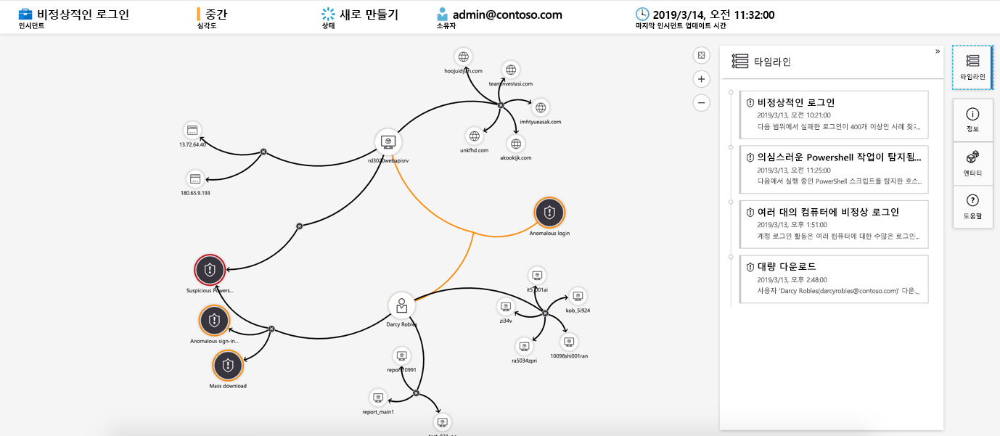

# 자습서: Azure Sentinel을 통해 인시던트 조사

> [!IMPORTANT]
> 조사 그래프는 현재 공개 미리 보기 상태입니다.
> 이 기능은 서비스 수준 계약 없이 제공되며 프로덕션 워크로드에는 권장되지 않습니다.
> 자세한 내용은 [Microsoft Azure Preview에 대한 추가 사용 약관](https://azure.microsoft.com/support/legal/preview-supplemental-terms/)을 참조하세요.

이 자습서에서는 Azure Sentinel을 통해 인시던트를 조사하는 데 도움이 됩니다. 데이터 원본을 Azure Sentinel에 연결한 후 의심스러운 문제가 발생하면 알림을 받게 됩니다. 이를 위해 Azure Sentinel을 사용하면 할당및 조사할 수 있는 인시던트를 생성하는 고급 경고 규칙을 만들 수 있습니다.

이 문서에서는 다음 내용을 설명합니다.
> [!div class="checklist"]
> * 인시던트 조사
> * 조사 그래프 사용
> * 위협에 대응

인시던트에는 여러 경고가 포함될 수 있습니다. 특정 조사에 대한 모든 관련 증거의 집계입니다. 인시던트는 **애널리틱스** 페이지에서 만든 분석 규칙에 따라 생성됩니다. 심각도 및 상태와 같은 경고와 관련된 속성은 인시던트 수준에서 설정됩니다. Azure Sentinel에 찾고 있는 위협의 종류와 이를 찾는 방법을 알려주면 인시던트를 조사하여 탐지된 위협을 모니터링할 수 있습니다.

## 사전 요구 사항
분석 규칙을 설정할 때 엔터티 매핑 필드를 사용한 경우에만 인시던트를 조사할 수 있습니다. 조사 그래프에는 원래 인시던트에 엔터티가 포함되어야 합니다.

## 인시던트를 조사하는 방법

1. **인시던트를**선택합니다. **인시던트** 페이지에서는 발생한 인시던트 수, 열려 있는 인시던트 수, **진행 중으로**설정한 인시던트 수 및 종료된 인시던트 수를 확인할 수 있습니다. 각 인시던트에 대해 발생한 시간과 인시던트 상태를 확인할 수 있습니다. 심각도를 살펴보고 먼저 처리할 인시던트를 결정합니다.

    

1. 상태 또는 심각도등과 같이 필요에 따라 인시던트를 필터링할 수 있습니다.

1. 조사를 시작하려면 특정 인시던트를 선택합니다. 오른쪽에서 심각도, 관련된 엔터티 수 요약, 이 인시던트를 트리거한 원시 이벤트 및 인시던트의 고유 ID를 포함하여 인시던트에 대한 자세한 정보를 볼 수 있습니다.

1. 인시던트의 경고 및 엔터티에 대한 자세한 내용을 보려면 인시던트 페이지에서 **전체 세부 정보 보기를** 선택하고 인시던트 정보를 요약하는 관련 탭을 검토합니다. 경고 탭에서 경고 자체를 **검토합니다.** 경고를 트리거한 쿼리, 쿼리당 반환되는 결과 수 및 경고에서 플레이북을 실행하는 기능 등 경고에 대한 모든 관련 정보를 볼 수 있습니다. 인시던트를 더 자세히 드릴다운하려면 **이벤트**수를 선택합니다. 그러면 결과를 생성한 쿼리와 Log Analytics에서 경고를 트리거한 이벤트가 열립니다. **엔터티** 탭에서 경고 규칙 정의의 일부로 매핑한 모든 엔터티를 볼 수 있습니다.

    

1. 인시던트를 적극적으로 조사하는 경우 인시던트를 닫을 때까지 인시던트의 상태를 **진행 중으로** 설정하는 것이 좋습니다.

1. 인시던트는 특정 사용자에게 할당할 수 있습니다. 인시던트 내외를 설정하여 각 **인시던트에** 대해 소유자를 할당할 수 있습니다. 모든 인시던트는 할당되지 않은 것으로 시작합니다. 또한 다른 분석가가 조사한 내용과 사고와 관련된 사항을 이해할 수 있도록 주석을 추가할 수도 있습니다.

    

1. 조사 맵을 보려면 **조사를** 선택합니다.

## 조사 그래프를 사용하여 심층 분석

조사 그래프를 사용하면 분석가가 각 조사에 대해 올바른 질문을 할 수 있습니다. 조사 그래프를 사용하면 관련 데이터를 관련 엔터티와 상호 연관시켜 잠재적 보안 위협의 범위를 이해하고 근본 원인을 식별할 수 있습니다. 그래프에 표시되는 엔터티를 선택하고 다른 확장 옵션 중에서 선택하여 자세히 알아보고 자세히 살펴볼 수 있습니다.  
  
조사 그래프는 다음을 제공합니다.

- **원시 데이터의 시각적 컨텍스트**: 라이브 시각적 그래프는 원시 데이터에서 자동으로 추출된 엔터티 관계를 표시합니다. 이렇게 하면 서로 다른 데이터 원본의 연결을 쉽게 볼 수 있습니다.

- **전체 조사 범위 검색**: 기본 제공 탐색 쿼리를 사용하여 조사 범위를 확장하여 위반의 전체 범위를 표시합니다.

- **기본 제공 조사 단계:** 미리 정의된 탐색 옵션을 사용하여 위협에 직면하여 올바른 질문을 하고 있는지 확인합니다.

조사 그래프를 사용하려면 다음을 수행하십시오.

1. 인시던트를 선택한 다음 **조사를**선택합니다. 그러면 조사 그래프로 이동합니다. 그래프는 경고에 직접 연결된 엔터티와 추가로 연결된 각 리소스의 예시 맵을 제공합니다.

   > [!IMPORTANT] 
   > 분석 규칙을 설정할 때 엔터티 매핑 필드를 사용한 경우에만 인시던트를 조사할 수 있습니다. 조사 그래프에는 원래 인시던트에 엔터티가 포함되어야 합니다.

   

1. 해당 엔터티에 대한 정보를 검토할 수 있도록 엔터티 창을 열 **엔터티를** 선택합니다.

    
  
1. 각 엔터티위로 마우스를 가져가서 조사를 심화하기 위해 엔터티 유형별 보안 전문가 및 분석가가 설계한 질문 목록을 표시하여 조사를 확장합니다. 이러한 옵션 **탐색 쿼리를 호출합니다.**

    

   예를 들어 컴퓨터에서 관련 경고를 요청할 수 있습니다. 탐색 쿼리를 선택하면 결과 제목이 그래프에 다시 추가됩니다. 이 예제에서 **관련 경고를** 선택하면 다음 경고가 그래프로 반환되었습니다.

    

1. 각 탐색 쿼리에 대해 **이벤트를\>** 선택하여 원시 이벤트 결과 및 로그 분석에 사용되는 쿼리를 여는 옵션을 선택할 수 있습니다.

1. 인시던트를 이해하기 위해 그래프는 병렬 타임라인을 제공합니다.

    

1. 타임라인 위로 마우스를 가져가면 그래프의 어떤 상황이 어떤 시점에서 발생했는지 확인합니다.

    

## 다음 단계
이 자습서에서는 Azure Sentinel을 사용하여 인시던트 조사를 시작하는 방법을 배웠습니다. 자동화 된 [플레이 북을 사용하여 위협에 대응하는 방법에](tutorial-respond-threats-playbook.md)대한 자습서를 계속 .
> [!div class="nextstepaction"]
> [위협에 대응하여](tutorial-respond-threats-playbook.md) 위협에 대한 대응을 자동화합니다.

