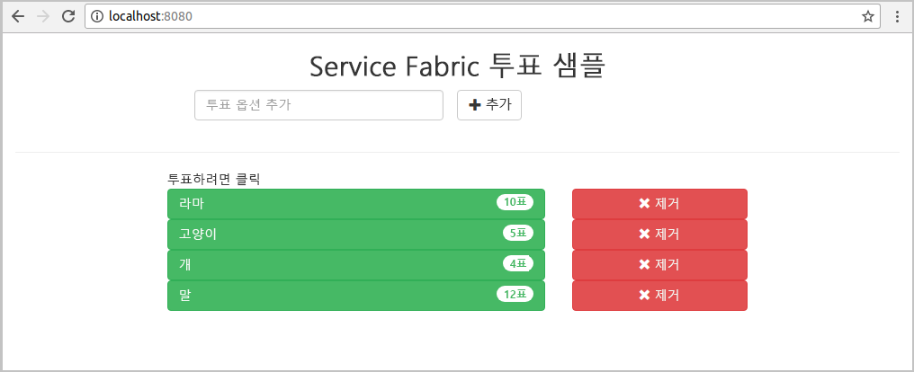
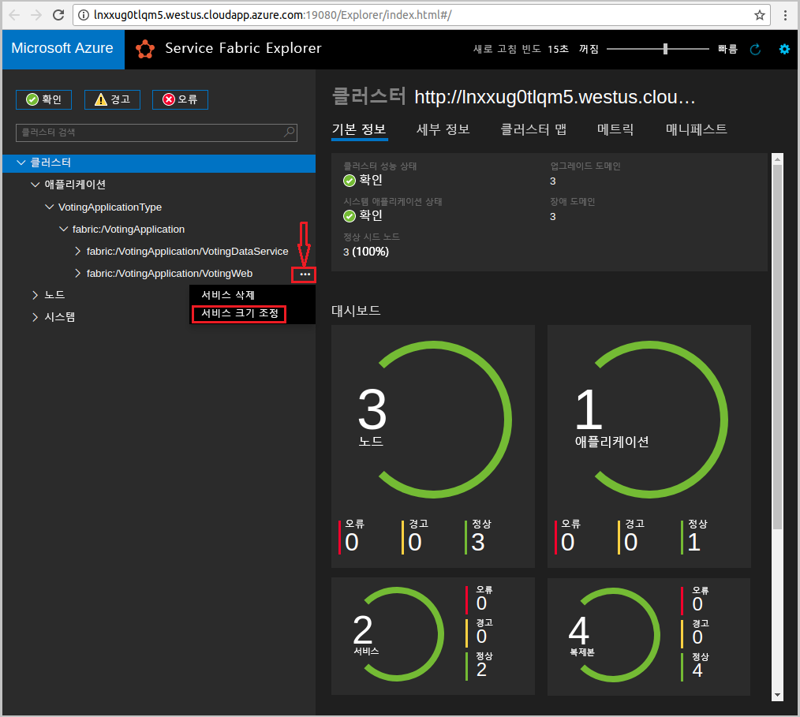

# <a name="quickstart--deploy-a-java-app-to-azure-service-fabric-on-linux"></a>빠른 시작:  Linux에서 Azure Service Fabric에 Java 앱 배포

이 빠른 시작에서는 Linux 개발자 머신에서 Eclipse IDE를 사용하여 Azure Service Fabric에 Java 애플리케이션을 배포합니다. 완료하면 투표 결과를 클러스터의 상태 저장 백 엔드 서비스에 저장하는 Java 웹 프런트 엔드가 있는 투표 애플리케이션이 생깁니다.

Azure Service Fabric은 마이크로 서비스 및 컨테이너를 배포 및 관리하기 위한 분산 시스템 플랫폼입니다.

## <a name="prerequisites"></a>사전 요구 사항

- [Java 환경](./service-fabric-get-started-linux.md#set-up-java-development) 및 [Yeoman](./service-fabric-get-started-linux.md#set-up-yeoman-generators-for-containers-and-guest-executables)
- [Eclipse Neon(4.6)+](https://www.eclipse.org/downloads/packages/) 및 [Service Fabric용 Eclipse 플러그 인](./service-fabric-get-started-linux.md#install-the-eclipse-plug-in-optional)
- [Service Fabric SDK 및 CLI(명령줄 인터페이스)](./service-fabric-get-started-linux.md#installation-methods)
- [Git](https://git-scm.com/downloads)

## <a name="download-the-sample"></a>샘플 다운로드

명령 창에서 다음 명령을 실행하여 로컬 컴퓨터에 샘플 앱 리포지토리를 복제합니다.

```bash
git clone https://github.com/Azure-Samples/service-fabric-java-quickstart.git
```

## <a name="run-the-application-locally"></a>로컬에서 애플리케이션 실행

1. 다음 명령을 실행하여 클러스터를 만듭니다.

    ```bash
    sudo /opt/microsoft/sdk/servicefabric/common/clustersetup/devclustersetup.sh
    ```
    로컬 클러스터를 시작하는 데 몇 시간이 걸립니다. 클러스터가 완전히 작동 중인지 확인하려면 `http://localhost:19080`에서 Service Fabric Explorer에 액세스합니다. 5개의 정상 노드는 로컬 클러스터가 작동되어 실행 중임을 나타냅니다.

    

2. Eclipse를 엽니다.
3. **파일** > **가져오기** > **Gradle** > **기존 Gradle 프로젝트**를 선택하고 마법사를 따릅니다.
4. **디렉터리**를 선택하고 GitHub에서 복제한 **service-fabric-java-quickstart** 폴더에서 **Voting** 디렉터리를 선택합니다. **마침**을 선택합니다.

    

5. 이제 Eclipse용 Package Explorer에 `Voting` 프로젝트가 있습니다.
6. 프로젝트를 마우스 오른쪽 단추로 클릭하고 **Service Fabric** 드롭다운 아래에서 **Publish Application**을 선택합니다. **PublishProfiles/Local.json**을 Target Profile로 선택하고 **Publish**를 선택합니다.

    

7. 즐겨찾는 웹 브라우저를 열고 `http://localhost:8080`에 액세스하여 애플리케이션에 액세스합니다.

    

이제 투표 옵션 집합을 추가하고 투표 하기를 시작할 수 있습니다. 애플리케이션이 실행되고 모든 데이터가 Service Fabric 클러스터에 저장되며 별도의 데이터베이스가 필요하지 않습니다.



## <a name="scale-applications-and-services-in-a-cluster"></a>클러스터에서 애플리케이션 및 서비스 크기 조정

서비스는 해당 서비스에 대한 로드 변동량을 수용하도록 클러스터 간에 쉽게 크기를 조정할 수 있습니다. 클러스터에서 실행되는 인스턴스 수를 변경하여 서비스 크기를 조정합니다. 서비스를 확장하는 방법에는 여러 가지가 있습니다. 예를 들어 Service Fabric CLI(`sfctl`)에서 스크립트나 명령을 사용할 수 있습니다. 다음 단계에서는 Service Fabric Explorer를 사용합니다.

Service Fabric Explorer는 모든 Service Fabric 클러스터에서 실행되고 클러스터의 HTTP 관리 포트(19080)로 이동하여 브라우저에서 액세스할 수 있습니다. `http://localhost:19080`)을 입력합니다.

웹 프런트 엔드 서비스의 크기를 조정하려면 다음을 수행합니다.

1. 클러스터에서 Service Fabric Explorer를 엽니다. `https://localhost:19080`)을 입력합니다.
2. 트리 뷰에서 **fabric:/Voting/VotingWeb** 노드 옆에 있는 줄임표( **...** )를 선택하고 **서비스 크기 조정**을 선택합니다.

    

    이제 웹 프런트 엔드 서비스의 인스턴스 수를 조정하도록 선택할 수 있습니다.

3. 숫자를 **2**로 변경하고 **서비스 크기 조정**을 선택합니다.
4. 트리 뷰에서 **fabric:/Voting/VotingWeb** 노드를 선택하고 파티션 노드(GUID로 표현됨)를 확장합니다.

    

    이제 두 개의 인스턴스가 있는 서비스를 인스턴스가 실행되는 노드를 볼 수 있는 트리 뷰에서 볼 수 있습니다.

이 간단한 관리 작업을 통해 프런트 엔드 서비스에서 사용 가능한 리소스를 두 배로 늘려서 사용자 부하를 처리했습니다. 서비스를 안정적으로 실행하기 위해 여러 인스턴스가 필요하지 않다는 것을 이해하는 것이 중요합니다. 서비스가 실패하면 Service Fabric은 클러스터에서 새 서비스 인스턴스가 실행되는지 확인합니다.

## <a name="next-steps"></a>다음 단계

이 빠른 시작에서는 다음을 수행하는 방법을 알아보았습니다.

* Eclipse를 Service Fabric Java 애플리케이션을 위한 도구로 사용
* 로컬 클러스터에 Java 애플리케이션 배포
* 애플리케이션을 여러 노드에 걸쳐 스케일 아웃

Service Fabric에서 Java 앱 작업에 대해 자세히 알아보려면 Java 앱에 대한 자습서를 계속 진행하십시오.

> [!div class="nextstepaction"]
> [Java 앱 배포](./service-fabric-tutorial-create-java-app.md)
