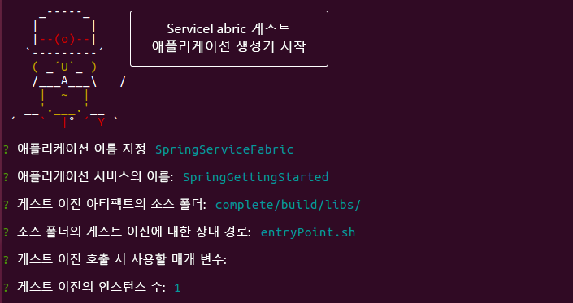
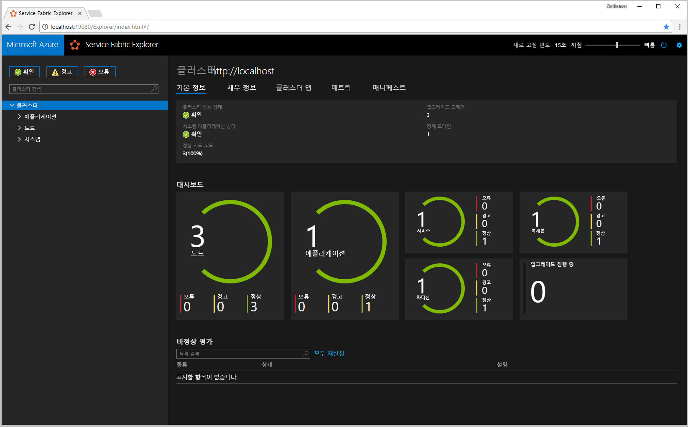
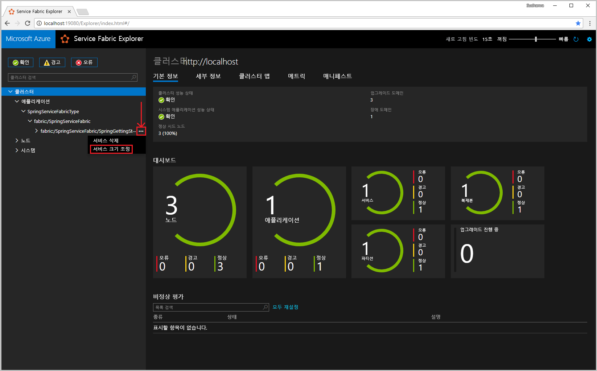
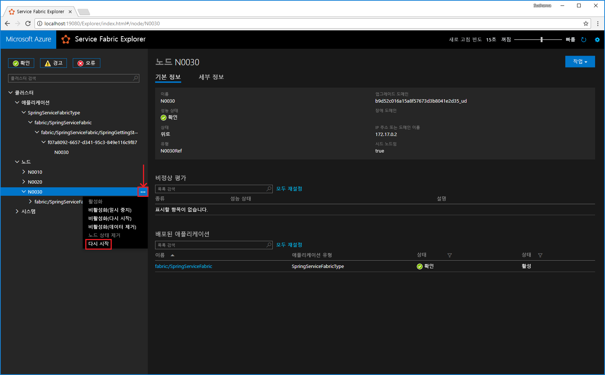
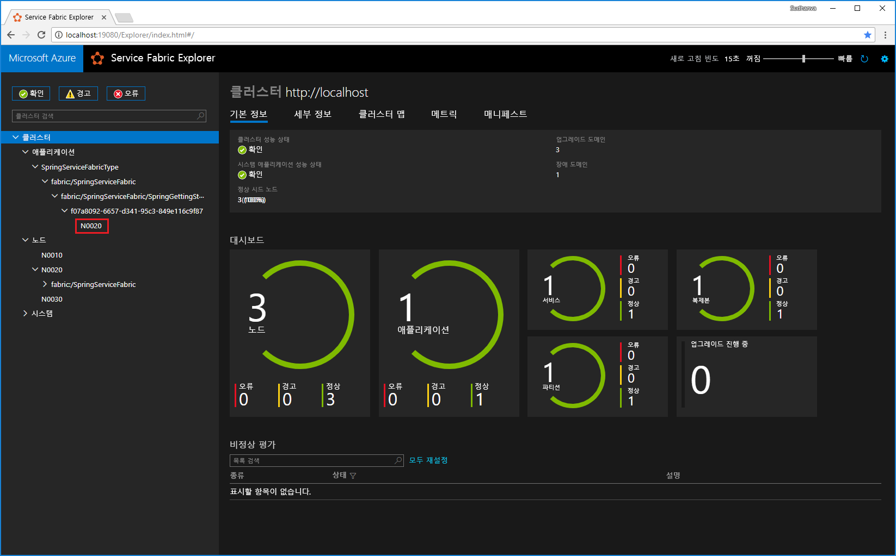

# <a name="quickstart-deploy-a-java-spring-boot-app-on-azure-service-fabric"></a>빠른 시작: Azure Service Fabric에 Java Spring Boot 앱 배포

이 빠른 시작에서는 Linux 또는 MacOS에서 익숙한 명령줄 도구를 사용하여 Java Spring Boot 애플리케이션을 Azure Service Fabric에 배포합니다. Azure Service Fabric은 마이크로 서비스 및 컨테이너를 배포 및 관리하기 위한 분산 시스템 플랫폼입니다. 

## <a name="prerequisites"></a>사전 요구 사항

#### <a name="linux"></a>[Linux](#tab/linux)

- [Java 환경](./service-fabric-get-started-linux.md#set-up-java-development) 및 [Yeoman](./service-fabric-get-started-linux.md#set-up-yeoman-generators-for-containers-and-guest-executables)
- [Service Fabric SDK 및 Service Fabric CLI(명령줄 인터페이스)](./service-fabric-get-started-linux.md#installation-methods)
- [Git](https://git-scm.com/downloads)

#### <a name="macos"></a>[MacOS](#tab/macos)

- [Java 환경 및 Yeoman](./service-fabric-get-started-mac.md#create-your-application-on-your-mac-by-using-yeoman)
- [Service Fabric SDK 및 Service Fabric CLI(명령줄 인터페이스)](./service-fabric-cli.md#cli-mac)
- [Git](https://git-scm.com/downloads)

--- 

## <a name="download-the-sample"></a>샘플 다운로드

터미널 창에서 다음 명령을 실행하여 로컬 머신에 Spring Boot [시작](https://github.com/spring-guides/gs-spring-boot) 샘플 앱을 복제합니다.

```bash
git clone https://github.com/spring-guides/gs-spring-boot.git
```

## <a name="build-the-spring-boot-application"></a>Spring Boot 애플리케이션 빌드 
*gs-spring-boot/complete* 디렉터리 내에서 아래 명령을 실행하여 애플리케이션을 빌드합니다. 

```bash
./gradlew build
``` 

## <a name="package-the-spring-boot-application"></a>Spring Boot 애플리케이션 패키지 
1. 클론의 *gs-spring-boot* 디렉터리 내에서 `yo azuresfguest` 명령을 실행합니다. 

1. 각 프롬프트에 다음 세부 정보를 입력합니다.

    

1. *SpringServiceFabric/SpringServiceFabric/SpringGettingStartedPkg/code* 폴더에서 *entryPoint.sh*라는 파일을 만듭니다. *entryPoint.sh* 파일에 다음 코드를 추가합니다. 

    ```bash
    #!/bin/bash
    BASEDIR=$(dirname $0)
    cd $BASEDIR
    java -jar *spring-boot*.jar
    ```

1. *gs-spring-boot/SpringServiceFabric/SpringServiceFabric/SpringGettingStartedPkg/ServiceManifest.xml* 파일에 **엔드포인트** 리소스 추가

    ```xml 
        <Resources>
          <Endpoints>
            <Endpoint Name="WebEndpoint" Protocol="http" Port="8080" />
          </Endpoints>
       </Resources>
    ```

    이제 *ServiceManifest.xml*은 다음과 같습니다. 

    ```xml
    <?xml version="1.0" encoding="utf-8"?>
    <ServiceManifest Name="SpringGettingStartedPkg" Version="1.0.0"
                     xmlns="http://schemas.microsoft.com/2011/01/fabric" xmlns:xsd="https://www.w3.org/2001/XMLSchema" xmlns:xsi="https://www.w3.org/2001/XMLSchema-instance" >

       <ServiceTypes>
          <StatelessServiceType ServiceTypeName="SpringGettingStartedType" UseImplicitHost="true">
       </StatelessServiceType>
       </ServiceTypes>

       <CodePackage Name="code" Version="1.0.0">
          <EntryPoint>
             <ExeHost>
                <Program>entryPoint.sh</Program>
                <Arguments></Arguments>
                <WorkingFolder>CodePackage</WorkingFolder>
             </ExeHost>
          </EntryPoint>
       </CodePackage>
        <Resources>
          <Endpoints>
            <Endpoint Name="WebEndpoint" Protocol="http" Port="8080" />
          </Endpoints>
       </Resources>
     </ServiceManifest>
    ```

이 단계에서는 Service Fabric에 배포할 수 있는 Spring Boot 시작 샘플에 Service Fabric 애플리케이션을 만들었습니다.

## <a name="run-the-application-locally"></a>로컬에서 애플리케이션 실행

1. 다음 명령을 실행하여 Ubuntu 컴퓨터에서 로컬 클러스터를 시작합니다.

    ```bash
    sudo /opt/microsoft/sdk/servicefabric/common/clustersetup/devclustersetup.sh
    ```

    Mac을 사용하는 경우 Docker 이미지에서 로컬 클러스터를 시작합니다. 여기서는 [필수 조건](./service-fabric-get-started-mac.md#create-a-local-container-and-set-up-service-fabric)에 따라 Mac용 로컬 클러스터를 설정했다고 가정합니다. 

    ```bash
    docker run --name sftestcluster -d -p 19080:19080 -p 19000:19000 -p 25100-25200:25100-25200 -p 8080:8080 mysfcluster
    ```

    로컬 클러스터를 시작하는 데 몇 시간이 걸립니다. 클러스터가 완전히 작동 중인지 확인하려면 `http://localhost:19080`에서 Service Fabric Explorer에 액세스합니다. 5개의 정상 노드는 로컬 클러스터가 작동되어 실행 중임을 나타냅니다. 
    
    

1. *gs-spring-boot/SpringServiceFabric* 폴더를 엽니다.
1. 다음 명령을 실행하여 로컬 클러스터에 연결합니다.

    ```bash
    sfctl cluster select --endpoint http://localhost:19080
    ```
1. *install.sh* 스크립트를 실행합니다.

    ```bash
    ./install.sh
    ```

1. 즐겨찾는 웹 브라우저를 열고 `http://localhost:8080`에 액세스하여 애플리케이션에 액세스합니다.

    

이제 Service Fabric 클러스터에 배포된 Spring Boot 애플리케이션에 액세스할 수 있습니다.

자세한 내용은 Spring 웹 사이트의 Spring Boot [시작](https://spring.io/guides/gs/spring-boot/) 샘플을 참조하세요.

## <a name="scale-applications-and-services-in-a-cluster"></a>클러스터에서 애플리케이션 및 서비스 크기 조정

서비스는 해당 서비스에 대한 로드 변동량을 수용하도록 클러스터 간에 크기를 조정할 수 있습니다. 클러스터에서 실행되는 인스턴스 수를 변경하여 서비스 크기를 조정합니다. 서비스의 크기를 조정하는 여러 가지 방법이 있으며 예를 들어, Service Fabric CLI(sfctl)의 스크립트 또는 명령을 사용할 수 있습니다. 다음 단계에서는 Service Fabric Explorer를 사용합니다.

Service Fabric Explorer는 모든 Service Fabric 클러스터에서 실행되고 클러스터 HTTP 관리 포트(19080)로 이동하여 브라우저에서 액세스할 수 있습니다(예: `http://localhost:19080`).

웹 프런트 엔드 서비스의 크기를 조정하려면 다음을 수행합니다.

1. 클러스터에서 Service Fabric Explorer를 엽니다. 예: `http://localhost:19080`
1. 트리 뷰에서 **fabric:/SpringServiceFabric/SpringGettingStarted** 노드 옆에 있는 줄임표( **...** )를 선택하고 **서비스 크기 조정**을 선택합니다.

    

    이제 서비스의 인스턴스 수를 조정하도록 선택할 수 있습니다.

1. 숫자를 **3**으로 변경하고 **서비스 크기 조정**을 선택합니다.

    명령줄을 사용하여 서비스의 크기를 조정하는 다른 방법은 다음과 같습니다.

    ```bash
    # Connect to your local cluster
    sfctl cluster select --endpoint https://<ConnectionIPOrURL>:19080 --pem <path_to_certificate> --no-verify

    # Run Bash command to scale instance count for your service
    sfctl service update --service-id 'SpringServiceFabric~SpringGettingStarted' --instance-count 3 --stateless 
    ``` 

1. 트리 뷰에서 **fabric:/SpringServiceFabric/SpringGettingStarted** 노드를 선택하고 파티션 노드(GUID로 표현됨)를 확장합니다.

    

    서비스에는 3개의 인스턴스가 있고, 트리 뷰에는 인스턴스가 실행되는 노드가 표시됩니다.

이 간단한 관리 작업을 통해 프런트 엔드 서비스에서 사용 가능한 리소스를 두 배로 늘려서 사용자 부하를 처리했습니다. 서비스를 안정적으로 실행하기 위해 여러 인스턴스가 필요하지 않다는 것을 이해하는 것이 중요합니다. 서비스가 실패하면 Service Fabric은 클러스터에서 새 서비스 인스턴스가 실행되는지 확인합니다.

## <a name="fail-over-services-in-a-cluster"></a>클러스터의 서비스 장애 조치

서비스 장애 조치를 보여 주기 위해 Service Fabric Explorer를 사용하여 노드 다시 시작을 시뮬레이션합니다. 서비스의 인스턴스 하나만 실행되고 있는지 확인합니다.

1. 클러스터에서 Service Fabric Explorer를 엽니다. 예: `http://localhost:19080`
1. 서비스의 인스턴스를 실행하는 노드 옆에 있는 줄임표( **...** )를 선택하고 노드를 다시 시작합니다.

    
1. 서비스의 인스턴스가 다른 노드로 이동되고, 애플리케이션에서 가동 중지 시간이 발생하지 않습니다.

    

## <a name="next-steps"></a>다음 단계

이 빠른 시작에서는 다음을 수행하는 방법을 알아보았습니다.

* Service Fabric에 Spring Boot 애플리케이션 배포
* 로컬 클러스터에 애플리케이션 배포
* 애플리케이션을 여러 노드에 걸쳐 스케일 아웃
* 가용성에 아무런 영향을 주지 않고 서비스에 대한 장애 조치 수행

Service Fabric에서 Java 앱 작업에 대해 자세히 알아보려면 Java 앱에 대한 자습서를 계속 진행하십시오.

> [!div class="nextstepaction"]
> [Java 앱 배포](./service-fabric-tutorial-create-java-app.md)
