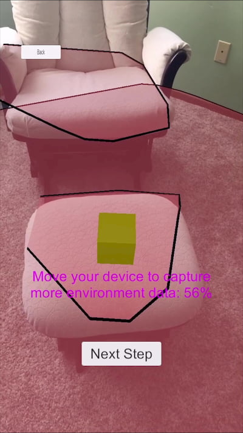

# 빠른 시작: Azure Spatial Anchors를 사용하여 Unity iOS 앱 만들기

이 빠른 시작에서는 [Azure Spatial Anchors](../overview.md)를 사용하여 Unity iOS 앱을 만드는 방법을 설명합니다. Azure Spatial Anchors는 시간이 지남에 따라 디바이스에서 위치를 유지하는 개체를 사용하여 혼합 현실 환경을 만들 수 있는 플랫폼 간 개발자 서비스입니다. 완료되면, Unity 지원 ARKit iOS 앱이 있어 공간 앵커를 저장하고 회수할 수 있습니다.

이 문서에서 배울 내용은 다음과 같습니다.

> [!div class="checklist"]
> * Spatial Anchors 계정 만들기
> * Unity 빌드 설정 준비
> * Spatial Anchors 계정 식별자 및 계정 키 구성
> * Xcode 프로젝트 내보내기
> * iOS 디바이스 배포 및 실행

[!INCLUDE [quickstarts-free-trial-note](../../../includes/quickstarts-free-trial-note.md)]

## 사전 요구 사항

이 빠른 시작을 완료하려면 다음 항목이 있어야 합니다.

- 최신 버전의 <a href="https://geo.itunes.apple.com/us/app/xcode/id497799835?mt=12" target="_blank">Xcode</a>가 설치된 macOS 머신(<a href="https://unity3d.com/get-unity/download" target="_blank">Unity 2019.4(LTS)</a> 포함).
- HomeBrew를 통해 설치된 Git. 터미널의 한 줄에 `/usr/bin/ruby -e "$(curl -fsSL https://raw.githubusercontent.com/Homebrew/install/master/install)"` 명령을 입력합니다. 그런 다음, `brew install git` 및 `brew install git-lfs`를 실행합니다.
- 개발자가 사용 가능한 <a href="https://developer.apple.com/documentation/arkit/verifying_device_support_and_user_permission" target="_blank">ARKit 호환</a> iOS 디바이스

[!INCLUDE [Create Spatial Anchors resource](../../../includes/spatial-anchors-get-started-create-resource.md)]

## Unity 샘플 프로젝트 다운로드 및 열기

[!INCLUDE [Clone Sample Repo](../../../includes/spatial-anchors-clone-sample-repository.md)]

[!INCLUDE [Open Unity Project](../../../includes/spatial-anchors-open-unity-project.md)]

[!INCLUDE [iOS Unity Build Settings](../../../includes/spatial-anchors-unity-ios-build-settings.md)]

[!INCLUDE [Configure Unity Scene](../../../includes/spatial-anchors-unity-configure-scene.md)]

## Xcode 프로젝트 내보내기

[!INCLUDE [Export Unity Project](../../../includes/spatial-anchors-unity-export-project-snip.md)]

[!INCLUDE [Configure Xcode](../../../includes/spatial-anchors-unity-ios-xcode.md)]

앱에서 화살표를 사용하여 **BasicDemo** 를 선택한 다음, **Go!** 를 누릅니다. 데모를 실행하는 단추입니다. 지침에 따라 앵커를 배치하고 회수합니다.

완료되면 Xcode에서 **중지** 를 눌러 앱을 중지합니다.

## 문제 해결

### 렌더링 문제

앱 실행 시 백그라운드로 카메라가 보이지 않으면(대신 공백, 파랑 또는 기타 질감 등이 보이면) Unity에서 자산을 다시 가져와야 할 가능성이 높습니다. 앱을 중지합니다. Unity의 맨 위 메뉴에서 **자산 -> 모두 다시 가져오기** 를 선택합니다. 그런 다음, 앱을 다시 실행합니다.

[!INCLUDE [Clean-up section](../../../includes/clean-up-section-portal.md)]

[!INCLUDE [Next steps](../../../includes/spatial-anchors-quickstarts-nextsteps.md)]

> [!div class="nextstepaction"]
> [자습서: 여러 디바이스에서 Spatial Anchors 공유](../tutorials/tutorial-share-anchors-across-devices.md)

> [!div class="nextstepaction"]
> [방법: Unity 프로젝트에서 Azure Spatial Anchors 구성](../how-tos/setup-unity-project.md)
