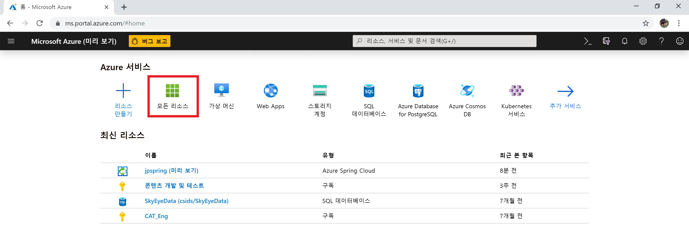
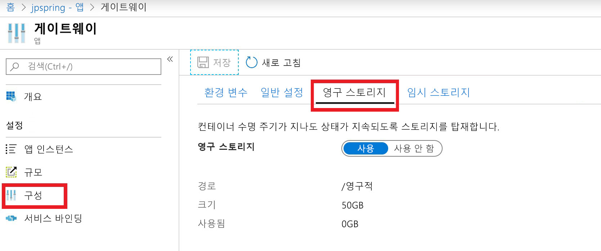

# <a name="use-persistent-storage-in-azure-spring-cloud"></a>Azure Spring Cloud에서 영구 스토리지 사용

Azure Spring Cloud는 응용 프로그램에 대한 두 가지 유형의 저장소(영구 및 임시)를 제공합니다.

기본적으로 Azure Spring Cloud는 각 응용 프로그램 인스턴스에 대한 임시 저장소를 제공합니다. 임시 저장소는 기본 마운트 경로 /tmp를 사용하여 인스턴스당 5GB로 제한됩니다.

> [!WARNING]
> 응용 프로그램 인스턴스를 다시 시작하면 연결된 임시 저장소가 영구적으로 삭제됩니다.

영구 저장소는 Azure에서 관리하고 응용 프로그램별로 할당된 파일 공유 컨테이너입니다. 영구 저장소에 저장된 데이터는 응용 프로그램의 모든 인스턴스에서 공유됩니다. Azure Spring Cloud 인스턴스에는 영구 저장소가 활성화된 최대 10개의 응용 프로그램을 사용할 수 있습니다. 각 응용 프로그램에는 50GB의 영구 저장소가 할당됩니다. 영구 저장소에 대한 기본 마운트 경로는 /persistent입니다.

> [!WARNING]
> 응용 프로그램의 영구 저장소를 사용하지 않도록 설정하면 해당 모든 저장소가 할당 해제되고 저장된 모든 데이터가 손실됩니다.

## <a name="use-the-azure-portal-to-enable-persistent-storage"></a>Azure 포털을 사용하여 영구 저장소 사용

1. Azure 포털의 **홈** 페이지에서 **모든 리소스를**선택합니다.

    >

1. 영구 저장소가 필요한 Azure Spring 클라우드 리소스를 선택합니다. 이 예제에서는 선택한 응용 프로그램을 **upspring이라고**합니다.

    > 

1. **설정** 제목 아래에서 **앱을**선택합니다.

1. Azure 스프링 클라우드 서비스가 테이블에 나타납니다.  영구 저장소를 추가할 서비스를 선택합니다. 이 예제에서는 **게이트웨이** 서비스가 선택됩니다.

    > 

1. 서비스의 구성 페이지에서 **구성을** 선택합니다.

1. 영구 **저장소** 탭을 선택하고 **에서 를**선택합니다.

    > 

영구 저장소를 사용하도록 설정하면 구성 페이지에 해당 크기와 경로가 표시됩니다.

## <a name="use-the-azure-cli-to-modify-persistent-storage"></a>Azure CLI를 사용하여 영구 저장소 수정

필요한 경우 Azure CLI에 대한 스프링 클라우드 확장을 설치합니다.

```azurecli
az extension add --name spring-cloud
```
기타 작업:

* 영구 저장소를 사용하도록 설정한 앱을 만들려면 다음을 수행합니다.

    ```azurecli
    az spring-cloud app create -n <app> -g <resource-group> -s <service-name> --enable-persistent-storage true
    ```

* 기존 앱에 대한 영구 저장소를 사용하려면 다음을 수행합니다.

    ```azurecli
    az spring-cloud app update -n <app> -g <resource-group> -s <service-name> --enable-persistent-storage true
    ```

* 기존 앱에서 영구 저장소를 사용하지 않도록 설정하려면 다음을 수행합니다.

    ```azurecli
    az spring-cloud app update -n <app> -g <resource-group> -s <service-name> --enable-persistent-storage false
    ```

    > [!WARNING]
    > 응용 프로그램의 영구 저장소를 사용하지 않도록 설정하면 해당 모든 저장소가 할당 해제되고 저장된 모든 데이터가 영구적으로 손실됩니다.

## <a name="next-steps"></a>다음 단계

* 응용 [프로그램 및 서비스 할당량에](spring-cloud-quotas.md)대해 자세히 알아봅니다.
* [응용 프로그램을 수동으로 확장하는](spring-cloud-tutorial-scale-manual.md)방법에 대해 알아봅니다.
