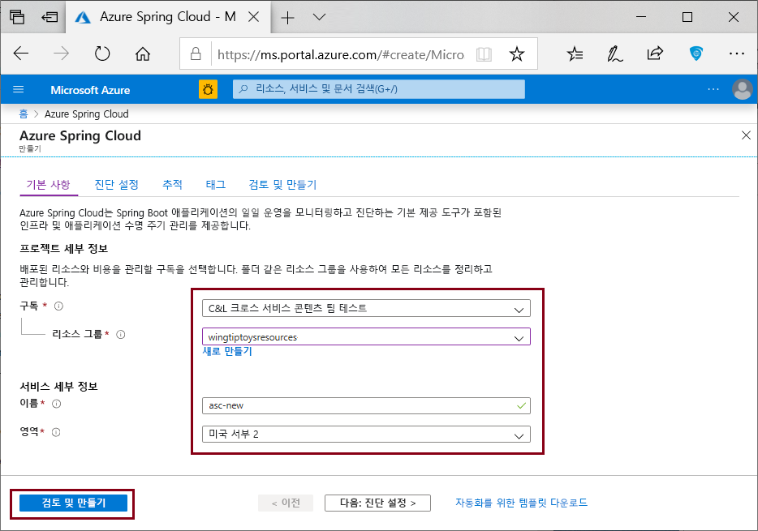

# <a name="quickstart-deploy-your-first-azure-spring-cloud-application"></a>빠른 시작: 첫 번째 Azure Spring Cloud 애플리케이션 배포

이 빠른 시작에서는 Azure에서 실행되는 간단한 Azure Spring Cloud 마이크로서비스 애플리케이션을 배포하는 방법을 설명합니다. 

이 자습서에서 사용되는 애플리케이션 코드는 Spring Initializr로 빌드된 간단한 앱입니다. 이 예제를 완료하면 애플리케이션에 온라인으로 액세스할 수 있고 Azure Portal을 통해 관리할 수 있습니다.

이 빠른 시작에서는 다음을 수행하는 방법을 설명합니다.

> [!div class="checklist"]
> * 기본 Spring Cloud 프로젝트 생성
> * 서비스 인스턴스 프로비저닝
> * 퍼블릭 엔드포인트를 사용하여 앱 빌드 및 배포
> * 실시간으로 로그 스트리밍

## <a name="prerequisites"></a>사전 요구 사항

이 빠른 시작을 완료하려면 다음이 필요합니다.

* [JDK 8 설치](https://docs.microsoft.com/java/azure/jdk/?view=azure-java-stable)
* [Azure 구독에 가입](https://azure.microsoft.com/free/)
* (선택 사항) [Azure CLI 버전 2.0.67 이상을 설치](https://docs.microsoft.com/cli/azure/install-azure-cli?view=azure-cli-latest)하고 다음 명령을 사용하여 Azure Spring Cloud 확장을 설치합니다. `az extension add --name spring-cloud`
* (선택 사항) [Azure Toolkit for IntelliJ를 설치](https://plugins.jetbrains.com/plugin/8053-azure-toolkit-for-intellij/)하고 [로그인](https://docs.microsoft.com/azure/developer/java/toolkit-for-intellij/create-hello-world-web-app#installation-and-sign-in)합니다.

## <a name="generate-a-spring-cloud-project"></a>Spring Cloud 프로젝트 생성

[Spring Initializr](https://start.spring.io/#!type=maven-project&language=java&platformVersion=2.3.3.RELEASE&packaging=jar&jvmVersion=1.8&groupId=com.example&artifactId=hellospring&name=hellospring&description=Demo%20project%20for%20Spring%20Boot&packageName=com.example.hellospring&dependencies=web,cloud-eureka,actuator,cloud-starter-sleuth,cloud-starter-zipkin)를 시작하여 Azure Spring Cloud의 권장 종속성이 있는 샘플 프로젝트를 생성합니다. 다음 그림은 이 샘플 프로젝트에 대해 설정된 Initializr를 보여 줍니다.
```url
https://start.spring.io/#!type=maven-project&language=java&platformVersion=2.3.3.RELEASE&packaging=jar&jvmVersion=1.8&groupId=com.example&artifactId=hellospring&name=hellospring&description=Demo%20project%20for%20Spring%20Boot&packageName=com.example.hellospring&dependencies=web,cloud-eureka,actuator,cloud-starter-sleuth,cloud-starter-zipkin
```

  

1. 모든 종속성이 설정된 경우 **생성**을 클릭합니다. 패키지를 다운로드하고 압축을 푼 다음, 다음과 같이 `src/main/java/com/example/hellospring/HelloController.java`를 추가하여 간단한 웹 애플리케이션에 대한 웹 컨트롤러를 만듭니다.

    ```java
    package com.example.hellospring;
    
    import org.springframework.web.bind.annotation.RestController;
    import org.springframework.web.bind.annotation.RequestMapping;
    
    @RestController
    public class HelloController {
    
        @RequestMapping("/")
        public String index() {
            return "Greetings from Azure Spring Cloud!";
        }
    
    }
    ```
## <a name="provision-an-instance-of-azure-spring-cloud"></a>Azure Spring Cloud의 인스턴스 프로비저닝

다음 절차에서는 Azure Portal을 사용하여 Azure Spring Cloud의 인스턴스를 만듭니다.

1. 새 탭에서 [Azure Portal](https://ms.portal.azure.com/)을 엽니다. 

2. 상단 검색 상자에서 *Azure Spring Cloud*를 검색합니다.

3. 결과에서 *Azure Spring Cloud*를 선택합니다.

    

4. Azure Spring Cloud 페이지에서 **+ 추가**를 클릭합니다.

    

5. Azure Spring Cloud **만들기** 페이지에 있는 양식을 채웁니다.  다음 지침을 고려하세요.
    - **구독**: 이 리소스 대한 요금이 청구될 구독을 선택합니다.
    - **리소스 그룹**: 새 리소스에 대한 리소스 그룹을 새로 만드는 것이 가장 좋습니다. 이는 **\<resource group name\>** 으로 이후 단계에서 사용됩니다.
    - **서비스 세부 정보/이름**: **\<service instance name\>** 을 지정합니다.  이름은 4-32자 사이여야 하며, 소문자, 숫자 및 하이픈(-) 문자만 포함할 수 있습니다.  서비스 이름의 첫 글자는 문자여야 하며 마지막 문자는 문자 또는 숫자여야 합니다.
    - **위치**: 서비스 인스턴스에 대한 지역을 선택합니다.

    

6. **검토 + 만들기**를 클릭합니다.

## <a name="build-and-deploy-the-app"></a>앱 빌드 및 배포
    
#### <a name="cli"></a>[CLI](#tab/Azure-CLI)
다음 절차에서는 Azure CLI를 사용하여 애플리케이션을 작성하고 배포합니다. 프로젝트의 루트에서 다음 명령을 실행합니다.

1. Maven을 사용하여 프로젝트를 빌드합니다.

    ```console
    mvn clean package -DskipTests
    ```

1. (아직 설치하지 않은 경우) Azure CLI용 Azure Spring Cloud 확장을 설치합니다.

    ```azurecli
    az extension add --name spring-cloud
    ```
    
1. 퍼블릭 엔드포인트가 할당된 앱을 만듭니다.

    ```azurecli
    az spring-cloud app create -n hellospring -s <service instance name> -g <resource group name> --is-public
    ```

1. 앱에 대한 Jar 파일을 배포합니다.

    ```azurecli
    az spring-cloud app deploy -n hellospring -s <service instance name> -g <resource group name> --jar-path target\hellospring-0.0.1-SNAPSHOT.jar
    ```
    
1. 애플리케이션 배포를 완료하는 데 몇 분이 걸립니다. 배포되었는지 확인하려면 Azure Portal의 **앱** 블레이드로 이동합니다. 애플리케이션의 상태가 표시되어야 합니다.

#### <a name="intellij"></a>[IntelliJ](#tab/IntelliJ)

다음 절차에서는 Azure Spring Cloud의 IntelliJ 플러그 인을 사용하여 IntelliJ IDEA에 샘플 앱을 배포합니다.  

### <a name="import-project"></a>프로젝트 가져오기

1. IntelliJ **시작** 대화 상자를 열고, **프로젝트 가져오기**를 선택하여 가져오기 마법사를 엽니다.
1. `hellospring` 폴더를 선택합니다.

    

### <a name="deploy-the-app"></a>앱 배포
Azure에 배포하려면 Azure 계정으로 로그인하고 구독을 선택해야 합니다.  로그인 세부 정보는 [설치 및 로그인](https://docs.microsoft.com/azure/developer/java/toolkit-for-intellij/create-hello-world-web-app#installation-and-sign-in)을 참조하세요.

1. IntelliJ 프로젝트 탐색기에서 프로젝트를 마우스 오른쪽 단추로 클릭하고 **Azure** -> **Azure Spring Cloud에 배포**를 선택합니다.

    [  ](media/spring-cloud-quickstart-java/intellij-deploy-azure-1.png#lightbox)

1. **이름** 필드에서 앱 이름을 적용합니다. **이름**은 앱 이름이 아니라 구성을 나타냅니다. 사용자는 일반적으로 변경할 필요가 없습니다.
1. **Artifact** 텍스트 상자에서 *hellospring-0.0.1-SNAPSHOT.jar*을 선택합니다.
1. **구독** 텍스트 상자에서 구독을 확인합니다.
1. **Spring Cloud** 텍스트 상자에서 [Azure Spring Cloud 인스턴스 프로비저닝](https://docs.microsoft.com/azure/spring-cloud/spring-cloud-quickstart-provision-service-instance)에서 만든 Azure Spring Cloud의 인스턴스를 선택합니다.
1. **퍼블릭 엔드포인트**를 *사용*으로 설정합니다.
1. **App:** 텍스트 상자에서 **앱 만들기...** 를 선택합니다.
1. *hellospring*을 입력한 다음, **확인**을 클릭합니다.

    [  ](media/spring-cloud-quickstart-java/intellij-deploy-to-azure.png#lightbox)

1. **Azure Spring Cloud 앱 배포** 대화 상자 아래쪽에 있는 **실행** 단추를 클릭하여 배포를 시작합니다. 플러그 인은 `hellospring` 앱에서 `mvn package` 명령을 실행하고 `package` 명령으로 생성된 jar을 배포합니다.
---

배포가 완료되면 `https://<service instance name>-hellospring.azuremicroservices.io/`에서 앱에 액세스할 수 있습니다.

  [  ](media/spring-cloud-quickstart-java/access-app-browser.png#lightbox)

## <a name="streaming-logs-in-real-time"></a>실시간으로 로그 스트리밍

#### <a name="cli"></a>[CLI](#tab/Azure-CLI)

다음 명령을 사용하여 앱에서 실시간 로그를 가져옵니다.

```azurecli
az spring-cloud app logs -n hellospring -s <service instance name> -g <resource group name> --lines 100 -f

```
로그는 결과에 표시됩니다.

[  ](media/spring-cloud-quickstart-java/streaming-logs.png#lightbox)

>[!TIP]
> `az spring-cloud app logs -h`를 사용하여 더 많은 매개 변수 및 로그 스트림 기능을 탐색합니다.

#### <a name="intellij"></a>[IntelliJ](#tab/IntelliJ)

1. **Azure Explorer**를 선택한 다음, **Spring Cloud**를 선택합니다.
1. 실행 중인 앱을 마우스 오른쪽 단추로 클릭합니다.
1. 드롭다운 목록에서 **스트리밍 로그**를 선택합니다.
1. 인스턴스를 선택합니다.

    [  ](media/spring-cloud-quickstart-java/intellij-get-streaming-logs.png)

1. 스트리밍 로그는 출력 창에 표시됩니다.

    [  ](media/spring-cloud-quickstart-java/intellij-streaming-logs-output.png)
---

고급 로그 분석 기능은 [Azure Portal](https://portal.azure.com/) 메뉴에서 **로그** 탭을 방문하세요. 여기에서 로그의 대기 시간은 몇 분입니다.

[  ](media/spring-cloud-quickstart-java/logs-analytics.png#lightbox)

## <a name="clean-up-resources"></a>리소스 정리
이전 단계에서 Azure 리소스를 리소스 그룹에 만들었습니다. 나중에 이러한 리소스가 필요하지 않을 것으로 예상되는 경우 포털에서 리소스 그룹을 삭제하거나 Cloud Shell에서 다음 명령을 실행하여 리소스 그룹을 삭제합니다.
```azurecli
az group delete --name <your resource group name; for example: hellospring-1558400876966-rg> --yes
```

이 빠른 시작에서는 다음과 같은 방법을 배웠습니다.

> [!div class="checklist"]
> * 기본 Azure Spring Cloud 프로젝트 생성
> * 서비스 인스턴스 프로비저닝
> * 퍼블릭 엔드포인트를 사용하여 앱 빌드 및 배포
> * 실시간으로 로그 스트리밍
## <a name="next-steps"></a>다음 단계
> [!div class="nextstepaction"]
> [마이크로서비스 빌드 및 실행](spring-cloud-quickstart-sample-app-introduction.md)

GitHub에서 더 많은 샘플을 사용할 수 있습니다. [Azure Spring Cloud 샘플](https://github.com/Azure-Samples/Azure-Spring-Cloud-Samples/tree/master/service-binding-cosmosdb-sql).
