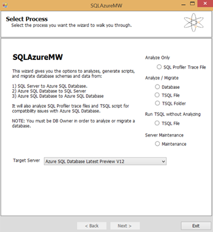
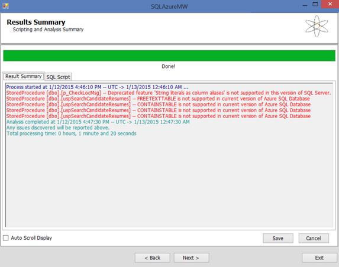

<properties 
   pageTitle="SQL 마이그레이션 마법사를 사용하여 마이그레이션" 
   description="Microsoft Azure SQL 데이터베이스, 데이터베이스 마이그레이션, 데이터베이스 가져오기, 데이터베이스 내보내기, 마이그레이션 마법사" 
   services="sql-database" 
   documentationCenter="" 
   authors="pehteh" 
   manager="jeffreyg" 
   editor="monicar"/>

<tags
   ms.service="sql-database"
   ms.devlang="NA"
   ms.topic="article"
   ms.tgt_pltfrm="NA"
   ms.workload="data-management" 
   ms.date="04/14/2015"
   ms.author="pehteh"/>

# SQL Azure 마이그레이션 마법사를 사용하여 마이그레이션

이 옵션은 SQL Azure 마이그레이션 마법사를 사용하여 원본 데이터베이스로 T-SQL 스크립트를 생성한 다음, SQL 데이터베이스와 호환되도록 마법사로 변환한 다음, SQL 데이터베이스에 연결하여 빈 Azure SQL 데이터베이스에 대해 스크립트를 실행하는 방법입니다. 스크립트는 스키마만 사용하여 생성하거나 BCP 형식의 데이터를 포함할 수 있습니다. 또한 마법사를 사용하여 데이터베이스의 특정 개체를 스크립트에 포함하거나 제외할 수 있습니다.

마법사에서 감지할 수 있는 모든 호환되지 않는 스키마를 내장된 변환 기능으로 처리할 수 있는 것은 아닙니다. 처리할 수 없는 호환되지 않는 스크립트는 오류로 보고되고 생성된 스크립트에 주석이 삽입됩니다. 이 경우 스크립트를 저장하여 수동으로 편집한 후 Azure SQL 데이터베이스에 제출할 수 있습니다. 변경이 필요한 경우 스크립트를 저장한 후 VS에서 SSMS 또는 SQL Server 도구를 사용하여 편집할 수 있습니다. 스크립트가 호환되면 Azure SQL 데이터베이스에 대해 대역 외 실행이 가능합니다.

> 참고: 이 옵션이 확장된 방법으로, 많은 오류가 감지되어 수정이 쉽지 않은 경우 Visual Studio에서 생성된 스크립트 파일을 데이터베이스 프로젝트로 가져올 수 있습니다. 프로젝트의 대상을 SQL 데이터베이스 V12로 설정하면 프로젝트를 빌드하고 VS에서 SQL Server 도구를 사용하여 오류를 점진적으로 수정할 수 있습니다. 스키마에 더 이상 오류가 없으면 스키마를 원본 데이터베이스의 복사본에 게시한 다음 옵션 1에서 설명한 것처럼 SSMS를 사용하여 데이터베이스를 가져오거나 Azure SQL 데이터베이스에 배포 또는 내보낼 수 있습니다.

## 마이그레이션 단계
1.	앞에서 설명한 대로 SQL 데이터베이스의 새 서버 또는 업그레이드한 기존 서버에 새 데이터베이스를 프로비전합니다. 마지막 단계로, 이 옵션에서 만든 마이그레이션 스크립트를 이 데이터베이스에 대해 실행합니다. 

2.	마이그레이션 마법사를 열고, **데이터베이스 분석/마이그레이션** 옵션을 선택하고, **대상 서버**를 Azure SQL 데이터베이스 V12로 설정한 후 **다음**을 클릭합니다.

3.	다음 페이지에서 **서버에 연결**을 클릭하고 원본 서버에 대한 연결 정보를 입력합니다. 연결 대화 상자에서 원본 데이터베이스를 지정하거나 서버에 연결한 다음 데이터베이스 목록에서 원본 데이터베이스를 선택합니다. 

4.	다음 페이지인 개체 선택 페이지에서 모든 데이터베이스 개체를 스크립팅할 것인지(기본값) 아니면 스크립팅할 특정 데이터베이스 개체를 선택할 것인지 고를 수 있습니다. 첫 번째 전달에서는 모든 개체를 스크립팅하고 마법사에서 스크립팅 또는 변환 오류를 보고하면 이 단계로 돌아와서 개체를 제외하는 것이 가장 좋은 방법입니다. 마법사는 먼저 SMO를 사용하여 데이터베이스의 개체를 스크립팅한 다음 생성된 스크립트를 사후 처리하여 일련의 regex 기반 유효성 검사 및 변환 규칙을 적용합니다.

4.	고급을 선택하고 마법사에서 사용하는 구성 옵션을 검토합니다. 첫 번째 전달에서는, 특히 데이터베이스가 큰 경우에는 **테이블/데이터 스크립팅**을 테이블 스키마만으로 설정하고, **대상 서버**를 Microsoft Azure SQL 데이터베이스 V12로 설정하고, **호환성 검사**를 재정의: 모든 호환성 검사 수행으로 설정해야 합니다.

5.	**다음**을 클릭하여 옵션을 검토하고, 다시 **다음**을 클릭하여 스크립트를 생성 및 변환합니다. SQL 스크립트 탭에서 스크립트를 검토할 수 있습니다.

6.	스키마가 SQL 데이터베이스와 호환되지 않아서 마법사에서 변환할 수 없는 경우 스크립트 생성 시 오류가 보고됩니다. 아래의 스크린 샷을 보시면 변환하는 도중 한 저장된 프로시저에서 문제가 발견되었습니다. 이 예는 전체 텍스트 검색을 사용하기 위해 프로시저를 작성했는데 아직 V12에서 지원되지 않아서 발생한 문제입니다. 하지만 이후 릴리스에서 지원될 예정입니다.

 - 오류 평가에 따라 마법사로 돌아가서 문제를 일으키는 개체를 제외하고 스크립트를 다시 생성할 수 있습니다. 오류를 해결하는 방법을 고민할 때 데이터베이스의 다른 개체와 해당 데이터베이스를 사용하는 응용 프로그램에 미칠 영향을 고려해야 합니다. 스크립트에 수정해야 할 오류가 있는 경우 SQL 스크립트 탭에서 스키마만 표시된 스크립트 파일을 저장하여 익숙한 편집기에서 열고 오류를 수정합니다. 그런 다음 SAMW 외부에서 1단계에서 만든 새 데이터베이스에 대해 스크립트를 실행합니다. 스크립트가 크거나 오류가 많으면 옵션 3을 사용해야 합니다. 생성된 스크립트 파일을 Visual Studio로 가져올 수는 있지만 SQL 파일에서 가져오면 옵션 3의 설명처럼 데이터베이스에서 가져오는 것보다 훨씬 오래 걸릴 수 있습니다.

7.	더 이상 오류가 없거나 생성 시 오류를 일으키는 원인을 제거했으면 **다음**을 클릭합니다. 표시되는 페이지에서 **서버에 연결**을 클릭하여 1단계에서 만든 Azure SQL 데이터베이스 서버에 연결합니다.

8.	다음 단계는 스크립트를 실행할 데이터베이스를 선택하는 것입니다. 서버에 있는 모든 기존 데이터베이스가 표시될 것입니다. 1단계에서 만든 데이터베이스를 선택합니다. 데이터베이스가 비어 있어야 하며 이 작업에 필요한 적절한 가격 책정 계층이 있어야 합니다. 
- 원하는 경우 이 시점에서 마법사를 사용하여 데이터베이스를 만들 수 있습니다. 데이터베이스 만들기를 클릭하여 데이터베이스를 구성하고 만들면 됩니다. 마이그레이션 프로세스에서 사용할 성능 수준을 선택하는 방법은 시작 섹션을 참조하세요.
- 데이터베이스를 만들었으면 해당 데이터베이스를 선택하여 계속합니다. 

9.	비어 있는 데이터베이스를 선택하고 **다음**을 클릭합니다. 스크립트를 실행하여 마이그레이션을 완료하겠다고 확인합니다.

<!---HONumber=58-->