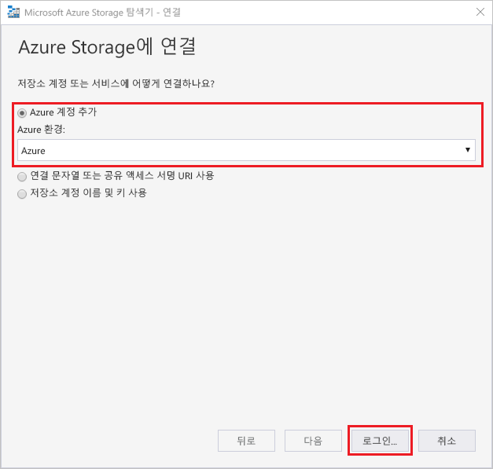

# Azure Storage 탐색기를 사용 하 여의 디렉터리, 파일 및 Acl 관리 Azure Data Lake Storage Gen2

이 문서에서는 [Azure Storage 탐색기](https://azure.microsoft.com/features/storage-explorer/) 를 사용 하 여 HNS (계층적 네임 스페이스)를 사용 하도록 설정 된 저장소 계정에서 디렉터리, 파일 및 사용 권한을 만들고 관리 하는 방법을 보여 줍니다.

## 사전 요구 사항

> [!div class="checklist"]
> * Azure 구독 [Azure 평가판](https://azure.microsoft.com/pricing/free-trial/)을 참조하세요.
> * 계층적 네임 스페이스 (HNS)를 사용 하도록 설정 된 저장소 계정입니다. [다음](data-lake-storage-quickstart-create-account.md) 지침에 따라 새로 만듭니다.
> * 로컬 컴퓨터에 설치 된 Azure Storage 탐색기 Windows, Macintosh 또는 Linux용 Azure Storage Explorer를 설치하려면 [Azure Storage Explorer](https://azure.microsoft.com/features/storage-explorer/)를 참조하세요.

## Storage Explorer에 로그인

Storage Explorer를 처음 시작할 때 **Microsoft Azure Storage Explorer - 연결** 창이 나타납니다. Storage Explorer에서는 몇 가지 방법으로 스토리지 계정에 연결할 수 있지만, 현재는 ACL을 관리하는 한 가지 방법만 지원됩니다.

|Task|목적|
|---|---|
|Azure 계정 추가 | Azure에 인증하기 위해 조직 로그인 페이지로 리디렉션합니다. ACL을 관리하고 설정하려는 경우 현재 유일하게 지원되는 인증 방법입니다.|
|연결 문자열 또는 공유 액세스 서명 URI 사용 | SAS 토큰 또는 공유 연결 문자열이 있는 컨테이너 또는 스토리지 계정에 직접 액세스하는 데 사용할 수 있습니다. |
|스토리지 계정 이름 및 키 사용| 스토리지 계정 이름과 스토리지 계정 키를 사용하여 Azure Storage에 연결합니다.|

**Azure 계정 추가** 를 선택 하 고 **로그인**을 클릭 합니다. 화면에 표시 되는 메시지에 따라 Azure 계정에 로그인 합니다.

작업이 완료되면 Azure Storage Explorer는 표시된 **탐색기** 탭을 로드합니다. 이 보기는 [Azure Storage 에뮬레이터](../common/storage-use-emulator.md?toc=%2fazure%2fstorage%2fblobs%2ftoc.json), [Cosmos DB](../../cosmos-db/storage-explorer.md?toc=%2fazure%2fstorage%2fblobs%2ftoc.json) 계정 또는 [Azure Stack](/azure-stack/user/azure-stack-storage-connect-se?toc=%2fazure%2fstorage%2fblobs%2ftoc.json) 환경을 통해 구성된 로컬 스토리지뿐만 아니라 모든 Azure Storage 계정에 대한 정보를 제공합니다.

## 컨테이너 만들기

컨테이너는 디렉터리와 파일을 보관 합니다. 하나를 만들려면 계속 진행 단계에서 만든 저장소 계정을 확장 합니다. **Blob 컨테이너**를 선택하고, 마우스 오른쪽 단추로 클릭하여 **Blob 컨테이너 만들기**를 선택합니다. 컨테이너의 이름을 입력 합니다. 컨테이너 이름 지정에 대 한 규칙 및 제한 사항 목록은 [컨테이너 만들기](storage-quickstart-blobs-dotnet.md#create-a-container) 섹션을 참조 하세요. 완료 되 면 **enter** 키를 눌러 컨테이너를 만듭니다. 컨테이너가 성공적으로 만들어지면 선택한 저장소 계정에 대 한 **Blob 컨테이너** 폴더 아래에 표시 됩니다.

## 디렉터리 만들기

디렉터리를 만들려면 진행 단계에서 만든 컨테이너를 선택 합니다. 컨테이너 리본에서 **새 폴더** 단추를 선택 합니다. 디렉터리의 이름을 입력 합니다. 완료 되 면 **enter** 키를 눌러 디렉터리를 만듭니다. 디렉터리가 성공적으로 만들어지면 편집기 창에 표시 됩니다.

## 디렉터리에 Blob 업로드

디렉터리 리본에서 **업로드** 단추를 선택 합니다. 이 작업에서는 폴더나 파일을 업로드할 수 있는 옵션이 제공됩니다.

업로드할 파일 또는 폴더를 선택합니다.

**확인**을 선택하면 선택한 파일들이 업로드 대기 상태가 되고 파일 하나하나가 업로드됩니다. 업로드가 완료되면 결과가 **활동** 창에 표시됩니다.

## 디렉터리에서 Blob 보기

**Azure Storage Explorer** 애플리케이션에서 스토리지 계정 아래에 있는 디렉터리를 선택합니다. 기본 창에는 선택한 디렉터리의 Blob 목록이 표시됩니다.

## Blob 다운로드

**Azure Storage 탐색기**를 사용 하 여 파일을 다운로드 하려면 파일을 선택한 상태로 리본에서 **다운로드** 를 선택 합니다. 파일 대화 상자가 열리면 파일 이름을 입력할 수 있습니다. **저장** 을 선택 하 여 로컬 위치에 대 한 파일 다운로드를 시작 합니다.

## 액세스 관리

컨테이너의 루트에서 사용 권한을 설정할 수 있습니다. 이렇게 하려면 해당 권한이 있는 개인 계정으로 Azure Storage Explorer에 로그인해야 합니다(연결 문자열을 사용하는 경우와 다름). 컨테이너를 마우스 오른쪽 단추로 클릭하고 **사용 권한 관리**를 선택하여 **사용 권한 관리** 대화 상자를 표시합니다.

**사용 권한 관리** 대화 상자에서는 소유자 및 소유자 그룹의 사용 권한을 관리할 수 있습니다. 또한 사용 권한을 관리할 수 있는 액세스 제어 목록에 새 사용자 및 그룹을 추가할 수 있습니다.

액세스 제어 목록에 새 사용자 또는 그룹을 추가하려면 **사용자 또는 그룹 추가** 필드를 선택합니다.

목록에 추가할 해당 AAD(Azure Active Directory) 항목을 입력하고 **추가**를 선택합니다.

이제 사용자 또는 그룹이 **사용자 및 그룹** 필드에 표시되며, 사용 권한 관리를 시작할 수 있습니다.

> [!NOTE]
> AAD에서 보안 그룹을 만들고 개별 사용자가 아닌 그룹에서 사용 권한을 유지 관리하는 것이 모범 사례이며 권장됩니다. 이 권장 사항에 대한 자세한 내용은 [Data Lake Storage Gen2에 대한 모범 사례](data-lake-storage-best-practices.md)를 참조하세요.

할당할 수 있는 사용 권한의 두 가지 범주는 액세스 ACL 및 기본 ACL입니다.

* **액세스**: 액세스 acl은 개체에 대 한 액세스를 제어 합니다. 파일과 디렉터리 모두에 액세스 ACL이 있습니다.

* **기본값**: 디렉터리에 생성 된 모든 자식 항목의 액세스 acl을 결정 하는 디렉터리와 연결 된 acl의 템플릿입니다. 파일에는 기본 ACL이 없습니다.

이러한 두 범주에는 파일 또는 디렉터리에 대 한 **읽기**, **쓰기**및 **실행**권한을 할당할 수 있는 세 가지 권한이 있습니다.

>[!NOTE]
> 여기에서 선택하면 현재 디렉터리에 있는 기존 항목에는 사용 권한이 설정되지 않습니다. 파일이 이미 있는 경우 각 개별 항목으로 이동한 다음, 사용 권한을 수동으로 설정해야 합니다.

개별 파일은 물론 개별 디렉터리에 대한 사용 권한을 관리할 수 있으므로 세분화된 액세스 제어가 가능합니다. 디렉터리와 파일 둘 다에서, 사용 권한 관리 프로세스는 위에서 설명한 프로세스와 동일합니다. 사용 권한을 관리하려는 파일 또는 디렉터리를 마우스 오른쪽 단추로 클릭하고 동일한 프로세스를 따릅니다.

## 다음 단계

Data Lake Storage Gen2의 액세스 제어 목록에 대해 알아봅니다.

> [!div class="nextstepaction"]
> [Azure Data Lake Storage Gen2의 액세스 제어](https://docs.microsoft.com/azure/storage/blobs/data-lake-storage-access-control)
