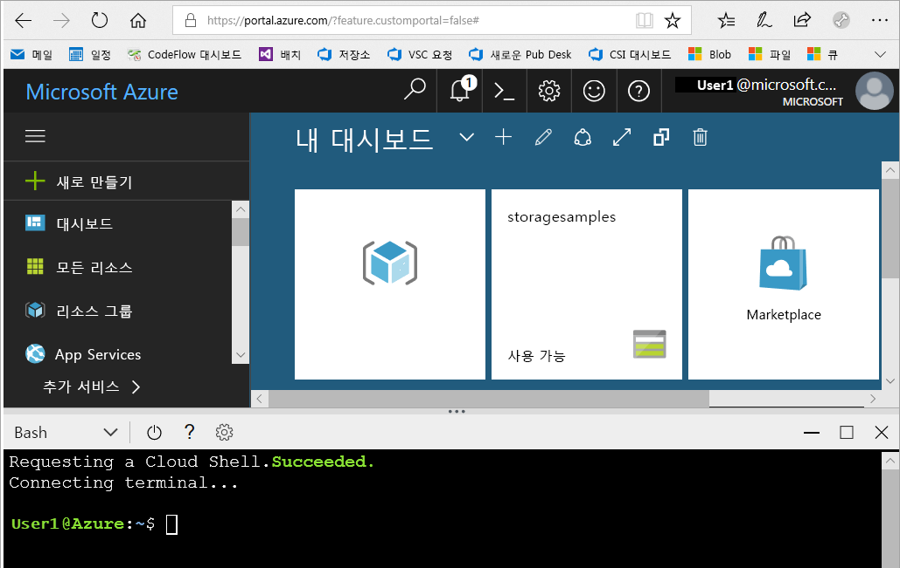

# <a name="create-a-storage-account"></a>저장소 계정 만들기

이 빠른 시작에서는 [Azure Portal](https://portal.azure.com/), [Azure PowerShell](https://docs.microsoft.com/powershell/azure/overview) 또는 [Azure CLI](https://docs.microsoft.com/cli/azure?view=azure-cli-latest)를 사용하여 저장소 계정을 만드는 것에 대해 알아봅니다.  

## <a name="prerequisites"></a>필수 조건

Azure 구독이 아직 없는 경우 시작하기 전에 [무료 계정](https://azure.microsoft.com/free/)을 만듭니다.

# <a name="portaltabportal"></a>[포털](#tab/portal)

없음.

# <a name="powershelltabpowershell"></a>[PowerShell](#tab/powershell)

이 빠른 시작에서는 Azure PowerShell 모듈 버전 3.6 이상이 필요합니다. `Get-Module -ListAvailable AzureRM`을 실행하여 현재 버전을 찾습니다. 설치 또는 업그레이드해야 하는 경우 [Azure PowerShell 모듈 설치](/powershell/azure/install-azurerm-ps)를 참조하세요.

# <a name="azure-clitabazure-cli"></a>[Azure CLI](#tab/azure-cli)

Azure에 로그인하고 다음 두 방법 중 하나로 Azure CLI 명령을 실행할 수 있습니다.

- Azure Cloud Shell의 Azure 포털에서 CLI 명령 실행 
- CLI를 설치하고 로컬에서 CLI 실행  

### <a name="use-azure-cloud-shell"></a>Azure Cloud Shell 사용

Azure Cloud Shell은 Azure 포털에서 직접 실행할 수 있는 무료 Bash 셸입니다. Azure CLI가 사전 설치되어 계정에서 사용하도록 구성되어 있습니다. Azure Portal 오른쪽 위에 있는 메뉴에서 **Cloud Shell** 버튼을 클릭합니다.

[](https://portal.azure.com)

이 단추는 이 빠른 시작의 단계를 실행하는 데 사용할 수 있는 대화형 셸을 시작합니다.

[](https://portal.azure.com)

### <a name="install-the-cli-locally"></a>로컬에서 CLI 설치

Azure CLI를 로컬에서 설치하여 사용할 수도 있습니다. 이 빠른 시작에서는 Azure CLI 버전 2.0.4 이상을 실행해야 합니다. `az --version`을 실행하여 버전을 찾습니다. 설치 또는 업그레이드가 필요한 경우, [Azure CLI 설치](/cli/azure/install-azure-cli)를 참조하세요. 

---

## <a name="log-in-to-azure"></a>Azure에 로그인

# <a name="portaltabportal"></a>[포털](#tab/portal)

[Azure Portal](https://portal.azure.com)에 로그인합니다.

# <a name="powershelltabpowershell"></a>[PowerShell](#tab/powershell)

`Connect-AzureRmAccount` 명령으로 Azure 구독에 로그인하고 화면의 지시에 따라 인증합니다.

```powershell
Connect-AzureRmAccount
```

# <a name="azure-clitabazure-cli"></a>[Azure CLI](#tab/azure-cli)

Azure Cloud Shell을 시작하려면 [Azure 포털](https://portal.azure.com)에 로그인합니다.

CLI의 로컬 설치를 사용해 로그인하려면 로그인 명령을 실행합니다.

```cli
az login
```

---

## <a name="create-a-storage-account"></a>저장소 계정 만들기

이제 저장소 계정을 만들 준비가 되었습니다.

모든 저장소 계정은 Azure 리소스 그룹에 속해야 합니다. 리소스 그룹은 Azure 리소스를 모아 놓은 논리적 컨테이너입니다. 저장소 계정을 만들 때 새 리소스 그룹을 만들거나 기존 리소스 그룹을 사용할 수 있는 옵션이 있습니다. 이 빠른 시작에는 새 리소스 그룹을 만드는 방법을 보여줍니다. 

**범용 v2** 저장소 계정은 모든 Azure 스토리지 서비스(Blob, 파일, 큐, 테이블 및 디스크)에 대한 액세스를 제공합니다. 빠른 시작에서는 범용 v2 저장소 계정을 만들지만 모든 유형의 저장소 계정을 만드는 단계는 비슷합니다.   

# <a name="portaltabportal"></a>[포털](#tab/portal)

[!INCLUDE [storage-create-account-portal-include](../../../includes/storage-create-account-portal-include.md)]

# <a name="powershelltabpowershell"></a>[PowerShell](#tab/powershell)

먼저 [New-AzureRmResourceGroup](/powershell/module/azurerm.resources/new-azurermresourcegroup) 명령을 사용하여 PowerShell을 통해 새 리소스 그룹을 만듭니다. 

```powershell
# put resource group in a variable so you can use the same group name going forward,
# without hardcoding it repeatedly
$resourceGroup = "storage-quickstart-resource-group"
New-AzureRmResourceGroup -Name $resourceGroup -Location $location 
```

`-Location` 매개 변수에 어떤 지역을 지정할지 확실하지 않으면 [Get-AzureRmLocation](/powershell/module/azurerm.resources/get-azurermlocation) 명령을 사용하여 해당 구독에 대해 지원되는 지역 목록을 검색할 수 있습니다.

```powershell
Get-AzureRmLocation | select Location 
$location = "westus"
```

다음으로, LRS(로컬 중복 저장소)를 사용하여 범용 v2 저장소 계정을 만듭니다. [New-AzureRmStorageAccount](/powershell/module/azurerm.storage/New-AzureRmStorageAccount) 명령을 사용합니다. 

```powershell
New-AzureRmStorageAccount -ResourceGroupName $resourceGroup `
  -Name "storagequickstart" `
  -Location $location `
  -SkuName Standard_LRS `
  -Kind StorageV2 
```

ZRS(영역 중복 스토리지)(미리 보기), GRS(지역 중복 스토리지) 또는 RA-GRS(읽기 액세스 지역 중복 스토리지)를 사용하여 범용 v2 저장소 계정을 만들려면 아래 표에서 **SkuName**매개 변수를 원하는 값으로 대체합니다. 

|복제 옵션  |SkuName 매개 변수  |
|---------|---------|
|LRS(로컬 중복 스토리지)     |Standard_LRS         |
|ZRS(영역 중복 스토리지)     |Standard_ZRS         |
|GRS(지역 중복 스토리지)     |Standard_GRS         |
|읽기 액세스 GRS(지역 중복 스토리지)     |Standard_RAGRS         |

# <a name="azure-clitabazure-cli"></a>[Azure CLI](#tab/azure-cli)

먼저 [az group create](/cli/azure/group#az_group_create) 명령을 사용하여 Azure CLI를 통해 새 리소스 그룹을 만듭니다. 

```azurecli-interactive
az group create \
    --name storage-quickstart-resource-group \
    --location westus
```

`--location` 매개 변수에 어떤 지역을 지정할지 확실하지 않으면 [az account list-locations](/cli/azure/account#az_account_list) 명령을 사용하여 해당 구독에 대해 지원되는 지역을 검색할 수 있습니다.

```azurecli-interactive
az account list-locations \
    --query "[].{Region:name}" \
    --out table
```

다음으로, 로컬 중복 스토리지를 사용하여 범용 v2 저장소 계정을 만듭니다. [az storage account create](/cli/azure/storage/account#az_storage_account_create) 명령을 사용합니다.

```azurecli-interactive
az storage account create \
    --name storagequickstart \
    --resource-group storage-quickstart-resource-group \
    --location westus \
    --sku Standard_LRS \
    --kind StorageV2
```

영역 중복 스토리지(ZRS 미리 보기), GRS(지역 중복 스토리지) 또는 RA-GRS(읽기 액세스 지역 중복 스토리지)를 사용하여 범용 v2 저장소 계정을 만들려면 아래 표에서 **sku**매개 변수를 원하는 값으로 대체합니다. 

|복제 옵션  |sku 매개 변수  |
|---------|---------|
|LRS(로컬 중복 스토리지)     |Standard_LRS         |
|ZRS(영역 중복 스토리지)     |Standard_ZRS         |
|GRS(지역 중복 스토리지)     |Standard_GRS         |
|읽기 액세스 GRS(지역 중복 스토리지)     |Standard_RAGRS         |

---

사용 가능한 복제 옵션에 대한 자세한 내용은 [스토리지 복제 옵션](storage-redundancy.md)을 참조하세요.

## <a name="clean-up-resources"></a>리소스 정리

이 빠른 시작에서 만든 리소스를 정리하려면 간단히 리소스 그룹을 삭제하면 됩니다. 리소스 그룹을 삭제하면 연결된 저장소 계정과 기타 해당 리소스 그룹에 연결된 다른 모든 리소스가 함께 삭제됩니다.

# <a name="portaltabportal"></a>[포털](#tab/portal)

Azure 포털을 사용하여 리소스 그룹을 제거하려면

1. Azure 포털에서 왼쪽의 메뉴를 확장하여 서비스 메뉴를 열고 **리소스 그룹**을 선택하여 리소스 그룹 목록을 표시합니다.
2. 삭제할 리소스 그룹을 찾아 목록 오른쪽에 있는 **자세히** 단추(**...** )를 마우스 오른쪽 단추로 클릭합니다.
3. **리소스 그룹 삭제**를 선택하고 확인합니다.

# <a name="powershelltabpowershell"></a>[PowerShell](#tab/powershell)

새 저장소 계정을 포함하여 리소스 그룹과 관련 리소스를 제거하려면 [Remove-AzureRmResourceGroup](/powershell/module/azurerm.resources/remove-azurermresourcegroup) 명령을 사용합니다. 

```powershell
Remove-AzureRmResourceGroup -Name $resourceGroup
```

# <a name="azure-clitabazure-cli"></a>[Azure CLI](#tab/azure-cli)

새 저장소 계정을 포함하여 리소스 그룹과 관련 리소스를 제거하려면 [az group delete](/cli/azure/group#az_group_delete) 명령을 사용합니다.

```azurecli-interactive
az group delete --name myResourceGroup
```

---

## <a name="next-steps"></a>다음 단계

이 빠른 시작에서는 범용 표준 저장소 계정을 만들었습니다. 저장소 계정에서 Blob을 업로드 및 다운로드하는 방법을 알아보려면 계속해서 Blob 저장소 빠른 시작을 진행합니다.

# <a name="portaltabportal"></a>[포털](#tab/portal)

> [!div class="nextstepaction"]
> [Azure Portal을 통한 Blob 사용](../blobs/storage-quickstart-blobs-portal.md)

# <a name="powershelltabpowershell"></a>[PowerShell](#tab/powershell)

> [!div class="nextstepaction"]
> [PowerShell을 통한 Blob 사용](../blobs/storage-quickstart-blobs-powershell.md)

# <a name="azure-clitabazure-cli"></a>[Azure CLI](#tab/azure-cli)

> [!div class="nextstepaction"]
> [Azure CLI를 통한 Blob Storage 사용](../blobs/storage-quickstart-blobs-cli.md)

---
