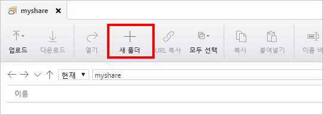

# 빠른 시작: Azure Storage 탐색기를 사용하여 Azure 파일 공유 만들기 및 관리
이 가이드에서는 Azure Storage 탐색기를 사용하여 [Azure 파일 공유](storage-files-introduction.md)로 작업하는 기본 사항을 설명합니다. Azure 파일 공유는 다른 파일 공유와 유사하지만, 클라우드에 저장되고 Azure Platform에서 지원합니다. Azure 파일 공유는 산업 표준 SMB 프로토콜을 지원하며 여러 머신, 애플리케이션 및 인스턴스 전반에서 파일 공유를 활성화합니다. 

Azure Storage 탐색기는 Windows, macOS 및 Linux에 사용할 수 있는 일반적인 클라이언트 도구입니다. Storage 탐색기를 사용하여 Azure 파일 공유 및 기타 스토리지 리소스를 관리할 수 있습니다.

Azure 구독이 아직 없는 경우 시작하기 전에 [체험 계정](https://azure.microsoft.com/free/?WT.mc_id=A261C142F)을 만듭니다.

## 필수 조건
이 빠른 시작을 사용하려면 Storage 탐색기를 설치해야 합니다. 다운로드하고 설치하려면 [Azure Storage 탐색기](https://azure.microsoft.com/features/storage-explorer/)로 이동합니다.

## 저장소 계정 만들기
Storage 탐색기를 사용하여 새 리소스를 만들 수 없습니다. 이 데모의 목적을 위해 [Azure Portal](https://portal.azure.com/)에 저장소 계정을 만듭니다. 

[!INCLUDE [storage-files-create-storage-account-portal](../../../includes/storage-files-create-storage-account-portal.md)]

## Azure 리소스에 Storage 탐색기 연결
Storage 탐색기를 처음 시작할 때 **Microsoft Azure Storage 탐색기 - 연결** 창이 나타납니다. Storage 탐색기는 Storage 계정에 연결하는 여러 방법을 제공합니다. 

- **Azure 계정을 사용하여 로그인**: 조직 또는 Microsoft 계정에 대한 사용자 자격 증명을 사용하여 로그인할 수 있습니다. 
- **연결 문자열 또는 SAS 토큰을 사용하여 특정 스토리지 계정에 연결**: 연결 문자열은 스토리지 계정 이름 및 스토리지 계정 키/SAS 토큰을 포함하는 특수 문자열입니다. 토큰을 사용하여 Storage 탐색기는 스토리지 계정에 직접 액세스합니다(Azure 계정에서 모든 스토리지 계정을 단순히 보는 대신). 연결 문자열에 대해 자세히 알아보려면 [Azure Storage 연결 문자열 구성](../common/storage-configure-connection-string.md?toc=%2fazure%2fstorage%2ffiles%2ftoc.json)을 참조하세요.
- **스토리지 계정 이름 및 키를 사용하여 특정 스토리지 계정에 연결**: 스토리지 계정 이름 및 스토리지 계정에 대한 키를 사용하여 Azure Storage에 연결합니다.

이 빠른 시작의 목적상 Azure 계정을 사용하여 로그인합니다. **Azure 계정 추가**를 선택한 다음, **로그인**을 선택합니다. 표시되는 메시지에 따라 Azure 계정에 로그인합니다.

### 파일 공유 만들기
`storageacct<random number>` 저장소 계정에 첫 번째 Azure 파일 공유를 만들려면:

1. 만든 저장소 계정을 확장합니다.
2. **파일 공유**를 마우스 오른쪽 단추로 클릭한 다음, **파일 공유 만들기**를 선택합니다.  
    

3. 파일 공유에 *myshare*를 입력한 다음, Enter 키를 누릅니다.

공유 이름은 소문자, 숫자 및 단일 하이픈만을 포함할 수 있습니다(하지만 하이픈으로 시작할 수 없음). 파일 공유 및 파일 이름 지정에 대한 자세한 내용은 [공유, 디렉터리, 파일 및 메타데이터 이름 지정 및 참조](https://docs.microsoft.com/rest/api/storageservices/Naming-and-Referencing-Shares--Directories--Files--and-Metadata)를 참조하세요.

파일 공유를 만든 후 파일 공유에 대한 탭이 오른쪽 창에서 열립니다. 

## Azure 파일 공유 사용
이제 Azure 파일 공유를 만들었으므로 SMB를 사용하여 [Windows](storage-how-to-use-files-windows.md), [Linux](storage-how-to-use-files-linux.md) 또는 [macOS](storage-how-to-use-files-mac.md)에 파일 공유를 탑재할 수 있습니다. 또는 Azure Storage 탐색기를 사용하여 Azure 파일 공유를 작업할 수 있습니다. SMB를 사용하여 파일 공유를 탑재하는 대신 Azure Storage 탐색기를 사용하는 장점은 Azure Storage 탐색기로 만들어진 모든 요청이 파일 REST API를 사용하여 만들어진다는 것입니다. 파일 REST API를 사용하여 SMB 액세스가 없는 클라이언트에서 파일 및 디렉터리를 만들고, 수정하고, 삭제할 수 있습니다.

### 디렉터리 만들기
디렉터리를 추가하면 파일 공유를 관리하는 계층 구조를 제공합니다. 디렉터리의 여러 수준에서 만들 수 있습니다. 그러나 하위 디렉터리를 만들기 전에 부모 디렉터리가 존재하는지 확인해야 합니다. 예를 들어 myDirectory/mySubDirectory 경로의 경우 *myDirectory* 디렉터리를 먼저 만들어야 합니다. 그런 다음, *mySubDirectory*를 만들 수 있습니다. 

1. 파일 공유에 대한 탭의 상단 메뉴에서 **새 폴더** 단추를 선택합니다. **새 디렉터리 만들기** 창이 열립니다.
    

2. 디렉터리 이름에 *myDirectory*를 입력한 다음, **확인**을 선택합니다. 

*myDirectory* 디렉터리는 *myshare* 파일 공유에 대한 탭에 나열됩니다.

### 파일 업로드 
로컬 컴퓨터에서 파일 공유의 새 디렉터리에 파일을 업로드할 수 있습니다. 전체 폴더 또는 단일 파일을 업로드할 수 있습니다.

1. 상단 메뉴에서 **업로드**를 선택합니다. 여기서는 폴더나 파일을 업로드할 수 있는 옵션을 제공합니다.
2. **파일 업로드**를 선택한 다음, 로컬 컴퓨터에서 업로드할 파일을 선택합니다.
3. **디렉터리로 업로드**에서 *myDirectory*를 입력한 다음, **업로드**를 선택합니다. 

완료되면 파일이 *myDirectory* 창의 목록에 나타납니다.

### 파일 다운로드
파일 공유에서 파일의 복사본을 다운로드하려면 파일을 마우스 오른쪽 단추로 클릭한 다음, **다운로드**를 선택합니다. 로컬 컴퓨터에서 파일을 배치할 위치를 선택한 다음, **저장**을 선택합니다.

창의 아래쪽에 있는 **활동** 창에 다운로드의 진행이 표시됩니다.

## 리소스 정리
Storage 탐색기를 사용하여 리소스를 제거할 수 없습니다. 이 빠른 시작에서 정리하기 위해 [Azure Portal](https://portal.azure.com/)을 사용할 수 있습니다. 

[!INCLUDE [storage-files-clean-up-portal](../../../includes/storage-files-clean-up-portal.md)]

## 다음 단계

> [!div class="nextstepaction"]
> [Azure Files란?](storage-files-introduction.md)
