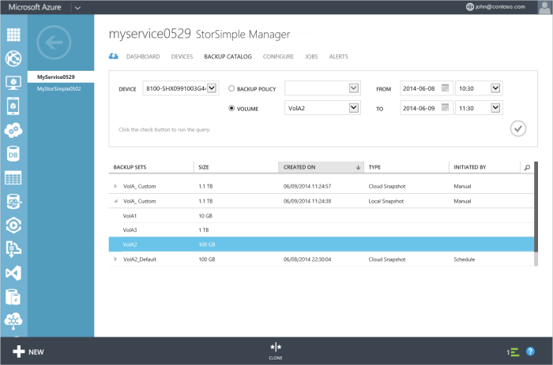

<properties
   pageTitle="StorSimple 볼륨 복제"
   description="다른 복제 유형 및 이를 사용하는 경우에 대해 설명하며, 백업 세트를 개별 볼륨 복제에 사용하는 방법에 대해 설명합니다."
   services="storsimple"
   documentationCenter="NA"
   authors="SharS"
   manager="adinah"
   editor="tysonn" /> <tags 
   ms.service="storsimple"
   ms.devlang="NA"
   ms.topic="article"
   ms.tgt_pltfrm="NA"
   ms.workload="TBD"
   ms.date="04/13/2015"
   ms.author="v-sharos" />

# StorSimple 볼륨 복제

## 개요

**백업 카탈로그** 페이지는 수동 또는 자동화된 백업을 수행할 때 생성되는 모든 백업 세트를 표시합니다. 이 페이지를 사용하여 백업 정책 또는 볼륨에 대한 모든 백업을 나열하거나, 백업을 선택 또는 삭제하거나 백업을 사용하여 볼륨을 복원 또는 복제할 수 있습니다.

  

이 자습서에서는 개별 볼륨 복제에 백업 세트를 사용하는 방법을 설명합니다. *임시* 및 *영구* 복제의 차이점에 대해서도 설명합니다.

## 볼륨의 복제본 만들기

로컬 또는 클라우드 스냅숏을 사용하여 동일한 장치, 다른 장치 또는 가상 컴퓨터에 복제본을 만들 수 있습니다.

## 볼륨 복제하기

1. StorSimple 관리자 서비스 페이지에서 **백업 카탈로그** 탭을 클릭하고 백접 세트를 선택합니다.

2. 백업 세트를 확장하여 연결된 볼륨을 봅니다. 백업 세트에서 볼륨을 클릭하여 선택합니다.

     

3. **복제**를 클릭하여 선택한 볼륨 복제를 시작합니다.

4. 볼륨 복제 마법사의 **이름 및 위치 지정** 아래:

  1. 대상 장치를 식별합니다. 복제본이 만들어지는 위치입니다. 동일한 장치를 선택하거나 다른 장치를 지정할 수 있습니다.

        >  [AZURE.NOTE] Make sure that the capacity required for the clone is lower than the capacity available on the target device.
  2. 해당 복제본에 대한 고유 볼륨 이름을 지정합니다. 이름은 3자에서 127자 사이여야 합니다.
  3. 화살표 아이콘을 클릭하여 다음 페이지로 이동합니다.

5. **이 볼륨을 사용할 수 있는 호스트 지정** 아래:

  1. 복제본에 대한 ACR\(액세스 제어 레코드\)을 지정합니다. 새 ACR을 추가하거나 기존 목록에서 선택할 수 있습니다.
  2. 확인 아이콘을 클릭하여 작업을 완료합니다.

6. 복제 작업이 시작되며 복제본 성공적으로 만들어지면 알림이 표시됩니다. **작업 보기**를 클릭하여 **작업** 페이지에서 복제 작업을 모니터링합니다.

7. 복제 작업 완료 후:

  1. **장치** 페이지로 이동하여 **볼륨 컨테이너** 탭을 선택합니다.
  2. 복제한 원본 볼륨에 연관된 볼륨 컨테이너를 선택합니다. 볼륨 목록에 방금 만든 복제본이 보입니다.

>[AZURE.NOTE]모니터링 및 기본 백업은 복제된 볼륨에서 자동으로 비활성화됩니다.

이러한 방식으로 만들어진 복제본은 임시 복제본입니다. 복제 유형에 대한 자세한 내용은 [임시 및 영구 복제본 비교](#transient-vs.-permanent-clones)를 참조하세요.

이 복제본은 이제 정규 볼륨이며 볼륨에 사용할 수 있는 모든 작업은 복제본에 사용할 수 있습니다. 백업에 대해 이 볼륨을 구성해야 합니다.

## 임시 및 영구 복제본 비교

백업 세트에서 특정 볼륨을 복제할 수 있습니다. 이러한 방식으로 만들어진 복제본은 *임시* 복제본입니다. 임시 복제본에는 원본 볼륨에 대한 참조가 있으며 로컬로 쓰는 동안 읽기위해 해당 볼륨을 사용합니다. 특히 복제된 볼륨이 큰 경우에는 성능이 저하될 수 있습니다.

임시 복제본의 클라우드 스냅숏을 수행한 후 결과 복제본은 *영구* 복제본이 됩니다. 영구 복제본은 독립적이며 복제된 원본 볼륨에 대한 참조가 없습니다. 성능 향상을 위해 영구 복제본을 만드는 것이 좋습니다.

## 임시 및 영구 복제본에 대한 시나리오

다음 섹션에서는 임시 및 영구 복제본을 사용할 수 있는 예제 상황에 대해 설명합니다.

### 임시 복제본을 사용하여 항목 수준 복구

1년 된 Microsoft PowerPoint 프레젠테이션 파일을 복구해야 합니다. IT 관리자는 해당 시간 프레임에서 특정 백업을 식별하고 볼륨을 필터링합니다. 그런 다음 관리자는 해당 볼륨을 복제하고, 필요한 파일을 찾아 사용자에게 제공합니다. 이 시나리오에서는 임시 복제본이 사용됩니다.
 
### 영구 복제본을 사용하여 프로덕션 환경에서 테스트

프로덕션 환경에서 테스트 버그를 확인해야 합니다. 프로덕션 환경에서 볼륨의 복제본을 만듭니다. 향상된 성능을 위해 이 복제본의 클라우드 스냅숏을 수행해야 합니다. 복제된 볼륨은 이제 독립적이며 성능이 향상됩니다. 이 시나리오에서는 영구 복제본이 사용됩니다.

## 다음 단계
[백업 세트에서 StorSimple 볼륨을 복원](storsimple-restore-from-backup-set.md)하는 방법에 대해 알아봅니다.

<!--HONumber=52-->
