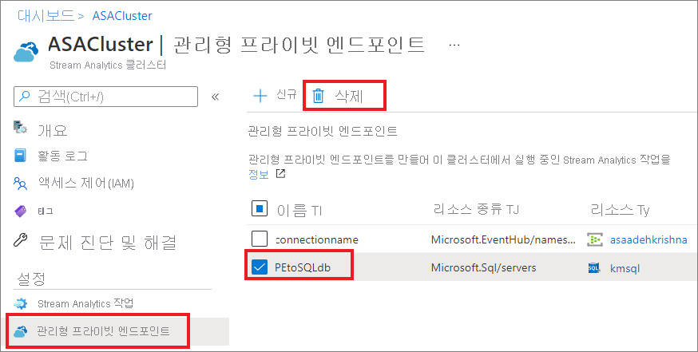

# Azure Stream Analytics 클러스터에서 프라이빗 엔드포인트 만들기 및 삭제

클러스터에서 실행되는 Azure Stream Analytics 작업을 방화벽 또는 Azure Virtual Network(VNet)로 보호되는 입력 및 출력 리소스에 연결할 수 있습니다. 먼저 Stream Analytics 클러스터에서 Azure Event Hub 또는 Azure SQL Database 같은 리소스의 프라이빗 엔드포인트를 만듭니다. 그런 다음, 입력 또는 출력에서 프라이빗 엔드포인트 연결을 승인합니다.

연결을 승인하면 Stream Analytics 클러스터에서 실행되는 모든 작업이 프라이빗 엔드포인트를 통해 리소스에 액세스할 수 있습니다. 이 문서에서는 Stream Analytics 클러스터에서 프라이빗 엔드포인트를 만들고 삭제하는 방법을 보여줍니다.

## Stream Analytics 클러스터에 프라이빗 엔드포인트 만들기

이 문서에서는 Stream Analytics 클러스터에 프라이빗 엔드포인트를 만드는 방법을 보여줍니다.

1. Azure Portal에서 해당하는 Stream Analytics 클러스터를 찾아서 선택합니다.

1. **설정**에서 **프라이빗 엔드포인트**를 선택합니다.

1. **프라이빗 엔드포인트 추가**를 선택하고 다음 정보를 입력하여 프라이빗 엔드포인트를 통해 안전하게 액세스하려는 리소스를 선택합니다.

   |설정|값|
   |---|---|
   |속성|프라이빗 엔드포인트의 이름을 입력합니다. 이 이름을 사용하는 경우 고유한 이름을 만듭니다.|
   |연결 방법|**내 디렉터리의 Azure 리소스에 연결**을 선택합니다.  프라이빗 엔드포인트를 사용하여 안전하게 연결할 리소스 중 하나를 선택하거나, 다른 사람이 공유한 리소스 ID 또는 별칭을 사용하여 다른 사람의 리소스에 연결할 수 있습니다.|
   |Subscription|구독을 선택합니다.|
   |리소스 유형|[리소스에 매핑되는 리소스 종류](../private-link/private-endpoint-overview.md#private-link-resource)를 선택합니다.|
   |리소스|프라이빗 엔드포인트를 사용하여 연결하려는 리소스를 선택합니다.|
   |대상 하위 리소스|프라이빗 엔드포인트가 액세스할 수 있는 위에서 선택한 리소스의 하위 리소스 종류입니다.|

   

1. 대상 리소스에서 연결을 승인합니다. 예를 들어 이전 단계에서 Azure SQL Database 인스턴스에 대한 프라이빗 엔드포인트를 만든 경우 이 SQL Database 인스턴스로 이동하여 승인해야 하는 보류 중인 연결을 확인해야 합니다. 연결 요청이 표시되는 데 몇 분 정도 걸릴 수 있습니다.

    

1. Stream Analytics 클러스터로 돌아가면 몇 분 이내에 상태가 **고객 승인 보류 중**에서 **DNS 설정 보류 중**으로 변경되었다가 다시 **설치 완료**로 변경되는 것을 확인할 수 있습니다.

## Stream Analytics 클러스터에서 프라이빗 엔드포인트 삭제

1. Azure Portal에서 해당하는 Stream Analytics 클러스터를 찾아서 선택합니다.

1. **설정**에서 **프라이빗 엔드포인트**를 선택합니다.

1. 삭제하려는 프라이빗 엔드포인트를 선택하고 **삭제**를 선택합니다.

   

## 다음 단계

Azure Stream Analytics 클러스터에서 프라이빗 엔드포인트를 관리하는 방법을 알아보았습니다. 다음으로 클러스터를 스케일링하고 클러스터에서 작업을 실행하는 방법을 알아볼 수 있습니다.

* [Azure Stream Analytics 클러스터 스케일링](scale-cluster.md)
* [Stream Analytics 클러스터에서 Stream Analytics 작업 관리](manage-jobs-cluster.md)