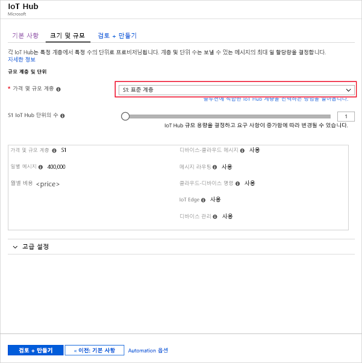
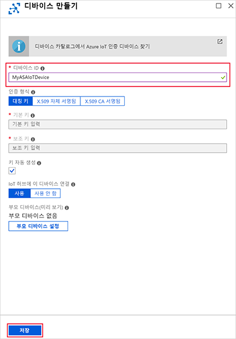
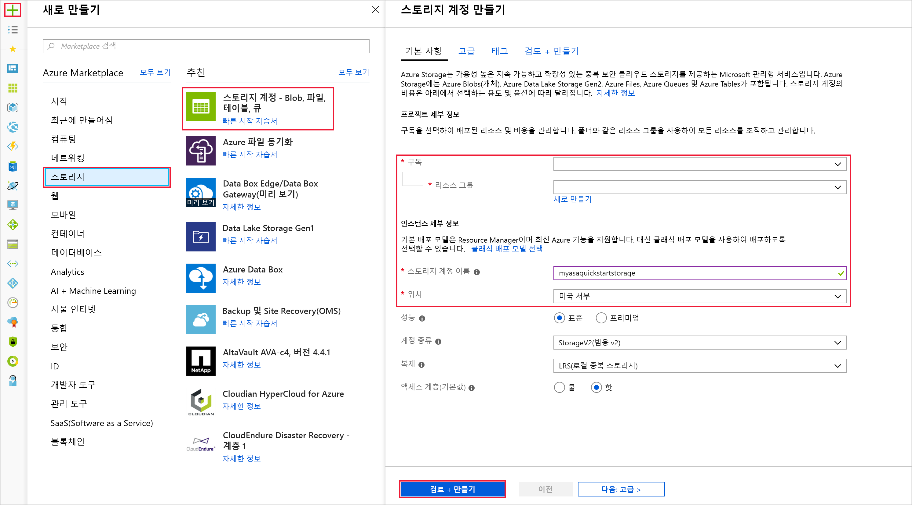
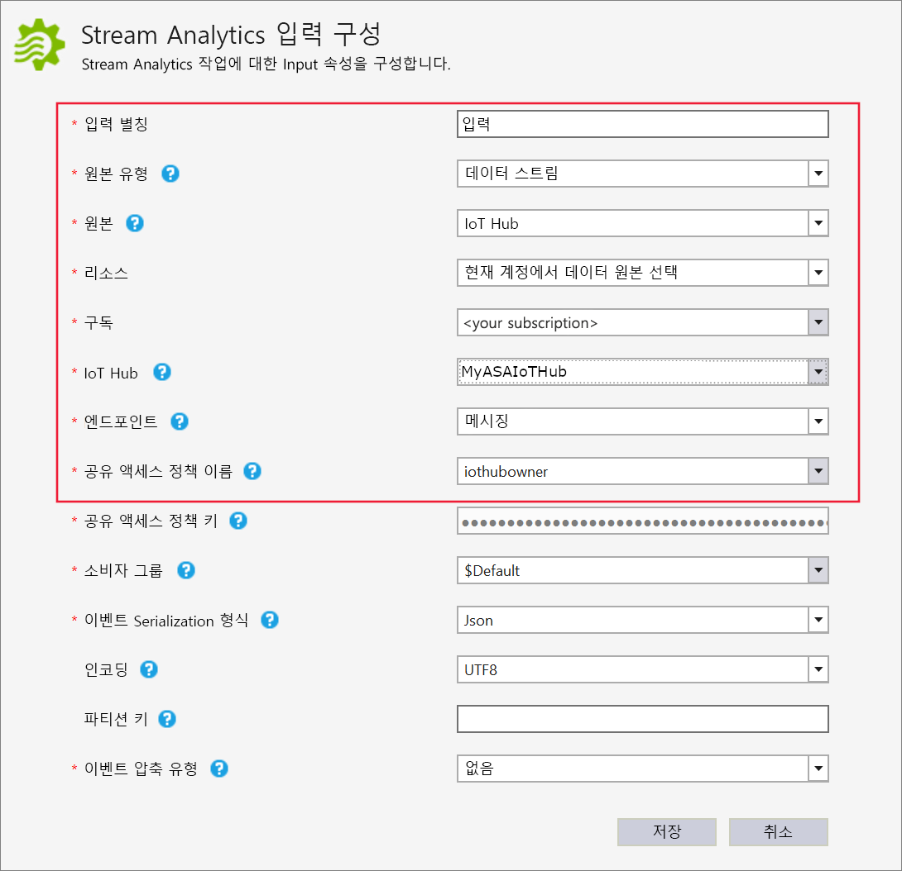
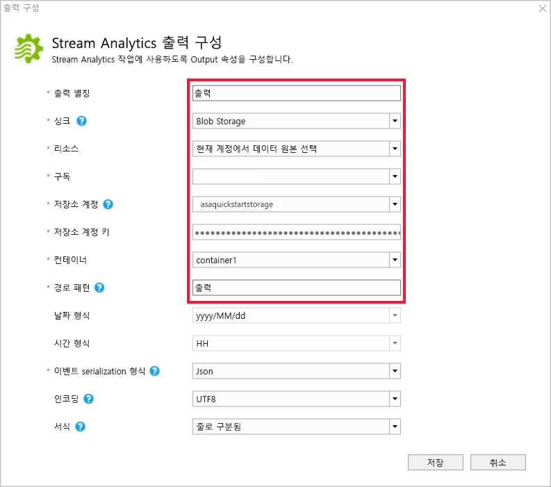
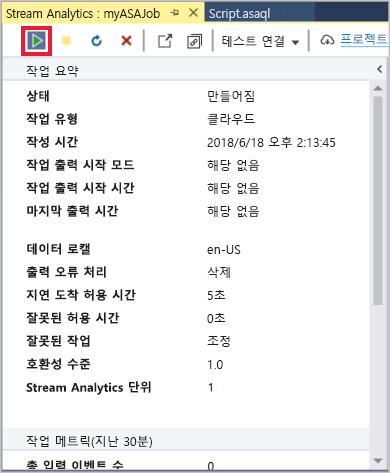
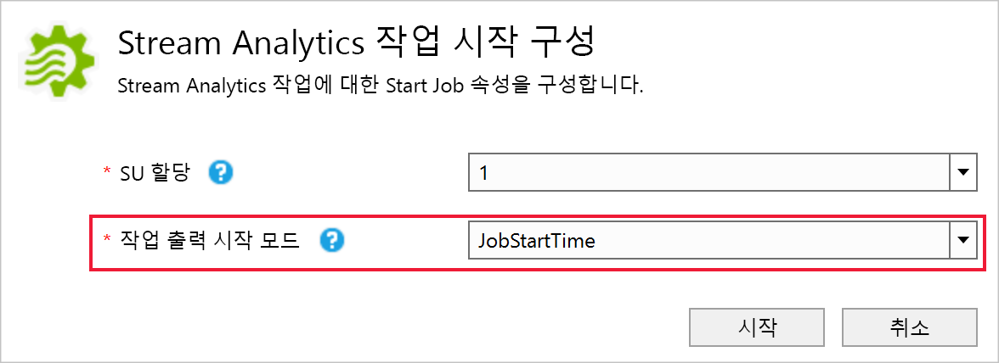

# <a name="quickstart-create-an-azure-stream-analytics-job-by-using-visual-studio"></a>빠른 시작: Visual Studio를 사용하여 Azure Stream Analytics 작업 만들기

이 빠른 시작에서는Visual Studio용 Azure Stream Analytics 도구를 사용하여 Stream Analytics 작업을 만들고 실행하는 방법을 보여줍니다. 예제 작업에서는 IoT Hub 서비스에서 스트리밍 데이터를 읽습니다. 27°를 초과할 때 평균 온도를 계산하고 Blob 스토리지의 새 파일에 결과 출력 이벤트를 작성하는 작업을 정의합니다.

> [!NOTE]
> Visual Studio 및 Visual Studio Code 도구는 중국 동부, 중국 북부, 독일 중부 및 독일 북동부 지역의 작업을 지원하지 않습니다.

## <a name="before-you-begin"></a>시작하기 전에

* Azure 구독이 아직 없는 경우 [체험 계정](https://azure.microsoft.com/free/)을 만듭니다.

* [Azure Portal](https://portal.azure.com/)에 로그인합니다.

* Visual Studio 2019, Visual Studio 2015 또는 Visual Studio 2013 업데이트 4를 설치합니다. Enterprise(Ultimate/Premium), Professional 및 Community Edition이 지원됩니다. Express Edition은 지원되지 않습니다.

* [설치 지침](./stream-analytics-tools-for-visual-studio-install.md)에 따라 Visual Studio용 Stream Analytics 도구를 설치합니다.

## <a name="prepare-the-input-data"></a>입력 데이터 준비

Stream Analytics 작업을 정의하기 전에 나중에 작업 입력으로 구성될 데이터를 준비해야 합니다. 작업에 필요한 입력 데이터를 준비하려면 다음 단계를 완료합니다.

1. [Azure Portal](https://portal.azure.com/)에 로그인합니다.

2. **리소스 만들기** > **사물 인터넷** > **IoT Hub** 를 선택합니다.

3. **IoT Hub** 창에서 다음 정보를 입력합니다.
   
   |**설정**  |**제안 값**  |**설명**  |
   |---------|---------|---------|
   |Subscription  | \<Your subscription\> |  사용할 Azure 구독을 선택합니다. |
   |Resource group   |   asaquickstart-resourcegroup  |   **새로 만들기** 를 선택하고 계정의 새로운 리소스 그룹 이름을 입력합니다. |
   |지역  |  \<Select the region that is closest to your users\> | IoT Hub를 호스트할 수 있는 지리적 위치를 선택합니다. 사용자와 가장 가까운 위치를 사용합니다. |
   |IoT Hub 이름  | MyASAIoTHub  |   IoT Hub의 이름을 선택합니다.   |

   

4. 완료되면 **다음: 크기 및 규모 설정** 을 선택합니다.

5. **가격 책정 및 규모 계층** 을 선택합니다. 이 빠른 시작의 경우 구독에서 아직 사용할 수 있다면 **F1 - 무료** 계층을 선택합니다. 체험 계층을사용 할 수 없는 경우 가능한 가장 낮은 계층을 선택합니다. 자세한 내용은 [IoT Hub 가격 책정](https://azure.microsoft.com/pricing/details/iot-hub/)을 참조하세요.

   

6. **검토 + 만들기** 를 선택합니다. IoT Hub 정보를 검토하고 **만들기** 를 클릭합니다. IoT Hub를 만드는 데 몇 분 정도 걸릴 수 있습니다. **알림** 창에서 진행 상황을 모니터링할 수 있습니다.

7. IoT Hub 탐색 메뉴의 **IoT 디바이스** 아래에서 **추가** 를 클릭합니다. **디바이스 ID** 를 추가하고 **저장** 을 클릭합니다.

   

8. 디바이스가 만들어진 후에 **IoT 디바이스** 목록에서 디바이스를 엽니다. 나중에 사용하기 위해 **연결 문자열---기본 키** 를 복사하고 메모장에 저장합니다.

   

## <a name="create-blob-storage"></a>Blob Storage 만들기

1. Azure Portal의 왼쪽 위 모서리에서 **리소스 만들기** > **스토리지** > **스토리지 계정** 을 선택합니다.

2. **스토리지 계정 만들기** 창에서 스토리지 계정 이름, 위치 및 리소스 그룹을 입력합니다. 자신이 만든 IoT Hub와 동일한 위치 및 리소스 그룹을 선택합니다. 그런 다음, **검토 + 만들기** 를 클릭하여 계정을 만듭니다.

   

3. 스토리지 계정이 생성되면 **개요** 창에서 **Blob** 타일을 선택합니다.

   

4. **Blob 서비스** 페이지에서 **컨테이너** 를 선택하고, 컨테이너에 *container1* 과 같은 이름을 지정합니다. **공용 액세스 수준** 을 **프라이빗(익명 액세스 없음)** 으로 유지하고 **확인** 을 선택합니다.

   

## <a name="create-a-stream-analytics-project"></a>Stream Analytics 프로젝트 만들기

1. Visual Studio를 시작합니다.

2. **파일 > 새 프로젝트 만들기** 를 선택합니다.  

3. 왼쪽의 템플릿 목록에서 **Stream Analytics** 를 선택한 다음, **Azure Stream Analytics 애플리케이션** 을 선택합니다.  

4. 프로젝트 **이름**, **위치** 및 **솔루션 이름** 을 입력하고, **확인** 을 선택합니다.

   

Azure Stream Analytics 프로젝트에 포함된 요소를 확인합니다.

   


## <a name="choose-the-required-subscription"></a>필수 구독 선택

1. Visual Studio의 **보기** 메뉴에서 **서버 탐색기** 를 선택합니다.

2. **Azure** 를 마우스 오른쪽 단추로 클릭하고, **Microsoft Azure 구독에 연결** 을 선택한 다음, Azure 계정으로 로그인합니다.

## <a name="define-input"></a>입력 정의

1. **솔루션 탐색기** 에서 **입력** 노드를 확장하고 **Input.json** 을 두 번 클릭합니다.

2. **Stream Analytics 입력 구성** 을 다음 값으로 채웁니다.

   |**설정**  |**제안 값**  |**설명**   |
   |---------|---------|---------|
   |입력 별칭  |  입력   |  작업의 입력을 식별하는 이름을 입력합니다.   |
   |원본 유형   |  데이터 스트림 |  적합한 입력 원본: 데이터 스트림 또는 참조 데이터를 선택합니다.   |
   |원본  |  IoT Hub |  적합한 입력 원본을 선택합니다.   |
   |리소스  | 현재 계정에서 데이터 원본 선택 | 기존 계정을 선택하거나 데이터를 수동으로 입력하도록 선택합니다.   |
   |Subscription  |  \<Your subscription\>   | 만든 IoT Hub가 있는 Azure 구독을 선택합니다.   |
   |IoT Hub  |  MyASAIoTHub   |  IoT Hub의 이름을 선택하거나 입력합니다. IoT Hub 이름은 동일한 구독에 만들어진 경우에 자동으로 감지됩니다.   |
   
3. 다른 옵션을 기본값으로 유지하고 **저장** 을 선택하여 설정을 저장합니다.  

   

## <a name="define-output"></a>출력 정의

1. **솔루션 탐색기** 에서 **출력** 노드를 확장하고 **Output.json** 을 두 번 클릭합니다.

2. **Stream Analytics 출력 구성** 을 다음 값으로 채웁니다.

   |**설정**  |**제안 값**  |**설명**   |
   |---------|---------|---------|
   |출력 별칭  |  출력   |  작업의 출력을 식별하는 이름을 입력합니다.   |
   |sink   |  Blob Storage |  적합한 싱크를 선택하세요.    |
   |리소스  |  데이터 원본 설정 수동 제공 |  기존 계정을 선택하거나 데이터를 수동으로 입력하도록 선택합니다.   |
   |Subscription  |  \<Your subscription\>   | 만든 스토리지 계정이 있는 Azure 구독을 선택합니다. 동일한 또는 다른 구독에 스토리지 계정이 있을 수 있습니다. 이 예제에서는 동일한 구독에 스토리지 계정을 만들었다고 가정합니다.   |
   |스토리지 계정  |  asaquickstartstorage   |  스토리지 계정의 이름을 선택하거나 입력합니다. 스토리지 계정 이름은 동일한 구독에 만들어진 경우에 자동으로 감지됩니다.   |
   |컨테이너  |  container1   |  스토리지 계정에서 만든 기존 컨테이너를 선택합니다.   |
   |경로 패턴  |  output   |  컨테이너 내에서 만들 파일 경로 이름을 입력합니다.   |
   
3. 다른 옵션을 기본값으로 유지하고 **저장** 을 선택하여 설정을 저장합니다.  

   

## <a name="define-the-transformation-query"></a>변환 쿼리 정의

1. Visual Studio의 **솔루션 탐색기** 에서 **Script.asaql** 을 엽니다.

2. 다음 쿼리를 추가합니다.

   ```sql
   SELECT *
   INTO Output
   FROM Input
   HAVING Temperature > 27
   ```

## <a name="submit-a-stream-analytics-query-to-azure"></a>Stream Analytics 쿼리를 Azure에 제출

1. **쿼리 편집기** 의 스크립트 편집기에서 **Azure에 제출** 을 선택합니다.

2. **새 Azure Stream Analytics 작업 만들기** 를 선택하고 **작업 이름** 을 입력합니다. 빠른 시작의 시작 부분에서 사용한 **구독**, **리소스 그룹** 및 **위치** 를 선택합니다.

   

## <a name="run-the-iot-simulator"></a>IoT 시뮬레이터 실행

1. 새 브라우저 탭 또는 창에서 [Raspberry Pi Azure IoT 온라인 시뮬레이터](https://azure-samples.github.io/raspberry-pi-web-simulator/)를 엽니다.

2. 15행의 자리 표시자를 이전 섹션에서 저장한 Azure IoT Hub 디바이스 연결 문자열로 대체합니다.

3. **실행** 을 클릭합니다. IoT Hub로 전송 중인 센서 데이터와 메시지가 출력에 표시되어야 합니다.

   

## <a name="start-the-stream-analytics-job-and-check-output"></a>Stream Analytics 작업 시작 및 출력 확인

1. 작업이 만들어지면 작업 보기가 자동으로 열립니다. 녹색 화살표 단추를 선택하여 작업을 시작합니다.

   

2. **작업 출력 시작 모드** 를 **JobStartTime** 으로 변경하고 **시작** 을 선택합니다.

   

3. 작업 상태가 **실행 중** 으로 변경되고 입력/출력 이벤트가 있습니다. 몇 분이 걸릴 수 있습니다.

   

4. 결과를 보려면 **보기** 메뉴에서 **클라우드 탐색기** 를 선택하고, 리소스 그룹의 스토리지 계정으로 이동합니다. **Blob 컨테이너** 아래에서 **container1** 및 **출력** 파일 경로를 차례로 두 번 클릭합니다.

   

## <a name="clean-up-resources"></a>리소스 정리

더 이상 필요하지 않으면 리소스 그룹, 스트리밍 작업 및 모든 관련 리소스를 삭제합니다. 작업을 삭제하면 작업에서 사용된 스트리밍 단위에 대한 청구를 방지합니다. 작업을 나중에 사용하려는 경우 중지하고 나중에 필요할 때 다시 시작할 수 있습니다. 이 작업을 계속 사용하지 않으려면 다음 단계를 사용하여 이 빠른 시작에서 만든 리소스를 모두 삭제합니다.

1. Azure Portal의 왼쪽 메뉴에서 **리소스 그룹** 을 선택한 다음, 만든 리소스의 이름을 선택합니다.  

2. 리소스 그룹 페이지에서 **삭제** 를 선택하고 텍스트 상자에서 삭제할 리소스의 이름을 입력한 다음, **삭제** 를 선택합니다.

## <a name="next-steps"></a>다음 단계

이 빠른 시작에서는 Visual Studio를 사용하여 간단한 Stream Analytics 작업을 배포했습니다. [Azure Portal](stream-analytics-quick-create-portal.md)과 [PowerShell](stream-analytics-quick-create-powershell.md)을 통해 Stream Analytics 작업도 배포할 수 있습니다. 

Azure Stream Analytics tools for Visual Studio를 알아보려면 다음 문서를 계속 합니다.

> [!div class="nextstepaction"]
> [Visual Studio를 사용하여 Azure Stream Analytics 작업 보기](stream-analytics-vs-tools.md)