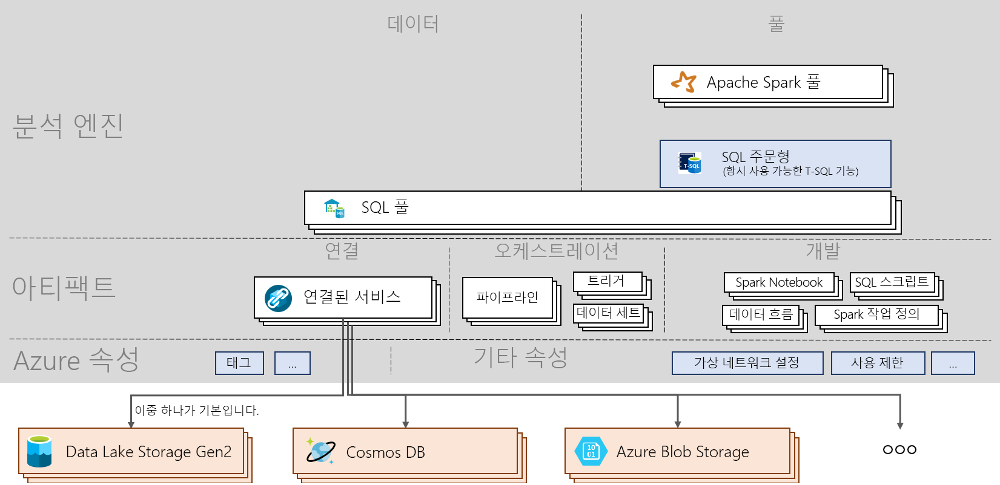

# Azure Synapse Analytics 참고 자료

[!INCLUDE [preview](includes/note-preview.md)]

Azure Synapse Analytics 참고 자료는 서비스의 기본 개념과 중요한 명령을 안내합니다. 이 문서는 새로 배우려는 분들과 필수 Azure Synapse 토픽의 핵심 내용을 원하는 분들에게 유용합니다.

## Architecture

> [!div class="mx-imgBorder"]
>

## 용어
| 용어                         | 정의      |
|:---                                 |:---                 |
| **Synapse 작업 영역** | Azure에서 클라우드 기반 엔터프라이즈 분석을 수행할 수 있는 안전한 협업 경계입니다. 작업 영역은 특정 지역에 배포되며 임시 데이터를 저장하기 위한 ADLS Gen2 계정 및 파일 시스템과 연결됩니다. 작업 영역은 리소스 그룹에 있습니다. |
| **Synapse SQL**   | 풀 또는 주문형 기능을 사용하여 분석을 실행합니다.  |
| **SQL 풀**   | 해당 데이터베이스가 포함된 0-N개의 SQL 프로비저닝 리소스를 작업 영역에 배포할 수 있습니다. 각 SQL 풀에는 데이터베이스가 연결됩니다. SQL 풀은 수동 또는 자동으로 크기를 조정하고, 일시 중지하고, 다시 시작할 수 있습니다. SQL 풀은 DWU를 100개부터 30,000개까지 확장할 수 있습니다.       |
| **SQL 주문형**   | 데이터 레이크의 데이터에 대한 T-SQL 쿼리를 실행할 수 있도록 대규모 데이터용으로 개발된 분산 데이터 처리 시스템입니다. 서버리스이므로 인프라를 관리할 필요가 없습니다.       |
|**Synapse용 Apache Spark** | Spark 풀에서 사용되는 Spark 런타임입니다. 지원되는 현재 버전은 Python 3.6.1, Scala 2.11.12, Apache Spark 0.5에 대한 .NET 지원, Delta Lake 0.3이 포함된 Spark 2.4입니다.  | 
| **Apache Spark 풀**  | 해당 데이터베이스가 포함된 0-N개의 Spark 프로비저닝 리소스를 작업 영역에 배포할 수 있습니다. Spark 풀은 자동으로 일시 중지하고, 다시 시작하고, 크기를 조정할 수 있습니다.  |
| **Spark 애플리케이션**  |   드라이버 프로세스와 실행기 프로세스 세트로 구성됩니다. Spark 애플리케이션은 Spark 풀에서 실행됩니다.            |
| **Spark 세션**  |   Spark 애플리케이션의 통합 진입점입니다. 더 적은 구문으로 Spark의 다양한 기능과 상호 작용할 수 있습니다. Notebook을 실행하려면 세션을 만들어야 합니다. 특정 크기, 특정 개수의 실행자에서 실행되도록 세션을 구성할 수 있습니다. Notebook 세션의 기본 구성은 중간 크기 실행기 2개에서 실행하는 것입니다. |
| **SQL 요청**  |   SQL 풀 또는 SQL 주문형을 통해 쿼리를 실행하는 등의 작업입니다. |
|**데이터 통합**| 다양한 원본 간에 데이터를 수집하고 작업 영역 내에서 또는 작업 영역 외부에서 실행되는 작업을 오케스트레이션하는 기능을 제공합니다.| 
|**아티팩트**| 사용자가 데이터 원본을 관리, 개발, 오케스트레이션 및 시각화하는 데 필요한 모든 개체를 캡슐화하는 개념입니다.|
|**Notebook**| Scala, PySpark, C# 및 SparkSQL을 지원하는 대화형이자 반응형인 데이터 과학 및 엔지니어링 인터페이스입니다. |
|**Spark 작업 정의**|코드 및 해당 종속성을 포함하는 어셈블리 jar를 사용하여 Spark 작업을 제출하는 인터페이스입니다.|
|**데이터 흐름**|  코딩 없이 빅 데이터 변환을 수행할 수 있는 완전한 시각적 환경을 제공합니다. 모든 최적화 및 실행이 서버리스 방식으로 처리됩니다. |
|**SQL 스크립트**| 파일에 저장되는 SQL 명령 세트입니다. SQL 스크립트는 하나 이상의 SQL 문을 포함할 수 있습니다. SQL 풀 또는 SQL 주문형을 통해 SQL 요청을 실행하는 데 사용할 수 있습니다.|
|**파이프라인**| 함께 하나의 작업을 수행하는 활동의 논리적 그룹화입니다.|
|**활동**| 데이터 복사나 Notebook 또는 SQL 스크립트 실행처럼 데이터에 대해 수행할 작업을 정의합니다.|
|**트리거**| 파이프라인을 실행합니다. 수동 또는 자동으로 실행할 수 있습니다(일정, 연속 창 또는 이벤트 기반).|
|**연결된 서비스**| 작업 영역에서 외부 리소스에 연결하는 데 필요한 연결 정보를 정의하는 연결 문자열입니다.|
|**데이터 세트**|  작업에서 입력 및 출력으로 사용할 데이터를 단순히 가리키거나 참조하는 데이터의 명명된 보기입니다. 연결된 서비스에 속합니다.|

## 다음 단계

- [작업 영역 만들기](quickstart-create-workspace.md)
- [Synapse Studio 사용](quickstart-synapse-studio.md)
- [SQL 풀 만들기](quickstart-create-sql-pool-portal.md)
- [Apache Spark 풀 만들기](quickstart-create-apache-spark-pool-portal.md)
- [SQL 주문형 사용](quickstart-sql-on-demand.md)

