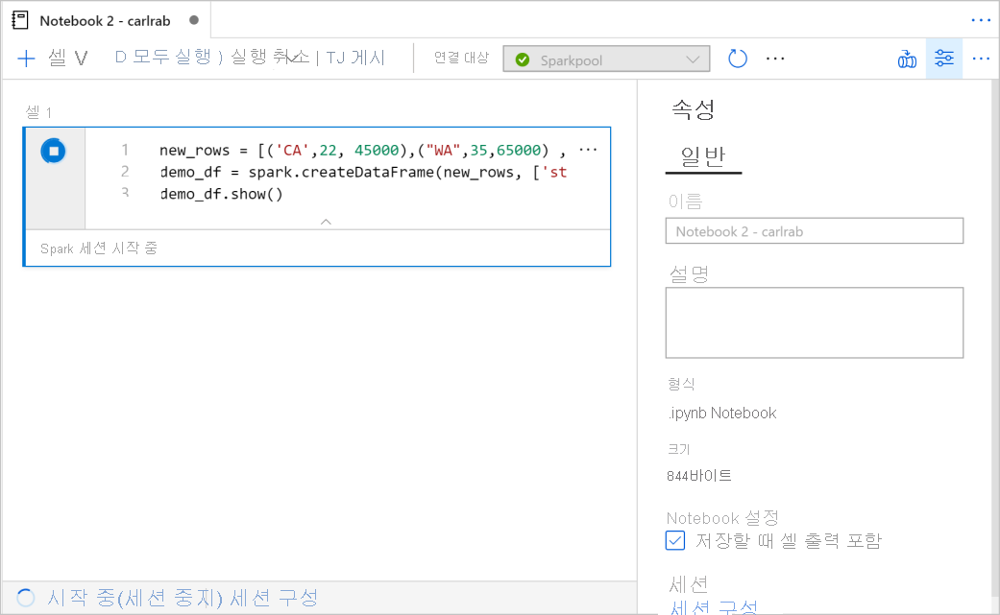
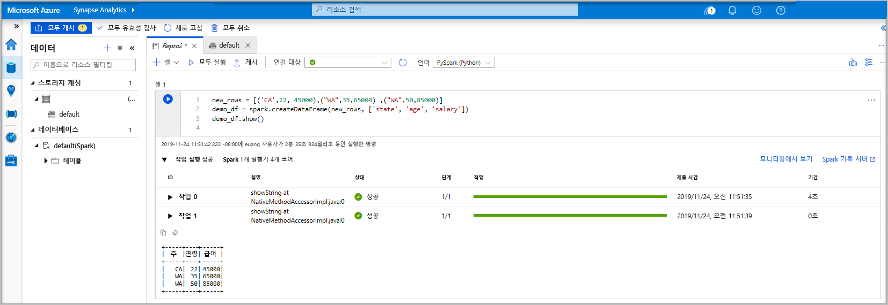
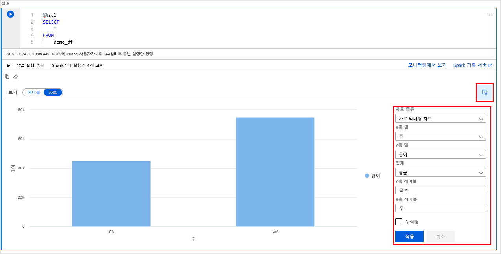

# <a name="quickstart-create-an-apache-spark-pool-in-azure-synapse-analytics-using-web-tools"></a>빠른 시작: 웹 도구를 사용하여 Azure Synapse Analytics에서 Apache Spark 풀 만들기

이 빠른 시작에서는 웹 도구를 사용하여 Azure Synapse에서 Apache Spark 풀(미리 보기)을 만드는 방법에 대해 알아봅니다. 그런 다음, Apache Spark 풀에 연결하고 파일 및 테이블에 대해 Spark SQL 쿼리를 실행하는 방법에 대해 알아봅니다. Apache Spark를 통해 메모리 내 처리 기능을 사용하여 데이터 분석 및 클러스터 컴퓨팅을 신속하게 처리합니다. Azure Synapse의 Spark에 대한 자세한 내용은 [개요: Azure Synapse의 Apache Spark](./spark/apache-spark-overview.md)를 참조하세요.

> [!IMPORTANT]
> Spark 인스턴스 요금은 인스턴스 사용 여부에 관계없이 분 단위 비례 배분 방식으로 청구됩니다. Spark 인스턴스를 사용한 후 꼭 인스턴스를 종료하거나 짧은 시간 제한을 설정해야 합니다. 자세한 내용은 이 문서의 **리소스 정리** 섹션을 참조하세요.

Azure 구독이 없는 경우 [시작하기 전에 체험 계정을 만듭니다](https://azure.microsoft.com/free/).

## <a name="prerequisites"></a>사전 요구 사항

- Azure 구독 - [체험 구독 만들기](https://azure.microsoft.com/free/)
- [Synapse Analytics 작업 영역](quickstart-create-workspace.md)
- [Apache Spark 풀](quickstart-create-apache-spark-pool-studio.md)

## <a name="sign-in-to-the-azure-portal"></a>Azure Portal에 로그인

[Azure Portal](https://portal.azure.com/)에 로그인합니다.

Azure 구독이 아직 없는 경우 시작하기 전에 [체험](https://azure.microsoft.com/free/) 계정을 만듭니다.

## <a name="create-a-notebook"></a>Notebook 만들기

Notebook은 다양한 프로그래밍 언어를 지원하는 대화형 환경입니다. Notebook을 사용하면 데이터와 상호 작용하고, 코드를 markdown, 텍스트와 결합하고, 간단한 시각화를 수행할 수 있습니다.

1. 사용하려는 Azure Synapse 작업 영역에 대한 Azure Portal 보기에서 **Synapse Studio 시작**을 선택합니다.
2. Synapse Studio가 시작되면 **개발**을 선택합니다. 그런 다음, 마우스로 **Notebook** 항목 위를 가리킵니다. 줄임표( **...** )를 선택합니다.
3. 여기서 **새 Notebook**을 선택합니다. 새 Notebook이 만들어지고 자동으로 생성된 이름으로 열립니다.
  

4. **속성** 창에서 Notebook 이름을 제공합니다.
5. 도구 모음에서 **게시**를 클릭합니다.
6. 하나의 Apache Spark 풀만 작업 영역에 있으면 이 풀이 기본적으로 선택됩니다. 선택되지 않은 경우 드롭다운을 사용하여 올바른 Apache Spark 풀을 선택합니다.
7. **코드 추가**를 클릭합니다. 기본 언어는 `Pyspark`입니다. Pyspark와 Spark SQL을 함께 사용하므로 기본 선택이 좋습니다. 기타 지원되는 언어는 Spark용 Scala 및 .NET입니다.
8. 다음으로 조작할 간단한 Spark DataFrame 개체를 만듭니다. 이 경우 코드에서 만듭니다. 세 개의 행과 세 개의 열이 있습니다.

   ```python
   new_rows = [('CA',22, 45000),("WA",35,65000) ,("WA",50,85000)]
   demo_df = spark.createDataFrame(new_rows, ['state', 'age', 'salary'])
   demo_df.show()
   ```

9. 이제 다음 방법 중 하나를 사용하여 셀을 실행합니다.

   - **Shift + Enter**를 누릅니다.
   - 셀 왼쪽의 파란색 재생 아이콘을 선택합니다.
   - 도구 모음에서 **모두 실행** 단추를 선택합니다.

   

10. Apache Spark 풀 인스턴스가 아직 실행되고 있지 않으면 자동으로 시작됩니다. 실행 중인 셀 아래에서 Apache Spark 풀 인스턴스 상태를 확인할 수 있습니다. Notebook 아래쪽의 상태 패널에서도 확인할 수 있습니다. 풀의 크기에 따라 시작하는 데 2-5분이 걸립니다. 코드 실행이 완료되면 실행하는 데 걸린 시간과 실행 시간을 보여 주는 정보가 셀 아래에 표시됩니다. 출력 셀에 출력이 표시됩니다.

    

11. 이제 데이터가 DataFrame에 있으므로 다양한 방법으로 이 데이터를 사용할 수 있습니다. 이 빠른 시작의 나머지 부분에서는 다른 형식의 데이터가 필요합니다.
12. 아래 코드를 다른 셀에 입력하여 실행합니다. 그러면 데이터 복사본이 포함된 Spark 테이블, CSV 및 Parquet 파일이 모두 만들어집니다.

    ```python
     demo_df.createOrReplaceTempView('demo_df')
     demo_df.write.csv('demo_df', mode='overwrite')
     demo_df.write.parquet('abfss://<<TheNameOfAStorageAccountFileSystem>>@<<TheNameOfAStorageAccount>>.dfs.core.windows.net/demodata/demo_df', mode='overwrite')
    ```

    스토리지 탐색기를 사용하는 경우 위에서 사용한 파일을 작성하는 서로 다른 두 가지 방법의 영향을 확인할 수 있습니다. 파일 시스템이 지정되지 않으면 기본값(이 경우 `default>user>trusted-service-user>demo_df`)이 사용됩니다. 데이터가 지정된 파일 시스템의 위치에 저장됩니다.

    "csv" 및 "parquet" 형식 모두에서 분할된 여러 파일이 있는 디렉터리를 만드는 작업을 작성합니다.

    

    

## <a name="run-spark-sql-statements"></a>Spark SQL 문 실행

SQL(구조적 쿼리 언어)은 데이터 쿼리 및 정의에 가장 일반적이며 널리 사용되는 언어입니다. Spark SQL은 익숙한 SQL 구문을 사용하여 구조화된 데이터를 처리하기 위한 Apache Spark에 대한 확장으로 작동합니다.

1. 다음 코드를 빈 셀에 붙여넣은 다음, 코드를 실행합니다. 이 명령은 풀의 테이블을 나열합니다.

   ```sql
   %%sql
   SHOW TABLES
   ```

   Azure Synapse Apache Spark 풀에서 Notebook을 사용하면 Spark SQL을 통해 쿼리를 실행하는 데 사용할 수 있는 미리 설정된 `sqlContext`가 제공됩니다. `%%sql`은 미리 설정된 `sqlContext`를 사용하여 쿼리를 실행하도록 Notebook에 지시합니다. 쿼리는 기본적으로 모든 Azure Synapse Apache Spark 풀과 함께 제공되는 시스템 테이블에서 상위 10개의 행을 검색합니다.

2. 또 다른 쿼리를 실행하여 `demo_df`의 데이터를 봅니다.

    ```sql
    %%sql
    SELECT * FROM demo_df
    ```

    이 코드는 두 개의 출력 셀을 생성합니다. 하나는 데이터 결과를 포함하고, 다른 하나는 작업 보기를 표시합니다.

    기본적으로 결과 보기에는 그리드가 표시됩니다. 그리드 아래에는 그리드 보기와 그래프 보기 간에 전환할 수 있는 보기 전환기가 있습니다.

    

3. **보기** 전환기에서 **차트**를 선택합니다.
4. 맨 오른쪽에 있는 **보기 옵션** 아이콘을 선택합니다.
5. **차트 종류** 필드에서 "가로 막대형 차트"를 선택합니다.
6. X축 열 필드에서 "상태"를 선택합니다.
7. Y축 열 필드에서 "급여"를 선택합니다.
8. **집계** 필드에서 "AVG"를 선택합니다.
9. **적용**을 선택합니다.

   

10. 동일한 SQL 실행 환경을 사용할 수 있으며 언어를 전환할 필요가 없습니다. 위의 SQL 셀을 이 PySpark 셀로 바꾸면 이 작업을 수행할 수 있습니다. **display** 명령이 사용되므로 출력 환경은 동일합니다.

    ```python
    display(spark.sql('SELECT * FROM demo_df'))
    ```

11. 이전에 실행한 각 셀에는 **기록 서버** 및 **모니터링**으로 이동할 수 있는 옵션이 있었습니다. 링크를 클릭하면 사용자 환경의 다른 부분으로 이동합니다.

## <a name="clean-up-resources"></a>리소스 정리

Azure Synapse는 데이터를 Azure Data Lake Storage에 저장합니다. Spark 인스턴스를 사용하지 않는 경우 안전하게 종료할 수 있습니다. Azure Synapse Apache Spark 풀이 사용되지 않는 경우에도 실행되는 동안에는 요금이 청구됩니다. 

풀 요금은 스토리지 요금보다 몇 배나 비싸므로 사용하지 않는 경우 Spark 인스턴스를 종료하는 것이 경제적입니다.

Spark 인스턴스가 종료되도록 하려면 연결된 세션(Notebook)을 종료합니다. Apache Spark 풀에 지정된 **유휴 시간**에 도달하면 풀이 종료됩니다. Notebook 아래쪽의 상태 표시줄에서 **세션 종료**를 선택할 수도 있습니다.

## <a name="next-steps"></a>다음 단계

이 빠른 시작에서는 Azure Synapse Apache Spark 풀을 만들고 기본 Spark SQL 쿼리를 실행하는 방법에 대해 알아보았습니다.

- [Azure Synapse Analytics](overview-what-is.md)
- [Apache Spark용 .NET 설명서](/dotnet/spark?toc=/azure/synapse-analytics/toc.json&bc=/azure/synapse-analytics/breadcrumb/toc.json)
- [Apache Spark 공식 설명서](https://spark.apache.org/docs/latest/)

>[!NOTE]
> 일부 공식 Apache Spark 설명서에서는 Azure Synapse Spark에서 사용할 수 없는 Spark 콘솔을 사용합니다. [Notebook](quickstart-apache-spark-notebook.md) 또는 [IntelliJ](./spark/intellij-tool-synapse.md) 환경을 대신 사용하세요.
