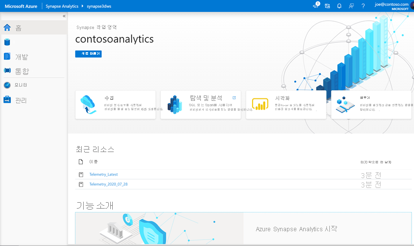
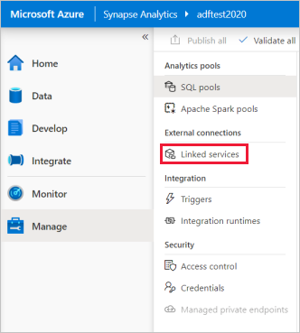
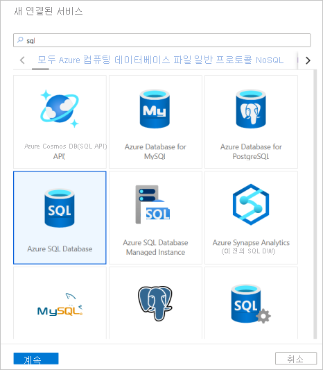
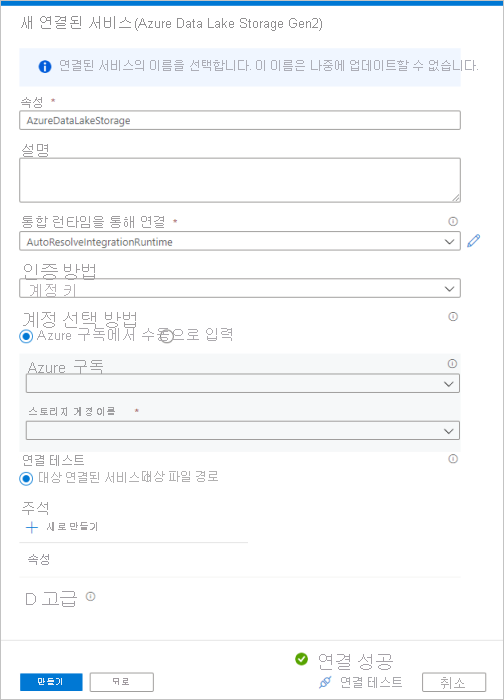
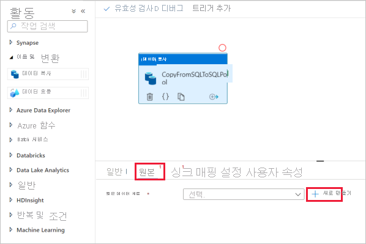
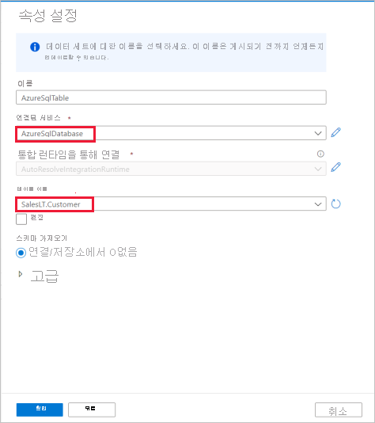
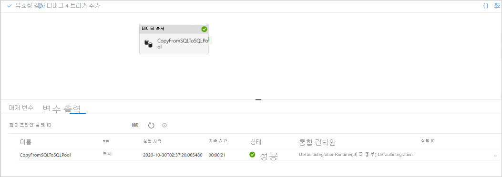

# 빠른 시작: 복사 작업을 사용하여 전용 SQL 풀에 데이터 로드

Azure Synapse Analytics는 데이터를 수집, 변환, 모델링 및 분석하는 데 도움이 되는 다양한 분석 엔진을 제공합니다. 전용 SQL 풀은 T-SQL 기반 컴퓨팅 및 스토리지 기능을 제공합니다. Synapse 작업 영역에서 전용 SQL 풀을 만든 후 보다 빠른 인사이트를 위해 데이터를 로드, 모델링, 처리 및 전달할 수 있습니다.

이 빠른 시작에서는 *데이터를 Azure SQL Database에서 Azure Synapse Analytics로 로드* 하는 방법에 대해 알아봅니다. 다른 데이터 저장소 유형에서 데이터를 복사할 때도 이와 유사한 단계를 따를 수 있습니다. 이와 비슷한 흐름은 다른 원본 및 싱크에 대한 데이터 복사에도 적용됩니다.

## 필수 구성 요소

* Azure 구독: Azure 구독이 아직 없는 경우 시작하기 전에 [체험 계정](https://azure.microsoft.com/free/)을 만듭니다.
* Azure Synapse 작업 영역: [빠른 시작: Synapse 작업 영역 만들기](quickstart-create-workspace.md)의 지침에 따라 Azure Portal을 사용하여 Synapse 작업 영역을 만듭니다.
* Azure SQL Database: 이 자습서에서는 Azure SQL Database의 Adventure Works LT 샘플 데이터 세트에서 데이터를 복사합니다. [Azure SQL Database에서 샘플 데이터베이스 만들기](../azure-sql/database/single-database-create-quickstart.md)의 지침에 따라 SQL Database에서 이 샘플 데이터베이스를 만들 수 있습니다. 또는 비슷한 단계에 따라 다른 데이터 저장소를 사용할 수 있습니다.
* Azure Storage 계정: Azure Storage는 복사 작업에서 *준비* 영역으로 사용됩니다. Azure Storage 계정이 없는 경우 [스토리지 계정 만들기](../storage/common/storage-account-create.md)의 지침을 참조하세요.
* Azure Synapse Analytics: 전용 SQL 풀을 싱크 데이터 저장소로 사용합니다. Azure Synapse Analytics 인스턴스가 없는 경우 새로 만드는 단계는 [전용 SQL 풀 만들기](quickstart-create-sql-pool-portal.md)를 참조하세요.

### Synapse Studio로 이동

Synapse 작업 영역을 만든 후에는 두 가지 방법으로 Synapse Studio를 열 수 있습니다.

* [Azure Portal](https://ms.portal.azure.com/#home)에서 Synapse 작업 영역을 엽니다. 시작하기 아래의 Open Synapse Studio 카드에서 **열기** 를 선택합니다.
* [Azure Synapse Analytics](https://web.azuresynapse.net/)를 열고, 작업 영역에 로그인합니다.

이 빠른 시작에서는 "adftest2020"이라는 작업 영역을 예로 사용합니다. 그러면 자동으로 Synapse Studio 홈 페이지로 이동합니다.

## 연결된 서비스 만들기

Azure Synapse Analytics에서 연결된 서비스는 다른 서비스에 대한 연결 정보를 정의합니다. 이 섹션에서는 Azure SQL Database 및 ADLS Gen2(Azure Data Lake Storage Gen2) 연결 서비스라는 두 가지 종류의 연결 서비스를 만듭니다.

1. Synapse Studio 홈 페이지의 왼쪽 탐색 영역에서 **관리** 탭을 선택합니다.
1. 외부 연결에서 연결된 서비스를 선택합니다.
  
   

1. 연결된 서비스를 추가하려면 **새로 만들기** 를 선택합니다.
1. 갤러리에서 **Azure SQL Database** 를 선택한 다음, **계속** 을 선택합니다. 검색 상자에서 "sql"을 입력하여 커넥터를 필터링할 수 있습니다.

   

1. [새 연결된 서비스] 페이지의 드롭다운 목록에서 서버 이름 및 DB 이름을 선택하고, 사용자 이름과 암호를 지정합니다. **연결 테스트** 를 클릭하여 설정의 유효성을 검사한 다음, **만들기** 를 선택합니다.

   

1. 갤러리에서 **Azure Data Lake Storage Gen2** 를 대신 선택하여 3~4단계를 반복합니다. [새 연결된 서비스] 페이지의 드롭다운 목록에서 스토리지 계정 이름을 선택합니다. **연결 테스트** 를 클릭하여 설정의 유효성을 검사한 다음, **만들기** 를 선택합니다. 

   
 
## 파이프라인 만들기

파이프라인에는 일련의 활동을 실행하기 위한 논리적 흐름이 포함됩니다. 이 섹션에서는 데이터를 Azure SQL Database에서 전용 SQL 풀로 수집하는 복사 작업이 포함된 파이프라인을 만듭니다.

1. **통합** 탭으로 이동합니다. 파이프라인 헤더 옆에 있는 더하기 아이콘, [파이프라인]을 차례로 선택합니다.

   

1. *작업* 창의 *이동 및 변환* 아래에서 **데이터 복사** 를 파이프라인 캔버스로 끕니다.
1. 복사 작업을 선택하고, [원본] 탭으로 이동합니다. **새로 만들기** 를 선택하여 새 원본 데이터 세트를 만듭니다.

   

1. 데이터 저장소로 **Azure SQL Database** 를 선택하고, **계속** 을 선택합니다.
1. *설정 속성* 창에서 이전 단계에서 만든 Azure SQL Database 연결된 서비스를 선택합니다. 
1. [테이블 이름] 아래에서 다음 복사 작업에 사용할 샘플 테이블을 선택합니다. 이 빠른 시작에서는 "SalesLT.Customer" 테이블을 예로 사용합니다. 

   
1. 마치면 **확인** 을 선택합니다.
1. 복사 작업을 선택하고 [싱크] 탭으로 이동합니다. **새로 만들기** 를 선택하여 새 싱크 데이터 세트를 만듭니다.
1. 데이터 저장소로 **Azure Synapse 전용 SQL 풀** 을 선택하고 **계속** 을 선택합니다.
1. **설정 속성** 창에서 이전 단계에서 만든 SQL 분석 풀을 선택합니다. 기존 테이블에 작성하는 경우 *테이블 이름* 아래의 드롭다운에서 해당 테이블을 선택합니다. 그렇지 않은 경우 "편집"을 선택하고, 새 테이블 이름을 입력합니다. 마치면 **확인** 을 선택합니다.
1. 싱크 데이터 세트 설정의 경우 [테이블 옵션] 필드에서 **자동 테이블 만들기** 를 사용하도록 설정합니다.

   

1. **설정** 페이지에서 **준비 사용** 확인란을 선택합니다. 이 옵션은 원본 데이터가 PolyBase와 호환되지 않는 경우에 적용됩니다. **준비 설정** 섹션에서 이전 단계에서 만든 Azure Data Lake Storage Gen2 연결된 서비스를 준비 스토리지로 선택합니다. 

    스토리지는 PolyBase를 사용하여 Azure Synapse Analytics에 로드하기 전에 데이터를 준비하는 데 사용됩니다. 복사가 완료되면 Azure Data Lake Storage Gen2의 중간 데이터가 자동으로 정리됩니다.

   

1. 파이프라인의 유효성을 검사하려면 도구 모음에서 **유효성 검사** 를 선택합니다. 페이지의 오른쪽에 파이프라인 유효성 검사 출력의 결과가 표시됩니다. 

## 파이프라인 디버그 및 게시

파이프라인 구성을 완료한 후에는 아티팩트를 게시하기 전에 디버그 실행을 실행하여 모든 것이 올바른지 확인할 수 있습니다.

1. 파이프라인을 디버그하려면 도구 모음에서 **디버그** 를 선택합니다. 창의 아래쪽에 있는 **출력** 탭에서 파이프라인 실행 상태가 표시됩니다. 

   

1. 파이프라인이 성공적으로 실행되면 위쪽 도구 모음에서 **모두 게시** 를 선택합니다. 이 작업은 사용자가 만든 엔터티(데이터 세트 및 파이프라인)를 Synapse Analytics 서비스에 게시합니다.
1. **게시됨** 메시지가 표시될 때까지 기다립니다. 알림 메시지를 보려면 오른쪽 위에 있는 종 모양 단추를 선택합니다. 

## 파이프라인 트리거 및 모니터링

이 섹션에서는 이전 단계에서 게시한 파이프라인을 수동으로 트리거합니다. 

1. 도구 모음에서 **트리거 추가** 를 선택한 다음, **지금 트리거** 를 선택합니다. **파이프라인 실행** 페이지에서 **확인** 을 선택합니다.  
1. 왼쪽 사이드바에 있는 **모니터** 탭으로 이동합니다. 수동 트리거로 트리거되는 파이프라인 실행이 표시됩니다. 
1. 파이프라인 실행이 성공적으로 완료되면 **파이프라인 이름** 열 아래의 링크를 선택하여 작업 실행 세부 정보를 보거나 파이프라인을 다시 실행합니다. 이 예제에서는 활동이 하나뿐이므로 목록에 하나의 항목만 표시됩니다. 
1. 복사 작업에 대한 자세한 내용을 보려면 **작업 이름** 열 아래의 **세부 정보** 링크(안경 아이콘)를 선택합니다. 원본에서 싱크로 복사된 데이터 양, 데이터 처리량, 해당 기간의 실행 단계 및 사용된 구성과 같은 세부 정보를 모니터링할 수 있습니다.

   

1. 파이프라인 실행 보기로 다시 전환하려면 위쪽에서 **모든 파이프라인 실행** 링크를 선택합니다. **새로 고침** 을 선택하여 목록을 새로 고칩니다.
1. 데이터가 전용 SQL 풀에 올바르게 작성되었는지 확인합니다.

## 다음 단계

Azure Synapse Analytics 지원에 대해 알아보려면 다음 문서로 계속 진행하세요.

> [!div class="nextstepaction"]
> [파이프라인 및 작업](../data-factory/concepts-pipelines-activities.md?bc=%2fazure%2fsynapse-analytics%2fbreadcrumb%2ftoc.json&toc=%2fazure%2fsynapse-analytics%2ftoc.json)
> [커넥터 개요](../data-factory/connector-overview.md?bc=%2fazure%2fsynapse-analytics%2fbreadcrumb%2ftoc.json&toc=%2fazure%2fsynapse-analytics%2ftoc.json)
> [복사 작업](../data-factory/copy-activity-overview.md?bc=%2fazure%2fsynapse-analytics%2fbreadcrumb%2ftoc.json&toc=%2fazure%2fsynapse-analytics%2ftoc.json)