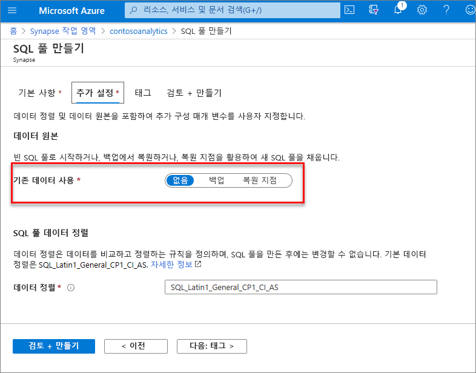
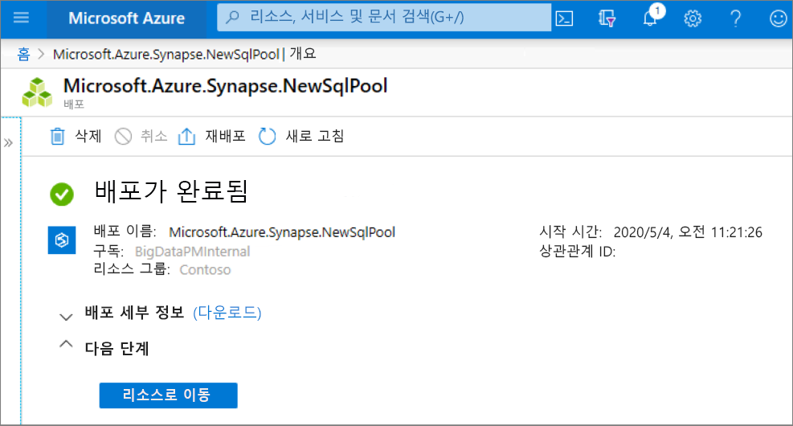
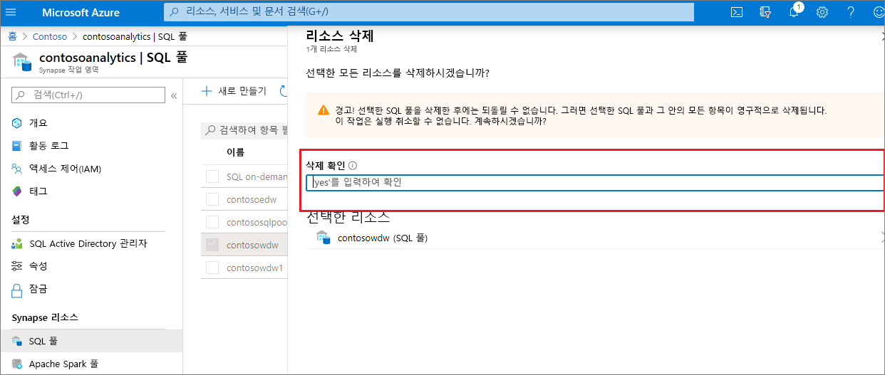

# 빠른 시작: Azure Portal을 사용하여 전용 SQL 풀 만들기

Azure Synapse Analytics는 데이터를 수집, 변환, 모델링 및 분석하는 데 도움이 되는 다양한 분석 엔진을 제공합니다. 전용 SQL 풀은 T-SQL 기반 컴퓨팅 및 스토리지 기능을 제공합니다. Synapse 작업 영역에서 전용 SQL 풀을 만든 후 보다 빠른 인사이트를 위해 데이터를 로드, 모델링, 처리 및 전달할 수 있습니다.

이 빠른 시작에서는 Azure Portal을 사용하여 Synapse 작업 영역에서 전용 SQL 풀을 만드는 방법을 알아봅니다.

Azure 구독이 없는 경우 [시작하기 전에 체험 계정을 만듭니다](https://azure.microsoft.com/free/).

## 사전 요구 사항

- Azure 구독 - [체험 구독 만들기](https://azure.microsoft.com/free/)
- [Synapse 작업 영역](./quickstart-create-workspace.md)

## Azure Portal에 로그인

[Azure 포털](https://portal.azure.com/)

## Synapse 작업 영역으로 이동

1. 검색 창에 서비스 이름(또는 리소스 이름)을 직접 입력하여 전용 SQL 풀이 생성될 때 Synapse 작업 영역으로 이동합니다.
 
1. 작업 영역 목록에서 열려는 작업 영역의 이름(또는 이름의 일부)을 입력합니다. 이 예제에서는 **contosoanalytics** 라는 작업 영역을 사용합니다.

## 새 전용 SQL 풀 만들기

1. 전용 SQL 풀을 만들려는 Synapse 작업 영역의 위쪽 표시줄에서 **새 전용 SQL 풀** 명령을 선택합니다.

2. **기본 사항** 탭에서 다음 정보를 입력합니다.

    | 설정 | 제안 값 | Description |
    | :------ | :-------------- | :---------- |
    | **전용 SQL 풀 이름** | 유효한 이름 | 전용 SQL 풀의 이름입니다. |
    | **성능 수준** | DW100c | 이 빠른 시작에서는 비용을 줄이기 위해 이 값을 가장 작은 크기로 설정합니다. |

  
    

    > [!IMPORTANT]
    > 전용 SQL 풀이 사용할 수 있는 이름과 관련된 제한 사항이 있습니다. 이름은 특수 문자를 포함할 수 없고, 15자 이하여야 하고, 예약어를 포함할 수 없고, 작업 영역에서 고유해야 합니다.

3. 완료되면 **다음: 추가 설정** 을 선택하여 사용자 지정 설정을 더 많이 구성합니다.
4. **없음** 을 선택하여 데이터 없이 전용 SQL 풀을 프로비저닝합니다. 기본 데이터 정렬을 선택한 상태로 둡니다.

    복원 지점에서 전용 SQL 풀을 복원하려면 **복원 지점** 을 선택합니다. 복원을 수행하는 방법에 대한 자세한 내용은 [방법: 기존 전용 SQL 풀 복원](backuprestore/restore-sql-pool.md)을 참조하세요.

5. **검토 + 만들기** 를 선택합니다.
6. 이전에 입력한 내용에 따라 세부 정보가 올바른지 확인합니다. **만들기** 를 선택합니다.

7. 이제 리소스 프로비저닝 흐름이 시작됩니다.
 

8. 프로비저닝이 완료된 후 작업 영역으로 돌아가면 새로 만든 전용 SQL 풀에 대한 새 항목이 표시됩니다.
 

전용 SQL 풀이 생성되면 작업 영역에서 데이터를 로드하고, 스트림을 처리하고, 레이크에서 읽기 등에 사용할 수 있습니다.

## 리소스 정리

작업 영역에서 전용 SQL 풀을 삭제하려면 다음 단계를 수행합니다.
> [!WARNING]
> 전용 SQL 풀을 삭제하면 분석 엔진과 삭제된 전용 SQL 풀의 데이터베이스에 저장된 데이터가 작업 영역에서 모두 제거됩니다. 그러면 더 이상 전용 SQL 풀에 연결할 수 없으며, 이 전용 SQL 풀에 대한 읽기 또는 쓰기 권한이 있는 모든 쿼리, 파이프라인 및 Notebook은 더 이상 작동하지 않습니다.

전용 SQL 풀을 삭제하려면 다음 단계를 완료합니다.

1. 작업 영역에서 SQL 풀 블레이드로 이동합니다.
1. 삭제할 전용 SQL 풀을 선택합니다(이 경우 **contosowdw**).
1. 선택했으면 **삭제** 를 누릅니다.
1. 삭제를 확인하고 **삭제** 단추 를 누릅니다.
1. 프로세스가 성공적으로 완료되면 전용 SQL 풀이 작업 영역 리소스에 더 이상 나열되지 않습니다.

## 다음 단계

- [빠른 시작: 웹 도구를 사용하여 Synapse Studio에서 서버리스 Apache Spark 풀 만들기](quickstart-apache-spark-notebook.md)를 참조하세요.
- [빠른 시작: Azure Portal을 사용하여 서버리스 Apache Spark 풀 만들기](quickstart-create-apache-spark-pool-portal.md)를 참조하세요.
