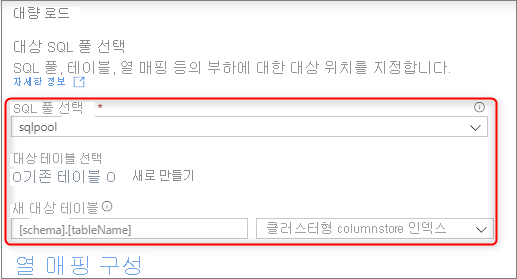
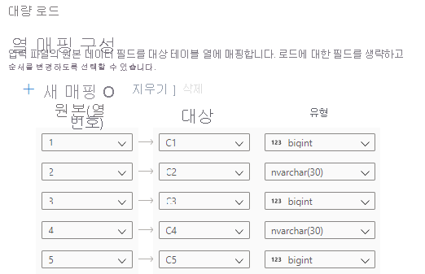

# Synapse SQL을 사용하여 대량 로드

Synapse Studio에서 대량 로드 마법사를 사용하는 것보다 더 쉽게 데이터를 로드하는 방법은 없습니다. 이 마법사는 [COPY 문](https://docs.microsoft.com/sql/t-sql/statements/copy-into-transact-sql?view=azure-sqldw-latest)을 사용하여 T-SQL 스크립트를 만드는 방법부터 데이터를 대량으로 로드하는 방법까지 안내합니다. 

## 대량 로드 마법사의 진입점

이제 Synapse Studio 내에서 다음 영역을 간단하게 마우스 오른쪽 단추로 클릭하면 SQL 풀을 사용하여 간단하게 데이터를 대량 로드할 수 있습니다.

- 작업 영역에 연결된 Azure 스토리지 계정의 파일 또는 폴더 

## 사전 요구 사항

- 작업 영역에 대한 액세스 권한(ADLS Gen2 계정에 대한 Storage Blob 데이터 기여자 RBAC 역할 이상)이 있어야 합니다.

- 데이터를 로드할 테이블을 새로 만들려면 [COPY 문 사용 권한](https://docs.microsoft.com/sql/t-sql/statements/copy-into-transact-sql?view=azure-sqldw-latest#permissions) 및 테이블 만들기 권한이 필요합니다.

- ADLS Gen2 계정과 연결되는 연결된 서비스에는 데이터를 로드할 **파일**/**폴더**에 대한 액세스 권한이 있어야 합니다. 예를 들어 연결된 서비스 인증 메커니즘이 관리 ID인 경우 작업 영역 관리 ID에는 스토리지 계정에 대한 Storage Blob 읽기 권한자 이상의 권한이 있어야 합니다.

- 작업 영역에서 VNet을 사용하는 경우 원본 데이터 및 오류 파일 위치에 대한 ADLS Gen2 계정 연결 서비스에 연결된 통합 런타임에서 대화형 작성을 사용하도록 설정해야 합니다. 마법사 내에서 자동 스키마를 검색하고, 원본 파일 내용을 미리 살펴보고, ADLS Gen2 스토리지 계정을 검색하려면 대화형 작성 기능이 필요합니다.

### 단계

1. 원본 스토리지 위치 패널에서 데이터를 로드하는 스토리지 계정과 파일 또는 폴더를 선택합니다. 

2. 거부된 행(오류 파일)을 기록할 스토리지 계정을 포함하여 파일 형식 설정을 선택합니다. 현재는 CSV 및 Parquet 파일만 지원됩니다.

    

3. "데이터 미리 보기"를 클릭하면 파일 형식 설정을 구성하는 데 도움이 되도록 COPY 문이 파일을 구문 분석하는 방법을 확인할 수 있습니다. 파일 형식 설정을 변경할 때마다 "데이터 미리 보기"를 클릭하여 COPY 문이 업데이트된 설정으로 파일을 구문 분석하는 방법을 확인하세요.  

4. 기존 테이블에 로드할 것인지 아니면 새 테이블에 로드할 것인지 여부를 포함하여 데이터 로드에 사용할 SQL 풀을 선택합니다. 

5. "열 매핑 구성"을 클릭하여 열 매핑이 적절한지 확인합니다. 새 테이블의 경우 대상 열 데이터 형식을 업데이트하려면 열 매핑을 구성해야 합니다. 

6. "스크립트 열기"를 클릭하면 데이터 레이크에서 로드하는 COPY 문을 사용하여 T-SQL 스크립트가 생성됩니다. 

## 다음 단계

- COPY 기능에 대한 자세한 내용은 [COPY 문](https://docs.microsoft.com/sql/t-sql/statements/copy-into-transact-sql?view=azure-sqldw-latest#syntax) 문서를 참조하세요.
- [데이터 로딩 개요](https://docs.microsoft.com/azure/synapse-analytics/sql-data-warehouse/design-elt-data-loading#what-is-elt) 문서를 확인하세요.
