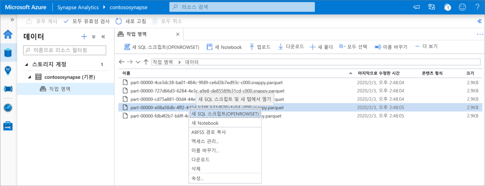
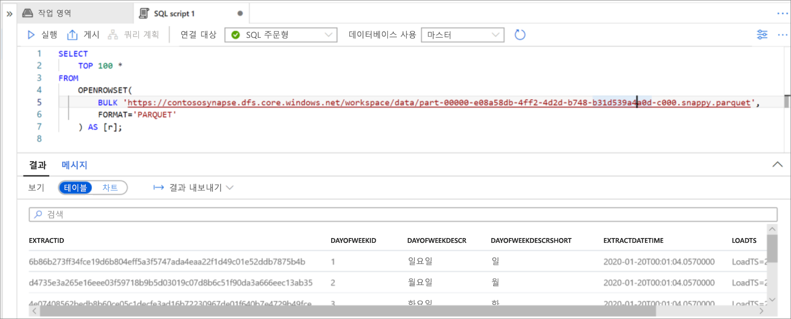

# 빠른 시작: Synapse Studio 사용(미리 보기)

이 빠른 시작에서는 Synapse Studio를 사용하여 파일을 쿼리하는 방법을 알아봅니다.

Azure 구독이 아직 없는 경우 시작하기 전에 [체험](https://azure.microsoft.com/free/) 계정을 만듭니다.

## Azure Portal에 로그인

[Azure Portal](https://portal.azure.com/)에 로그인합니다.

## 사전 요구 사항

[Azure Synapse 작업 영역 및 연결된 스토리지 계정을 만듭니다](quickstart-create-workspace.md).

## Synapse Studio 시작

Azure Portal의 Azure Synapse 작업 영역에서 **Synapse Studio 시작**을 클릭합니다.

또는 [Azure Synapse Analytics](https://web.azuresynapse.net)를 클릭하고 적절한 테넌트, 구독 및 작업 영역 값을 제공하여 Synapse Studio를 시작할 수 있습니다.

## 스토리지 계정 찾아보기

Synapse Studio를 연 후 **데이터**로 이동한 다음, **스토리지 계정**을 확장하여 작업 영역에서 스토리지 계정을 확인합니다.

도구 모음의 링크를 사용하여 파일을 구성하여 새 폴더를 만들고 파일을 업로드할 수 있습니다.

## 스토리지 계정에서 파일 쿼리

> [!IMPORTANT]
> 파일을 쿼리하려면 기본 스토리지에 대한 `Storage Blob Reader` 역할의 멤버여야 합니다. [Azure Storage에 대한 **Storage Blob 데이터 읽기 권한자** 또는 **Storage Blob 데이터 기여자** RBAC 권한을 할당](../storage/common/storage-auth-aad-rbac-portal.md?toc=/azure/synapse-analytics/toc.json&bc=/azure/synapse-analytics/breadcrumb/toc.json#assign-a-built-in-rbac-role)하는 방법에 대해 알아봅니다.

1. 일부 `PARQUET` 파일을 업로드합니다.
2. 하나 이상의 파일을 선택한 다음, 새 SQL 스크립트나 Spark Notebook을 만들어 파일의 콘텐츠를 확인합니다. Notebook을 만들려면 [Synapse 작업 영역에서 Apache Spark 풀](quickstart-create-apache-spark-pool-studio.md)을 만들어야 합니다.

   

3. 생성된 쿼리 또는 Notebook을 실행하여 파일의 콘텐츠를 확인합니다.

   

4. 쿼리를 변경하여 결과를 필터링하고 정렬할 수 있습니다. [SQL 기능 개요](sql/overview-features.md)의 SQL 주문형에서 사용할 수 있는 언어 기능을 찾습니다.

## 다음 단계

- [Azure Storage에 대한 **Storage Blob 데이터 읽기 권한자** 또는 **Storage Blob 데이터 기여자** RBAC 권한을 할당하여](../storage/common/storage-auth-aad-rbac-portal.md?toc=/azure/synapse-analytics/toc.json&bc=/azure/synapse-analytics/breadcrumb/toc.json#assign-a-built-in-rbac-role) Azure AD 사용자가 파일을 쿼리할 수 있습니다.
- [SQL 주문형을 사용하여 Azure Storage에서 파일 쿼리](sql/on-demand-workspace-overview.md)
- [Azure Portal을 사용하여 Apache Spark 풀 만들기](quickstart-create-apache-spark-pool-portal.md)
- [Azure Storage에 저장된 파일에 대한 Power BI 보고서 만들기](sql/tutorial-connect-power-bi-desktop.md)
