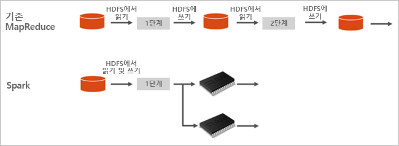

# Azure Synapse Analytics의 Apache Spark

Apache Spark는 메모리 내 처리를 지원하여 빅 데이터 분석 애플리케이션의 성능을 향상하는 병렬 처리 프레임워크입니다. Azure Synapse Analytics의 Apache Spark는 Microsoft가 구현한 클라우드의 Apache Spark 중 하나입니다. Azure Synapse를 사용하면 Azure에서 Spark 풀(미리 보기)을 쉽게 만들고 구성할 수 있습니다. Azure Synapse의 Spark 풀은 Azure Storage 및 Azure Data Lake 2세대 스토리지와 호환됩니다. 따라서 Azure Spark 풀을 사용하여 Azure에 저장된 데이터를 처리할 수 있습니다.

[!INCLUDE [preview](../includes/note-preview.md)]

## Apache Spark란?

Apache Spark는 메모리 내 클러스터 컴퓨팅을 위한 기본 형식을 제공합니다. Spark 작업은 메모리로 데이터를 로드하고 캐시하여 반복적으로 쿼리할 수 있습니다. 메모리 내 컴퓨팅은 디스크 기반 애플리케이션보다 훨씬 빠릅니다. 또한 Spark는 여러 프로그래밍 언어와 통합되기 때문에 로컬 컬렉션과 같은 분산 데이터 세트를 조작할 수 있습니다. 매핑 및 reduce 작업으로 모든 것을 구조화하지 않아도 됩니다.

Azure Synapse의 Spark 풀은 완전 관리형 Spark 서비스를 제공합니다. Synapse Analytics에서 Spark 풀을 만들면 다음과 같은 이점이 있습니다.

| 기능 | Description |
| --- | --- |
| 속도 및 효율성 |Spark 인스턴스는 60개 미만의 노드의 경우 약 2분 안에 시작되고 60개가 넘는 노드의 경우 약 5분 안에 시작됩니다. 인스턴스는 노트북 연결로 유지되지 않는 한, 기본적으로 마지막 작업이 실행된 후 5분이 지나면 종료됩니다. |
| 만들기 편의성 |Azure Portal, Azure PowerShell 또는 Synapse Analytics .NET SDK를 사용하여 몇 분 안에 Azure Synapse에서 새 Spark 풀을 만들 수 있습니다. [Synapse Analytics에서 Spark 풀 시작](../quickstart-create-apache-spark-pool-studio.md)을 참조하세요. |
| 사용 편의성 |Synapse Analytics에는 [Nteract](https://nteract.io/)에서 파생된 사용자 지정 노트북이 포함되어 있습니다. 이러한 노트북을 대화형 데이터 처리 및 시각화에 사용할 수 있습니다.|
| REST API |Synapse Analytics의 Spark에는 작업을 원격으로 제출하고 모니터링하는 REST API 기반 Spark 작업 서버인 [Apache Livy](https://github.com/cloudera/hue/tree/master/apps/spark/java#welcome-to-livy-the-rest-spark-server)가 포함되어 있습니다. |
| Azure Data Lake Storage 2세대에 대한 지원| Azure Synapse의 Spark 풀은 Blob Storage뿐만 아니라 Azure Data Lake Storage 2세대를 사용할 수 있습니다. Data Lake Storage에 대한 자세한 내용은 [Azure Data Lake Storage 개요](../../data-lake-store/data-lake-store-overview.md)를 참조하세요. |
| 타사 IDE와의 통합 | Azure Synapse는 애플리케이션을 만들어 Spark 풀에 제출하는 데 유용한 [JetBrains의 IntelliJ IDEA](https://www.jetbrains.com/idea/)용 IDE 플러그 인을 제공합니다. |
| 미리 로드된 Anaconda 라이브러리 |Azure Synapse의 Spark 풀에는 Anaconda 라이브러리가 미리 설치되어 제공됩니다. [Anaconda](https://docs.continuum.io/anaconda/) 는 기계 학습, 데이터 분석, 시각화 등을 위해 약 200개의 라이브러리를 제공합니다. |
| 확장성 | Azure Synapse의 Apache Spark 풀에 자동 크기 조정을 사용하도록 설정하여, 필요에 따라 노드를 추가하거나 제거하여 풀을 확장할 수 있습니다. 또한 모든 데이터가 Azure Storage 또는 Data Lake Storage에 저장되므로 데이터 손실 없이 Spark 풀을 종료할 수 있습니다. |

Azure Synapse의 Spark 풀에는 풀에서 기본적으로 사용할 수 있는 다음 구성 요소가 포함됩니다.

- [Spark Core](https://spark.apache.org/docs/2.4.5/). Spark Core, Spark SQL, GraphX 및 MLlib가 포함됩니다.
- [Anaconda](https://docs.continuum.io/anaconda/)
- [Apache Livy](https://github.com/cloudera/hue/tree/master/apps/spark/java#welcome-to-livy-the-rest-spark-server)
- [Nteract 노트북](https://nteract.io/)

## Spark 풀 아키텍처

Spark가 Synapse Analytics에서 실행되는 방식을 이해하면 Spark의 구성 요소를 쉽게 이해할 수 있습니다.

Spark 애플리케이션은 주 프로그램(드라이버 프로그램이라고 함)의 SparkContext 개체에 의해 조정된 풀에서 독립 프로세스 세트로 실행됩니다.

SparkContext는 애플리케이션 전체에 리소스를 할당하는 클러스터 관리자에 연결할 수 있습니다. 클러스터 관리자는 [Apache Hadoop YARN](https://hadoop.apache.org/docs/current/hadoop-yarn/hadoop-yarn-site/YARN.html)입니다. 일단 연결되면 Spark는 풀의 노드에서 실행기를 가져오며. 이것은 계산을 실행하고 애플리케이션의 데이터를 저장하는 프로세스입니다. 그런 다음, 애플리케이션 코드(SparkContext에 전달된 JAR 또는 Python 파일에 의해 정의됨)를 실행기에 보냅니다. 마지막으로, SparkContext는 실행할 실행기로 작업을 전송합니다.

SparkContext는 사용자의 main 함수를 실행하고 노드에서 다양한 병렬 작업을 실행합니다. 그런 다음, SparkContext는 작업 결과를 수집합니다. 노드는 파일 시스템에서 데이터를 읽고 씁니다. 또한 노드는 변환된 데이터를 RDD(Resilient Distributed Datasets)로 메모리 내에 캐시합니다.

SparkContext는 Spark 풀에 연결되며 애플리케이션을 DAG(방향성 비순환 그래프)로 변환하는 작업을 담당합니다. 그래프는 노드의 실행기 프로세스 내에서 실행되는 개별 작업으로 구성됩니다. 각 애플리케이션은 전체 애플리케이션의 기간에 대해 유지하고 여러 스레드에서 작업을 실행하는 자체 실행기 프로세스를 가져옵니다.

## Synapse Analytics의 Apache Spark 사용 사례

Synapse Analytics의 Spark 풀을 사용하면 다음과 같은 주요 시나리오가 가능합니다.

### 데이터 엔지니어링/데이터 준비

Apache Spark에는 많은 양의 데이터 준비 및 처리를 지원하는 많은 언어 기능이 포함되어 있어서, Synapse Analytics 내의 다른 서비스에서 보다 유용하게 사용할 수 있습니다. 이러한 기능은 여러 언어(C#, Scala, PySpark, Spark SQL) 및 처리와 연결을 위해 제공된 라이브러리를 통해 사용할 수 있습니다.

### Machine Learning

Apache Spark에는 Synapse Analytics의 Spark 풀에서 사용할 수 있는 Spark에 기반하여 구축된 기계 학습 라이브러리인 [MLlib](https://spark.apache.org/mllib/)가 함께 제공됩니다. Synapse Analytics의 Spark 풀에는 기계 학습을 비롯한 다양한 데이터 과학 패키지가 포함된 Python 배포판인 Anaconda도 포함되어 있습니다. 노트북에 기본 제공되는 지원과 결합하면 기계 학습 애플리케이션을 만드는 환경이 갖추어집니다.

## 어디에서 시작할 수 있나요?

다음 문서를 사용하여 Synapse Analytics의 Apache Spark에 대해 자세히 알아볼 수 있습니다.

- [빠른 시작: Azure Synapse에서 Spark 풀 만들기](../quickstart-create-apache-spark-pool-portal.md)
- [빠른 시작: Apache Spark Notebook 만들기](../quickstart-apache-spark-notebook.md)
- [자습서: Apache Spark를 사용한 기계 학습](./apache-spark-machine-learning-mllib-notebook.md)
- [Apache Spark 공식 설명서](https://spark.apache.org/docs/2.4.5/)

> [!NOTE]
> 일부 공식 Apache Spark 설명서는 Spark 콘솔 사용에 의존하지만, Azure Synapse Spark에서는 사용할 수 없으므로 노트북 또는 IntelliJ 환경을 대신 사용합니다.

## 다음 단계

이 개요에서는 Azure Synapse Analytics의 Apache Spark에 대한 기본적인 지식을 알아보았습니다. 다음 문서로 이동하여 Azure Synapse Analytics에서 Spark 풀을 만드는 방법을 알아보세요.

- [Azure Synapse에서 Spark 풀 만들기](../quickstart-create-apache-spark-pool-portal.md)
