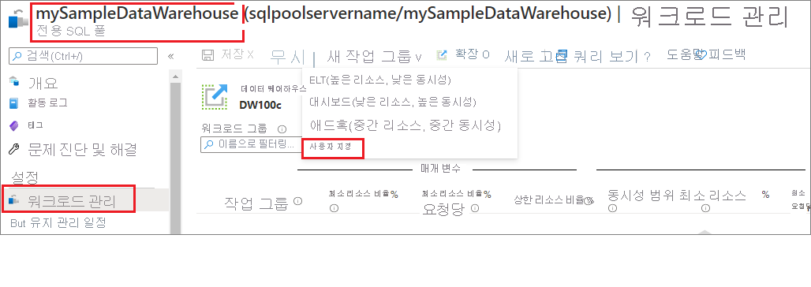
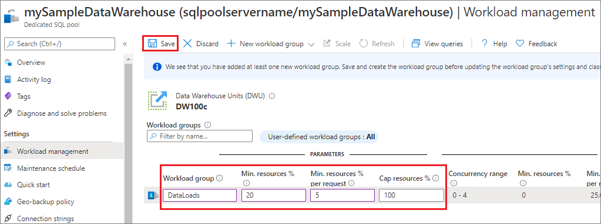

# 빠른 시작: Azure Portal에서 워크로드 그룹을 사용하여 전용 SQL 풀 워크로드 격리 구성

이 빠른 시작에서는 리소스를 예약하는 워크로드 그룹을 만들어 [워크로드 격리](sql-data-warehouse-workload-isolation.md)를 구성합니다.  이 자습서에서는 `DataLoads`라고 하는 데이터 로드에 대한 워크로드 그룹을 만듭니다. 워크로드 그룹은 시스템 리소스의 20%를 예약합니다.  데이터 로드에 대해 20% 격리를 사용하는 경우 리소스는 SLA를 준수할 수 있습니다.  워크로드 그룹을 만든 후에는 이 워크로드 그룹에 쿼리를 할당하는 [워크로드 분류자를 만듭니다](quickstart-create-a-workload-classifier-portal.md).

Azure 구독이 아직 없는 경우 시작하기 전에 [체험](https://azure.microsoft.com/free/) 계정을 만듭니다.

## Azure Portal에 로그인

[Azure Portal](https://portal.azure.com/)에 로그인합니다.

> [!NOTE]
> Azure Synapse Analytics에서 전용 SQL 풀 인스턴스를 만들면 새로운 청구 가능 서비스가 생성될 수 있습니다.  자세한 내용은 [Azure Synapse Analytics 가격 책정](https://azure.microsoft.com/pricing/details/sql-data-warehouse/)을 참조하세요.

## 사전 요구 사항

이 빠른 시작에서는 Synapse SQL에 전용 SQL 풀 인스턴스가 이미 있고 CONTROL DATABASE 권한이 있다고 가정합니다. 새로 만들어야 하는 경우 [빠른 시작: 전용 SQL 풀 만들기 - 포털](../quickstart-create-sql-pool-portal.md)을 사용하여 **mySampleDataWarehouse** 라는 데이터 웨어하우스를 만듭니다.

>[!IMPORTANT] 
>워크로드 관리를 구성하려면 전용 SQL 풀이 온라인 상태여야 합니다. 

## 워크로드 격리 구성

워크로드 그룹을 만들어 특정 워크로드에 대해 전용 SQL 풀 리소스를 격리하고 예약할 수 있습니다.  워크로드 그룹을 통해 워크로드를 관리하는 데 도움이 되는 방법에 대한 자세한 내용은 [워크로드 격리](sql-data-warehouse-workload-isolation.md) 개념 설명서를 참조하세요.  [만들기 및 연결 - 포털](create-data-warehouse-portal.md) 빠른 시작에서 **mySampleDataWarehouse** 를 만들고 DW100c에서 초기화했습니다. 다음 단계는 **mySampleDataWarehouse** 에서 워크로드 그룹을 만듭니다.

20% 격리를 사용하는 워크로드 그룹을 만들려면 다음을 수행합니다.
1.  **mySampleDataWarehouse** 전용 SQL 풀 페이지로 이동합니다.
1.  **워크로드 관리** 를 선택합니다.
1.  **새 워크로드 그룹** 을 선택합니다.
1.  **사용자 지정** 을 선택합니다.

    

6.  **워크로드 그룹** 에 `DataLoads`를 입력합니다.
7.  **최소 리소스 비율** 에 `20`을 입력합니다.
8.  **요청당 최소 리소스 비율** 에 `5`를 입력합니다.
9.  **상한 리소스 비율** 에 `100`을 입력합니다.
10. **저장** 을 입력합니다.

   

워크로드 그룹을 만들 때 포털 알림이 표시됩니다.  워크로드 그룹 리소스는 구성된 값 아래의 차트에 표시됩니다.

   

## 리소스 정리

이 자습서에서 만든 `DataLoads` 워크로드 그룹을 삭제하려면 다음을 수행합니다.
1. `DataLoads` 워크로드 그룹의 오른쪽에 있는 **`...`** 를 클릭합니다.
2. **워크로드 그룹 삭제** 를 클릭합니다.
3. 워크로드 그룹 삭제를 확인하는 메시지가 표시되면 **예** 를 클릭합니다.
4. **Save** 를 클릭합니다.

   

데이터 웨어하우스 단위 및 데이터 웨어하우스에 저장된 데이터에 대해 요금이 청구됩니다. 이러한 컴퓨팅 및 스토리지 리소스에 대한 요금이 별도로 청구됩니다.

- 데이터를 스토리지에 보관하려는 경우 데이터 웨어하우스를 사용하지 않을 때 컴퓨팅을 일시 중지할 수 있습니다. 컴퓨팅을 일시 중지하면 데이터 스토리지 비용만 부과됩니다. 데이터로 작업할 준비가 되면 컴퓨팅을 다시 시작합니다.
- 앞으로 요금이 부과되지 않게 하려면 데이터 웨어하우스를 삭제하면 됩니다.

다음 단계에 따라 리소스를 정리합니다.

1. [Azure Portal](https://portal.azure.com)에 로그인하여 전용 SQL 풀을 선택합니다.

    

2. 컴퓨팅을 일시 중지하려면 **일시 중지** 단추를 선택합니다. 데이터 웨어하우스가 일시 중지되면 **시작** 단추가 표시됩니다.  컴퓨팅을 다시 시작하려면 **시작** 을 선택합니다.

3. 컴퓨팅 또는 스토리지에 대한 요금이 청구되지 않도록 데이터 웨어하우스를 제거하려면 **삭제** 를 선택합니다.

## 다음 단계

`DataLoads` 워크로드 그룹을 사용하려면 요청을 워크로드 그룹으로 라우팅하기 위해 [워크로드 분류자](/sql/t-sql/statements/create-workload-classifier-transact-sql?toc=/azure/synapse-analytics/sql-data-warehouse/toc.json&bc=/azure/synapse-analytics/sql-data-warehouse/breadcrumb/toc.json&view=azure-sqldw-latest)를 만들어야 합니다.  [워크로드 분류자 만들기](quickstart-create-a-workload-classifier-portal.md) 자습서를 계속 진행하여 `DataLoads`에 대한 워크로드 분류자를 만듭니다.

## 참고 항목
워크로드 관리에 대한 워크로드를 모니터링하는 방법에 대한 자세한 내용은 방법 문서 [Workload Management 관리 및 모니터링](sql-data-warehouse-how-to-manage-and-monitor-workload-importance.md)을 참조하세요.
