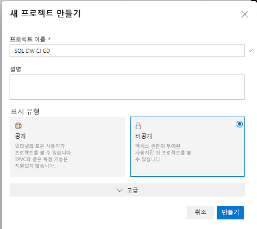
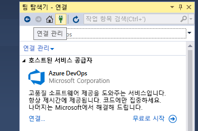
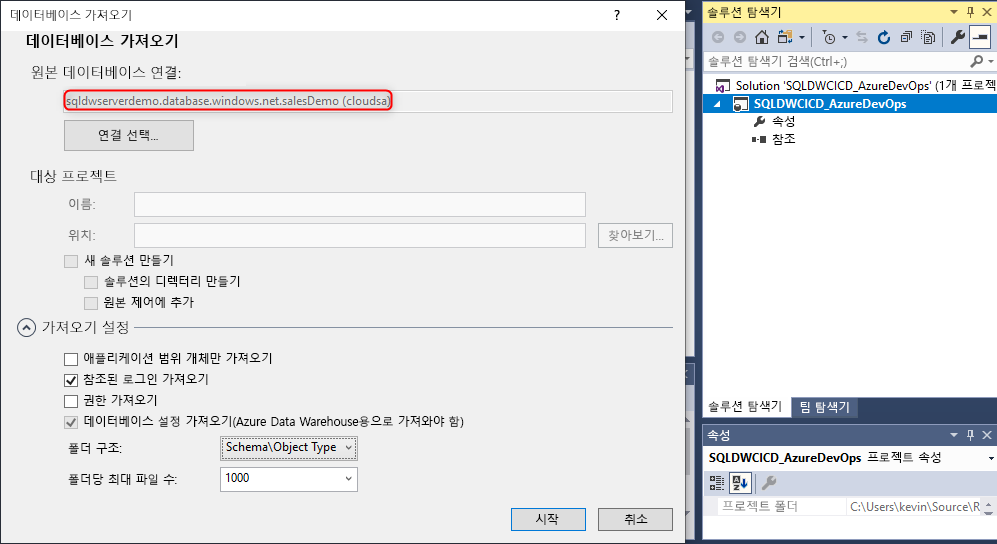
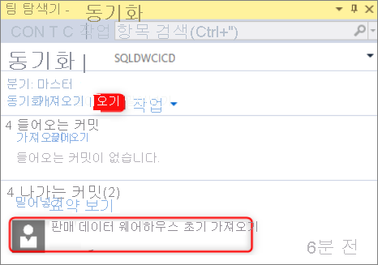
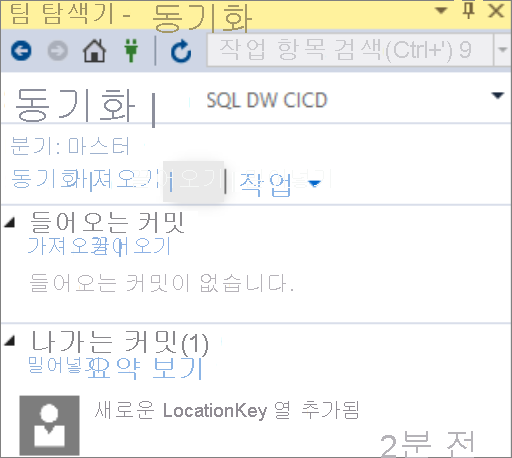
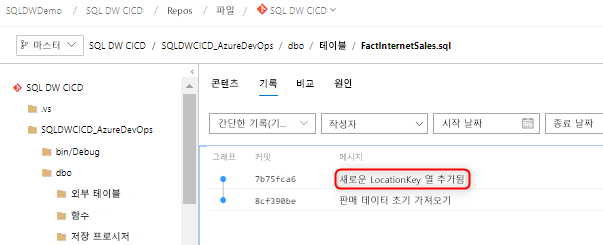

# SQL 풀에 대한 원본 제어 통합

이 자습서에서는 SSDT(SQL Server Data Tools) 데이터베이스 프로젝트를 소스 제어와 통합하는 방법에 대해 간략하게 설명합니다.  원본 제어 통합은 Azure Synapse Analytics에서 SQL 풀 리소스를 사용하여 지속적인 통합 및 배포 파이프라인을 빌드하는 첫 번째 단계입니다.

## 시작하기 전에

- [Azure DevOps 조직](https://azure.microsoft.com/services/devops/)에 가입
- [만들기 및 연결](create-data-warehouse-portal.md) 자습서 진행
- [Visual Studio 2019 설치](https://visualstudio.microsoft.com/vs/older-downloads/)

## Azure DevOps 설정 및 연결

1. Azure DevOps 조직에서 Azure Repo 리포지토리를 통해 SSDT 데이터베이스 프로젝트를 호스트하는 프로젝트를 만듭니다.

   

2. Visual Studio를 열고 "연결 관리"를 선택하여 1단계에서 Azure DevOps 조직 및 프로젝트에 연결합니다.

   

   

3. 프로젝트의 Azure Repo 리포지토리를 로컬 머신에 복제

   

## 프로젝트 생성 및 연결

1. Visual Studio에서 **로컬 복제 리포지토리**의 디렉터리와 로컬 Git 리포지토리를 모두 사용하여 새 SQL Server 데이터베이스 프로젝트를 만듭니다.

     

2. 빈 sqlproject를 마우스 오른쪽 단추로 클릭하고 데이터 웨어하우스를 데이터베이스 프로젝트로 가져옵니다.

     

3. Visual Studio의 팀 탐색기에서 로컬 Git 리포지토리에 대한 모든 변경 내용을 커밋합니다.

     

4. 변경 내용이 복제된 리포지토리에 로컬로 커밋되었으므로 Azure DevOps 프로젝트에서 변경 내용을 Azure Repo 리포지토리에 동기화하고 푸시합니다.

   

     

## 유효성 검사

1. Visual Studio SSDT(SQL Server Data Tools)에서 데이터베이스 프로젝트의 테이블 열을 업데이트하여 변경 내용이 Azure Repo에 푸시되었는지 확인합니다.

   

2. 로컬 리포지토리에서 Azure Repo로 변경 내용 커밋 및 푸시

   

3. 변경 내용이 Azure Repo 리포지토리에 푸시되었는지 확인합니다.

   

4. (**선택 사항**) 스키마 비교를 사용하고 SSDT를 사용하여 대상 데이터 웨어하우스의 변경 내용을 업데이트하여 Azure Repo 리포지토리 및 로컬 리포지토리의 개체 정의가 데이터 웨어하우스에 반영되도록 합니다.

## 다음 단계

- [SQL 풀 개발](sql-data-warehouse-overview-develop.md)
