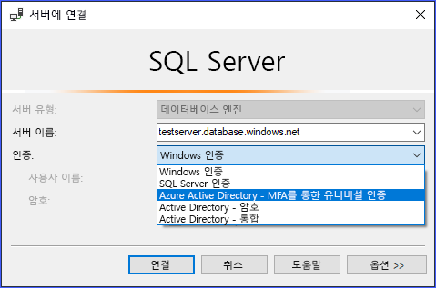
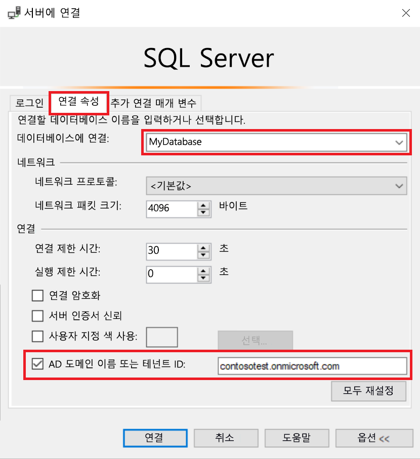
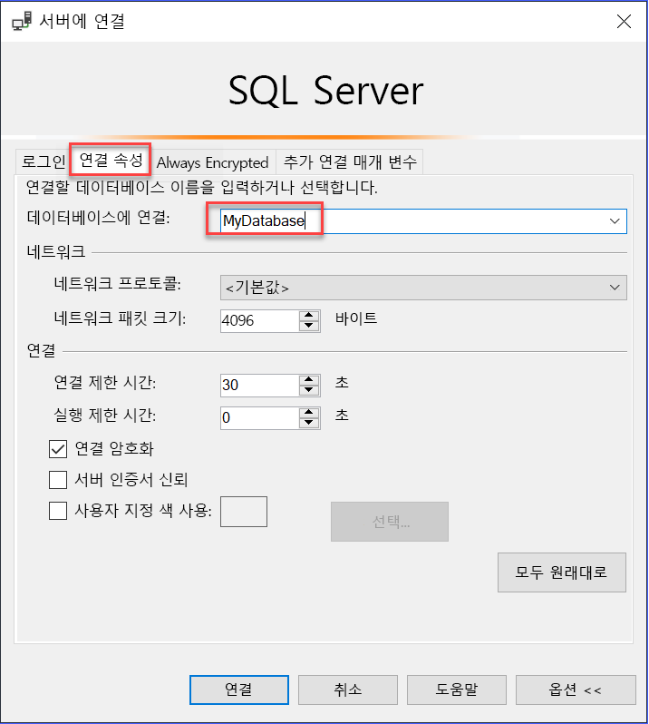

# Synapse SQL에서 다단계 AAD 인증 사용(MFA용 SSMS 지원)

Synapse SQL은 *Active Directory 유니버설 인증*을 사용하여 SSMS(SQL Server Management Studio)에서 연결을 지원합니다. 

이 문서에서는 다양한 인증 옵션 간의 차이점과 유니버설 인증 사용과 관련된 제한 사항에 대해 설명합니다. 

**최신 SSMS 다운로드** - 클라이언트 컴퓨터에서 최신 SSMS 버전을 [SSMS(SQL Server Management Studio) 다운로드](https://msdn.microsoft.com/library/mt238290.aspx)에서 다운로드합니다. 

**최신 SSMS 다운로드** - 클라이언트 컴퓨터에서 최신 SSMS 버전을 [SSMS(SQL Server Management Studio) 다운로드](/sql/ssms/download-sql-server-management-studio-ssms?toc=/azure/synapse-analytics/toc.json&bc=/azure/synapse-analytics/breadcrumb/toc.json&view=azure-sqldw-latest)에서 다운로드합니다.

이 문서에서 설명하는 모든 기능에 대해 2017년 7월 버전 17.2 이상을 사용합니다.  가장 최근의 연결 대화 상자는 다음 이미지와 유사하게 표시됩니다.

  

## 5가지 인증 옵션  

Active Directory 유니버설 인증은 다음과 같은 두 가지 비대화형 인증 방법을 지원합니다.
    - `Active Directory - Password` 인증
    - `Active Directory - Integrated` 인증

두 개의 비대화형 인증 모델도 있으며, 이는 다양한 애플리케이션(ADO.NET, JDCB, ODC 등)에서 사용할 수 있습니다. 이러한 두 가지 방법을 사용할 경우 팝업 대화 상자가 표시되지 않습니다.

- `Active Directory - Password`
- `Active Directory - Integrated`

Azure MFA(다단계 인증)도 지원하는 대화형 방법은 다음과 같습니다.

- `Active Directory - Universal with MFA`

Azure MFA를 사용하면 간단한 로그인 프로세스에 대한 사용자 요구를 충족하는 동시에 데이터 및 애플리케이션에 대한 액세스를 보호할 수 있습니다. 또한 전화 통화, 문자 메시지, PIN을 사용하는 스마트 카드, 모바일 앱 알림 등의 여러 가지 간편한 인증 옵션을 통해 강력한 인증을 제공하므로 사용자는 선호하는 방법을 선택할 수 있습니다. Azure AD를 사용하는 대화형 MFA는 유효성 검사를 위한 팝업 대화 상자를 표시할 수 있습니다.

Multi-Factor Authentication에 대한 설명을 보려면 [Multi-Factor Authentication](../../active-directory/authentication//concept-mfa-howitworks.md?toc=/azure/synapse-analytics/toc.json&bc=/azure/synapse-analytics/breadcrumb/toc.json)을 참조하세요.

### Azure AD 도메인 이름 또는 테넌트 ID 매개 변수

[SSMS 버전 17](/sql/ssms/download-sql-server-management-studio-ssms?toc=/azure/synapse-analytics/toc.json&bc=/azure/synapse-analytics/breadcrumb/toc.json&view=azure-sqldw-latest)부터 다른 Azure Active 디렉터리에서 현재 Active Directory로 가져온 게스트 사용자는 연결할 때 Azure AD 도메인 이름 또는 테넌트 ID를 제공할 수 있습니다. 

게스트 사용자에는 타 Azure AD에서 초대 받은 사용자, outlook.com, hotmail.com, live.com 등의 Microsoft 계정, gmail.com 등의 타 계정이 포함됩니다. 이 정보를 통해 **MFA를 통한 Active Directory 유니버설 인증**에서 올바른 인증 기관을 식별할 수 있습니다. 이 옵션은 outlook.com, hotmail.com 또는 live.com과 같은 Microsoft 계정(MSA)이나 비 MSA 계정을 지원하는 데도 필요합니다. 

유니버설 인증을 사용하여 인증을 받으려면 이러한 모든 사용자는 Azure AD 도메인 이름 또는 테넌트 ID를 입력해야 합니다. 이 매개 변수는 Azure 서버와 연결되는 현재 Azure AD 도메인 이름/테넌트 ID를 나타냅니다. 

예를 들어 Azure 서버가 사용자 `joe@contosodev.onmicrosoft.com`이 Azure AD 도메인 `contosodev.onmicrosoft.com`에서 가져온 사용자로 호스트되는 Azure AD 도메인 `contosotest.onmicrosoft.com`에 연결되는 경우 이 사용자를 인증하는 데 필요한 도메인 이름은 `contosotest.onmicrosoft.com`입니다. 

사용자가 Azure 서버에 연결된 Azure AD의 네이티브 사용자이고 MSA 계정이 아닌 경우 도메인 이름 또는 테넌트 ID는 필요하지 않습니다. 

(SSMS 버전 17.2부터) 매개 변수를 **데이터베이스 연결** 대화 상자에 입력하려면 **Active Directory - MFA를 통한 유니버설**을 선택하여 대화 상자를 입력하고 **옵션**을 클릭한 다음 **사용자 이름** 상자를 입력하고 **연결 속성** 탭을 클릭합니다. 

**AD 도메인 이름 또는 테넌트 ID** 상자를 선택한 다음 인증 기관(예: 도메인 이름, **contosotest.onmicrosoft.com**) 또는 테넌트 ID의 GUID를 제공합니다.  

   

SSMS 18.x 이상을 실행하는 경우 18.x 이상이 자동으로 인식하므로 게스트 사용자에게 AD 도메인 이름 또는 테넌트 ID가 더 이상 필요하지 않습니다.

   

### Azure AD 기업 간 지원   
Azure AD B2B 시나리오에서 게스트 사용자로 지원되는 Azure AD 사용자([Azure B2B 협업이란?](../../active-directory/b2b/what-is-b2b.md?toc=/azure/synapse-analytics/toc.json&bc=/azure/synapse-analytics/breadcrumb/toc.json) 참조)는 현재 Azure AD에서 만들어진 그룹의 구성원에 속하며 지정된 데이터베이스에서 Transact-SQL `CREATE USER` 문을 통해 수동으로 매핑된 Synapse SQL에만 연결할 수 있습니다. 

예를 들어 `steve@gmail.com`이 Azure AD `contosotest`(Azure Ad 도메인 `contosotest.onmicrosoft.com`)에 초대된 경우 Azure AD 그룹(예: `usergroup`)이 `steve@gmail.com` 구성원을 포함하는 Azure AD에 만들어져야 합니다. 그런 다음, Transact-SQL `CREATE USER [usergroup] FROM EXTERNAL PROVIDER` 문을 실행하여 Azure AD SQL 관리자 또는 Azure AD DBO로 특정 데이터베이스(즉, MyDatabase)에 대해 이 그룹을 만들어야 합니다. 

데이터베이스 사용자가 만들어지면 `steve@gmail.com` 사용자가 `Active Directory – Universal with MFA support` SSMS 인증 옵션을 사용하여 `MyDatabase`에 로그인할 수 있습니다. 

기본적으로 사용자 그룹은 연결 권한만 있으며 추가적인 액세스 권한은 일반적인 방식으로 부여 받아야 합니다. 

게스트 사용자인 `steve@gmail.com` 사용자는 확인란을 선택하고 SSMS **연결 속성** 대화 상자에서 `contosotest.onmicrosoft.com` AD 도메인 이름을 추가해야 합니다. **AD 도메인 이름 또는 테넌트 ID** 옵션은 MFA 연결 옵션이 있는 유니버설에서만 지원되며 그 밖의 경우는 회색으로 표시됩니다.

## Synapse SQL에 대한 유니버설 인증 제한 사항

- SSMS 및 SqlPackage.exe는 현재 Active Directory 유니버설 인증을 통해 MFA에서 사용할 수 있는 유일한 도구입니다.
- SSMS 버전 17.2는 MFA를 통한 유니버설 인증을 사용하는 다중 사용자 동시 액세스를 지원합니다. 버전 17.0 및 17.1에서는 유니버설 인증을 사용한 SSMS 인스턴스에 대한 로그인이 단일 Azure Active Directory 계정으로 제한되었습니다. 다른 Azure AD 계정으로 로그인하려면 SSMS의 다른 인스턴스를 사용해야 합니다. (이 제한은 Active Directory 유니버설 인증으로 제한됩니다. Active Directory 암호 인증, Active Directory 통합 인증 또는 SQL Server 인증을 사용하여 다른 서버에 로그인할 수 있습니다.)
- SSMS는 개체 탐색기, 쿼리 편집기 및 쿼리 저장소 시각화에 대해 Active Directory 유니버설 인증을 지원합니다.
- SSMS 버전 17.2는 데이터 데이터베이스 내보내기/추출/배포를 위한 DacFx Wizard 마법사 지원을 제공합니다. 특정 사용자가 유니버설 인증을 사용하여 최초 인증 대화 상자를 통해 인증되면 DacFx 마법사가 모든 다른 인증 방법에서와 같은 방식으로 작동합니다.
- SSMS 테이블 디자이너는 유니버설 인증을 지원하지 않습니다.
- 지원되는 버전의 SSMS를 사용해야 한다는 점을 제외하고, Active Directory 유니버설 인증에 대한 추가적인 소프트웨어 요구 사항은 없습니다.  
- 유니버설 인증을 위한 ADAL(Active Directory Authentication Library) 버전이 제공되는 최신 릴리스인 ADAL.dll 3.13.9로 업데이트되었습니다. [Active Directory 인증 라이브러리 3.14.1](https://www.nuget.org/packages/Microsoft.IdentityModel.Clients.ActiveDirectory/)을 참조하세요.  

## 다음 단계
자세한 내용은 [SQL Server Management Studio를 사용하여 Synapse SQL에 연결](get-started-ssms.md) 문서를 참조하세요. 

