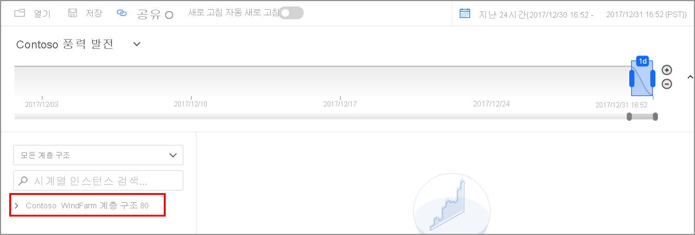
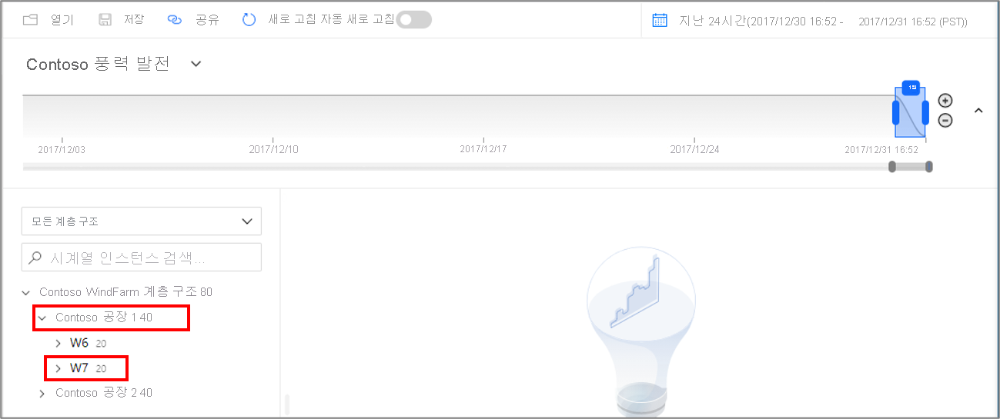
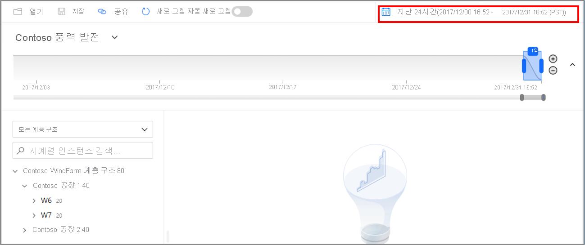
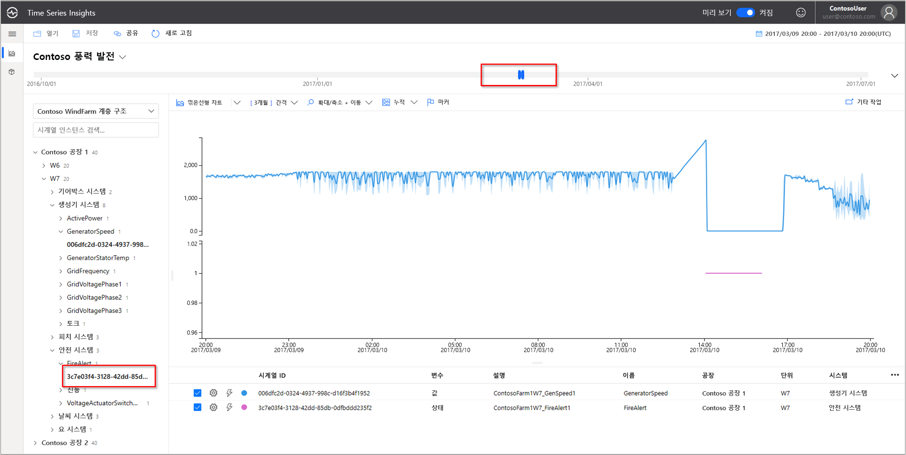
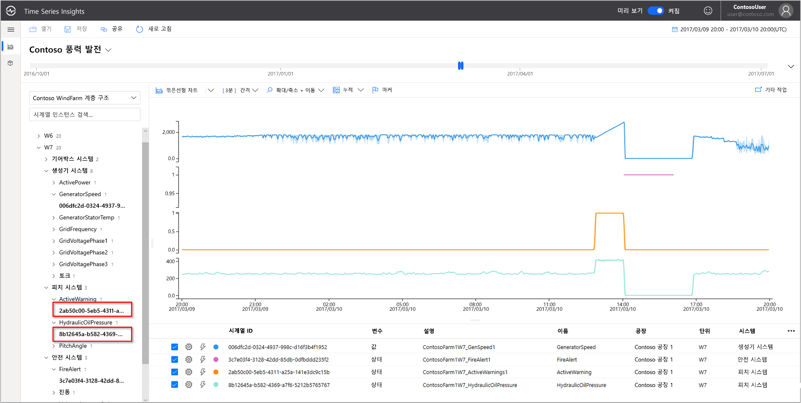
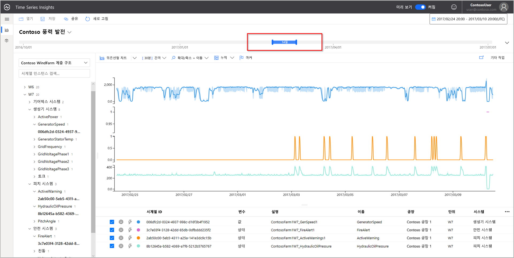
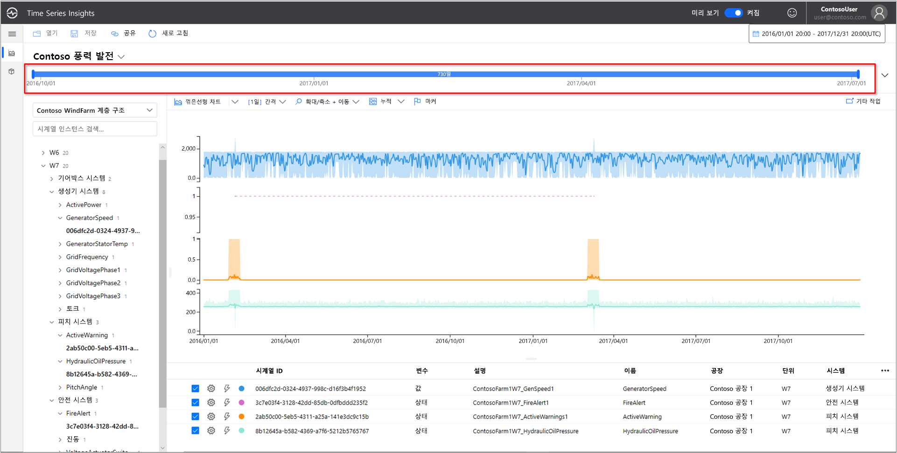
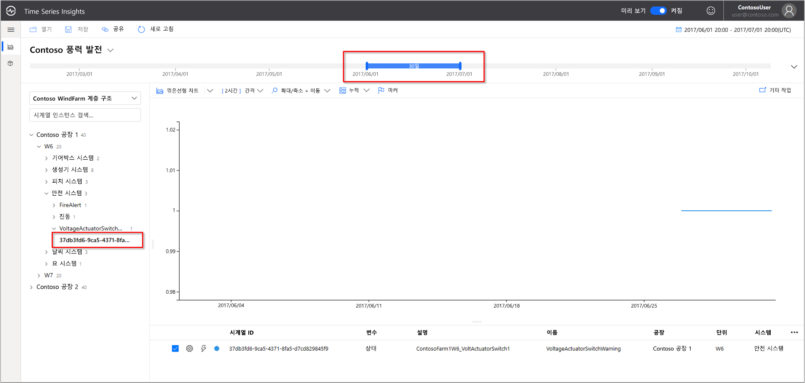
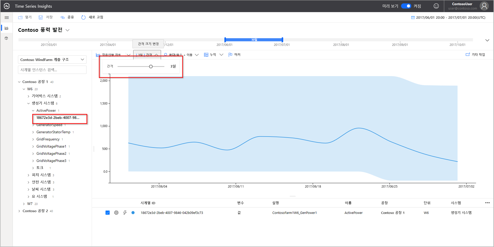
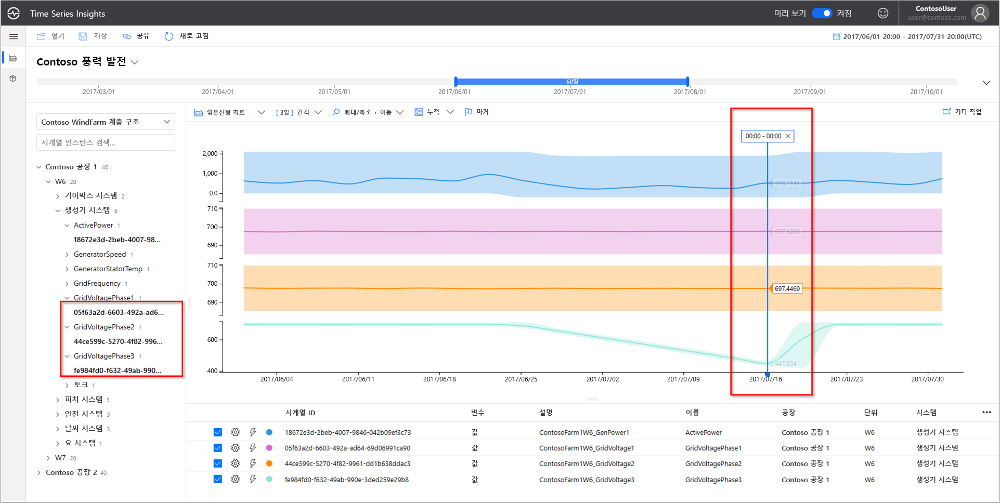

# 빠른 시작: Azure Time Series Insights Gen2 데모 환경 탐색

이 빠른 시작에서는 Azure Time Series Insights Gen2 환경을 사용합니다. 무료 데모에서는 Azure Time Series Insights Gen2에 추가된 주요 기능을 살펴봅니다.

Azure Time Series Insights Gen2 데모 환경에 등장하는 가상 기업 Contoso는 풍력 터빈 팜 두 곳을 운영하고 있습니다. 팜마다 10개의 터빈이 있습니다. 각 터빈에는 1분마다 Azure IoT Hub에 데이터를 보고하는 20개의 센서가 있습니다. 센서는 기상 조건, 블레이드 피치 및 요 위치에 대한 정보를 수집합니다. 발전기 성능, 기어박스 동작 및 안전 모니터 정보도 기록됩니다.

이 빠른 시작에서는 Azure Time Series Insights Gen2를 사용하여 Contoso 데이터에서 실행 가능한 인사이트를 찾는 방법을 알아봅니다. 또한 간단한 근본 원인 분석을 수행하여 중대한 오류를 보다 정확하게 예측하고 유지 관리를 수행합니다.

> [!IMPORTANT]
> Azure 계정이 없는 경우  [Azure 체험 계정](https://azure.microsoft.com/free/?ref=microsoft.com&utm_source=microsoft.com&utm_medium=docs&utm_campaign=visualstudio) 을 만듭니다.

## 데모 환경에서 Azure Time Series Insights Gen2 탐색기 살펴보기

Azure Time Series Insights Gen2 탐색기는 기록 데이터 및 근본 원인 분석 과정을 보여 줍니다. 시작하기:

1.  [Contoso 풍력 팜 데모](https://insights.timeseries.azure.com/preview/samples) 환경으로 이동합니다.  

1. 로그인하라는 메시지가 표시되면 Azure 계정 자격 증명을 사용하여 Azure Time Series Insights Gen2 탐색기에 로그인합니다.

## 기록 데이터 사용

1. **Contoso WindFarm 계층 구조** 를 선택합니다.

   

1. **Contoso Plant 1** 에서 풍력 터빈 **W7** 을 살펴봅니다.

   

   1. 보기 범위를 **1/1/17 20:00:00.00 - 3/10/17 20:00:00.00(UTC)** 로 변경합니다.

      

      

   1. 확대 **(+)** 및 축소 **(-)** 를 사용하여 슬라이드 바를 이동하여 범위 보기를 조정합니다.

      

   1. 센서를 선택하려면 **Contoso Plant 1** > **W7** > **발전기 시스템** > **GeneratorSpeed** 를 선택합니다. 그런 다음, 표시되는 값을 검토합니다.

      

1. 최근에 Contoso는 풍력 터빈 **W7** 에서 화재를 발견했습니다. 화재 원인에 대한 여러 의견이 있습니다. Azure Time Series Insights Gen2에는 화재 발생 시 활성화된 화재 경고 센서가 표시됩니다.

   1. 보기 범위를 **3/9/17 20:00:00.00 - 3/10/17 20:00:00.00(UTC)** 로 변경합니다.
   1. **안전 시스템** > **FireAlert** 를 선택합니다.

      

1. 문제 발생 시에 나타난 다른 이벤트를 검토하여 상황을 이해하세요. 화재 직전에 유압 및 활성 경고가 최대로 높아졌습니다.

   1. **피치 시스템** > **HydraulicOilPressure** 를 선택합니다.
   1. **피치 시스템** > **ActiveWarning** 을 선택합니다.

      

1. 화재가 발생하기 직전에 오일 압력과 활성 경고가 증가했습니다. 표시된 시계열을 확장하여 화재로 이어진 기타 징후가 있었는지 검토합니다. 시간이 지나면서 두 센서 모두 변화를 보입니다. 이 변화는 지속적이고 걱정스러운 패턴을 나타냅니다.

    * 보기 범위를 **2/24/17 20:00:00.00 - 3/10/17 20:00:00.00(UTC)** 로 변경합니다.

      

1. 2년 동안의 기록 데이터를 검토한 결과, 동일한 센서 변화를 보인 다른 화재 이벤트가 확인되었습니다.

    * 보기 범위를 **1/1/16 - 12/31/17**(모든 데이터)로 변경합니다.

      

Azure Time Series Insights Gen2 및 센서 원격 분석을 사용하여 기록 데이터에 숨겨진 장기적인 추세를 발견했습니다. 이러한 새 인사이트를 사용하여 다음과 같은 작업을 수행할 수 있습니다.

* 실제로 발생한 문제를 설명합니다.
* 문제를 해결합니다.
* 더 나은 경고 알림 시스템을 설치합니다.

## 근본 원인 분석

1. 일부 시나리오에서는 데이터의 미묘한 단서를 파악하기 위해 정교한 분석이 필요합니다. 날짜 **6/25** 풍차 **W6** 을 선택합니다.

    1. 보기 범위를 **6/1/17 20:00:00.00 - 7/1/17 20:00:00.00(UTC)** 로 변경합니다.
    1. **Contoso Plant 1** > **W6** > **안전 시스템** > **VoltageActuatorSwitchWarning** 을 선택합니다.

       

1. 경고는 발전기의 전압에 문제가 있음을 나타냅니다. 발전기의 전체 전력 출력은 현재 간격의 정상 범위 내에 있습니다. 이 간격을 늘리면 다른 패턴이 나타납니다. 감소가 발생하는 것이 분명합니다.

    1. **VoltageActuatorSwitchWarning** 센서를 분리합니다.
    1. **발전기 시스템** > **ActivePower** 를 선택합니다.
    1. 간격을 **3일** 로 변경합니다.

       

1. 시간 범위를 확장하여 문제가 중지되었는지 또는 계속되는지를 확인할 수 있습니다.

    * 시간 범위를 60일로 확장합니다.

      

1. 다른 센서 데이터를 추가하면 유용한 상황 정보를 제공할 수 있습니다. 더 많은 센서를 확인할수록 문제에 대한 이해의 폭이 넓어집니다. 실제 값을 표시하기 위해 표식을 놓겠습니다.

    1. **발전기 시스템** 를 선택하고, **GridVoltagePhase1**, **GridVoltagePhase2** 및 **GridVoltagePhase3** 센서를 선택합니다.
    1. 표시 영역의 마지막 데이터 요소에 마커를 놓습니다.

       

    전압 센서 중 두 개는 정상 범위 내에서 비슷하게 작동하고 있습니다. **GridVoltagePhase3** 센서가 문제인 것으로 보입니다.

1. 상황과 관련이 깊은 데이터를 추가하면 3단계 감소가 훨씬 큰 문제인 것처럼 보입니다. 경고의 원인을 파악할 수 있는 좋은 실마리를 찾았습니다. 이제 이 이슈를 유지 관리 팀에 전달할 수 있습니다.  

    * 동일한 차트 배율로 모든 **발전기 시스템** 센서를 오버레이하도록 화면 표시를 변경합니다.

      

## 리소스 정리

이제 이 빠른 시작을 완료했으므로 만든 리소스를 정리합니다.

1. [Azure Portal](https://portal.azure.com)의 왼쪽 메뉴에서 **모든 리소스** 를 선택하고 Azure Time Series Insights Gen2 리소스 그룹을 찾습니다.
1. **삭제** 를 선택하여 전체 리소스 그룹(및 그 안에 포함된 모든 리소스)을 삭제하거나 각 리소스를 개별적으로 제거합니다.

## 다음 단계

여러분만의 Azure Time Series Insights Gen2 환경을 만들 준비가 되었습니다. 시작하려면 다음을 수행합니다.

> [!div class="nextstepaction"]
> [Azure Time Series Insights Gen2 환경 계획](./how-to-plan-your-environment.md)

데모 및 해당 기능을 사용하는 방법을 알아봅니다.

> [!div class="nextstepaction"]
> [Azure Time Series Insights Gen2 탐색기](./concepts-ux-panels.md)
