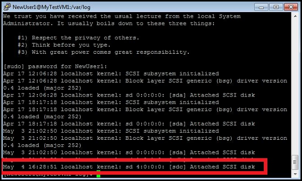
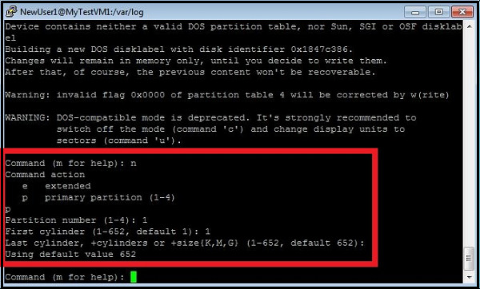
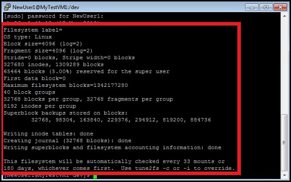

<properties 
	pageTitle="Azure에서 Linux를 실행하는 가상 컴퓨터에 디스크 연결" 
	description="데이터 디스크를 Azure 가상 컴퓨터에 연결하고 사용 가능하도록 초기화하는 방법에 대해 알아봅니다." 
	services="virtual-machines" 
	documentationCenter="" 
	authors="KBDAzure" 
	manager="timlt" 
	editor="tysonn"/>

<tags 
	ms.service="virtual-machines" 
	ms.workload="infrastructure-services" 
	ms.tgt_pltfrm="vm-linux" 
	ms.devlang="na" 
	ms.topic="article" 
	ms.date="1/26/2015" 
	ms.author="kathydav"/>

#Linux 가상 컴퓨터에 데이터 디스크를 연결하는 방법

빈 디스크와 데이터가 포함된 디스크를 모두 연결할 수 있습니다. 두 경우 모두, 디스크는 실제로 Azure 저장소 계정에 상주하는 .vhd 파일입니다. 또한 두 경우 모두 디스크를 연결한 후 초기화를 해야 사용 준비가 완료됩니다. 

> [AZURE.NOTE] 모범 사례는 별도 디스크를 하나 이상 사용하여 가상 컴퓨터의 데이터를 저장하는 것입니다. Azure 가상 컴퓨터를 만들면 운영 체제 디스크와 임시 디스크가 있습니다. **임시 디스크는 데이터 저장에 사용하지 마세요.** 이름이 의미하는 것과 같이 D 드라이브는 임시 저장소만 제공합니다. Azure 저장소에 상주하지 않으므로 중복성이나 백업을 제공하지 않습니다. 
> 임시 디스크는 일반적으로 Azure Linux 에이전트에 의해 관리되며 **/mnt/resource**(또는 Ubuntu 이미지의 **/mnt**)에 자동으로 탑재됩니다. 다른 한편, Linux에서 데이터 디스크 이름은 커널에 의해 `/dev/sdc`로 지정될 수도 있습니다. 이 경우 해당 리소스를 파티셔닝, 형식 지정 및 마운트해야 합니다. 자세한 내용은 [Azure Linux 에이전트 사용자 가이드](http://azure.microsoft.com/manage/linux/how-to-guides/linux-agent-guide/)를 참조하세요.

- [방법: 빈 디스크 연결](#attachempty)
- [방법: 기존 디스크 연결](#attachexisting)
- [방법: Linux에서 새 데이터 디스크 초기화](#initializeinlinux)

[WACOM.INCLUDE [howto-attach-disk-windows-linux](../includes/howto-attach-disk-windows-linux.md)]

##방법: Linux에서 새 데이터 디스크 초기화

1. [Linux를 실행하는 가상 컴퓨터에 로그온하는 방법][logonlinux]에 나열된 단계에 따라 가상 컴퓨터에 연결합니다.

2. SSH 창에서 다음 명령을 입력하고 가상 컴퓨터 관리를 위해 만든 계정의 암호를 입력합니다.

		# sudo grep SCSI /var/log/messages

	>[AZURE.NOTE] 최근 Ubuntu 배포의 경우 `/var/log/messages` 로깅이 기본적으로 사용하지 않도록 설정될 수 있으므로 `sudo grep SCSI /var/log/syslog`를 사용해야 할 수 있습니다. 

	표시되는 메시지에서 추가된 마지막 데이터 디스크의 식별자를 찾을 수 있습니다.

	

3. SSH 창에서 다음 명령을 입력하여 새 장치를 만들고 계정 암호를 입력합니다.

		# sudo fdisk /dev/sdc

	>[AZURE.NOTE] 이 예제에서는 일부 분산에서 `$PATH`에 /sbin 또는 /usr/sbin이 없는 경우 `sudo -i`를 사용해야 할 수도 있습니다.

4. **n**을 입력하여 새 파티션을 만듭니다.

	

5. **p**를 입력하여 파티션을 주 파티션으로 설정하고, **1**을 입력하여 첫 번째 파티션으로 설정한 다음 enter를 입력하여 실린더에 대한 기본값을 적용합니다.

	

6. **p**를 입력하여 분할되는 디스크에 대한 세부 정보를 확인합니다.

	

7. **w**를 입력하여 디스크에 대한 설정을 씁니다.

	

8. 새 파티션에 파일 시스템을 만듭니다. 예를 들어 다음 명령을 입력한 후 계정 암호를 입력합니다.

		# sudo mkfs -t ext4 /dev/sdc1

	

	>[AZURE.NOTE] SUSE Linux Enterprise 11 시스템에서는 ext4 파일 시스템에 대해 읽기 전용 권한만 지원합니다.  이 시스템에서 새 파일 시스템 형식을 ext4 대신 ext3으로 지정하는 것이 좋습니다.

9. 새 파일 시스템을 탑재할 디렉터리를 만듭니다. 예를 들어 다음 명령을 입력한 후 계정 암호를 입력합니다.

		# sudo mkdir /datadrive

10. 다음 명령을 입력하여 드라이브를 탑재합니다.

		# sudo mount /dev/sdc1 /datadrive

	이제 데이터 디스크를 **/datadrive**로 사용할 준비가 되었습니다.

11. /etc/fstab에 새 드라이브를 추가합니다.

	다시 부팅 후 드라이브가 자동으로 다시 탑재되도록 하려면 /etc/fstab 파일에 추가해야 합니다. 또한 /etc/fstab에 UUID(Universally Unique IDentifier)를 사용하여 장치 이름(즉, /dev/sdc1) 대신 드라이브를 가리키는 것이 좋습니다. 새 드라이브의 UUID를 찾으려면 **blkid** 유틸리티를 사용할 수 있습니다.
	
		# sudo -i blkid

	출력은 다음과 유사합니다.

		/dev/sda1: UUID="11111111-1b1b-1c1c-1d1d-1e1e1e1e1e1e" TYPE="ext4"
		/dev/sdb1: UUID="22222222-2b2b-2c2c-2d2d-2e2e2e2e2e2e" TYPE="ext4"
		/dev/sdc1: UUID="33333333-3b3b-3c3c-3d3d-3e3e3e3e3e3e" TYPE="ext4"

	>[AZURE.NOTE] **/etc/fstab** 파일을 부적절하게 편집하면 부팅할 수 없는 시스템이 발생할 수 있습니다. 확실하지 않은 경우 배포 설명서에서 이 파일을 제대로 편집하는 방법에 대한 자세한 내용을 확인하세요. 또한 편집하기 전에 /etc/fstab 파일의 백업을 만드는 것이 좋습니다.

	다음으로, 텍스트 편집기에서 **/etc/fstab** 파일을 엽니다. /etc/fstab은 시스템 파일이므로 이 파일을 편집하려면 `sudo`를 사용해야 합니다. 예를 들면 다음과 같습니다.

		# sudo vi /etc/fstab

	이 예제에서는 이전 단계에서 만든 새 **/dev/sdc1** 장치의 UUID 값과 탑재 지점 **/datadrive**를 사용합니다. **/etc/fstab** 파일의 끝에 다음 줄을 추가합니다.

		UUID=33333333-3b3b-3c3c-3d3d-3e3e3e3e3e3e   /datadrive   ext4   defaults   1   2

	또는 SUSE Linux 기반 시스템에서는 약간 다른 형식을 사용해야 할 수 있습니다.

		/dev/disk/by-uuid/33333333-3b3b-3c3c-3d3d-3e3e3e3e3e3e   /   ext3   defaults   1   2

	이제 이전 단계에서 만든 예제 탑재 지점 `/datadrive`를 사용하여 파일 시스템을 탑재 해제했다가 다시 탑재하여 파일 시스템이 제대로 탑재되었는지 테스트할 수 있습니다. 

		# sudo umount /datadrive
		# sudo mount /datadrive

	`mount` 명령에서 오류가 발생하는 경우 /etc/fstab 파일에서 구문이 올바른지 확인합니다. 추가 데이터 드라이브 또는 파티션이 만들어진 경우 /etc/fstab에 별도로 입력해야 합니다.

	>[AZURE.NOTE] 이후에 fstab을 편집하지 않고 데이터 디스크를 제거하면 VM이 부팅되지 않을 수 있습니다. 이런 경우가 자주 발생하면 대부분의 배포에서 디스크가 부팅 시 탑재되지 않더라도 시스템이 부팅되도록 하는 `nofail` 및/또는 `nobootwait` fstab 옵션을 제공합니다. 이러한 매개 변수에 대한 자세한 내용은 배포 설명서를 참조하세요.

[logonlinux]: ../virtual-machines-linux-how-to-log-on/

<!--HONumber=45--> 
