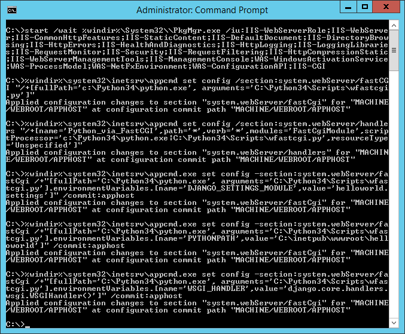

<properties pageTitle="Django를 사용하는 Python 웹 앱 - Azure 자습서" description="Azure에서 Windows Server 2012 R2 Datacenter 가상 컴퓨터를 사용하여 Django 기반 웹사이트를 호스트하는 방법을 설명하는 자습서입니다." services="virtual-machines" documentationCenter="python" authors="huguesv" manager="wpickett" editor=""/>

<tags ms.service="virtual-machines" ms.workload="web" ms.tgt_pltfrm="vm-windows" ms.devlang="python" ms.topic="article" ms.date="09/25/2014" ms.author="huvalo"/>

# Django Hello World 웹 응용 프로그램

<a href="/ko-kr/develop/python/tutorials/web-app-with-django/" title="Windows" class="current">Windows</a><a href="/ko-kr/develop/python/tutorials/django-hello-world-(maclinux)/" title="MacLinux">Mac/Linux</a>

이 자습서에서는 Windows Server 가상 컴퓨터를 사용하여 Microsoft Azure에서 Django 기반 웹 사이트를 
호스트하는 방법에 대해 알아봅니다. 이 자습서에서는 이전에 Azure를 사용한 경험이 없다고 가정합니다. 이 가이드를 완료하면 클라우드에서 Django 기반 응용 프로그램을 실행할 수 있게 됩니다.

다음 방법에 대해 알아봅니다.

* Django를 호스트하도록 Azure 가상 컴퓨터 설정. 이 자습서에서는 **Windows Server**에서 설정하는 방법을 설명하지만 Azure에서 호스트되는 Linux VM에서도 같은 작업을 수행할 수 있습니다. 
* Windows에서 새 Django 응용 프로그램 만들기

이 자습서의 지침에 따라 간단한 Hello World 웹 응용 프로그램을
빌드할 수 있습니다. 응용 프로그램은 Azure 가상 컴퓨터에서 호스트됩니다.

아래에는 완성된 응용 프로그램의 스크린샷이 표시되어 있습니다.

![A browser window displaying the hello world page on Azure][1]

[AZURE.INCLUDE [create-account-and-vms-note](../includes/create-account-and-vms-note.md)]

## Django를 호스트하기 위해 Azure 가상 컴퓨터 만들기 및 구성

1. [여기][portal-vm]에 나와 있는 지침을 따라서  *Windows Server 2012 R2 Datacenter* 배포의 Azure 가상 컴퓨터를 만드세요.

1. 웹을 통해 들어오는 포트 **80** 트래픽을 가상 컴퓨터의 포트 **80**으로 보내도록 Azure에 지시합니다.
 - Azure 포털에서 새로 만든 가상 컴퓨터로 이동하고  *끝점* 탭을 클릭합니다.
 - 화면 아래쪽에 있는  *추가* 단추를 클릭합니다.
	

 -  *TCP* 프로토콜의  *공용 포트 80*을  *개인 포트 80*으로 엽니다.
![][port80]
1.  *대시보드* 탭에서  *연결*을 클릭하여  *원격 데스크톱*을 사용해 새로 만든 Azure 가상 컴퓨터에 원격으로 로그인합니다.  

**중요:** 아래에 설명된 모든 지침에서는 가상 컴퓨터에 올바로 로그인했고 로컬 컴퓨터가 아니라 가상 컴퓨터에서 명령을 실행하는 것으로 가정합니다.

## Python 및 Django 설정

**참고:** Internet Explorer를 사용하여 다운로드하려면 IE ESC 설정을 구성해야 할 수도 있습니다(시작/관리 도구/서버 관리자/로컬 서버에서 **IE 보안 강화 구성**을 클릭하고 끄기로 설정).

1. [웹 플랫폼 설치 관리자][]를 설치합니다.
1. 웹 플랫폼 설치 관리자를 사용하여 Python 및 WFastCGI를 설치합니다.  그러면 Python 스크립트 폴더에 wfastcgi.py가 설치됩니다.
	1. 웹 플랫폼 설치 관리자를 시작합니다.
	1. 검색 창에 WFastCGI를 입력합니다. 
	1. 사용하려는 Python 버전(2.7 또는 3.4)에 해당하는 WFactCGI 항목을 선택합니다.  그러면 WFastCGI의 종속성으로 Python이 설치됩니다. 
1. Python 2.7을 설치한 경우 [다음 절차에 따라 pip를 수동으로 설치](https://pip.pypa.io/en/latest/installing.html)합니다. Python 3.4의 경우에는 pip가 이미 설치된 상태로 제공됩니다.
1. pip를 사용하여 Django를 설치합니다.

    Python 2.7:

        c:\python27\scripts\pip install django

    Python 3.4:

        c:\python34\scripts\pip install django

## FastCGI를 포함하여 IIS 설정

1. FastCGI 지원을 포함하여 IIS를 설치합니다.  이 설치를 실행하려면 몇 분 정도 걸릴 수 있습니다.

		start /wait %windir%\System32\\PkgMgr.exe /iu:IIS-WebServerRole;IIS-WebServer;IIS-CommonHttpFeatures;IIS-StaticContent;IIS-DefaultDocument;IIS-DirectoryBrowsing;IIS-HttpErrors;IIS-HealthAndDiagnostics;IIS-HttpLogging;IIS-LoggingLibraries;IIS-RequestMonitor;IIS-Security;IIS-RequestFiltering;IIS-HttpCompressionStatic;IIS-WebServerManagementTools;IIS-ManagementConsole;WAS-WindowsActivationService;WAS-ProcessModel;WAS-NetFxEnvironment;WAS-ConfigurationAPI;IIS-CGI

### Python 2.7

아래 명령은 Python 2.7을 실행하는 경우에만 실행합니다.

1. Python Fast CGI 처리기를 설정합니다.

		%windir%\system32\inetsrv\appcmd set config /section:system.webServer/fastCGI "/+[fullPath='c:\Python27\python.exe', arguments='C:\Python27\Scripts\wfastcgi.py']"

1. 이 사이트에 처리기를 등록합니다.

		%windir%\system32\inetsrv\appcmd set config /section:system.webServer/handlers "/+[name='Python_via_FastCGI',path='*',verb='*',modules='FastCgiModule',scriptProcessor='c:\Python27\python.exe|C:\Python27\Scripts\wfastcgi.py',resourceType='Unspecified']"

1. Django 응용 프로그램을 실행하도록 처리기를 구성합니다.

		%windir%\system32\inetsrv\appcmd.exe set config -section:system.webServer/fastCgi /+"[fullPath='C:\Python27\python.exe', arguments='C:\Python27\Scripts\wfastcgi.py'].environmentVariables.[name='DJANGO_SETTINGS_MODULE',value='helloworld.settings']" /commit:apphost

1. Python 인터프리터가 Django 앱을 찾을 수 있도록 PYTHONPATH를 구성합니다.

		%windir%\system32\inetsrv\appcmd.exe set config -section:system.webServer/fastCgi /+"[fullPath='C:\Python27\python.exe', arguments='C:\Python27\Scripts\wfastcgi.py'].environmentVariables.[name='PYTHONPATH',value='C:\inetpub\wwwroot\helloworld']" /commit:apphost

1. FastCGI가 WSGI 게이트웨이에게 어떤 WSGI 처리기를 사용할지 알려 줍니다.

		%windir%\system32\inetsrv\appcmd.exe set config -section:system.webServer/fastCgi /+"[fullPath='C:\Python27\python.exe', arguments='C:\Python27\Scripts\wfastcgi.py'].environmentVariables.[name='WSGI_HANDLER',value='django.core.handlers.wsgi.WSGIHandler()']" /commit:apphost

1. 다음이 표시되어야 합니다.

	 

### Python 3.4

Run these commands only if you are using Python 3.4.

1. Python Fast CGI 처리기를 설정합니다.

		%windir%\system32\inetsrv\appcmd set config /section:system.webServer/fastCGI "/+[fullPath='c:\Python34\python.exe', arguments='C:\Python34\Scripts\wfastcgi.py']"

1. 이 사이트에 처리기를 등록합니다.

		%windir%\system32\inetsrv\appcmd set config /section:system.webServer/handlers "/+[name='Python_via_FastCGI',path='*',verb='*',modules='FastCgiModule',scriptProcessor='c:\Python34\python.exe|C:\Python34\Scripts\wfastcgi.py',resourceType='Unspecified']"

1. Django 응용 프로그램을 실행하도록 처리기를 구성합니다.

		%windir%\system32\inetsrv\appcmd.exe set config -section:system.webServer/fastCgi /+"[fullPath='C:\Python34\python.exe', arguments='C:\Python34\Scripts\wfastcgi.py'].environmentVariables.[name='DJANGO_SETTINGS_MODULE',value='helloworld.settings']" /commit:apphost

1. Python 인터프리터가 Django 앱을 찾을 수 있도록 PYTHONPATH를 구성합니다.

		%windir%\system32\inetsrv\appcmd.exe set config -section:system.webServer/fastCgi /+"[fullPath='C:\Python34\python.exe', arguments='C:\Python34\Scripts\wfastcgi.py'].environmentVariables.[name='PYTHONPATH',value='C:\inetpub\wwwroot\helloworld']" /commit:apphost

1. FastCGI가 WSGI 게이트웨이에게 어떤 WSGI 처리기를 사용할지 알려 줍니다.

		%windir%\system32\inetsrv\appcmd.exe set config -section:system.webServer/fastCgi /+"[fullPath='C:\Python34\python.exe', arguments='C:\Python34\Scripts\wfastcgi.py'].environmentVariables.[name='WSGI_HANDLER',value='django.core.handlers.wsgi.WSGIHandler()']" /commit:apphost

1. 다음이 표시되어야 합니다.

	 

## 새 Django 응용 프로그램 만들기

1.   *C:\inetpub\wwwroot*에서 다음 명령을 입력하여 새 Django 프로젝트를 만듭니다.

    Python 2.7:

		C:\Python27\Scripts\django-admin.exe startproject helloworld

    Python 3.4:

		C:\Python34\Scripts\django-admin.exe startproject helloworld
    
	

1.  **django-admin** 명령은 Django 기반 웹 사이트의 기본 구조를 생성합니다.
    
  -   **helloworld\manage.py**는 Django 기반 웹 사이트의 호스팅을 시작 및 중지하는 데 도움이 됩니다.
  -   **helloworld\helloworld\settings.py**에는 응용 프로그램에 대한 Django 설정이 포함되어 있습니다.
  -   **helloworld\helloworld\urls.py**에는 각 url과 뷰 사이의 매핑 코드가 들어 있습니다.

1.   *C:\inetpub\wwwroot\helloworld\helloworld* 디렉터리에 **views.py**라는 새 파일을 만듭니다. 이 파일에는 "hello world" 페이지를 렌더링하는 뷰가 포함되어 있습니다. 편집기를 시작하고 다음을 입력합니다.
		
		from django.http import HttpResponse
		def home(request):
    		html = "<html><body>Hello World!</body></html>"
    		return HttpResponse(html)

1.  **urls.py** 파일의 내용을 다음과 같이 바꿉니다.

		from django.conf.urls import patterns, url
		urlpatterns = patterns('',
			url(r'^$', 'helloworld.views.home', name='home'),
		)

1. 끝으로, 브라우저에서 웹 페이지를 로드합니다.

![A browser window displaying the hello world page on Azure][1]

## Azure 가상 컴퓨터 종료

이 자습서를 완료했으므로 새로 만든 Azure 가상 컴퓨터를 종료하거나 종료한 후 제거하여 다른 자습서에 사용할 리소스를 늘리고 Azure 사용량에 따른 요금 부과를 방지하세요.

[1]: ./media/virtual-machines-python-django-web-app-windows-server/django-helloworld-browser-azure.png

[port80]: ./media/virtual-machines-python-django-web-app-windows-server/django-helloworld-port80.png

[portal-vm]: /ko-kr/manage/windows/tutorials/virtual-machine-from-gallery/

[웹 플랫폼 설치 관리자]: http://www.microsoft.com/web/downloads/platform.aspx

<!--HONumber=42-->
