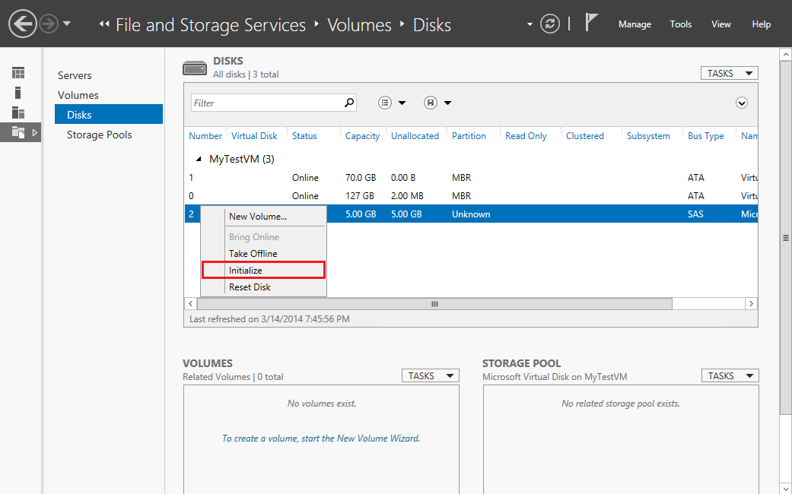
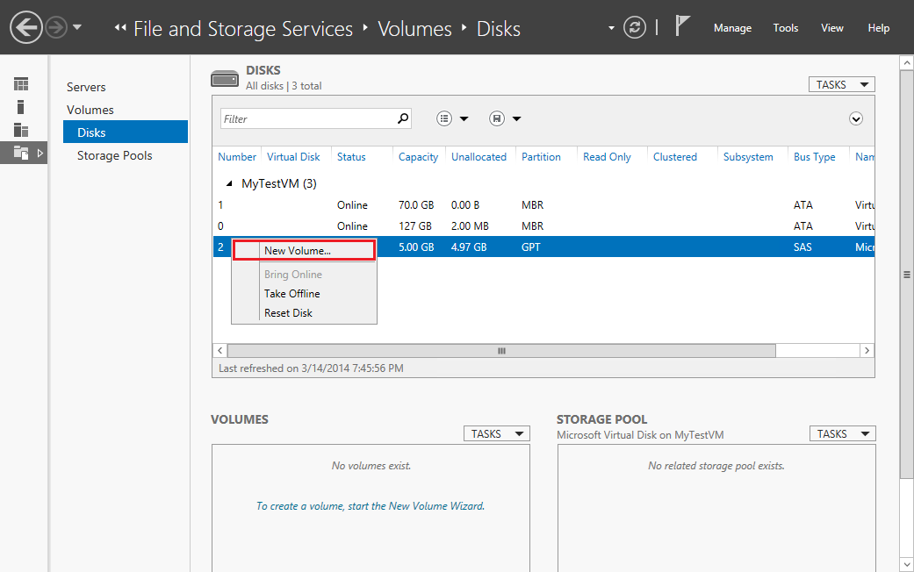

<properties 
	pageTitle="Azure에서 Windows를 실행하는 가상 컴퓨터 만들기" 
	description="Azure에서 Windows VM(가상 컴퓨터)을 만든 다음 로그온하고 데이터 디스크를 연결하는 방법에 대해 알아봅니다." 
	services="virtual-machines" 
	documentationCenter="" 
	authors="KBDAzure" 
	manager="timlt" 
	editor="tysonn"/>

<tags 
	ms.service="virtual-machines" 
	ms.workload="infrastructure-services" 
	ms.tgt_pltfrm="vm-windows" 
	ms.devlang="na" 
	ms.topic="article" 
	ms.date="03/04/2015" 
	ms.author="kathydav"/>

# Windows를 실행하는 가상 컴퓨터 만들기

<a href="/documentation/articles/virtual-machines-windows-tutorial/" title="Azure Portal" class="current">Azure 포털</a><a href="/documentation/articles/virtual-machines-windows-tutorial-azure-preview/" title="Azure Preview Portal">Azure 미리 보기 포털</a>

이 자습서에서는 Azure VM(가상 컴퓨터)을 간편하게 만드는 방법을 보여 줍니다. 이 자습서에서는 Windows Server 이미지를 사용하지만 이는 Azure를 통해 사용할 수 있는 여러 이미지 중 하나에 불과합니다. 예를 들어 Windows 운영 체제, Linux-based 운영 체제, 사전 설치된 응용 프로그램이 있는 이미지 등이 여기에 해당합니다. 선택할 수 있는 이미지는 소유한 구독 유형에 따라 다릅니다. 예를 들어 데스크톱 이미지는 MSDN 구독자가 사용할 수 있습니다.

[사용자 고유의 이미지를 템플릿으로](virtual-machines-create-upload-vhd-windows-server.md) 사용하여 Windows VM을 만들 수도 있습니다. Azure VM에 대한 자세한 내용은 [Azure 가상 컴퓨터 개요](http://msdn.microsoft.com/library/azure/jj156143.aspx)를 참조하세요.

[AZURE.INCLUDE [free-trial-note](../includes/free-trial-note.md)]

## 가상 컴퓨터를 만드는 방법

이 섹션에서는 관리 포털의 **갤러리에서** 방법을 사용하여 가상 컴퓨터를 만드는 방법을 보여 줍니다. 이 옵션은 **빠른 생성** 옵션보다 많은 구성 선택 항목을 제공합니다. 예를 들어 가상 컴퓨터를 가상 네트워크에 가입하려는 경우 **갤러리에서** 옵션을 사용해야 합니다.

> [AZURE.NOTE] 또한 보다 다양하며 사용자 지정 가능한 [Azure 미리 보기 포털](https://portal.azure.com)에서 가상 컴퓨터를 만들고, 다중 VM 응용 프로그램 템플릿의 배포를 자동화하고, 고급 VM 모니터링 및 진단 기능을 사용해 볼 수 있습니다. 두 포털에서 사용 가능한 VM 구성 옵션은 상당히 중복되지만 동일하지는 않습니다.  

[AZURE.INCLUDE [virtual-machines-create-WindowsVM](../includes/virtual-machines-create-WindowsVM.md)]

## 가상 컴퓨터를 만든 후 로그온하는 방법 

이 섹션에서는 가상 컴퓨터에서 실행되는 설정 및 응용 프로그램을 관리할 수 있도록 가상 컴퓨터에 로그인하는 방법을 보여 줍니다.

[AZURE.INCLUDE [virtual-machines-log-on-win-server](../includes/virtual-machines-log-on-win-server.md)]

## 새 가상 컴퓨터에 데이터 디스크를 연결하는 방법 

이 섹션에서는 가상 컴퓨터에 빈 데이터 디스크를 연결하는 방법을 보여 줍니다. 기존 디스크를 연결하는 방법 등에 대한 자세한 내용은 [데이터 디스크 연결 자습서](http://azure.microsoft.com/documentation/articles/storage-windows-attach-disk/)를 참조하세요.

1. Azure [관리 포털](http://manage.windowsazure.com)에 로그인합니다.

2. **가상 컴퓨터**를 클릭한 다음 **MyTestVM** 가상 컴퓨터를 선택합니다.

	
	
3. 먼저 빠른 시작 페이지가 나타날 수도 있습니다. 이 경우 맨 위에서 **대시보드**를 선택합니다.

	

4. 명령 모음에서 **연결**을 클릭한 다음, 팝업이 표시되면 **빈 디스크 연결**을 클릭합니다.

		

5. **가상 컴퓨터 이름**, **저장소 위치**, **파일 이름** 및 **호스트 캐시 기본 설정**은 이미 정의되어 있습니다. 원하는 디스크 크기만 입력하면 됩니다. **크기** 필드에 **5**를 입력합니다. 확인 표시를 클릭하여 디스크를 연결합니다.

	>[AZURE.NOTE] 모든 디스크는 Azure 저장소의 .vhd 파일에서 만들어집니다. **파일 이름**에는 디스크 이름이 아니라 디스크에서 사용하는 .vhd 파일 이름을 지정할 수 있습니다. Azure에서는 디스크에 이름을 자동으로 할당합니다. 

		
	
	>[AZURE.NOTE] .vhd 파일은 Azure 저장소에 페이지 Blob로 저장됩니다. Azure 외부에서 가상 하드 디스크는 VHD 또는 VHDX 형식을 사용할 수 있습니다. 또한 고정, 동적 확장 또는 차이점 보관용 디스크일 수도 있습니다. Azure는 VHD 형식의 고정 디스크를 지원합니다. 자세한 내용은 [Azure의 VHD 정보](http://msdn.microsoft.com/library/azure/dn790344.aspx)를 참조하세요.  

6. 대시보드로 돌아와 빈 데이터 디스크가 가상 컴퓨터에 연결되어 있는지 확인합니다. 이 디스크는 **디스크** 목록에서 OS 디스크 뒤에 표시됩니다.

	

	데이터 디스크를 가상 컴퓨터에 연결한 후 디스크는 오프라인 상태이며 초기화되지 않습니다. 가상 컴퓨터에 로그온한 다음 디스크를 초기화해야 데이터를 저장하는 데 사용할 수 있습니다.

7. 이전 섹션인 [가상 컴퓨터를 만든 후 로그온하는 방법]의 단계에 따라 가상 컴퓨터에 연결하고 로그온합니다.

8. 가상 컴퓨터에 로그온한 후 **Server Manager**를 엽니다. 왼쪽 창에서 **파일 및 저장소 서비스**를 선택합니다.

	

9. 확장된 메뉴에서 **디스크**를 선택합니다.

		
	
10.	**디스크** 섹션의 목록에는 디스크 0, 디스크 1, 디스크 2의 3개 디스크가 있습니다. 디스크 0은 OS 디스크이며, 디스크 1은 임시 리소스 디스크(데이터 저장소에 사용되지 않음), 디스크 2는 가상 컴퓨터에 연결한 데이터 디스크입니다. 데이터 디스크의 용량은 디스크를 연결할 때 지정한 대로 5GB입니다. 디스크 2를 마우스 오른쪽 단추로 클릭하고  **초기화**를 선택합니다.

	

11. **예**를 클릭합니다.

	

12. 디스크 2를 마우스 오른쪽 단추로 클릭하고 **새 볼륨**을 선택합니다. 

	

13. 기본값을 사용하여 마법사를 완료합니다. 마법사를 완료하면 새 볼륨이 **볼륨** 섹션에 나열됩니다. 이제 디스크가 온라인 상태이며 데이터를 저장할 준비가 완료되었습니다. 

	
	
## 다음 단계 

Azure에서 Windows 가상 컴퓨터를 구성하는 방법에 대한 자세한 내용은 다음 문서를 참조하세요.

[가상 컴퓨터를 가상 네트워크 또는 클라우드 서비스와 연결하는 방법](cloud-services-connect-virtual-machine.md)

[Windows Server VHD를 만들어서 Azure에 업로드](virtual-machines-create-upload-vhd-windows-server.md)

[가상 컴퓨터의 가용성 관리](manage-availability-virtual-machines.md)

[Azure VM 구성 설정 정보](http://msdn.microsoft.com/library/azure/dn763935.aspx)

[비디오: VHD 시작 - 백그라운드 작업](http://azure.microsoft.com/documentation/videos/getting-started-with-azure-virtual-machines)

[비디오: Mark Russinovich의 FAQ 소개 - Microsoft Azure에서 Windows 실행](http://azure.microsoft.com/documentation/videos/mark-russinovich-windows-on-azure)

[비디오: 다시 사용할 수 있는 이미지를 만들어 웹 팜에 새 가상 컴퓨터 추가](http://azure.microsoft.com/documentation/videos/adding-virtual-machines-web-farm)

[비디오: 가상 하드 드라이브와 저장소 계정을 추가하고 가상 컴퓨터 크기 조정](http://azure.microsoft.com/documentation/videos/adding-drives-scaling-virtual-machines)

[비디오: Scott Guthrie의 가상 컴퓨터 소개](http://azure.microsoft.com/documentation/videos/virtual-machines-scottgu)

[비디오: Azure 가상 컴퓨터의 저장소 및 디스크 기본 사항](http://azure.microsoft.com/documentation/videos/storage-and-disks-virtual-machines)

[Azure의 가상 컴퓨터 정보]: #virtualmachine
[가상 컴퓨터를 만드는 방법]: #custommachine
[가상 컴퓨터를 만든 후 로그온하는 방법]: #logon
[새 가상 컴퓨터에 데이터 디스크를 연결하는 방법]: #attachdisk
[가상 컴퓨터와의 통신을 설정하는 방법]: #endpoints

<!--HONumber=47-->
