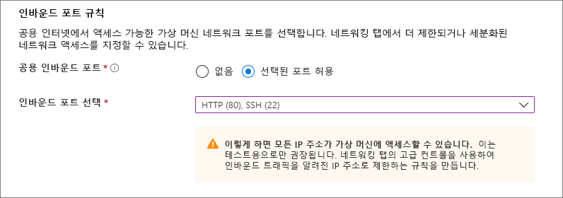

# <a name="quickstart-create-a-linux-virtual-machine-in-the-azure-portal"></a>빠른 시작: Azure Portal에서 Linux 가상 머신 만들기

Azure Portal을 통해 Azure VM(가상 머신)을 만들 수 있습니다. Azure Portal은 Azure 리소스를 만드는 브라우저 기반 사용자 인터페이스입니다. 이 빠른 시작에서는 Azure Portal을 사용하여 Ubuntu 18.04 LTS를 실행하는 Linux VM(가상 머신)을 배포하는 방법을 보여줍니다. VM 작동을 확인하기 위해 VM에 대해 SSH를 수행하고 NGINX 웹 서버를 설치합니다.

Azure 구독이 아직 없는 경우 시작하기 전에 [체험 계정](https://azure.microsoft.com/free/?WT.mc_id=A261C142F)을 만듭니다.

## <a name="create-ssh-key-pair"></a>SSH 키 쌍 만들기

이 빠른 시작을 완료하려면 SSH 키 쌍이 필요합니다. SSH 키 쌍이 이미 있는 경우 이 단계를 건너뜁니다.

Bash 셸을 열고 [ssh-keygen](https://www.ssh.com/ssh/keygen/)을 사용하여 SSH 키 쌍을 만듭니다. 로컬 컴퓨터에 Bash 셸이 없는 경우 [Azure Cloud Shell](https://shell.azure.com/bash)을 사용할 수 있습니다.


1. [Azure Portal](https://portal.azure.com)에 로그인합니다.
1. 페이지 위쪽의 메뉴에서 `>_` 아이콘을 선택하여 Cloud Shell을 엽니다.
1. CloudShell에서 왼쪽 위에 **Bash**가 표시되는지 확인합니다. PowerShell이라고 표시되는 경우 드롭다운을 사용하여 **Bash**를 선택하고 **확인**을 선택하여 Bash 셸로 변경합니다.
1. `ssh-keygen -t rsa -b 2048`을 입력하여 ssh 키를 만듭니다. 
1. 키 쌍을 저장할 파일을 입력하라는 메시지가 표시됩니다. **Enter**를 눌러 기본 위치(대괄호 안에 나열됨)로 저장합니다. 
1. 암호를 입력하라는 메시지가 표시됩니다. SSH 키에 대한 암호를 입력하거나 **Enter**를 눌러 암호 없이 계속할 수 있습니다.
1. `ssh-keygen` 명령은 `id_rsa`에서 `~/.ssh directory`의 기본 이름으로 공개 및 프라이빗 키를 생성합니다. 명령이 공개 키의 전체 경로를 반환합니다. `cat`를 입력하여 공개 키의 경로를 통해 `cat ~/.ssh/id_rsa.pub`의 해당 콘텐츠를 표시합니다.
1. 이 명령의 출력을 복사하고 이 문서의 뒷부분에서 사용할 수 있는 위치에 저장합니다. 이는 공용 키로서, 관리자 계정이 VM에 로그인하도록 구성할 때 필요합니다.

## <a name="sign-in-to-azure"></a>Azure에 로그인

[Azure Portal](https://portal.azure.com)에 로그인합니다(아직 로그인하지 않은 경우).

## <a name="create-virtual-machine"></a>가상 머신 만들기

1. 검색에서 **가상 머신**을 입력합니다.
1. **서비스**에서 **가상 머신**을 선택합니다.
1. **가상 머신** 페이지에서 **추가**를 선택합니다. **가상 머신 만들기** 페이지가 열립니다.
1. **기본** 탭의 **프로젝트 세부 정보** 아래에서 올바른 구독이 선택되어 있는지 확인한 다음, 리소스 그룹 **새로 만들기**를 선택합니다. 이름으로 *myResourceGroup*을 입력합니다.* 

    

1. **인스턴스 세부 정보** 아래에서 *가상 머신 이름*에 **myVM**을 입력하고 *지역*에 **미국 동부**를 선택한 후 *이미지*로 **Ubuntu 18.04 LTS**를 선택합니다. 다른 기본값을 그대로 둡니다.

    

1. **관리자 계정**에서 **SSH 공개 키**를 선택하고, 사용자 이름을 입력한 다음, 공개 키를 붙여넣습니다. 공개 키에서 선행 또는 후행 공백을 모두 제거합니다.

    

1. **인바운드 포트 규칙** > **공용 인바운드 포트** 아래에서 **선택한 포트 허용**을 선택한 다음, 드롭다운에서 **SSH(22)** 및 **HTTP(80)** 를 선택합니다. 

    

1. 나머지 기본값을 그대로 둔 다음, 페이지의 아래에서 **검토 + 만들기** 단추를 선택합니다.

1. **가상 머신 만들기** 페이지에서 만들려는 VM의 세부 정보를 볼 수 있습니다. 준비가 되면 **만들기**를 선택합니다.

VM 배포에는 몇 분 정도 걸립니다. 배포가 완료되면 다음 섹션으로 이동합니다.

    
## <a name="connect-to-virtual-machine"></a>가상 머신에 연결

VM과의 SSH 연결을 만듭니다.

1. VM의 개요 페이지에서 **연결** 단추를 선택합니다. 

    

2. **가상 머신 연결** 페이지에서 포트 22를 통해 IP 주소로 연결하는 기본 옵션을 유지합니다. **VM 로컬 계정을 사용하여 로그인**에 연결 명령이 표시됩니다. 명령을 복사하는 단추를 선택합니다. 다음 예제에서는 SSH 연결 명령의 모양을 보여줍니다.

    ```bash
    ssh azureuser@10.111.12.123
    ```

3. SSH 키 쌍을 만들 때 사용한 것과 동일한 Bash 셸을 사용하여(예: `>_` 선택 또는 https://shell.azure.com/bash) 로 이동하여 Cloud Shell을 다시 열 수 있음) SSH 연결 명령을 셸에 붙여넣어 SSH 세션을 만듭니다.

## <a name="install-web-server"></a>웹 서버 설치

실제로 작동 중인 VM을 보려면 NGINX 웹 서버를 설치합니다. SSH 세션에서 패키지 소스를 업데이트한 다음, 최신 NGINX 패키지를 설치합니다.

```bash
sudo apt-get -y update
sudo apt-get -y install nginx
```

완료되면 `exit`를 입력하여 SSH 세션을 종료합니다.


## <a name="view-the-web-server-in-action"></a>실제로 작동 중인 웹 서버 보기

원하는 웹 브라우저를 사용하여 기본 NGINX 시작 페이지를 봅니다. VM의 공용 IP 주소를 웹 주소로 입력합니다. 공용 IP 주소는 VM 개요 페이지나, 앞서 사용한 SSH 구성 문자열 부분에 있습니다.


## <a name="clean-up-resources"></a>리소스 정리

리소스 그룹, 가상 머신 및 모든 관련 리소스가 더 이상 필요 없는 경우 삭제해도 됩니다. 삭제하려면 가상 머신의 리소스 그룹을 선택하고 **삭제**를 선택한 다음, 삭제할 리소스 그룹의 이름을 확인합니다.

## <a name="next-steps"></a>다음 단계

이 빠른 시작에서는 간단한 가상 머신을 배포하고, 네트워크 보안 그룹 및 규칙을 만들고 기본 웹 서버를 설치했습니다. Azure 가상 머신에 대한 자세한 내용을 알아보려면 Linux VM의 자습서를 계속 진행합니다.

> [!div class="nextstepaction"]
> [Azure Linux 가상 머신 자습서](./tutorial-manage-vm.md)
