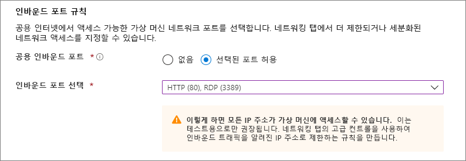
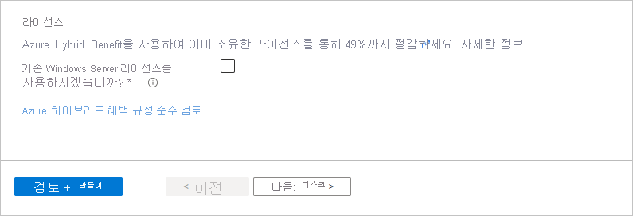

# <a name="quickstart-create-a-windows-virtual-machine-in-the-azure-portal"></a>빠른 시작: Azure 포털에서 Windows 가상 머신 만들기

Azure Portal을 통해 Azure VM(가상 머신)을 만들 수 있습니다. 이 방법은 VM 및 관련 리소스를 만드는 브라우저 기반 사용자 인터페이스를 제공합니다. 이 빠른 시작에서는 Azure Portal을 사용하여 Windows Server 2016을 실행하는 Azure에서 VM(가상 머신)을 배포하는 방법을 보여줍니다. 작업에서 VM을 보려면 VM에 RDP를 수행하고 IIS 웹 서버를 설치합니다.

Azure 구독이 아직 없는 경우 시작하기 전에 [체험 계정](https://azure.microsoft.com/free/?WT.mc_id=A261C142F)을 만듭니다.

## <a name="sign-in-to-azure"></a>Azure에 로그인

[https://portal.azure.com](https://portal.azure.com ) 에서 Azure Portal에 로그인합니다.

## <a name="create-virtual-machine"></a>가상 머신 만들기

1. Azure Portal의 왼쪽 위 모서리에서 **리소스 만들기**를 선택합니다.

1. **새로 만들기** 페이지의 **인기**에서 **Windows Server 2016 Datacenter**를 선택합니다.

1. **기본** 탭의 **프로젝트 세부 정보** 아래에서 올바른 구독이 선택되어 있는지 확인한 다음, 리소스 그룹 **새로 만들기**를 선택합니다. 이름으로 *myResourceGroup*을 입력합니다. 

    

1. **인스턴스 세부 정보** 아래에서 **가상 머신 이름**에 *myVM*을 입력하고 **위치**에 *미국 동부*를 선택합니다. 다른 기본값은 그대로 둡니다.

    

1. **관리자 계정**에서 *azureuser*와 같은 사용자 이름 및 암호를 입력합니다. 암호는 12자 이상이어야 하며 [정의된 복잡성 요구 사항](faq.md#what-are-the-password-requirements-when-creating-a-vm)을 충족해야 합니다.

    

1. **인바운드 포트 규칙**에서 **선택한 포트 허용**을 선택한 다음, 드롭다운에서 **RDP(3389)** 및 **HTTP**를 선택합니다.

    

1. 나머지 기본값은 그대로 둔 다음, 페이지의 하단에 있는 **검토 + 만들기** 단추를 선택합니다.

    


## <a name="connect-to-virtual-machine"></a>가상 머신에 연결

가상 머신에 대한 원격 데스크톱 연결을 만듭니다. 이러한 지침은 Windows 컴퓨터에서 VM에 연결하는 방법을 알려줍니다. Mac의 Mac 앱 스토어에서 이 [원격 데스크톱 클라이언트](https://itunes.apple.com/us/app/microsoft-remote-desktop/id715768417?mt=12)와 같은 RDP 클라이언트가 필요합니다.

1. 가상 머신 속성 페이지에서 **연결** 단추를 클릭합니다. 

    
    
2. **가상 머신에 연결** 페이지에서, 3389 포트를 통해 DNS 이름으로 연결하는 기본 옵션을 유지하고 **RDP 파일 다운로드**를 클릭합니다.

2. 다운로드한 RDP 파일을 열고 메시지가 표시되면 **연결**을 클릭합니다. 

3. **Windows 보안** 창에서 **추가 선택 사항** 및 **다른 계정 사용**을 차례로 선택합니다. 사용자 이름으로 **localhost**\\*username*을 입력하고, 가상 머신에 대해 만든 암호를 입력한 다음, **확인**을 클릭합니다.

4. 로그인 프로세스 중에 인증서 경고가 나타날 수 있습니다. **예** 또는 **계속**을 클릭하여 연결을 만듭니다.

## <a name="install-web-server"></a>웹 서버 설치

실제로 작동하는 VM을 보려면 IIS 웹 서버를 설치합니다. VM에서 PowerShell 프롬프트를 열고 다음 명령을 실행합니다.

```powershell
Install-WindowsFeature -name Web-Server -IncludeManagementTools
```

여기까지 마쳤으면 VM에 대한 RDP 연결을 닫습니다.


## <a name="view-the-iis-welcome-page"></a>IIS 시작 페이지 보기

포털에서 VM을 선택하고, VM 개요에서 IP 주소 오른쪽에 있는 **복사하려면 클릭** 단추를 사용하여 복사한 후 브라우저 탭에 붙여넣습니다. 기본 IIS 시작 페이지가 열리고, 다음과 비슷한 모습입니다.


## <a name="clean-up-resources"></a>리소스 정리

리소스 그룹, 가상 머신 및 모든 관련 리소스가 더 이상 필요 없는 경우 삭제해도 됩니다. 가상머신에 대한 리소스 그룹을 선택한 다음 **삭제**를 선택합니다. 리소스 그룹의 이름을 확인하고 리소스 삭제를 마칩니다.

## <a name="next-steps"></a>다음 단계

이 빠른 시작에서는 간단한 가상 머신을 배포하고, 웹 트래픽에 대한 네트워크 포트를 열고, 기본 웹 서버를 설치했습니다. Azure 가상 머신에 대한 자세한 내용을 알아보려면 Windows VM의 자습서를 계속 진행합니다.

> [!div class="nextstepaction"]
> [Azure Windows 가상 머신 자습서](./tutorial-manage-vm.md)
