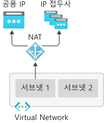
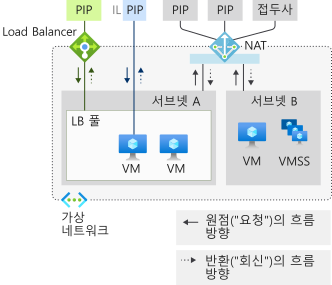

# Virtual Network NAT란?

Virtual Network NAT(Network Address Translation)는 가상 네트워크에 대한 아웃바운드 전용 인터넷 연결을 간소화합니다. 서브넷에 구성되는 경우 모든 아웃바운드 연결에서 지정된 고정 공용 IP 주소를 사용합니다.  가상 머신에 직접 연결되는 부하 분산 장치 또는 공용 IP 주소가 없으면 아웃바운드 연결이 가능합니다. NAT는 완전 관리형이며 복원력이 높습니다.

<!-- 

-->

  

*그림: Virtual Network NAT*

## 아웃바운드 전용의 고정 IP 주소

NAT를 사용하여 각 서브넷에 대한 아웃바운드 연결을 정의할 수 있습니다.  동일한 가상 네트워크 내의 여러 서브넷에는 서로 다른 NAT가 있을 수 있습니다. 서브넷은 사용할 NAT 게이트웨이 리소스를 지정하여 구성됩니다. 모든 가상 머신 인스턴스의 모든 UDP 및 TCP 아웃바운드 흐름은 NAT를 사용합니다. 

NAT는 표준 SKU 공용 IP 주소 리소스, 공용 IP 접두사 리소스 또는 이 둘의 조합과 호환됩니다.  공용 IP 접두사를 직접 사용하거나 접두사의 공용 IP 주소를 여러 NAT 게이트웨이 리소스에 배포할 수 있습니다. NAT는 모든 트래픽을 접두사의 IP 주소 범위로 그루밍합니다.  이제 배포의 모든 IP를 허용 목록에 쉽게 추가할 수 있습니다.

고객이 구성하지 않고도 NAT에서 서브넷의 모든 아웃바운드 트래픽을 자동으로 처리합니다.  사용자 정의 경로는 필요하지 않습니다. NAT는 다른 아웃바운드 시나리오보다 우선적으로 적용되며 서브넷의 기본 인터넷 대상을 대체합니다.

## 규모에 맞게 여러 IP 주소가 포함되는 주문형 SNAT

NAT는 "포트 네트워크 주소 변환"(PNAT 또는 PAT)을 사용하며 대부분의 워크로드에 추천됩니다. 주문형 아웃바운드 흐름 할당으로 동적 또는 확산 워크로드를 쉽게 수용할 수 있습니다. 광범위한 사전 계획, 미리 할당 및 궁극적으로 과도한 아웃바운드 리소스 프로비저닝을 방지할 수 있습니다. SNAT 포트 리소스는 특정 NAT 게이트웨이 리소스를 사용하여 모든 서브넷에서 공유하고 사용할 수 있으며 필요할 때 제공됩니다.

NAT에 연결된 공용 IP 주소는 UDP 및 TCP에 대해 최대 64,000개의 동시 흐름을 제공합니다. 단일 IP 주소로 시작하여 최대 16개의 공용 IP 주소로 확장할 수 있습니다.

NAT를 사용하면 가상 네트워크에서 인터넷으로의 흐름을 만들 수 있습니다. 인터넷에서 반환하는 트래픽은 활성 흐름에 대한 응답으로만 허용됩니다.

부하 분산 장치 아웃바운드 SNAT와 달리 NAT는 아웃바운드 연결을 수행할 수 있는 가상 머신 인스턴스의 개인 IP를 제한하지 않습니다.  보조 IP 구성은 NAT를 통해 아웃바운드 인터넷 연결을 만들 수 있습니다.

## 인바운드 및 아웃바운드의 동시 사용

NAT와 호환되는 표준 SKU 리소스는 다음과 같습니다.

- 부하 분산 장치
- 공용 IP 주소
- 공용 IP 접두사

NAT와 함께 사용하는 경우 이러한 리소스는 서브넷에 대한 인바운드 인터넷 연결을 제공합니다. NAT는 서브넷의 모든 아웃바운드 인터넷 연결을 제공합니다.

NAT 및 호환되는 표준 SKU 기능은 흐름이 시작된 방향을 인식합니다. 인바운드 및 아웃바운드 시나리오를 동시에 사용할 수 있습니다. 이러한 기능은 흐름 방향을 인식하므로 이러한 시나리오에서 올바른 네트워크 주소 변환을 받을 수 있습니다. 

<!-- 

-->

  

*그림: Virtual Network NAT 흐름 방향*

## 완전 관리형, 높은 복원력

NAT는 처음부터 완전히 확장됩니다. 램프 업 또는 스케일 아웃 작업은 필요하지 않습니다.  Azure는 사용자를 대신하여 NAT 작업을 관리합니다.  NAT는 항상 여러 장애 도메인을 포함하고 있으므로 여러 오류를 서비스 중단 없이 유지할 수 있습니다.

## 인식할 수 없는 흐름에 대한 TCP 다시 설정

NAT의 프라이빗 쪽은 존재하지 않는 TCP 연결에서 통신을 시도하기 위해 TCP 다시 설정 패킷을 보냅니다. 한 가지 예로 유휴 시간 제한에 도달한 연결이 있습니다. 수신되는 다음 패킷은 TCP 다시 설정을 개인 IP 주소로 반환하여 신호를 보내고 연결을 강제로 종료합니다.

NAT의 퍼블릭 쪽은 TCP 다시 설정 패킷 또는 다른 트래픽을 생성하지 않으며,  고객의 가상 네트워크에서 생성된 트래픽만 내보냅니다.

## 구성 가능한 TCP 유휴 시간 제한

사용되는 기본 TCP 유휴 시간 제한은 4분이며 최대 120분까지 늘릴 수 있습니다. 또한 흐름의 모든 활동에서 TCP keepalive를 포함하여 유휴 타이머를 다시 설정할 수도 있습니다.

## 가용성 영역을 사용한 지역 또는 영역 격리

NAT는 기본적으로 지역 시나리오입니다. [가용성 영역](../availability-zones/az-overview.md) 시나리오를 만들 때 NAT는 특정 영역에서 격리될 수 있습니다(영역 배포).

<!-- 

-->

  

*그림: 가용성 영역이 있는 Virtual Network NAT*

## 다차원 가시성 메트릭

Azure Monitor에 공개되는 다차원 메트릭을 통해 NAT 작업을 모니터링할 수 있습니다. 이러한 메트릭은 사용 현황을 관찰하고 문제를 해결하는 데 사용할 수 있습니다.  NAT 게이트웨이 리소스에서 공개하는 메트릭은 다음과 같습니다.
- 바이트
- 패킷 수
- 삭제된 패킷 수
- 총 SNAT 연결 횟수
- 간격당 SNAT 연결 상태 전환 횟수

<!-- "ADD when PM is done" Learn more about [NAT gateway metrics](./nat-gateway-metrics.md) -->

## SLA

일반 공급에서 NAT 데이터 경로의 가용성은 99.9% 이상입니다.

## 가격 책정

NAT 게이트웨이는 다음과 같은 별도의 두 가지 미터를 통해 청구됩니다.

| 미터 | 비용 |
| --- | --- |
| 리소스 시간 | $0.045/시간 |
| 처리된 데이터 | $0.045/GB |

리소스 시간은 NAT 게이트웨이 리소스의 존재 기간을 나타냅니다.
처리된 데이터는 NAT 게이트웨이 리소스에서 처리하는 모든 트래픽을 나타냅니다.

## 가용성

Virtual Network NAT와 NAT 게이트웨이 리소스는 모든 Azure 퍼블릭 클라우드 [지역](https://azure.microsoft.com/global-infrastructure/regions/)에서 사용할 수 있습니다.

## 지원

NAT는 일반적인 지원 채널을 통해 지원됩니다.

## 제안

서비스를 향상시킬 수 있는 방법을 찾고 있습니다. [UserVoice for NAT](https://aka.ms/natuservoice)에서 다음에 빌드해야 하는 항목을 제안하고 이에 대해 투표할 수 있습니다.

## 제한 사항

* NAT는 표준 SKU 공용 IP, 공용 IP 접두사 및 부하 분산 장치 리소스와 호환됩니다. 기본 리소스(예: 기본 부하 분산 장치) 및 이러한 리소스에서 파생된 제품은 NAT와 호환되지 않습니다.  기본 리소스는 NAT에서 구성되지 않은 서브넷에 배치해야 합니다.
* IPv4 주소 패밀리가 지원됩니다.  IPv6 주소 패밀리는 NAT와 상호 작용하지 않습니다.  NAT는 IPv6 접두사가 있는 서브넷에 배포할 수 없습니다.
* NAT를 사용하는 경우 NSG 흐름 로깅이 지원되지 않습니다.
* NAT는 여러 가상 네트워크에 걸쳐 있을 수 없습니다.

## 다음 단계

* [NAT 게이트웨이 리소스](./nat-gateway-resource.md)에 대해 알아봅니다.
* [UserVoice에서 Virtual Network NAT에 대해 다음에 빌드할 항목을 알려줍니다](https://aka.ms/natuservoice).

